# Summary
## MW-112d

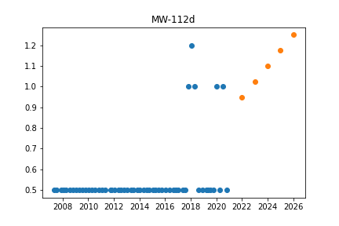

Initiated AutoTS object with best model: 
ETS
{
  "fillna": "rolling_mean",
  "transformations": {
    "0": "ClipOutliers",
    "1": "Discretize",
    "2": "Detrend",
    "3": "Slice"
  },
  "transformation_params": {
    "0": {
      "method": "clip",
      "std_threshold": 3.5,
      "fillna": null
    },
    "1": {
      "discretization": "lower",
      "n_bins": 5
    },
    "2": {
      "model": "GLS"
    },
    "3": {
      "method": 0.5
    }
  }
}
{
  "damped_trend": false,
  "trend": "additive",
  "seasonal": null,
  "seasonal_periods": null
}

## MW-61d

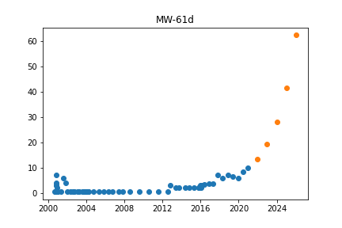

Initiated AutoTS object with best model: 
AverageValueNaive
{
  "fillna": "fake_date",
  "transformations": {
    "0": "Log",
    "1": "SinTrend",
    "2": "bkfilter"
  },
  "transformation_params": {
    "0": {},
    "1": {},
    "2": {}
  }
}
{
  "method": "Weighted_Mean"
}

## MW-42s

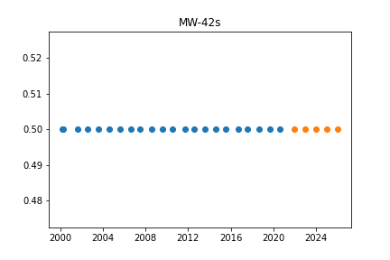

Initiated AutoTS object with best model: 
ETS
{
  "fillna": "rolling_mean",
  "transformations": {
    "0": "QuantileTransformer",
    "1": "SeasonalDifference",
    "2": "bkfilter",
    "3": "DifferencedTransformer",
    "4": "PowerTransformer"
  },
  "transformation_params": {
    "0": {
      "output_distribution": "uniform",
      "n_quantiles": 5
    },
    "1": {
      "lag_1": 7,
      "method": "Mean"
    },
    "2": {},
    "3": {},
    "4": {}
  }
}
{
  "damped_trend": false,
  "trend": null,
  "seasonal": null,
  "seasonal_periods": null
}

## SW-1M

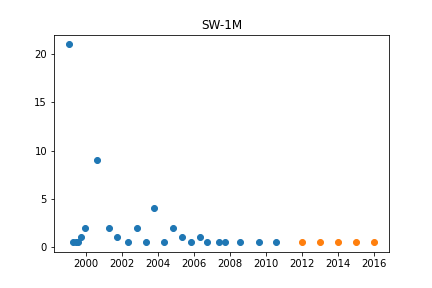

Initiated AutoTS object with best model: 
AverageValueNaive
{
  "fillna": "mean",
  "transformations": {
    "0": "PowerTransformer",
    "1": "DifferencedTransformer"
  },
  "transformation_params": {
    "0": {},
    "1": {}
  }
}
{
  "method": "Median"
}

## 593 Allison

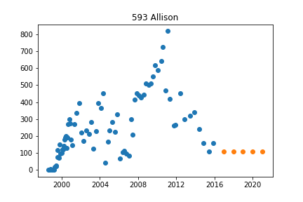

Initiated AutoTS object with best model: 
LastValueNaive
{
  "fillna": "ffill",
  "transformations": {
    "0": "ClipOutliers",
    "1": "MinMaxScaler"
  },
  "transformation_params": {
    "0": {
      "method": "clip",
      "std_threshold": 1,
      "fillna": null
    },
    "1": {}
  }
}
{}

## AMW-1

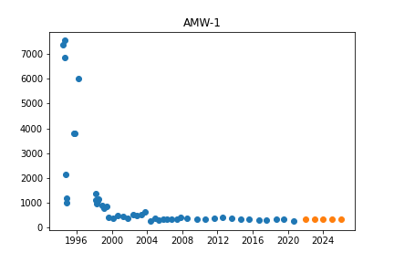

Initiated AutoTS object with best model: 
LastValueNaive
{
  "fillna": "ffill_mean_biased",
  "transformations": {
    "0": "StandardScaler",
    "1": "bkfilter",
    "2": "StandardScaler",
    "3": "QuantileTransformer"
  },
  "transformation_params": {
    "0": {},
    "1": {},
    "2": {},
    "3": {
      "output_distribution": "uniform",
      "n_quantiles": 7
    }
  }
}
{}

## MW-84s

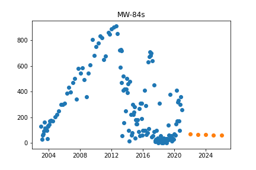

Initiated AutoTS object with best model: 
AverageValueNaive
{
  "fillna": "ffill",
  "transformations": {
    "0": "MinMaxScaler",
    "1": "DifferencedTransformer"
  },
  "transformation_params": {
    "0": {},
    "1": {}
  }
}
{
  "method": "Mean"
}

## MW-131s

Initiated AutoTS object with best model: 
Ensemble
{}
{
  "model_name": "BestN",
  "model_count": 3,
  "model_metric": "best_score_unique",
  "models": {
    "2887d2af24ace64615ccf0154ef2e4be": {
      "Model": "AverageValueNaive",
      "ModelParameters": {
        "method": "Mean"
      },
      "TransformationParameters": {
        "fillna": "fake_date",
        "transformations": {
          "0": "DifferencedTransformer",
          "1": "SinTrend"
        },
        "transformation_params": {
          "0": {},
          "1": {}
        }
      }
    },
    "e2a60c4ecbd462977f9bb3743c7e1a1b": {
      "Model": "LastValueNaive",
      "ModelParameters": {},
      "TransformationParameters": {
        "fillna": "mean",
        "transformations": {
          "0": "ClipOutliers",
          "1": "bkfilter",
          "2": "MaxAbsScaler"
        },
        "transformation_params": {
          "0": {
            "method": "clip",
            "std_threshold": 1,
            "fillna": null
          },
          "1": {},
          "2": {}
        }
      }
    },
    "3800d94d453da167d3ff228241c81648": {
      "Model": "ETS",
      "ModelParameters": {
        "damped_trend": false,
        "trend": "multiplicative",
        "seasonal": null,
        "seasonal_periods": null
      },
      "TransformationParameters": {
        "fillna": "ffill",
        "transformations": {
          "0": "DifferencedTransformer",
          "1": "SinTrend",
          "2": "bkfilter",
          "3": "SeasonalDifference"
        },
        "transformation_params": {
          "0": {},
          "1": {},
          "2": {},
          "3": {
            "lag_1": 7,
            "method": "Median"
          }
        }
      }
    }
  }
}

## MW-82d

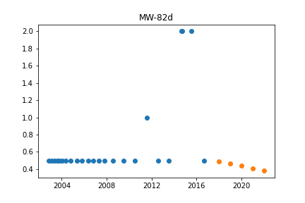

Initiated AutoTS object with best model: 
Ensemble
{}
{
  "model_name": "BestN",
  "model_count": 3,
  "model_metric": "mixed_metric",
  "models": {
    "00fdc01e308a28738e962901ff250a96": {
      "Model": "ETS",
      "ModelParameters": {
        "damped_trend": false,
        "trend": null,
        "seasonal": null,
        "seasonal_periods": null
      },
      "TransformationParameters": {
        "fillna": "zero",
        "transformations": {
          "0": "PowerTransformer",
          "1": "DifferencedTransformer"
        },
        "transformation_params": {
          "0": {},
          "1": {}
        }
      }
    },
    "666a917eb9784f8ab86f1b06c759003e": {
      "Model": "ETS",
      "ModelParameters": {
        "damped_trend": false,
        "trend": "additive",
        "seasonal": "additive",
        "seasonal_periods": 2
      },
      "TransformationParameters": {
        "fillna": "ffill",
        "transformations": {
          "0": "PowerTransformer",
          "1": "DifferencedTransformer"
        },
        "transformation_params": {
          "0": {},
          "1": {}
        }
      }
    },
    "1c04b8b8c0ea94aec87bde262271faa4": {
      "Model": "GLS",
      "ModelParameters": {},
      "TransformationParameters": {
        "fillna": "ffill",
        "transformations": {
          "0": "Discretize",
          "1": "DifferencedTransformer",
          "2": "Detrend",
          "3": "MaxAbsScaler",
          "4": "Slice"
        },
        "transformation_params": {
          "0": {
            "discretization": "upper",
            "n_bins": 5
          },
          "1": {},
          "2": {
            "model": "Linear"
          },
          "3": {},
          "4": {
            "method": 0.2
          }
        }
      }
    }
  }
}

## 2950 Valley

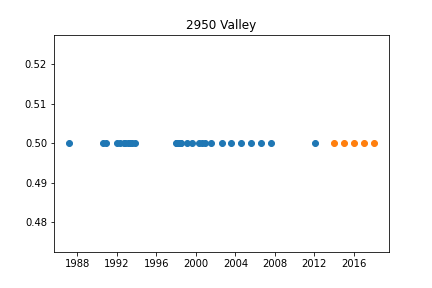

Initiated AutoTS object with best model: 
Ensemble
{}
{
  "model_name": "BestN",
  "model_count": 3,
  "model_metric": "mixed_metric",
  "models": {
    "2887d2af24ace64615ccf0154ef2e4be": {
      "Model": "AverageValueNaive",
      "ModelParameters": {
        "method": "Mean"
      },
      "TransformationParameters": {
        "fillna": "fake_date",
        "transformations": {
          "0": "DifferencedTransformer",
          "1": "SinTrend"
        },
        "transformation_params": {
          "0": {},
          "1": {}
        }
      }
    },
    "32acf1f6936e129f7f028374d553538f": {
      "Model": "AverageValueNaive",
      "ModelParameters": {
        "method": "Mean"
      },
      "TransformationParameters": {
        "fillna": "mean",
        "transformations": {
          "0": "ClipOutliers",
          "1": "QuantileTransformer",
          "2": "DifferencedTransformer"
        },
        "transformation_params": {
          "0": {
            "method": "clip",
            "std_threshold": 3,
            "fillna": null
          },
          "1": {
            "output_distribution": "uniform",
            "n_quantiles": 7
          },
          "2": {}
        }
      }
    },
    "da3c53c0617d9f838e7cfcf5e786e702": {
      "Model": "AverageValueNaive",
      "ModelParameters": {
        "method": "Mean"
      },
      "TransformationParameters": {
        "fillna": "rolling_mean_24",
        "transformations": {
          "0": "SeasonalDifference",
          "1": "Round",
          "2": "Detrend"
        },
        "transformation_params": {
          "0": {
            "lag_1": 7,
            "method": "Mean"
          },
          "1": {
            "model": "middle",
            "decimals": 2,
            "on_transform": true,
            "on_inverse": false
          },
          "2": {
            "model": "GLS"
          }
        }
      }
    }
  }
}

## MW-BE-1s

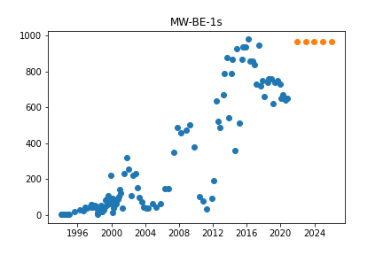

Initiated AutoTS object with best model: 
GLS
{
  "fillna": "ffill",
  "transformations": {
    "0": "bkfilter",
    "1": "QuantileTransformer",
    "2": "Round"
  },
  "transformation_params": {
    "0": {},
    "1": {
      "output_distribution": "uniform",
      "n_quantiles": 7
    },
    "2": {
      "model": "middle",
      "decimals": 0,
      "on_transform": false,
      "on_inverse": true
    }
  }
}
{}

## MW-62d

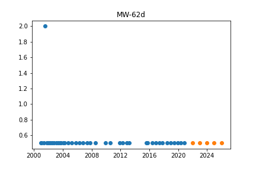

Initiated AutoTS object with best model: 
AverageValueNaive
{
  "fillna": "rolling_mean",
  "transformations": {
    "0": "SeasonalDifference",
    "1": "Discretize",
    "2": "MaxAbsScaler",
    "3": "Round",
    "4": "PctChangeTransformer",
    "5": "MinMaxScaler"
  },
  "transformation_params": {
    "0": {
      "lag_1": 7,
      "method": "Median"
    },
    "1": {
      "discretization": "lower",
      "n_bins": 20
    },
    "2": {},
    "3": {
      "model": "middle",
      "decimals": 0,
      "on_transform": false,
      "on_inverse": true
    },
    "4": {},
    "5": {}
  }
}
{
  "method": "Weighted_Mean"
}

## 2652 Dexter Rd

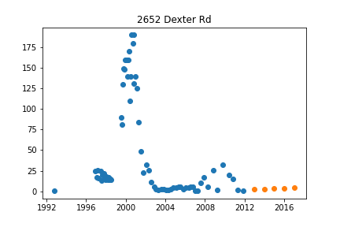

Initiated AutoTS object with best model: 
GLS
{
  "fillna": "mean",
  "transformations": {
    "0": "StandardScaler",
    "1": "DifferencedTransformer",
    "2": "Slice",
    "3": "ClipOutliers"
  },
  "transformation_params": {
    "0": {},
    "1": {},
    "2": {
      "method": 0.2
    },
    "3": {
      "method": "clip",
      "std_threshold": 1,
      "fillna": null
    }
  }
}
{}

## MW-87s

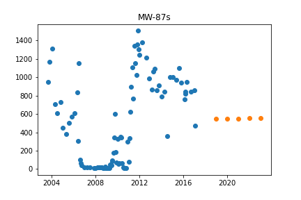

Initiated AutoTS object with best model: 
Ensemble
{}
{
  "model_name": "BestN",
  "model_count": 3,
  "model_metric": "best_score",
  "models": {
    "1bfbeebf2c2b6c1464b3ff68447836b3": {
      "Model": "LastValueNaive",
      "ModelParameters": {},
      "TransformationParameters": {
        "fillna": "ffill",
        "transformations": {
          "0": "ClipOutliers",
          "1": "QuantileTransformer",
          "2": "RobustScaler",
          "3": "Detrend"
        },
        "transformation_params": {
          "0": {
            "method": "clip",
            "std_threshold": 1,
            "fillna": null
          },
          "1": {
            "output_distribution": "uniform",
            "n_quantiles": 3
          },
          "2": {},
          "3": {
            "model": "Linear"
          }
        }
      }
    },
    "532e43bb9a9f4337771b9ce52a67fe6e": {
      "Model": "ETS",
      "ModelParameters": {
        "damped_trend": false,
        "trend": null,
        "seasonal": null,
        "seasonal_periods": null
      },
      "TransformationParameters": {
        "fillna": "mean",
        "transformations": {
          "0": "ClipOutliers",
          "1": "QuantileTransformer"
        },
        "transformation_params": {
          "0": {
            "method": "clip",
            "std_threshold": 3,
            "fillna": null
          },
          "1": {
            "output_distribution": "uniform",
            "n_quantiles": 3
          }
        }
      }
    },
    "02727cc40e79af881b7c42eb82b54931": {
      "Model": "ETS",
      "ModelParameters": {
        "damped_trend": false,
        "trend": null,
        "seasonal": null,
        "seasonal_periods": null
      },
      "TransformationParameters": {
        "fillna": "mean",
        "transformations": {
          "0": "Round",
          "1": "QuantileTransformer"
        },
        "transformation_params": {
          "0": {
            "model": "middle",
            "decimals": 0,
            "on_transform": true,
            "on_inverse": false
          },
          "1": {
            "output_distribution": "uniform",
            "n_quantiles": 3
          }
        }
      }
    }
  }
}

## MW-134d

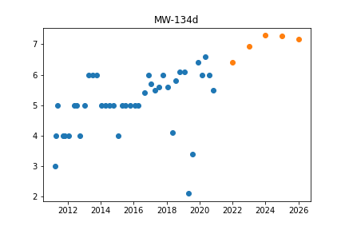

Initiated AutoTS object with best model: 
Ensemble
{}
{
  "model_name": "BestN",
  "model_count": 3,
  "model_metric": "best_score_unique",
  "models": {
    "7850c8fe45b676fe1b99782ae526f879": {
      "Model": "AverageValueNaive",
      "ModelParameters": {
        "method": "Median"
      },
      "TransformationParameters": {
        "fillna": "fake_date",
        "transformations": {
          "0": "DifferencedTransformer",
          "1": "SinTrend"
        },
        "transformation_params": {
          "0": {},
          "1": {}
        }
      }
    },
    "ea4602c8f07a1663b4ac26e97b7c3983": {
      "Model": "ETS",
      "ModelParameters": {
        "damped_trend": true,
        "trend": "multiplicative",
        "seasonal": null,
        "seasonal_periods": null
      },
      "TransformationParameters": {
        "fillna": "ffill",
        "transformations": {
          "0": "PowerTransformer",
          "1": "DifferencedTransformer",
          "2": "SeasonalDifference"
        },
        "transformation_params": {
          "0": {},
          "1": {},
          "2": {
            "lag_1": 12,
            "method": "Mean"
          }
        }
      }
    },
    "b5a23e9e7406363aa9a21508929ea784": {
      "Model": "GLS",
      "ModelParameters": {},
      "TransformationParameters": {
        "fillna": "fake_date",
        "transformations": {
          "0": "bkfilter",
          "1": "Detrend",
          "2": "Slice",
          "3": "PowerTransformer",
          "4": "StandardScaler"
        },
        "transformation_params": {
          "0": {},
          "1": {
            "model": "GLS"
          },
          "2": {
            "method": 0.5
          },
          "3": {},
          "4": {}
        }
      }
    }
  }
}

## IW-2

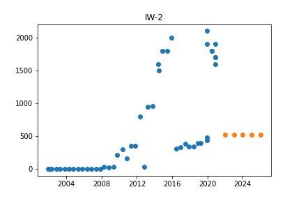

Initiated AutoTS object with best model: 
GLS
{
  "fillna": "ffill",
  "transformations": {
    "0": "PCA"
  },
  "transformation_params": {
    "0": {}
  }
}
{}

## MW-41s

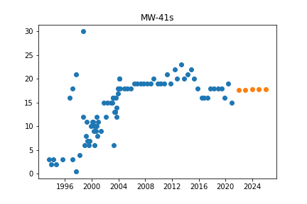

Initiated AutoTS object with best model: 
ETS
{
  "fillna": "rolling_mean_24",
  "transformations": {
    "0": "IntermittentOccurrence",
    "1": "Detrend"
  },
  "transformation_params": {
    "0": {
      "center": "mean"
    },
    "1": {
      "model": "GLS"
    }
  }
}
{
  "damped_trend": true,
  "trend": "multiplicative",
  "seasonal": null,
  "seasonal_periods": null
}

## SW-2M

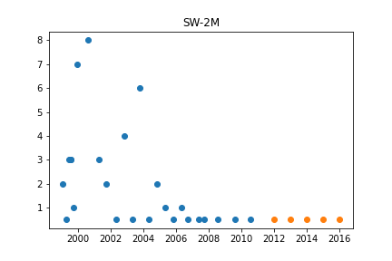

Initiated AutoTS object with best model: 
AverageValueNaive
{
  "fillna": "mean",
  "transformations": {
    "0": "ClipOutliers",
    "1": "Slice"
  },
  "transformation_params": {
    "0": {
      "method": "clip",
      "std_threshold": 3,
      "fillna": null
    },
    "1": {
      "method": 0.5
    }
  }
}
{
  "method": "Median"
}

## 4470 Jackson Rd

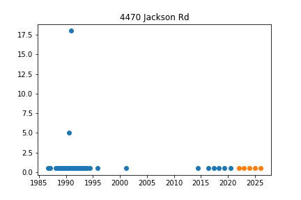

Initiated AutoTS object with best model: 
ETS
{
  "fillna": "ffill",
  "transformations": {
    "0": "ClipOutliers",
    "1": "QuantileTransformer",
    "2": "Detrend",
    "3": "ClipOutliers",
    "4": "Discretize"
  },
  "transformation_params": {
    "0": {
      "method": "clip",
      "std_threshold": 1,
      "fillna": null
    },
    "1": {
      "output_distribution": "uniform",
      "n_quantiles": 10
    },
    "2": {
      "model": "GLS"
    },
    "3": {
      "method": "clip",
      "std_threshold": 5,
      "fillna": null
    },
    "4": {
      "discretization": "center",
      "n_bins": 10
    }
  }
}
{
  "damped_trend": false,
  "trend": null,
  "seasonal": "multiplicative",
  "seasonal_periods": 12
}

## MW-47d

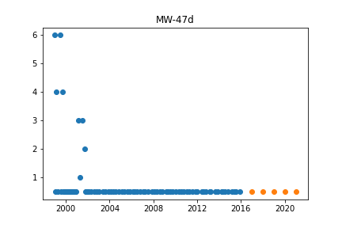

Initiated AutoTS object with best model: 
AverageValueNaive
{
  "fillna": "ffill",
  "transformations": {
    "0": "PositiveShift",
    "1": "DifferencedTransformer",
    "2": "Round",
    "3": "Slice"
  },
  "transformation_params": {
    "0": {},
    "1": {},
    "2": {
      "model": "middle",
      "decimals": -2,
      "on_transform": false,
      "on_inverse": true
    },
    "3": {
      "method": 0.5
    }
  }
}
{
  "method": "Median"
}

## MW-107

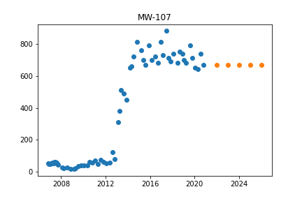

Initiated AutoTS object with best model: 
ETS
{
  "fillna": null,
  "transformations": {
    "0": "ClipOutliers",
    "1": "Discretize"
  },
  "transformation_params": {
    "0": {
      "method": "clip",
      "std_threshold": 5,
      "fillna": null
    },
    "1": {
      "discretization": "center",
      "n_bins": 10
    }
  }
}
{
  "damped_trend": false,
  "trend": null,
  "seasonal": null,
  "seasonal_periods": null
}

## TW-4

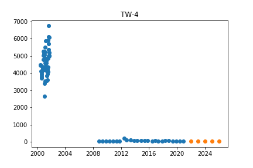

Initiated AutoTS object with best model: 
ETS
{
  "fillna": "rolling_mean_24",
  "transformations": {
    "0": "ClipOutliers",
    "1": "QuantileTransformer",
    "2": "Round",
    "3": "DifferencedTransformer",
    "4": "Detrend",
    "5": "MaxAbsScaler"
  },
  "transformation_params": {
    "0": {
      "method": "clip",
      "std_threshold": 3.5,
      "fillna": null
    },
    "1": {
      "output_distribution": "uniform",
      "n_quantiles": 5
    },
    "2": {
      "model": "middle",
      "decimals": -2,
      "on_transform": false,
      "on_inverse": true
    },
    "3": {},
    "4": {
      "model": "GLS"
    },
    "5": {}
  }
}
{
  "damped_trend": false,
  "trend": "additive",
  "seasonal": null,
  "seasonal_periods": null
}

## MW-53i

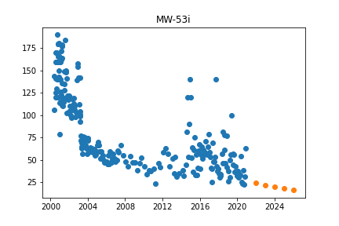

Initiated AutoTS object with best model: 
ETS
{
  "fillna": "fake_date",
  "transformations": {
    "0": "bkfilter",
    "1": "PowerTransformer",
    "2": "DifferencedTransformer"
  },
  "transformation_params": {
    "0": {},
    "1": {},
    "2": {}
  }
}
{
  "damped_trend": false,
  "trend": "additive",
  "seasonal": null,
  "seasonal_periods": null
}

## TW-3

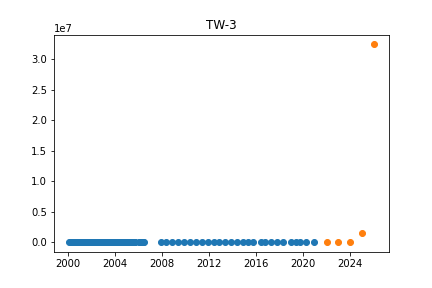

Initiated AutoTS object with best model: 
Ensemble
{}
{
  "model_name": "BestN",
  "model_count": 3,
  "model_metric": "mixed_metric",
  "models": {
    "053f4f30a98c5ca4e9fc3d7b38388607": {
      "Model": "AverageValueNaive",
      "ModelParameters": {
        "method": "Mean"
      },
      "TransformationParameters": {
        "fillna": "mean",
        "transformations": {
          "0": "ClipOutliers",
          "1": "QuantileTransformer",
          "2": "DifferencedTransformer"
        },
        "transformation_params": {
          "0": {
            "method": "clip",
            "std_threshold": 3,
            "fillna": null
          },
          "1": {
            "output_distribution": "uniform",
            "n_quantiles": 5
          },
          "2": {}
        }
      }
    },
    "6fd86a1a870a61142fbe6322b3242408": {
      "Model": "LastValueNaive",
      "ModelParameters": {},
      "TransformationParameters": {
        "fillna": "fake_date",
        "transformations": {
          "0": "Discretize",
          "1": "Slice",
          "2": "DifferencedTransformer",
          "3": "StandardScaler",
          "4": "DifferencedTransformer"
        },
        "transformation_params": {
          "0": {
            "discretization": "center",
            "n_bins": 5
          },
          "1": {
            "method": 0.2
          },
          "2": {},
          "3": {},
          "4": {}
        }
      }
    },
    "fa01ae168ed942f173bba37d637c1269": {
      "Model": "ETS",
      "ModelParameters": {
        "damped_trend": false,
        "trend": "multiplicative",
        "seasonal": "multiplicative",
        "seasonal_periods": 24
      },
      "TransformationParameters": {
        "fillna": "zero",
        "transformations": {
          "0": "ClipOutliers",
          "1": "PctChangeTransformer",
          "2": "Detrend",
          "3": "ClipOutliers"
        },
        "transformation_params": {
          "0": {
            "method": "clip",
            "std_threshold": 3,
            "fillna": null
          },
          "1": {},
          "2": {
            "model": "Linear"
          },
          "3": {
            "method": "clip",
            "std_threshold": 2,
            "fillna": null
          }
        }
      }
    }
  }
}

## 4141 Jackson Rd

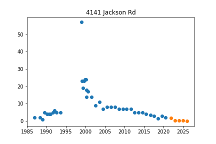

Initiated AutoTS object with best model: 
ETS
{
  "fillna": "ffill_mean_biased",
  "transformations": {
    "0": "PowerTransformer",
    "1": "Slice",
    "2": "PctChangeTransformer",
    "3": "IntermittentOccurrence",
    "4": "SeasonalDifference",
    "5": "SeasonalDifference"
  },
  "transformation_params": {
    "0": {},
    "1": {
      "method": 0.2
    },
    "2": {},
    "3": {
      "center": "mean"
    },
    "4": {
      "lag_1": 12,
      "method": "Mean"
    },
    "5": {
      "lag_1": 12,
      "method": "Median"
    }
  }
}
{
  "damped_trend": false,
  "trend": null,
  "seasonal": null,
  "seasonal_periods": null
}

## MW-100

Initiated AutoTS object with best model: 
Ensemble
{}
{
  "model_name": "BestN",
  "model_count": 3,
  "model_metric": "best_score_unique",
  "models": {
    "53f1bbca30f1bae5c3bfebbb89cf161c": {
      "Model": "LastValueNaive",
      "ModelParameters": {},
      "TransformationParameters": {
        "fillna": "ffill",
        "transformations": {
          "0": "ClipOutliers",
          "1": "QuantileTransformer"
        },
        "transformation_params": {
          "0": {
            "method": "clip",
            "std_threshold": 3,
            "fillna": null
          },
          "1": {
            "output_distribution": "uniform",
            "n_quantiles": 3
          }
        }
      }
    },
    "9f9aa7ef2bd8e2660797f05b69c9b139": {
      "Model": "ETS",
      "ModelParameters": {
        "damped_trend": false,
        "trend": "additive",
        "seasonal": null,
        "seasonal_periods": null
      },
      "TransformationParameters": {
        "fillna": "mean",
        "transformations": {
          "0": "PositiveShift",
          "1": "QuantileTransformer"
        },
        "transformation_params": {
          "0": {},
          "1": {
            "output_distribution": "uniform",
            "n_quantiles": 3
          }
        }
      }
    },
    "9c4020228efbf25d0fafaedd74140bb8": {
      "Model": "AverageValueNaive",
      "ModelParameters": {
        "method": "Mean"
      },
      "TransformationParameters": {
        "fillna": "ffill",
        "transformations": {
          "0": "Round",
          "1": "bkfilter",
          "2": "DifferencedTransformer",
          "3": "Discretize"
        },
        "transformation_params": {
          "0": {
            "model": "middle",
            "decimals": 0,
            "on_transform": false,
            "on_inverse": true
          },
          "1": {},
          "2": {},
          "3": {
            "discretization": "upper",
            "n_bins": 20
          }
        }
      }
    }
  }
}

## SW-COMB

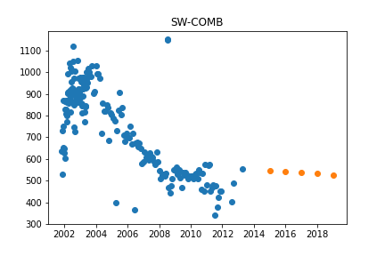

Initiated AutoTS object with best model: 
Ensemble
{}
{
  "model_name": "BestN",
  "model_count": 3,
  "model_metric": "best_score_unique",
  "models": {
    "15e1eebc46c19f7c73ca093d2217b3ab": {
      "Model": "ETS",
      "ModelParameters": {
        "damped_trend": false,
        "trend": "additive",
        "seasonal": null,
        "seasonal_periods": null
      },
      "TransformationParameters": {
        "fillna": "ffill",
        "transformations": {
          "0": "MinMaxScaler",
          "1": "PowerTransformer",
          "2": "StandardScaler"
        },
        "transformation_params": {
          "0": {},
          "1": {},
          "2": {}
        }
      }
    },
    "f333cb7adee0642bba82529a4c185e1a": {
      "Model": "LastValueNaive",
      "ModelParameters": {},
      "TransformationParameters": {
        "fillna": "ffill",
        "transformations": {
          "0": "RobustScaler",
          "1": "PowerTransformer"
        },
        "transformation_params": {
          "0": {},
          "1": {}
        }
      }
    },
    "49aa80fc558937ef2ddb989b4d881440": {
      "Model": "AverageValueNaive",
      "ModelParameters": {
        "method": "Mean"
      },
      "TransformationParameters": {
        "fillna": "ffill",
        "transformations": {
          "0": "ClipOutliers",
          "1": "DifferencedTransformer",
          "2": "MinMaxScaler",
          "3": "StandardScaler"
        },
        "transformation_params": {
          "0": {
            "method": "clip",
            "std_threshold": 3,
            "fillna": null
          },
          "1": {},
          "2": {},
          "3": {}
        }
      }
    }
  }
}

## MW-9d

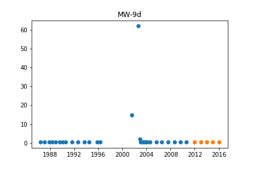

Initiated AutoTS object with best model: 
GLS
{
  "fillna": "ffill",
  "transformations": {
    "0": "ClipOutliers",
    "1": "QuantileTransformer",
    "2": "RobustScaler",
    "3": "Round",
    "4": "MaxAbsScaler"
  },
  "transformation_params": {
    "0": {
      "method": "clip",
      "std_threshold": 3.5,
      "fillna": null
    },
    "1": {
      "output_distribution": "uniform",
      "n_quantiles": 6
    },
    "2": {},
    "3": {
      "model": "middle",
      "decimals": 2,
      "on_transform": true,
      "on_inverse": true
    },
    "4": {}
  }
}
{}

## MW-106s

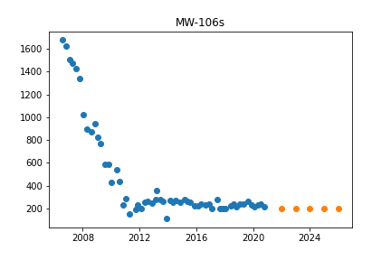

Initiated AutoTS object with best model: 
GLS
{
  "fillna": "rolling_mean",
  "transformations": {
    "0": "QuantileTransformer",
    "1": "QuantileTransformer",
    "2": "Detrend",
    "3": "Log"
  },
  "transformation_params": {
    "0": {
      "output_distribution": "uniform",
      "n_quantiles": 3
    },
    "1": {
      "output_distribution": "uniform",
      "n_quantiles": 3
    },
    "2": {
      "model": "Linear"
    },
    "3": {}
  }
}
{}

## MW-129s

Initiated AutoTS object with best model: 
AverageValueNaive
{
  "fillna": "ffill",
  "transformations": {
    "0": "StandardScaler",
    "1": "QuantileTransformer",
    "2": "Round",
    "3": "StandardScaler",
    "4": "MinMaxScaler",
    "5": "QuantileTransformer"
  },
  "transformation_params": {
    "0": {},
    "1": {
      "output_distribution": "uniform",
      "n_quantiles": 1
    },
    "2": {
      "model": "middle",
      "decimals": 0,
      "on_transform": true,
      "on_inverse": true
    },
    "3": {},
    "4": {},
    "5": {
      "output_distribution": "normal",
      "n_quantiles": 1
    }
  }
}
{
  "method": "Median"
}

## MW-15d

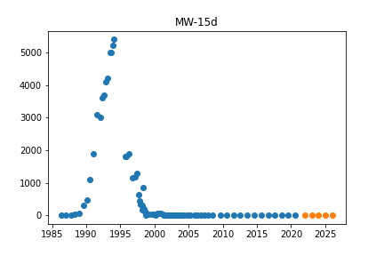

Initiated AutoTS object with best model: 
ETS
{
  "fillna": "rolling_mean",
  "transformations": {
    "0": "ClipOutliers",
    "1": "bkfilter",
    "2": "Slice",
    "3": "MinMaxScaler"
  },
  "transformation_params": {
    "0": {
      "method": "clip",
      "std_threshold": 3,
      "fillna": null
    },
    "1": {},
    "2": {
      "method": 0.2
    },
    "3": {}
  }
}
{
  "damped_trend": false,
  "trend": null,
  "seasonal": "additive",
  "seasonal_periods": 37
}

## MW-KZ-1

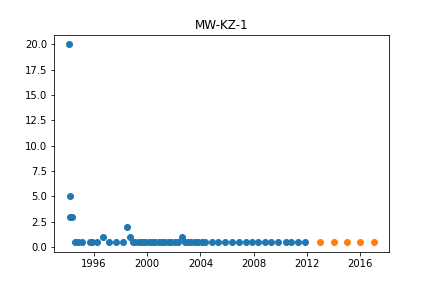

Initiated AutoTS object with best model: 
Ensemble
{}
{
  "model_name": "BestN",
  "model_count": 3,
  "model_metric": "best_score_unique",
  "models": {
    "d76391bff1126e7a25a5cd344a7c4e15": {
      "Model": "GLS",
      "ModelParameters": {},
      "TransformationParameters": {
        "fillna": "rolling_mean_24",
        "transformations": {
          "0": "MaxAbsScaler",
          "1": "QuantileTransformer",
          "2": "RobustScaler",
          "3": "bkfilter"
        },
        "transformation_params": {
          "0": {},
          "1": {
            "output_distribution": "uniform",
            "n_quantiles": 4
          },
          "2": {},
          "3": {}
        }
      }
    },
    "a5536c05de8fbff638d7cda4b6492e7e": {
      "Model": "AverageValueNaive",
      "ModelParameters": {
        "method": "Weighted_Mean"
      },
      "TransformationParameters": {
        "fillna": "ffill",
        "transformations": {
          "0": "ClipOutliers",
          "1": "QuantileTransformer",
          "2": "RobustScaler",
          "3": "RollingMeanTransformer"
        },
        "transformation_params": {
          "0": {
            "method": "clip",
            "std_threshold": 2,
            "fillna": null
          },
          "1": {
            "output_distribution": "uniform",
            "n_quantiles": 4
          },
          "2": {},
          "3": {
            "fixed": true,
            "window": 7
          }
        }
      }
    },
    "43818731df95a7c40173edf53212ddcf": {
      "Model": "LastValueNaive",
      "ModelParameters": {},
      "TransformationParameters": {
        "fillna": "ffill",
        "transformations": {
          "0": "ClipOutliers",
          "1": "QuantileTransformer"
        },
        "transformation_params": {
          "0": {
            "method": "clip",
            "std_threshold": 2,
            "fillna": null
          },
          "1": {
            "output_distribution": "uniform",
            "n_quantiles": 4
          }
        }
      }
    }
  }
}

## MW-76i

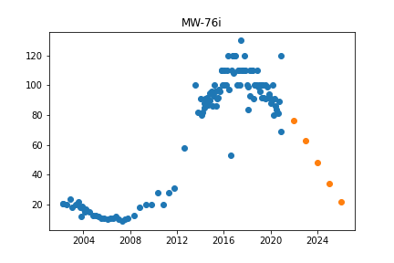

Initiated AutoTS object with best model: 
LastValueNaive
{
  "fillna": "rolling_mean_24",
  "transformations": {
    "0": "ClipOutliers",
    "1": "SinTrend"
  },
  "transformation_params": {
    "0": {
      "method": "clip",
      "std_threshold": 4,
      "fillna": null
    },
    "1": {}
  }
}
{}

## MW-60

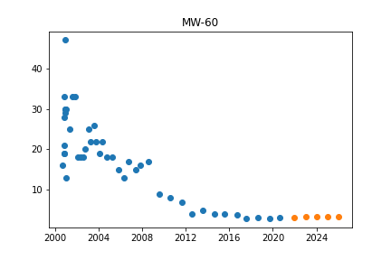

Initiated AutoTS object with best model: 
LastValueNaive
{
  "fillna": "ffill",
  "transformations": {
    "0": "RobustScaler",
    "1": "DifferencedTransformer",
    "2": "ClipOutliers",
    "3": "Discretize"
  },
  "transformation_params": {
    "0": {},
    "1": {},
    "2": {
      "method": "clip",
      "std_threshold": 3.5,
      "fillna": null
    },
    "3": {
      "discretization": "lower",
      "n_bins": 5
    }
  }
}
{}

## MW-56d

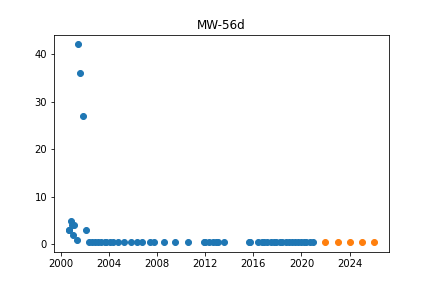

Initiated AutoTS object with best model: 
AverageValueNaive
{
  "fillna": "rolling_mean_24",
  "transformations": {
    "0": "RobustScaler",
    "1": "Discretize",
    "2": "DifferencedTransformer",
    "3": "Round"
  },
  "transformation_params": {
    "0": {},
    "1": {
      "discretization": "lower",
      "n_bins": 20
    },
    "2": {},
    "3": {
      "model": "middle",
      "decimals": -1,
      "on_transform": true,
      "on_inverse": true
    }
  }
}
{
  "method": "Median"
}

## Bethlehem Cemetery

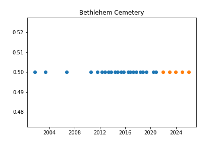

Initiated AutoTS object with best model: 
Ensemble
{}
{
  "model_name": "BestN",
  "model_count": 3,
  "model_metric": "best_score_unique",
  "models": {
    "2887d2af24ace64615ccf0154ef2e4be": {
      "Model": "AverageValueNaive",
      "ModelParameters": {
        "method": "Mean"
      },
      "TransformationParameters": {
        "fillna": "fake_date",
        "transformations": {
          "0": "DifferencedTransformer",
          "1": "SinTrend"
        },
        "transformation_params": {
          "0": {},
          "1": {}
        }
      }
    },
    "869327f8cae4917a3d35847bac3bdc06": {
      "Model": "LastValueNaive",
      "ModelParameters": {},
      "TransformationParameters": {
        "fillna": "rolling_mean",
        "transformations": {
          "0": "ClipOutliers",
          "1": "MinMaxScaler",
          "2": "Detrend"
        },
        "transformation_params": {
          "0": {
            "method": "clip",
            "std_threshold": 4,
            "fillna": null
          },
          "1": {},
          "2": {
            "model": "GLS"
          }
        }
      }
    },
    "7684e43ff921c51e5ec8131d9a7869b1": {
      "Model": "GLS",
      "ModelParameters": {},
      "TransformationParameters": {
        "fillna": "ffill",
        "transformations": {
          "0": "SeasonalDifference",
          "1": "PowerTransformer",
          "2": "Round",
          "3": "ClipOutliers",
          "4": "PowerTransformer"
        },
        "transformation_params": {
          "0": {
            "lag_1": 12,
            "method": "Mean"
          },
          "1": {},
          "2": {
            "model": "middle",
            "decimals": 0,
            "on_transform": false,
            "on_inverse": true
          },
          "3": {
            "method": "clip",
            "std_threshold": 3.5,
            "fillna": null
          },
          "4": {}
        }
      }
    }
  }
}

## TW-13

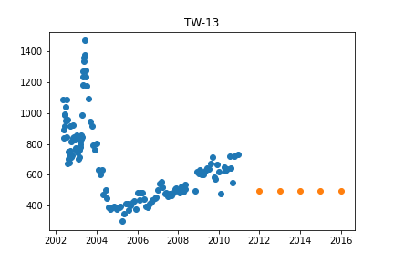

Initiated AutoTS object with best model: 
Ensemble
{}
{
  "model_name": "BestN",
  "model_count": 3,
  "model_metric": "best_score_unique",
  "models": {
    "f6133b6ce2816c1a5748336d8dd316b6": {
      "Model": "LastValueNaive",
      "ModelParameters": {},
      "TransformationParameters": {
        "fillna": "mean",
        "transformations": {
          "0": "ClipOutliers",
          "1": "Discretize"
        },
        "transformation_params": {
          "0": {
            "method": "clip",
            "std_threshold": 1,
            "fillna": null
          },
          "1": {
            "discretization": "center",
            "n_bins": 20
          }
        }
      }
    },
    "39891593a08f5d75797bfd09a723bc0e": {
      "Model": "ETS",
      "ModelParameters": {
        "damped_trend": false,
        "trend": null,
        "seasonal": null,
        "seasonal_periods": null
      },
      "TransformationParameters": {
        "fillna": "mean",
        "transformations": {
          "0": "ClipOutliers",
          "1": "Discretize",
          "2": "QuantileTransformer"
        },
        "transformation_params": {
          "0": {
            "method": "clip",
            "std_threshold": 1,
            "fillna": null
          },
          "1": {
            "discretization": "center",
            "n_bins": 20
          },
          "2": {
            "output_distribution": "uniform",
            "n_quantiles": 1
          }
        }
      }
    },
    "9d1c34ccb177d3d21d8bb03224c4d157": {
      "Model": "AverageValueNaive",
      "ModelParameters": {
        "method": "Mean"
      },
      "TransformationParameters": {
        "fillna": "rolling_mean",
        "transformations": {
          "0": "ClipOutliers",
          "1": "QuantileTransformer"
        },
        "transformation_params": {
          "0": {
            "method": "clip",
            "std_threshold": 1,
            "fillna": null
          },
          "1": {
            "output_distribution": "uniform",
            "n_quantiles": 1
          }
        }
      }
    }
  }
}

## MW-67

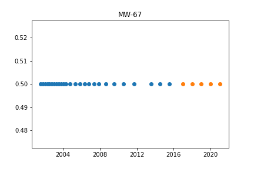

Initiated AutoTS object with best model: 
ETS
{
  "fillna": "fake_date",
  "transformations": {
    "0": "DifferencedTransformer",
    "1": "ClipOutliers"
  },
  "transformation_params": {
    "0": {},
    "1": {
      "method": "clip",
      "std_threshold": 3,
      "fillna": null
    }
  }
}
{
  "damped_trend": false,
  "trend": null,
  "seasonal": "additive",
  "seasonal_periods": 60
}

## MW-93

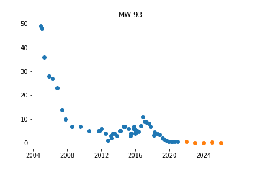

Initiated AutoTS object with best model: 
LastValueNaive
{
  "fillna": "fake_date",
  "transformations": {
    "0": "PowerTransformer",
    "1": "StandardScaler",
    "2": "DifferencedTransformer",
    "3": "SeasonalDifference",
    "4": "IntermittentOccurrence"
  },
  "transformation_params": {
    "0": {},
    "1": {},
    "2": {},
    "3": {
      "lag_1": 12,
      "method": "LastValue"
    },
    "4": {
      "center": "mean"
    }
  }
}
{}

## PMW-1

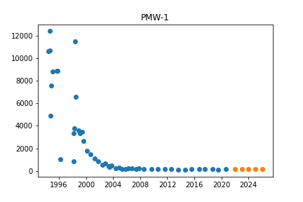

Initiated AutoTS object with best model: 
LastValueNaive
{
  "fillna": "median",
  "transformations": {
    "0": "ClipOutliers",
    "1": "QuantileTransformer"
  },
  "transformation_params": {
    "0": {
      "method": "clip",
      "std_threshold": 1,
      "fillna": null
    },
    "1": {
      "output_distribution": "uniform",
      "n_quantiles": 7
    }
  }
}
{}

## TW-14

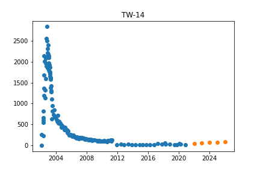

Initiated AutoTS object with best model: 
Ensemble
{}
{
  "model_name": "BestN",
  "model_count": 3,
  "model_metric": "best_score_unique",
  "models": {
    "557e79494e83bc95e54faee1119c6f45": {
      "Model": "AverageValueNaive",
      "ModelParameters": {
        "method": "Weighted_Mean"
      },
      "TransformationParameters": {
        "fillna": "rolling_mean",
        "transformations": {
          "0": "Detrend",
          "1": "Slice"
        },
        "transformation_params": {
          "0": {
            "model": "GLS"
          },
          "1": {
            "method": 0.2
          }
        }
      }
    },
    "e6a95ab1dc74190cded6ee99372d8141": {
      "Model": "ETS",
      "ModelParameters": {
        "damped_trend": false,
        "trend": "additive",
        "seasonal": null,
        "seasonal_periods": null
      },
      "TransformationParameters": {
        "fillna": "rolling_mean_24",
        "transformations": {
          "0": "DifferencedTransformer",
          "1": "ClipOutliers",
          "2": "Slice",
          "3": "MaxAbsScaler",
          "4": "RobustScaler"
        },
        "transformation_params": {
          "0": {},
          "1": {
            "method": "clip",
            "std_threshold": 5,
            "fillna": null
          },
          "2": {
            "method": 0.2
          },
          "3": {},
          "4": {}
        }
      }
    },
    "b7335bd461891ce5b48bc2d6f28ba8d7": {
      "Model": "LastValueNaive",
      "ModelParameters": {},
      "TransformationParameters": {
        "fillna": "rolling_mean",
        "transformations": {
          "0": "Discretize",
          "1": "QuantileTransformer"
        },
        "transformation_params": {
          "0": {
            "discretization": "center",
            "n_bins": 10
          },
          "1": {
            "output_distribution": "uniform",
            "n_quantiles": 4
          }
        }
      }
    }
  }
}

## MOW-1

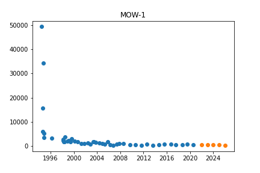

Initiated AutoTS object with best model: 
ETS
{
  "fillna": "mean",
  "transformations": {
    "0": "MaxAbsScaler",
    "1": "QuantileTransformer"
  },
  "transformation_params": {
    "0": {},
    "1": {
      "output_distribution": "uniform",
      "n_quantiles": 7
    }
  }
}
{
  "damped_trend": false,
  "trend": "additive",
  "seasonal": null,
  "seasonal_periods": null
}

## 430 Barber West

Initiated AutoTS object with best model: 
ETS
{
  "fillna": "ffill",
  "transformations": {
    "0": "DifferencedTransformer",
    "1": "SinTrend"
  },
  "transformation_params": {
    "0": {},
    "1": {}
  }
}
{
  "damped_trend": false,
  "trend": null,
  "seasonal": "multiplicative",
  "seasonal_periods": 96
}

## MW-51

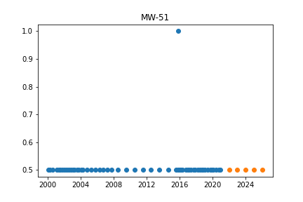

Initiated AutoTS object with best model: 
AverageValueNaive
{
  "fillna": "mean",
  "transformations": {
    "0": "ClipOutliers",
    "1": "QuantileTransformer",
    "2": "DifferencedTransformer"
  },
  "transformation_params": {
    "0": {
      "method": "clip",
      "std_threshold": 3,
      "fillna": null
    },
    "1": {
      "output_distribution": "uniform",
      "n_quantiles": 5
    },
    "2": {}
  }
}
{
  "method": "Mean"
}

## MW-3d

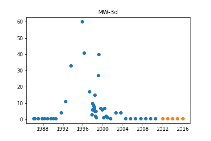

Initiated AutoTS object with best model: 
LastValueNaive
{
  "fillna": "rolling_mean",
  "transformations": {
    "0": "ClipOutliers",
    "1": "QuantileTransformer"
  },
  "transformation_params": {
    "0": {
      "method": "clip",
      "std_threshold": 1,
      "fillna": null
    },
    "1": {
      "output_distribution": "uniform",
      "n_quantiles": 6
    }
  }
}
{}

## 2690 Dexter Rd

Initiated AutoTS object with best model: 
ETS
{
  "fillna": "zero",
  "transformations": {
    "0": "ClipOutliers"
  },
  "transformation_params": {
    "0": {
      "method": "clip",
      "std_threshold": 3,
      "fillna": null
    }
  }
}
{
  "damped_trend": false,
  "trend": null,
  "seasonal": null,
  "seasonal_periods": null
}

## TW-22

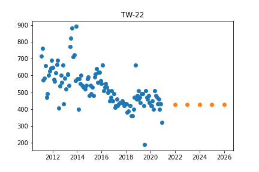

Initiated AutoTS object with best model: 
Ensemble
{}
{
  "model_name": "BestN",
  "model_count": 3,
  "model_metric": "best_score_unique",
  "models": {
    "91e50fc1699b8fb85e67deadc1a5cd1b": {
      "Model": "LastValueNaive",
      "ModelParameters": {},
      "TransformationParameters": {
        "fillna": "fake_date",
        "transformations": {
          "0": "ClipOutliers"
        },
        "transformation_params": {
          "0": {
            "method": "clip",
            "std_threshold": 2,
            "fillna": null
          }
        }
      }
    },
    "b135128f09da13da10dbc635688fa53f": {
      "Model": "ETS",
      "ModelParameters": {
        "damped_trend": false,
        "trend": null,
        "seasonal": null,
        "seasonal_periods": null
      },
      "TransformationParameters": {
        "fillna": "ffill",
        "transformations": {
          "0": "ClipOutliers"
        },
        "transformation_params": {
          "0": {
            "method": "clip",
            "std_threshold": 2,
            "fillna": null
          }
        }
      }
    },
    "d05648e259e734273ae381dadfd6547c": {
      "Model": "AverageValueNaive",
      "ModelParameters": {
        "method": "Mean"
      },
      "TransformationParameters": {
        "fillna": "mean",
        "transformations": {
          "0": "ClipOutliers",
          "1": "QuantileTransformer",
          "2": "DifferencedTransformer"
        },
        "transformation_params": {
          "0": {
            "method": "clip",
            "std_threshold": 3,
            "fillna": null
          },
          "1": {
            "output_distribution": "uniform",
            "n_quantiles": 1
          },
          "2": {}
        }
      }
    }
  }
}

## AE-1

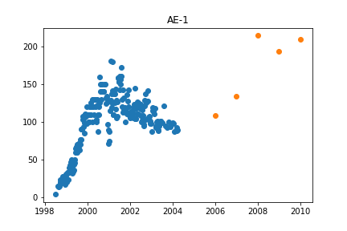

Initiated AutoTS object with best model: 
ETS
{
  "fillna": "rolling_mean",
  "transformations": {
    "0": "Detrend",
    "1": "MaxAbsScaler",
    "2": "Detrend"
  },
  "transformation_params": {
    "0": {
      "model": "Linear"
    },
    "1": {},
    "2": {
      "model": "GLS"
    }
  }
}
{
  "damped_trend": false,
  "trend": null,
  "seasonal": "additive",
  "seasonal_periods": 7
}

## MW-30d

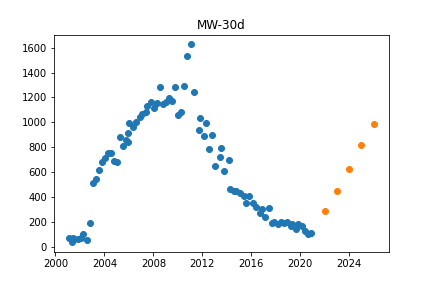

Initiated AutoTS object with best model: 
LastValueNaive
{
  "fillna": "mean",
  "transformations": {
    "0": "bkfilter",
    "1": "SinTrend",
    "2": "Detrend",
    "3": "PowerTransformer"
  },
  "transformation_params": {
    "0": {},
    "1": {},
    "2": {
      "model": "Linear"
    },
    "3": {}
  }
}
{}

## 3249 Dexter Rd

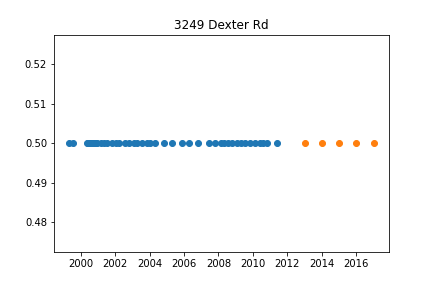

Initiated AutoTS object with best model: 
AverageValueNaive
{
  "fillna": "rolling_mean",
  "transformations": {
    "0": "SeasonalDifference",
    "1": "Discretize",
    "2": "MaxAbsScaler",
    "3": "Round",
    "4": "PctChangeTransformer",
    "5": "MinMaxScaler"
  },
  "transformation_params": {
    "0": {
      "lag_1": 7,
      "method": "Median"
    },
    "1": {
      "discretization": "lower",
      "n_bins": 20
    },
    "2": {},
    "3": {
      "model": "middle",
      "decimals": 0,
      "on_transform": false,
      "on_inverse": true
    },
    "4": {},
    "5": {}
  }
}
{
  "method": "Weighted_Mean"
}

## 697 South Wagner Rd

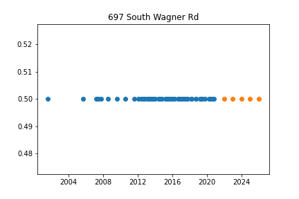

Initiated AutoTS object with best model: 
AverageValueNaive
{
  "fillna": "rolling_mean",
  "transformations": {
    "0": "SeasonalDifference",
    "1": "Discretize",
    "2": "MaxAbsScaler",
    "3": "Round",
    "4": "PctChangeTransformer",
    "5": "MinMaxScaler"
  },
  "transformation_params": {
    "0": {
      "lag_1": 7,
      "method": "Median"
    },
    "1": {
      "discretization": "lower",
      "n_bins": 20
    },
    "2": {},
    "3": {
      "model": "middle",
      "decimals": 0,
      "on_transform": false,
      "on_inverse": true
    },
    "4": {},
    "5": {}
  }
}
{
  "method": "Weighted_Mean"
}

## MW-79d

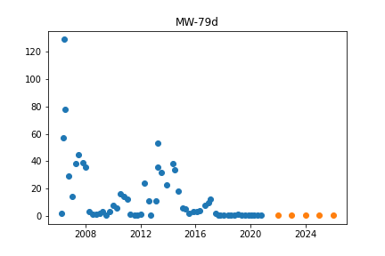

Initiated AutoTS object with best model: 
ETS
{
  "fillna": "ffill",
  "transformations": {
    "0": "QuantileTransformer",
    "1": "IntermittentOccurrence",
    "2": "DifferencedTransformer",
    "3": "Detrend"
  },
  "transformation_params": {
    "0": {
      "output_distribution": "uniform",
      "n_quantiles": 3
    },
    "1": {
      "center": "mean"
    },
    "2": {},
    "3": {
      "model": "Linear"
    }
  }
}
{
  "damped_trend": false,
  "trend": "additive",
  "seasonal": null,
  "seasonal_periods": null
}

## MW-69

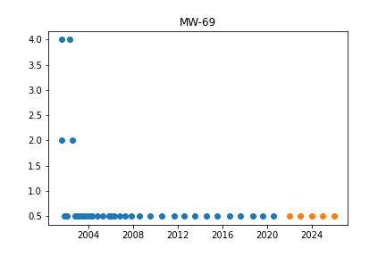

Initiated AutoTS object with best model: 
Ensemble
{}
{
  "model_name": "BestN",
  "model_count": 3,
  "model_metric": "best_score",
  "models": {
    "053f4f30a98c5ca4e9fc3d7b38388607": {
      "Model": "AverageValueNaive",
      "ModelParameters": {
        "method": "Mean"
      },
      "TransformationParameters": {
        "fillna": "mean",
        "transformations": {
          "0": "ClipOutliers",
          "1": "QuantileTransformer",
          "2": "DifferencedTransformer"
        },
        "transformation_params": {
          "0": {
            "method": "clip",
            "std_threshold": 3,
            "fillna": null
          },
          "1": {
            "output_distribution": "uniform",
            "n_quantiles": 5
          },
          "2": {}
        }
      }
    },
    "43be953ef9de52bed39a1aedb9848be0": {
      "Model": "ETS",
      "ModelParameters": {
        "damped_trend": false,
        "trend": "additive",
        "seasonal": null,
        "seasonal_periods": null
      },
      "TransformationParameters": {
        "fillna": "mean",
        "transformations": {
          "0": "ClipOutliers",
          "1": "QuantileTransformer"
        },
        "transformation_params": {
          "0": {
            "method": "clip",
            "std_threshold": 3,
            "fillna": null
          },
          "1": {
            "output_distribution": "uniform",
            "n_quantiles": 5
          }
        }
      }
    },
    "4227ea11cbb6620f9f5312f619e4d78c": {
      "Model": "GLS",
      "ModelParameters": {},
      "TransformationParameters": {
        "fillna": "median",
        "transformations": {
          "0": "ClipOutliers",
          "1": "QuantileTransformer",
          "2": "RobustScaler",
          "3": "Round",
          "4": "MaxAbsScaler"
        },
        "transformation_params": {
          "0": {
            "method": "clip",
            "std_threshold": 3.5,
            "fillna": null
          },
          "1": {
            "output_distribution": "uniform",
            "n_quantiles": 5
          },
          "2": {},
          "3": {
            "model": "middle",
            "decimals": 2,
            "on_transform": true,
            "on_inverse": true
          },
          "4": {}
        }
      }
    }
  }
}

## 435 Barber

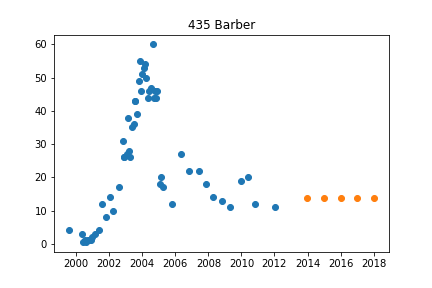

Initiated AutoTS object with best model: 
Ensemble
{}
{
  "model_name": "BestN",
  "model_count": 3,
  "model_metric": "mixed_metric",
  "models": {
    "3a29bb837752e80a31a303cd79464009": {
      "Model": "AverageValueNaive",
      "ModelParameters": {
        "method": "Midhinge"
      },
      "TransformationParameters": {
        "fillna": "rolling_mean_24",
        "transformations": {
          "0": "MaxAbsScaler",
          "1": "QuantileTransformer",
          "2": "RobustScaler",
          "3": "MaxAbsScaler"
        },
        "transformation_params": {
          "0": {},
          "1": {
            "output_distribution": "uniform",
            "n_quantiles": 3
          },
          "2": {},
          "3": {}
        }
      }
    },
    "ad63056df4e49ee5de66f31faa23ae42": {
      "Model": "AverageValueNaive",
      "ModelParameters": {
        "method": "Midhinge"
      },
      "TransformationParameters": {
        "fillna": "rolling_mean_24",
        "transformations": {
          "0": "ClipOutliers",
          "1": "Discretize",
          "2": "RobustScaler",
          "3": "PCA"
        },
        "transformation_params": {
          "0": {
            "method": "clip",
            "std_threshold": 3.5,
            "fillna": null
          },
          "1": {
            "discretization": "lower",
            "n_bins": 5
          },
          "2": {},
          "3": {}
        }
      }
    },
    "4a7981d8ca0ef5b931ba745da9e8ff8c": {
      "Model": "LastValueNaive",
      "ModelParameters": {},
      "TransformationParameters": {
        "fillna": "mean",
        "transformations": {
          "0": "ClipOutliers",
          "1": "QuantileTransformer"
        },
        "transformation_params": {
          "0": {
            "method": "clip",
            "std_threshold": 1,
            "fillna": null
          },
          "1": {
            "output_distribution": "uniform",
            "n_quantiles": 3
          }
        }
      }
    }
  }
}

## MW-59s

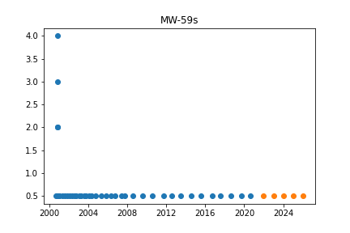

Initiated AutoTS object with best model: 
AverageValueNaive
{
  "fillna": "mean",
  "transformations": {
    "0": "ClipOutliers",
    "1": "QuantileTransformer",
    "2": "DifferencedTransformer"
  },
  "transformation_params": {
    "0": {
      "method": "clip",
      "std_threshold": 3,
      "fillna": null
    },
    "1": {
      "output_distribution": "uniform",
      "n_quantiles": 5
    },
    "2": {}
  }
}
{
  "method": "Mean"
}

## MW-35

Initiated AutoTS object with best model: 
LastValueNaive
{
  "fillna": "ffill",
  "transformations": {
    "0": "ClipOutliers",
    "1": "QuantileTransformer",
    "2": "ClipOutliers",
    "3": "RobustScaler"
  },
  "transformation_params": {
    "0": {
      "method": "clip",
      "std_threshold": 1,
      "fillna": null
    },
    "1": {
      "output_distribution": "uniform",
      "n_quantiles": 8
    },
    "2": {
      "method": "clip",
      "std_threshold": 5,
      "fillna": null
    },
    "3": {}
  }
}
{}

## MW-10s

Initiated AutoTS object with best model: 
LastValueNaive
{
  "fillna": "mean",
  "transformations": {
    "0": "MaxAbsScaler",
    "1": "bkfilter",
    "2": "bkfilter",
    "3": "Slice",
    "4": "Slice"
  },
  "transformation_params": {
    "0": {},
    "1": {},
    "2": {},
    "3": {
      "method": 100
    },
    "4": {
      "method": 100
    }
  }
}
{}

## MW-105s

Initiated AutoTS object with best model: 
Ensemble
{}
{
  "model_name": "BestN",
  "model_count": 3,
  "model_metric": "best_score_unique",
  "models": {
    "bc81cf4f6005c25b1226cf74dec6b2ac": {
      "Model": "LastValueNaive",
      "ModelParameters": {},
      "TransformationParameters": {
        "fillna": "fake_date",
        "transformations": {
          "0": "PctChangeTransformer",
          "1": "QuantileTransformer",
          "2": "ClipOutliers",
          "3": "PCA"
        },
        "transformation_params": {
          "0": {},
          "1": {
            "output_distribution": "uniform",
            "n_quantiles": 3
          },
          "2": {
            "method": "clip",
            "std_threshold": 5,
            "fillna": null
          },
          "3": {}
        }
      }
    },
    "8d1fac94c4e37ae677d6f2154dad5e37": {
      "Model": "AverageValueNaive",
      "ModelParameters": {
        "method": "Mean"
      },
      "TransformationParameters": {
        "fillna": "fake_date",
        "transformations": {
          "0": "PctChangeTransformer",
          "1": "QuantileTransformer",
          "2": "DifferencedTransformer",
          "3": "PCA"
        },
        "transformation_params": {
          "0": {},
          "1": {
            "output_distribution": "uniform",
            "n_quantiles": 3
          },
          "2": {},
          "3": {}
        }
      }
    },
    "df19079bc6f639a4467f54bdf60d3806": {
      "Model": "ETS",
      "ModelParameters": {
        "damped_trend": false,
        "trend": "additive",
        "seasonal": null,
        "seasonal_periods": null
      },
      "TransformationParameters": {
        "fillna": "fake_date",
        "transformations": {
          "0": "Round",
          "1": "QuantileTransformer",
          "2": "DifferencedTransformer",
          "3": "SeasonalDifference"
        },
        "transformation_params": {
          "0": {
            "model": "middle",
            "decimals": -1,
            "on_transform": true,
            "on_inverse": false
          },
          "1": {
            "output_distribution": "uniform",
            "n_quantiles": 3
          },
          "2": {},
          "3": {
            "lag_1": 7,
            "method": "LastValue"
          }
        }
      }
    }
  }
}

## DOLPH

Initiated AutoTS object with best model: 
LastValueNaive
{
  "fillna": "mean",
  "transformations": {
    "0": "Detrend"
  },
  "transformation_params": {
    "0": {
      "model": "GLS"
    }
  }
}
{}

## NMW-3d

Initiated AutoTS object with best model: 
ETS
{
  "fillna": "ffill",
  "transformations": {
    "0": "PctChangeTransformer",
    "1": "Slice"
  },
  "transformation_params": {
    "0": {},
    "1": {
      "method": 0.2
    }
  }
}
{
  "damped_trend": false,
  "trend": null,
  "seasonal": null,
  "seasonal_periods": null
}

## MW-39d

Initiated AutoTS object with best model: 
AverageValueNaive
{
  "fillna": "fake_date",
  "transformations": {
    "0": "ClipOutliers",
    "1": "PowerTransformer",
    "2": "DifferencedTransformer",
    "3": "Discretize",
    "4": "RobustScaler"
  },
  "transformation_params": {
    "0": {
      "method": "clip",
      "std_threshold": 2,
      "fillna": null
    },
    "1": {},
    "2": {},
    "3": {
      "discretization": "lower",
      "n_bins": 20
    },
    "4": {}
  }
}
{
  "method": "Median"
}

## MW-32

Initiated AutoTS object with best model: 
LastValueNaive
{
  "fillna": "zero",
  "transformations": {
    "0": "Discretize",
    "1": "QuantileTransformer",
    "2": "DifferencedTransformer",
    "3": "MinMaxScaler",
    "4": "bkfilter"
  },
  "transformation_params": {
    "0": {
      "discretization": "lower",
      "n_bins": 20
    },
    "1": {
      "output_distribution": "uniform",
      "n_quantiles": 8
    },
    "2": {},
    "3": {},
    "4": {}
  }
}
{}

## MW-103d

Initiated AutoTS object with best model: 
Ensemble
{}
{
  "model_name": "BestN",
  "model_count": 3,
  "model_metric": "best_score_unique",
  "models": {
    "adace2b90e21432683f2b92b2f5cce39": {
      "Model": "AverageValueNaive",
      "ModelParameters": {
        "method": "Weighted_Mean"
      },
      "TransformationParameters": {
        "fillna": "rolling_mean",
        "transformations": {
          "0": "bkfilter",
          "1": "DifferencedTransformer",
          "2": "Discretize",
          "3": "QuantileTransformer"
        },
        "transformation_params": {
          "0": {},
          "1": {},
          "2": {
            "discretization": "center",
            "n_bins": 5
          },
          "3": {
            "output_distribution": "uniform",
            "n_quantiles": 3
          }
        }
      }
    },
    "6cd81a448d9af2d744976d94b4080df3": {
      "Model": "LastValueNaive",
      "ModelParameters": {},
      "TransformationParameters": {
        "fillna": "ffill",
        "transformations": {
          "0": "IntermittentOccurrence"
        },
        "transformation_params": {
          "0": {
            "center": "mean"
          }
        }
      }
    },
    "8f19bc0ac654e21d979da496ba25c00e": {
      "Model": "GLS",
      "ModelParameters": {},
      "TransformationParameters": {
        "fillna": "ffill",
        "transformations": {
          "0": "Detrend",
          "1": "DifferencedTransformer",
          "2": "PowerTransformer",
          "3": "QuantileTransformer",
          "4": "ClipOutliers"
        },
        "transformation_params": {
          "0": {
            "model": "GLS"
          },
          "1": {},
          "2": {},
          "3": {
            "output_distribution": "uniform",
            "n_quantiles": 3
          },
          "4": {
            "method": "clip",
            "std_threshold": 3.5,
            "fillna": null
          }
        }
      }
    }
  }
}

## MW-101

Initiated AutoTS object with best model: 
AverageValueNaive
{
  "fillna": "rolling_mean_24",
  "transformations": {
    "0": "Detrend",
    "1": "DifferencedTransformer",
    "2": "Detrend"
  },
  "transformation_params": {
    "0": {
      "model": "Linear"
    },
    "1": {},
    "2": {
      "model": "GLS"
    }
  }
}
{
  "method": "Median"
}

## 440 Clarendon

Initiated AutoTS object with best model: 
ETS
{
  "fillna": "ffill",
  "transformations": {
    "0": "PositiveShift",
    "1": "StandardScaler",
    "2": "DifferencedTransformer"
  },
  "transformation_params": {
    "0": {},
    "1": {},
    "2": {}
  }
}
{
  "damped_trend": false,
  "trend": null,
  "seasonal": null,
  "seasonal_periods": null
}

## 110 Parkland Plaza

Initiated AutoTS object with best model: 
Ensemble
{}
{
  "model_name": "BestN",
  "model_count": 3,
  "model_metric": "mixed_metric",
  "models": {
    "12f11b29f165d90aecff8bd575ce1359": {
      "Model": "LastValueNaive",
      "ModelParameters": {},
      "TransformationParameters": {
        "fillna": "rolling_mean_24",
        "transformations": {
          "0": "PositiveShift",
          "1": "SinTrend"
        },
        "transformation_params": {
          "0": {},
          "1": {}
        }
      }
    },
    "bbc1fa99ba0928fcfa572125d084ac1c": {
      "Model": "LastValueNaive",
      "ModelParameters": {},
      "TransformationParameters": {
        "fillna": "rolling_mean",
        "transformations": {
          "0": "PositiveShift",
          "1": "SinTrend",
          "2": "Discretize"
        },
        "transformation_params": {
          "0": {},
          "1": {},
          "2": {
            "discretization": "upper",
            "n_bins": 5
          }
        }
      }
    },
    "3eb53c08d93aeab663798a0b7ab2ea66": {
      "Model": "GLS",
      "ModelParameters": {},
      "TransformationParameters": {
        "fillna": "ffill",
        "transformations": {
          "0": "PositiveShift",
          "1": "Detrend",
          "2": "Detrend",
          "3": "RollingMeanTransformer"
        },
        "transformation_params": {
          "0": {},
          "1": {
            "model": "GLS"
          },
          "2": {
            "model": "Linear"
          },
          "3": {
            "fixed": true,
            "window": 7
          }
        }
      }
    }
  }
}

## TW-5

Initiated AutoTS object with best model: 
Ensemble
{}
{
  "model_name": "BestN",
  "model_count": 3,
  "model_metric": "mixed_metric",
  "models": {
    "153cb2803be2daf4e6dc66e5a31175c8": {
      "Model": "AverageValueNaive",
      "ModelParameters": {
        "method": "Midhinge"
      },
      "TransformationParameters": {
        "fillna": "rolling_mean",
        "transformations": {
          "0": "RobustScaler",
          "1": "bkfilter",
          "2": "Slice",
          "3": "MinMaxScaler",
          "4": "Detrend"
        },
        "transformation_params": {
          "0": {},
          "1": {},
          "2": {
            "method": 0.5
          },
          "3": {},
          "4": {
            "model": "GLS"
          }
        }
      }
    },
    "2f28487ac60534a4b0b7c51867246c83": {
      "Model": "AverageValueNaive",
      "ModelParameters": {
        "method": "Midhinge"
      },
      "TransformationParameters": {
        "fillna": "rolling_mean",
        "transformations": {
          "0": "RobustScaler",
          "1": "bkfilter",
          "2": "Slice",
          "3": "CenterLastValue"
        },
        "transformation_params": {
          "0": {},
          "1": {},
          "2": {
            "method": 0.5
          },
          "3": {
            "rows": 6
          }
        }
      }
    },
    "a6e7df9c0b801522957f85bd9944e850": {
      "Model": "LastValueNaive",
      "ModelParameters": {},
      "TransformationParameters": {
        "fillna": "rolling_mean_24",
        "transformations": {
          "0": "RobustScaler",
          "1": "Discretize",
          "2": "Discretize",
          "3": "PCA",
          "4": "QuantileTransformer",
          "5": "Discretize"
        },
        "transformation_params": {
          "0": {},
          "1": {
            "discretization": "upper",
            "n_bins": 20
          },
          "2": {
            "discretization": "upper",
            "n_bins": 5
          },
          "3": {},
          "4": {
            "output_distribution": "uniform",
            "n_quantiles": 5
          },
          "5": {
            "discretization": "upper",
            "n_bins": 10
          }
        }
      }
    }
  }
}

## MW-99d

Initiated AutoTS object with best model: 
LastValueNaive
{
  "fillna": "rolling_mean_24",
  "transformations": {
    "0": "MinMaxScaler",
    "1": "bkfilter",
    "2": "SeasonalDifference",
    "3": "StandardScaler",
    "4": "StandardScaler"
  },
  "transformation_params": {
    "0": {},
    "1": {},
    "2": {
      "lag_1": 7,
      "method": "Mean"
    },
    "3": {},
    "4": {}
  }
}
{}

## MW-76s

Initiated AutoTS object with best model: 
LastValueNaive
{
  "fillna": "mean",
  "transformations": {
    "0": "ClipOutliers",
    "1": "bkfilter",
    "2": "bkfilter"
  },
  "transformation_params": {
    "0": {
      "method": "clip",
      "std_threshold": 3,
      "fillna": null
    },
    "1": {},
    "2": {}
  }
}
{}

## MW-57

Initiated AutoTS object with best model: 
ETS
{
  "fillna": "mean",
  "transformations": {
    "0": "ClipOutliers",
    "1": "QuantileTransformer",
    "2": "Round"
  },
  "transformation_params": {
    "0": {
      "method": "clip",
      "std_threshold": 2,
      "fillna": null
    },
    "1": {
      "output_distribution": "uniform",
      "n_quantiles": 5
    },
    "2": {
      "model": "middle",
      "decimals": 1,
      "on_transform": false,
      "on_inverse": true
    }
  }
}
{
  "damped_trend": false,
  "trend": null,
  "seasonal": null,
  "seasonal_periods": null
}

## MW-120s

Initiated AutoTS object with best model: 
LastValueNaive
{
  "fillna": "rolling_mean_24",
  "transformations": {
    "0": "Discretize",
    "1": "SeasonalDifference",
    "2": "IntermittentOccurrence"
  },
  "transformation_params": {
    "0": {
      "discretization": "lower",
      "n_bins": 20
    },
    "1": {
      "lag_1": 12,
      "method": "Median"
    },
    "2": {
      "center": "mean"
    }
  }
}
{}

## MW-68

Initiated AutoTS object with best model: 
AverageValueNaive
{
  "fillna": "rolling_mean",
  "transformations": {
    "0": "RobustScaler",
    "1": "DifferencedTransformer",
    "2": "Slice"
  },
  "transformation_params": {
    "0": {},
    "1": {},
    "2": {
      "method": 0.2
    }
  }
}
{
  "method": "Median"
}

## MW-129i

Initiated AutoTS object with best model: 
Ensemble
{}
{
  "model_name": "BestN",
  "model_count": 3,
  "model_metric": "best_score",
  "models": {
    "652a26c0674ac8ba597a20affd749c1c": {
      "Model": "LastValueNaive",
      "ModelParameters": {},
      "TransformationParameters": {
        "fillna": "ffill_mean_biased",
        "transformations": {
          "0": "ClipOutliers",
          "1": "PowerTransformer",
          "2": "Detrend"
        },
        "transformation_params": {
          "0": {
            "method": "clip",
            "std_threshold": 2,
            "fillna": null
          },
          "1": {},
          "2": {
            "model": "GLS"
          }
        }
      }
    },
    "775f803a43d858c52f1fc466e3634d76": {
      "Model": "LastValueNaive",
      "ModelParameters": {},
      "TransformationParameters": {
        "fillna": "ffill",
        "transformations": {
          "0": "ClipOutliers",
          "1": "PowerTransformer",
          "2": "Detrend"
        },
        "transformation_params": {
          "0": {
            "method": "clip",
            "std_threshold": 4,
            "fillna": null
          },
          "1": {},
          "2": {
            "model": "GLS"
          }
        }
      }
    },
    "60c44c06dfc7a35db0997ca2bd47e818": {
      "Model": "LastValueNaive",
      "ModelParameters": {},
      "TransformationParameters": {
        "fillna": "ffill",
        "transformations": {
          "0": "ClipOutliers",
          "1": "PowerTransformer",
          "2": "Detrend",
          "3": "ClipOutliers"
        },
        "transformation_params": {
          "0": {
            "method": "clip",
            "std_threshold": 4,
            "fillna": null
          },
          "1": {},
          "2": {
            "model": "GLS"
          },
          "3": {
            "method": "clip",
            "std_threshold": 3,
            "fillna": null
          }
        }
      }
    }
  }
}

## MW-50

Initiated AutoTS object with best model: 
ETS
{
  "fillna": "fake_date",
  "transformations": {
    "0": "ClipOutliers",
    "1": "MinMaxScaler",
    "2": "Detrend"
  },
  "transformation_params": {
    "0": {
      "method": "clip",
      "std_threshold": 4,
      "fillna": null
    },
    "1": {},
    "2": {
      "model": "GLS"
    }
  }
}
{
  "damped_trend": false,
  "trend": "multiplicative",
  "seasonal": null,
  "seasonal_periods": null
}

## MW-92

Initiated AutoTS object with best model: 
Ensemble
{}
{
  "model_name": "BestN",
  "model_count": 3,
  "model_metric": "best_score_unique",
  "models": {
    "a02446712d4694409e2c0b03f356938d": {
      "Model": "AverageValueNaive",
      "ModelParameters": {
        "method": "Mode"
      },
      "TransformationParameters": {
        "fillna": "fake_date",
        "transformations": {
          "0": "Log",
          "1": "DifferencedTransformer"
        },
        "transformation_params": {
          "0": {},
          "1": {}
        }
      }
    },
    "7e598c7773e49f15f25abba9a8bc241f": {
      "Model": "GLS",
      "ModelParameters": {},
      "TransformationParameters": {
        "fillna": "rolling_mean",
        "transformations": {
          "0": "Log",
          "1": "MaxAbsScaler",
          "2": "MaxAbsScaler"
        },
        "transformation_params": {
          "0": {},
          "1": {},
          "2": {}
        }
      }
    },
    "0a93918622a4173319a26548b0cd9971": {
      "Model": "LastValueNaive",
      "ModelParameters": {},
      "TransformationParameters": {
        "fillna": "ffill",
        "transformations": {
          "0": "Log",
          "1": "DifferencedTransformer",
          "2": "bkfilter"
        },
        "transformation_params": {
          "0": {},
          "1": {},
          "2": {}
        }
      }
    }
  }
}

## MW-66

Initiated AutoTS object with best model: 
AverageValueNaive
{
  "fillna": "ffill",
  "transformations": {
    "0": "ClipOutliers",
    "1": "MinMaxScaler",
    "2": "Detrend"
  },
  "transformation_params": {
    "0": {
      "method": "clip",
      "std_threshold": 4,
      "fillna": null
    },
    "1": {},
    "2": {
      "model": "GLS"
    }
  }
}
{
  "method": "Mean"
}

## MW-126d

Initiated AutoTS object with best model: 
AverageValueNaive
{
  "fillna": "ffill",
  "transformations": {
    "0": "MaxAbsScaler",
    "1": "Slice"
  },
  "transformation_params": {
    "0": {},
    "1": {
      "method": 100
    }
  }
}
{
  "method": "Median"
}

## TW-15

Initiated AutoTS object with best model: 
LastValueNaive
{
  "fillna": "ffill",
  "transformations": {
    "0": "PositiveShift",
    "1": "Detrend"
  },
  "transformation_params": {
    "0": {},
    "1": {
      "model": "Linear"
    }
  }
}
{}

## MW-53s

Initiated AutoTS object with best model: 
GLS
{
  "fillna": "ffill_mean_biased",
  "transformations": {
    "0": "MinMaxScaler",
    "1": "QuantileTransformer",
    "2": "Round"
  },
  "transformation_params": {
    "0": {},
    "1": {
      "output_distribution": "uniform",
      "n_quantiles": 5
    },
    "2": {
      "model": "middle",
      "decimals": -2,
      "on_transform": true,
      "on_inverse": false
    }
  }
}
{}

## TW-12

Initiated AutoTS object with best model: 
LastValueNaive
{
  "fillna": "rolling_mean",
  "transformations": {
    "0": "PowerTransformer"
  },
  "transformation_params": {
    "0": {}
  }
}
{}

## MW-88

Initiated AutoTS object with best model: 
LastValueNaive
{
  "fillna": "mean",
  "transformations": {
    "0": "ClipOutliers",
    "1": "DifferencedTransformer"
  },
  "transformation_params": {
    "0": {
      "method": "clip",
      "std_threshold": 1,
      "fillna": null
    },
    "1": {}
  }
}
{}

## MW-43

Initiated AutoTS object with best model: 
LastValueNaive
{
  "fillna": "ffill",
  "transformations": {
    "0": "Log",
    "1": "MinMaxScaler",
    "2": "ClipOutliers"
  },
  "transformation_params": {
    "0": {},
    "1": {},
    "2": {
      "method": "clip",
      "std_threshold": 1,
      "fillna": null
    }
  }
}
{}

## MW-72s

Initiated AutoTS object with best model: 
Ensemble
{}
{
  "model_name": "BestN",
  "model_count": 3,
  "model_metric": "mixed_metric",
  "models": {
    "d6964770622a5c4bb019bfbfa8b22fa0": {
      "Model": "GLS",
      "ModelParameters": {},
      "TransformationParameters": {
        "fillna": "ffill",
        "transformations": {
          "0": "PowerTransformer",
          "1": "DifferencedTransformer",
          "2": "QuantileTransformer"
        },
        "transformation_params": {
          "0": {},
          "1": {},
          "2": {
            "output_distribution": "uniform",
            "n_quantiles": 4
          }
        }
      }
    },
    "c99d40694c623b27e9a780067b79e91e": {
      "Model": "ETS",
      "ModelParameters": {
        "damped_trend": false,
        "trend": null,
        "seasonal": null,
        "seasonal_periods": null
      },
      "TransformationParameters": {
        "fillna": "ffill",
        "transformations": {
          "0": "PowerTransformer",
          "1": "DifferencedTransformer",
          "2": "MaxAbsScaler",
          "3": "MaxAbsScaler",
          "4": "PositiveShift",
          "5": "QuantileTransformer"
        },
        "transformation_params": {
          "0": {},
          "1": {},
          "2": {},
          "3": {},
          "4": {},
          "5": {
            "output_distribution": "uniform",
            "n_quantiles": 4
          }
        }
      }
    },
    "cb0c9edb51f750e2dabaa91e8dd1274b": {
      "Model": "ETS",
      "ModelParameters": {
        "damped_trend": false,
        "trend": null,
        "seasonal": null,
        "seasonal_periods": null
      },
      "TransformationParameters": {
        "fillna": "ffill",
        "transformations": {
          "0": "PowerTransformer",
          "1": "DifferencedTransformer",
          "2": "QuantileTransformer"
        },
        "transformation_params": {
          "0": {},
          "1": {},
          "2": {
            "output_distribution": "uniform",
            "n_quantiles": 4
          }
        }
      }
    }
  }
}

## NMW-1s

Initiated AutoTS object with best model: 
LastValueNaive
{
  "fillna": "ffill",
  "transformations": {
    "0": "Log",
    "1": "QuantileTransformer",
    "2": "MaxAbsScaler",
    "3": "Detrend"
  },
  "transformation_params": {
    "0": {},
    "1": {
      "output_distribution": "uniform",
      "n_quantiles": 7
    },
    "2": {},
    "3": {
      "model": "Linear"
    }
  }
}
{}

## MW-12d

Initiated AutoTS object with best model: 
AverageValueNaive
{
  "fillna": "ffill_mean_biased",
  "transformations": {
    "0": "PowerTransformer",
    "1": "Detrend",
    "2": "DifferencedTransformer"
  },
  "transformation_params": {
    "0": {},
    "1": {
      "model": "Linear"
    },
    "2": {}
  }
}
{
  "method": "Mean"
}

## MW-8s

Initiated AutoTS object with best model: 
AverageValueNaive
{
  "fillna": "ffill",
  "transformations": {
    "0": "PowerTransformer",
    "1": "Slice",
    "2": "MaxAbsScaler",
    "3": "RobustScaler"
  },
  "transformation_params": {
    "0": {},
    "1": {
      "method": 0.5
    },
    "2": {},
    "3": {}
  }
}
{
  "method": "Weighted_Mean"
}

## ARTESIAN #3

Initiated AutoTS object with best model: 
Ensemble
{}
{
  "model_name": "BestN",
  "model_count": 3,
  "model_metric": "mixed_metric",
  "models": {
    "13a0c5c83bafa83a5e8c96f625321148": {
      "Model": "LastValueNaive",
      "ModelParameters": {},
      "TransformationParameters": {
        "fillna": "rolling_mean",
        "transformations": {
          "0": "PctChangeTransformer",
          "1": "RollingMeanTransformer",
          "2": "QuantileTransformer",
          "3": "ClipOutliers"
        },
        "transformation_params": {
          "0": {},
          "1": {
            "fixed": false,
            "window": 3
          },
          "2": {
            "output_distribution": "uniform",
            "n_quantiles": 9
          },
          "3": {
            "method": "clip",
            "std_threshold": 2,
            "fillna": null
          }
        }
      }
    },
    "b3bfe304d227b0084e40e9814b90b8c3": {
      "Model": "LastValueNaive",
      "ModelParameters": {},
      "TransformationParameters": {
        "fillna": "ffill",
        "transformations": {
          "0": "PctChangeTransformer",
          "1": "RollingMeanTransformer",
          "2": "Slice",
          "3": "ClipOutliers"
        },
        "transformation_params": {
          "0": {},
          "1": {
            "fixed": false,
            "window": 3
          },
          "2": {
            "method": 100
          },
          "3": {
            "method": "clip",
            "std_threshold": 2,
            "fillna": null
          }
        }
      }
    },
    "f1ed2ac2ae7484706695c8f1493bf43c": {
      "Model": "ETS",
      "ModelParameters": {
        "damped_trend": true,
        "trend": null,
        "seasonal": null,
        "seasonal_periods": null
      },
      "TransformationParameters": {
        "fillna": "rolling_mean",
        "transformations": {
          "0": "PctChangeTransformer",
          "1": "RollingMeanTransformer",
          "2": "QuantileTransformer",
          "3": "ClipOutliers"
        },
        "transformation_params": {
          "0": {},
          "1": {
            "fixed": false,
            "window": 3
          },
          "2": {
            "output_distribution": "uniform",
            "n_quantiles": 9
          },
          "3": {
            "method": "clip",
            "std_threshold": 2,
            "fillna": null
          }
        }
      }
    }
  }
}

## MW-44

Initiated AutoTS object with best model: 
Ensemble
{}
{
  "model_name": "BestN",
  "model_count": 3,
  "model_metric": "mixed_metric",
  "models": {
    "43be953ef9de52bed39a1aedb9848be0": {
      "Model": "ETS",
      "ModelParameters": {
        "damped_trend": false,
        "trend": "additive",
        "seasonal": null,
        "seasonal_periods": null
      },
      "TransformationParameters": {
        "fillna": "mean",
        "transformations": {
          "0": "ClipOutliers",
          "1": "QuantileTransformer"
        },
        "transformation_params": {
          "0": {
            "method": "clip",
            "std_threshold": 3,
            "fillna": null
          },
          "1": {
            "output_distribution": "uniform",
            "n_quantiles": 5
          }
        }
      }
    },
    "4227ea11cbb6620f9f5312f619e4d78c": {
      "Model": "GLS",
      "ModelParameters": {},
      "TransformationParameters": {
        "fillna": "median",
        "transformations": {
          "0": "ClipOutliers",
          "1": "QuantileTransformer",
          "2": "RobustScaler",
          "3": "Round",
          "4": "MaxAbsScaler"
        },
        "transformation_params": {
          "0": {
            "method": "clip",
            "std_threshold": 3.5,
            "fillna": null
          },
          "1": {
            "output_distribution": "uniform",
            "n_quantiles": 5
          },
          "2": {},
          "3": {
            "model": "middle",
            "decimals": 2,
            "on_transform": true,
            "on_inverse": true
          },
          "4": {}
        }
      }
    },
    "d7603c455f69dcd94737f0b9394b3330": {
      "Model": "LastValueNaive",
      "ModelParameters": {},
      "TransformationParameters": {
        "fillna": "ffill",
        "transformations": {
          "0": "ClipOutliers"
        },
        "transformation_params": {
          "0": {
            "method": "clip",
            "std_threshold": 3,
            "fillna": null
          }
        }
      }
    }
  }
}

## MW-128d

Initiated AutoTS object with best model: 
LastValueNaive
{
  "fillna": "fake_date",
  "transformations": {
    "0": "QuantileTransformer",
    "1": "Discretize"
  },
  "transformation_params": {
    "0": {
      "output_distribution": "uniform",
      "n_quantiles": 1
    },
    "1": {
      "discretization": "lower",
      "n_bins": 20
    }
  }
}
{}

## MW-86

Initiated AutoTS object with best model: 
Ensemble
{}
{
  "model_name": "BestN",
  "model_count": 3,
  "model_metric": "best_score",
  "models": {
    "da3c53c0617d9f838e7cfcf5e786e702": {
      "Model": "AverageValueNaive",
      "ModelParameters": {
        "method": "Mean"
      },
      "TransformationParameters": {
        "fillna": "rolling_mean_24",
        "transformations": {
          "0": "SeasonalDifference",
          "1": "Round",
          "2": "Detrend"
        },
        "transformation_params": {
          "0": {
            "lag_1": 7,
            "method": "Mean"
          },
          "1": {
            "model": "middle",
            "decimals": 2,
            "on_transform": true,
            "on_inverse": false
          },
          "2": {
            "model": "GLS"
          }
        }
      }
    },
    "2ae851216d7133d87d44b32e6636103d": {
      "Model": "LastValueNaive",
      "ModelParameters": {},
      "TransformationParameters": {
        "fillna": "fake_date",
        "transformations": {
          "0": "SeasonalDifference",
          "1": "SinTrend"
        },
        "transformation_params": {
          "0": {
            "lag_1": 7,
            "method": "LastValue"
          },
          "1": {}
        }
      }
    },
    "cf24811a7358f264e92546fa532f36ff": {
      "Model": "AverageValueNaive",
      "ModelParameters": {
        "method": "Midhinge"
      },
      "TransformationParameters": {
        "fillna": "rolling_mean",
        "transformations": {
          "0": "RobustScaler",
          "1": "SeasonalDifference",
          "2": "SeasonalDifference",
          "3": "ClipOutliers",
          "4": "MinMaxScaler",
          "5": "ClipOutliers"
        },
        "transformation_params": {
          "0": {},
          "1": {
            "lag_1": 7,
            "method": "LastValue"
          },
          "2": {
            "lag_1": 12,
            "method": "Mean"
          },
          "3": {
            "method": "clip",
            "std_threshold": 5,
            "fillna": null
          },
          "4": {},
          "5": {
            "method": "clip",
            "std_threshold": 1,
            "fillna": null
          }
        }
      }
    }
  }
}

## LB-2

Initiated AutoTS object with best model: 
Ensemble
{}
{
  "model_name": "BestN",
  "model_count": 3,
  "model_metric": "mixed_metric",
  "models": {
    "42fb798fe0a5988737bb8ecbf0e0aadd": {
      "Model": "ETS",
      "ModelParameters": {
        "damped_trend": false,
        "trend": null,
        "seasonal": null,
        "seasonal_periods": null
      },
      "TransformationParameters": {
        "fillna": "ffill_mean_biased",
        "transformations": {
          "0": "IntermittentOccurrence",
          "1": "RollingMeanTransformer",
          "2": "Detrend",
          "3": "SeasonalDifference",
          "4": "IntermittentOccurrence"
        },
        "transformation_params": {
          "0": {
            "center": "mean"
          },
          "1": {
            "fixed": true,
            "window": 7
          },
          "2": {
            "model": "Linear"
          },
          "3": {
            "lag_1": 7,
            "method": "LastValue"
          },
          "4": {
            "center": "mean"
          }
        }
      }
    },
    "7d8f1051dcd522e9dc5921857326e038": {
      "Model": "ETS",
      "ModelParameters": {
        "damped_trend": false,
        "trend": null,
        "seasonal": null,
        "seasonal_periods": null
      },
      "TransformationParameters": {
        "fillna": "ffill_mean_biased",
        "transformations": {
          "0": "IntermittentOccurrence",
          "1": "RollingMeanTransformer",
          "2": "Detrend",
          "3": "SeasonalDifference"
        },
        "transformation_params": {
          "0": {
            "center": "mean"
          },
          "1": {
            "fixed": true,
            "window": 7
          },
          "2": {
            "model": "Linear"
          },
          "3": {
            "lag_1": 7,
            "method": "LastValue"
          }
        }
      }
    },
    "7346621dd6fb764fe3003ed6181ec8b7": {
      "Model": "AverageValueNaive",
      "ModelParameters": {
        "method": "Mean"
      },
      "TransformationParameters": {
        "fillna": "ffill",
        "transformations": {
          "0": "Detrend",
          "1": "PowerTransformer",
          "2": "StandardScaler"
        },
        "transformation_params": {
          "0": {
            "model": "GLS"
          },
          "1": {},
          "2": {}
        }
      }
    }
  }
}

## MW-75

Initiated AutoTS object with best model: 
Ensemble
{}
{
  "model_name": "BestN",
  "model_count": 3,
  "model_metric": "best_score",
  "models": {
    "034f5ac0200650986e021d1f7c1579c8": {
      "Model": "AverageValueNaive",
      "ModelParameters": {
        "method": "Midhinge"
      },
      "TransformationParameters": {
        "fillna": "ffill",
        "transformations": {
          "0": "bkfilter",
          "1": "DifferencedTransformer",
          "2": "Round"
        },
        "transformation_params": {
          "0": {},
          "1": {},
          "2": {
            "model": "middle",
            "decimals": 0,
            "on_transform": false,
            "on_inverse": true
          }
        }
      }
    },
    "9adc1bc1286242f72fec2c75d7161594": {
      "Model": "ETS",
      "ModelParameters": {
        "damped_trend": false,
        "trend": null,
        "seasonal": null,
        "seasonal_periods": null
      },
      "TransformationParameters": {
        "fillna": "rolling_mean",
        "transformations": {
          "0": "ClipOutliers",
          "1": "IntermittentOccurrence",
          "2": "Detrend"
        },
        "transformation_params": {
          "0": {
            "method": "clip",
            "std_threshold": 3,
            "fillna": null
          },
          "1": {
            "center": "mean"
          },
          "2": {
            "model": "GLS"
          }
        }
      }
    },
    "d76d371dc17ab91e57fc060c6ccf8c3c": {
      "Model": "ETS",
      "ModelParameters": {
        "damped_trend": false,
        "trend": null,
        "seasonal": null,
        "seasonal_periods": null
      },
      "TransformationParameters": {
        "fillna": "rolling_mean",
        "transformations": {
          "0": "IntermittentOccurrence",
          "1": "Detrend"
        },
        "transformation_params": {
          "0": {
            "center": "mean"
          },
          "1": {
            "model": "GLS"
          }
        }
      }
    }
  }
}

## MW-81

Initiated AutoTS object with best model: 
Ensemble
{}
{
  "model_name": "BestN",
  "model_count": 3,
  "model_metric": "mixed_metric",
  "models": {
    "3475a5e2af7a71b45564dbf2335cb415": {
      "Model": "LastValueNaive",
      "ModelParameters": {},
      "TransformationParameters": {
        "fillna": "rolling_mean",
        "transformations": {
          "0": "ClipOutliers",
          "1": "SinTrend",
          "2": "bkfilter",
          "3": "SeasonalDifference",
          "4": "SeasonalDifference"
        },
        "transformation_params": {
          "0": {
            "method": "clip",
            "std_threshold": 1,
            "fillna": null
          },
          "1": {},
          "2": {},
          "3": {
            "lag_1": 7,
            "method": "Median"
          },
          "4": {
            "lag_1": 7,
            "method": "Mean"
          }
        }
      }
    },
    "31382e2dc2657fa2870cc59e2631162a": {
      "Model": "GLS",
      "ModelParameters": {},
      "TransformationParameters": {
        "fillna": "ffill",
        "transformations": {
          "0": "PowerTransformer",
          "1": "SinTrend",
          "2": "bkfilter",
          "3": "SeasonalDifference"
        },
        "transformation_params": {
          "0": {},
          "1": {},
          "2": {},
          "3": {
            "lag_1": 7,
            "method": "Median"
          }
        }
      }
    },
    "bd4ead52a14b482d60b737bf7fdf5275": {
      "Model": "ETS",
      "ModelParameters": {
        "damped_trend": false,
        "trend": null,
        "seasonal": null,
        "seasonal_periods": null
      },
      "TransformationParameters": {
        "fillna": "ffill",
        "transformations": {
          "0": "PowerTransformer",
          "1": "SinTrend",
          "2": "ClipOutliers",
          "3": "SeasonalDifference"
        },
        "transformation_params": {
          "0": {},
          "1": {},
          "2": {
            "method": "clip",
            "std_threshold": 2,
            "fillna": null
          },
          "3": {
            "lag_1": 7,
            "method": "Median"
          }
        }
      }
    }
  }
}

## MW-21

Initiated AutoTS object with best model: 
Ensemble
{}
{
  "model_name": "BestN",
  "model_count": 3,
  "model_metric": "best_score_unique",
  "models": {
    "f08e5616eb6184a8c105b40c589e3b14": {
      "Model": "LastValueNaive",
      "ModelParameters": {},
      "TransformationParameters": {
        "fillna": "ffill",
        "transformations": {
          "0": "ClipOutliers",
          "1": "QuantileTransformer"
        },
        "transformation_params": {
          "0": {
            "method": "clip",
            "std_threshold": 1,
            "fillna": null
          },
          "1": {
            "output_distribution": "uniform",
            "n_quantiles": 4
          }
        }
      }
    },
    "c168cd7b3ca90fc4677aa2ee018a97fe": {
      "Model": "AverageValueNaive",
      "ModelParameters": {
        "method": "Midhinge"
      },
      "TransformationParameters": {
        "fillna": "ffill",
        "transformations": {
          "0": "ClipOutliers",
          "1": "QuantileTransformer"
        },
        "transformation_params": {
          "0": {
            "method": "clip",
            "std_threshold": 3,
            "fillna": null
          },
          "1": {
            "output_distribution": "uniform",
            "n_quantiles": 4
          }
        }
      }
    },
    "75e9c7ac988088a3a190916b9c20b9f9": {
      "Model": "ETS",
      "ModelParameters": {
        "damped_trend": true,
        "trend": null,
        "seasonal": null,
        "seasonal_periods": null
      },
      "TransformationParameters": {
        "fillna": "ffill_mean_biased",
        "transformations": {
          "0": "ClipOutliers",
          "1": "QuantileTransformer"
        },
        "transformation_params": {
          "0": {
            "method": "clip",
            "std_threshold": 3,
            "fillna": null
          },
          "1": {
            "output_distribution": "uniform",
            "n_quantiles": 4
          }
        }
      }
    }
  }
}

## MW-4d

Initiated AutoTS object with best model: 
AverageValueNaive
{
  "fillna": "ffill",
  "transformations": {
    "0": "SeasonalDifference",
    "1": "Discretize",
    "2": "DifferencedTransformer",
    "3": "StandardScaler"
  },
  "transformation_params": {
    "0": {
      "lag_1": 12,
      "method": "LastValue"
    },
    "1": {
      "discretization": "center",
      "n_bins": 5
    },
    "2": {},
    "3": {}
  }
}
{
  "method": "Midhinge"
}

## 476 Barber

Initiated AutoTS object with best model: 
AverageValueNaive
{
  "fillna": "ffill_mean_biased",
  "transformations": {
    "0": "MaxAbsScaler",
    "1": "MaxAbsScaler",
    "2": "MinMaxScaler",
    "3": "Round"
  },
  "transformation_params": {
    "0": {},
    "1": {},
    "2": {},
    "3": {
      "model": "middle",
      "decimals": 0,
      "on_transform": false,
      "on_inverse": true
    }
  }
}
{
  "method": "Exp_Weighted_Mean"
}

## MW-26

Initiated AutoTS object with best model: 
GLS
{
  "fillna": "ffill_mean_biased",
  "transformations": {
    "0": "Round",
    "1": "QuantileTransformer",
    "2": "Detrend"
  },
  "transformation_params": {
    "0": {
      "model": "middle",
      "decimals": 0,
      "on_transform": false,
      "on_inverse": true
    },
    "1": {
      "output_distribution": "uniform",
      "n_quantiles": 6
    },
    "2": {
      "model": "Linear"
    }
  }
}
{}

## MW-122d

Initiated AutoTS object with best model: 
AverageValueNaive
{
  "fillna": "ffill",
  "transformations": {
    "0": "SeasonalDifference"
  },
  "transformation_params": {
    "0": {
      "lag_1": 12,
      "method": "LastValue"
    }
  }
}
{
  "method": "Midhinge"
}

## MW-19

Initiated AutoTS object with best model: 
Ensemble
{}
{
  "model_name": "BestN",
  "model_count": 3,
  "model_metric": "best_score_unique",
  "models": {
    "5aa6fb5e9dde4c1d07fbc675989a60c7": {
      "Model": "ETS",
      "ModelParameters": {
        "damped_trend": true,
        "trend": null,
        "seasonal": null,
        "seasonal_periods": null
      },
      "TransformationParameters": {
        "fillna": "rolling_mean",
        "transformations": {
          "0": "ClipOutliers",
          "1": "Round",
          "2": "Detrend"
        },
        "transformation_params": {
          "0": {
            "method": "clip",
            "std_threshold": 3,
            "fillna": null
          },
          "1": {
            "model": "middle",
            "decimals": 0,
            "on_transform": false,
            "on_inverse": true
          },
          "2": {
            "model": "GLS"
          }
        }
      }
    },
    "8e4726f0ed152ae2a89f67e3c35ba8f3": {
      "Model": "AverageValueNaive",
      "ModelParameters": {
        "method": "Median"
      },
      "TransformationParameters": {
        "fillna": "ffill",
        "transformations": {
          "0": "ClipOutliers",
          "1": "Round",
          "2": "Detrend"
        },
        "transformation_params": {
          "0": {
            "method": "clip",
            "std_threshold": 3,
            "fillna": null
          },
          "1": {
            "model": "middle",
            "decimals": 0,
            "on_transform": false,
            "on_inverse": true
          },
          "2": {
            "model": "GLS"
          }
        }
      }
    },
    "40281155a223b51d59a9b3e09bddcfea": {
      "Model": "GLS",
      "ModelParameters": {},
      "TransformationParameters": {
        "fillna": "rolling_mean",
        "transformations": {
          "0": "ClipOutliers",
          "1": "Round",
          "2": "Detrend"
        },
        "transformation_params": {
          "0": {
            "method": "clip",
            "std_threshold": 3,
            "fillna": null
          },
          "1": {
            "model": "middle",
            "decimals": 0,
            "on_transform": false,
            "on_inverse": true
          },
          "2": {
            "model": "GLS"
          }
        }
      }
    }
  }
}

## MW-115

Initiated AutoTS object with best model: 
ETS
{
  "fillna": "rolling_mean_24",
  "transformations": {
    "0": "RobustScaler",
    "1": "Round",
    "2": "Detrend"
  },
  "transformation_params": {
    "0": {},
    "1": {
      "model": "middle",
      "decimals": 0,
      "on_transform": false,
      "on_inverse": true
    },
    "2": {
      "model": "GLS"
    }
  }
}
{
  "damped_trend": false,
  "trend": null,
  "seasonal": null,
  "seasonal_periods": null
}

## MW-2s

Initiated AutoTS object with best model: 
ETS
{
  "fillna": "ffill",
  "transformations": {
    "0": "bkfilter",
    "1": "QuantileTransformer",
    "2": "QuantileTransformer"
  },
  "transformation_params": {
    "0": {},
    "1": {
      "output_distribution": "uniform",
      "n_quantiles": 10
    },
    "2": {
      "output_distribution": "uniform",
      "n_quantiles": 10
    }
  }
}
{
  "damped_trend": false,
  "trend": "multiplicative",
  "seasonal": null,
  "seasonal_periods": null
}

## MW-18d

Initiated AutoTS object with best model: 
GLS
{
  "fillna": "ffill",
  "transformations": {
    "0": "ClipOutliers",
    "1": "PctChangeTransformer",
    "2": "StandardScaler",
    "3": "RollingMeanTransformer"
  },
  "transformation_params": {
    "0": {
      "method": "clip",
      "std_threshold": 2,
      "fillna": null
    },
    "1": {},
    "2": {},
    "3": {
      "fixed": true,
      "window": 7
    }
  }
}
{}

## MW-17

Initiated AutoTS object with best model: 
Ensemble
{}
{
  "model_name": "BestN",
  "model_count": 3,
  "model_metric": "mixed_metric",
  "models": {
    "61161273d586168ca2ff9675cd594e54": {
      "Model": "ETS",
      "ModelParameters": {
        "damped_trend": false,
        "trend": "additive",
        "seasonal": null,
        "seasonal_periods": null
      },
      "TransformationParameters": {
        "fillna": "ffill",
        "transformations": {
          "0": "Discretize",
          "1": "DifferencedTransformer",
          "2": "ClipOutliers",
          "3": "Round",
          "4": "RobustScaler"
        },
        "transformation_params": {
          "0": {
            "discretization": "center",
            "n_bins": 10
          },
          "1": {},
          "2": {
            "method": "clip",
            "std_threshold": 3.5,
            "fillna": null
          },
          "3": {
            "model": "middle",
            "decimals": 0,
            "on_transform": true,
            "on_inverse": true
          },
          "4": {}
        }
      }
    },
    "2ddf7e44a44101d81a90b453108d4447": {
      "Model": "ETS",
      "ModelParameters": {
        "damped_trend": true,
        "trend": "additive",
        "seasonal": null,
        "seasonal_periods": null
      },
      "TransformationParameters": {
        "fillna": "ffill",
        "transformations": {
          "0": "Discretize",
          "1": "DifferencedTransformer",
          "2": "ClipOutliers",
          "3": "Round",
          "4": "RobustScaler"
        },
        "transformation_params": {
          "0": {
            "discretization": "center",
            "n_bins": 5
          },
          "1": {},
          "2": {
            "method": "clip",
            "std_threshold": 3.5,
            "fillna": null
          },
          "3": {
            "model": "middle",
            "decimals": 0,
            "on_transform": true,
            "on_inverse": true
          },
          "4": {}
        }
      }
    },
    "4cf4f71f15dac04fb1a4a378c8dcad55": {
      "Model": "LastValueNaive",
      "ModelParameters": {},
      "TransformationParameters": {
        "fillna": "ffill",
        "transformations": {
          "0": "MinMaxScaler",
          "1": "DifferencedTransformer"
        },
        "transformation_params": {
          "0": {},
          "1": {}
        }
      }
    }
  }
}

## MW-124s

Initiated AutoTS object with best model: 
GLS
{
  "fillna": "ffill_mean_biased",
  "transformations": {
    "0": "RobustScaler",
    "1": "MinMaxScaler"
  },
  "transformation_params": {
    "0": {},
    "1": {}
  }
}
{}

## MW-97d

Initiated AutoTS object with best model: 
ETS
{
  "fillna": "ffill",
  "transformations": {
    "0": "SeasonalDifference",
    "1": "Detrend"
  },
  "transformation_params": {
    "0": {
      "lag_1": 12,
      "method": "Median"
    },
    "1": {
      "model": "GLS"
    }
  }
}
{
  "damped_trend": false,
  "trend": null,
  "seasonal": null,
  "seasonal_periods": null
}

## MW-28

Initiated AutoTS object with best model: 
GLS
{
  "fillna": "median",
  "transformations": {
    "0": "MaxAbsScaler",
    "1": "DifferencedTransformer",
    "2": "Round",
    "3": "Discretize",
    "4": "Detrend"
  },
  "transformation_params": {
    "0": {},
    "1": {},
    "2": {
      "model": "middle",
      "decimals": -1,
      "on_transform": true,
      "on_inverse": false
    },
    "3": {
      "discretization": "lower",
      "n_bins": 5
    },
    "4": {
      "model": "GLS"
    }
  }
}
{}

## 373 Pinewood Shallow

Initiated AutoTS object with best model: 
LastValueNaive
{
  "fillna": "mean",
  "transformations": {
    "0": "ClipOutliers",
    "1": "DifferencedTransformer"
  },
  "transformation_params": {
    "0": {
      "method": "clip",
      "std_threshold": 1,
      "fillna": null
    },
    "1": {}
  }
}
{}

## MW-11d

Initiated AutoTS object with best model: 
LastValueNaive
{
  "fillna": "rolling_mean_24",
  "transformations": {
    "0": "ClipOutliers",
    "1": "Discretize",
    "2": "SeasonalDifference"
  },
  "transformation_params": {
    "0": {
      "method": "clip",
      "std_threshold": 3,
      "fillna": null
    },
    "1": {
      "discretization": "center",
      "n_bins": 20
    },
    "2": {
      "lag_1": 7,
      "method": "Median"
    }
  }
}
{}

## MW-58d

Initiated AutoTS object with best model: 
ETS
{
  "fillna": "rolling_mean",
  "transformations": {
    "0": "ClipOutliers",
    "1": "Detrend",
    "2": "ClipOutliers"
  },
  "transformation_params": {
    "0": {
      "method": "clip",
      "std_threshold": 3,
      "fillna": null
    },
    "1": {
      "model": "GLS"
    },
    "2": {
      "method": "clip",
      "std_threshold": 2,
      "fillna": null
    }
  }
}
{
  "damped_trend": true,
  "trend": null,
  "seasonal": null,
  "seasonal_periods": null
}

## LB-4

Initiated AutoTS object with best model: 
Ensemble
{}
{
  "model_name": "BestN",
  "model_count": 3,
  "model_metric": "mixed_metric",
  "models": {
    "8e752ec8fa92b606d2e362d5b9bc56d7": {
      "Model": "ETS",
      "ModelParameters": {
        "damped_trend": false,
        "trend": null,
        "seasonal": null,
        "seasonal_periods": null
      },
      "TransformationParameters": {
        "fillna": "ffill",
        "transformations": {
          "0": "PCA",
          "1": "PowerTransformer",
          "2": "Discretize"
        },
        "transformation_params": {
          "0": {},
          "1": {},
          "2": {
            "discretization": "lower",
            "n_bins": 5
          }
        }
      }
    },
    "d05648e259e734273ae381dadfd6547c": {
      "Model": "AverageValueNaive",
      "ModelParameters": {
        "method": "Mean"
      },
      "TransformationParameters": {
        "fillna": "mean",
        "transformations": {
          "0": "ClipOutliers",
          "1": "QuantileTransformer",
          "2": "DifferencedTransformer"
        },
        "transformation_params": {
          "0": {
            "method": "clip",
            "std_threshold": 3,
            "fillna": null
          },
          "1": {
            "output_distribution": "uniform",
            "n_quantiles": 1
          },
          "2": {}
        }
      }
    },
    "26c947cab79232c9dbab42b1c40cfc35": {
      "Model": "ETS",
      "ModelParameters": {
        "damped_trend": false,
        "trend": "additive",
        "seasonal": null,
        "seasonal_periods": null
      },
      "TransformationParameters": {
        "fillna": "mean",
        "transformations": {
          "0": "ClipOutliers",
          "1": "QuantileTransformer"
        },
        "transformation_params": {
          "0": {
            "method": "clip",
            "std_threshold": 3,
            "fillna": null
          },
          "1": {
            "output_distribution": "uniform",
            "n_quantiles": 1
          }
        }
      }
    }
  }
}

## MW-38s

Initiated AutoTS object with best model: 
Ensemble
{}
{
  "model_name": "BestN",
  "model_count": 3,
  "model_metric": "mixed_metric",
  "models": {
    "2887d2af24ace64615ccf0154ef2e4be": {
      "Model": "AverageValueNaive",
      "ModelParameters": {
        "method": "Mean"
      },
      "TransformationParameters": {
        "fillna": "fake_date",
        "transformations": {
          "0": "DifferencedTransformer",
          "1": "SinTrend"
        },
        "transformation_params": {
          "0": {},
          "1": {}
        }
      }
    },
    "32acf1f6936e129f7f028374d553538f": {
      "Model": "AverageValueNaive",
      "ModelParameters": {
        "method": "Mean"
      },
      "TransformationParameters": {
        "fillna": "mean",
        "transformations": {
          "0": "ClipOutliers",
          "1": "QuantileTransformer",
          "2": "DifferencedTransformer"
        },
        "transformation_params": {
          "0": {
            "method": "clip",
            "std_threshold": 3,
            "fillna": null
          },
          "1": {
            "output_distribution": "uniform",
            "n_quantiles": 7
          },
          "2": {}
        }
      }
    },
    "da3c53c0617d9f838e7cfcf5e786e702": {
      "Model": "AverageValueNaive",
      "ModelParameters": {
        "method": "Mean"
      },
      "TransformationParameters": {
        "fillna": "rolling_mean_24",
        "transformations": {
          "0": "SeasonalDifference",
          "1": "Round",
          "2": "Detrend"
        },
        "transformation_params": {
          "0": {
            "lag_1": 7,
            "method": "Mean"
          },
          "1": {
            "model": "middle",
            "decimals": 2,
            "on_transform": true,
            "on_inverse": false
          },
          "2": {
            "model": "GLS"
          }
        }
      }
    }
  }
}

## LB-3

Initiated AutoTS object with best model: 
Ensemble
{}
{
  "model_name": "BestN",
  "model_count": 3,
  "model_metric": "mixed_metric",
  "models": {
    "fabbe2953e169984059a8b56255ef36d": {
      "Model": "LastValueNaive",
      "ModelParameters": {},
      "TransformationParameters": {
        "fillna": "ffill_mean_biased",
        "transformations": {
          "0": "ClipOutliers",
          "1": "DifferencedTransformer"
        },
        "transformation_params": {
          "0": {
            "method": "clip",
            "std_threshold": 2,
            "fillna": null
          },
          "1": {}
        }
      }
    },
    "3f4e2e02feacd500acb73695ae5ba8b2": {
      "Model": "GLS",
      "ModelParameters": {},
      "TransformationParameters": {
        "fillna": "median",
        "transformations": {
          "0": "DifferencedTransformer",
          "1": "QuantileTransformer",
          "2": "Round",
          "3": "MaxAbsScaler"
        },
        "transformation_params": {
          "0": {},
          "1": {
            "output_distribution": "uniform",
            "n_quantiles": 1
          },
          "2": {
            "model": "middle",
            "decimals": 2,
            "on_transform": true,
            "on_inverse": true
          },
          "3": {}
        }
      }
    },
    "9000e8c6d6e2bd0337f7aedd804de6e4": {
      "Model": "GLS",
      "ModelParameters": {},
      "TransformationParameters": {
        "fillna": "fake_date",
        "transformations": {
          "0": "DifferencedTransformer",
          "1": "QuantileTransformer",
          "2": "Round",
          "3": "MaxAbsScaler"
        },
        "transformation_params": {
          "0": {},
          "1": {
            "output_distribution": "uniform",
            "n_quantiles": 1
          },
          "2": {
            "model": "middle",
            "decimals": 2,
            "on_transform": true,
            "on_inverse": true
          },
          "3": {}
        }
      }
    }
  }
}

## NMW-2s

Initiated AutoTS object with best model: 
LastValueNaive
{
  "fillna": "ffill_mean_biased",
  "transformations": {
    "0": "bkfilter",
    "1": "RobustScaler"
  },
  "transformation_params": {
    "0": {},
    "1": {}
  }
}
{}

## ARTESIAN #2

Initiated AutoTS object with best model: 
Ensemble
{}
{
  "model_name": "BestN",
  "model_count": 3,
  "model_metric": "mixed_metric",
  "models": {
    "91de1c5a121d18a25f65abd4fe6d7a45": {
      "Model": "LastValueNaive",
      "ModelParameters": {},
      "TransformationParameters": {
        "fillna": "ffill",
        "transformations": {
          "0": "Round",
          "1": "SeasonalDifference"
        },
        "transformation_params": {
          "0": {
            "model": "middle",
            "decimals": -1,
            "on_transform": false,
            "on_inverse": true
          },
          "1": {
            "lag_1": 12,
            "method": "Mean"
          }
        }
      }
    },
    "0e8b03e56f984cd94819a669f4505d42": {
      "Model": "LastValueNaive",
      "ModelParameters": {},
      "TransformationParameters": {
        "fillna": "ffill",
        "transformations": {
          "0": "PowerTransformer",
          "1": "IntermittentOccurrence",
          "2": "StandardScaler",
          "3": "PowerTransformer"
        },
        "transformation_params": {
          "0": {},
          "1": {
            "center": "mean"
          },
          "2": {},
          "3": {}
        }
      }
    },
    "b93f47b8f1e3a511f87ffbb9c4785e19": {
      "Model": "ETS",
      "ModelParameters": {
        "damped_trend": false,
        "trend": null,
        "seasonal": "multiplicative",
        "seasonal_periods": 12
      },
      "TransformationParameters": {
        "fillna": "ffill",
        "transformations": {
          "0": "SeasonalDifference",
          "1": "Discretize",
          "2": "bkfilter",
          "3": "SeasonalDifference"
        },
        "transformation_params": {
          "0": {
            "lag_1": 12,
            "method": "LastValue"
          },
          "1": {
            "discretization": "center",
            "n_bins": 10
          },
          "2": {},
          "3": {
            "lag_1": 7,
            "method": "Median"
          }
        }
      }
    }
  }
}

## MW-89

Initiated AutoTS object with best model: 
Ensemble
{}
{
  "model_name": "BestN",
  "model_count": 3,
  "model_metric": "best_score_unique",
  "models": {
    "5c5cd5be067b127263e3dddeff3869e2": {
      "Model": "GLS",
      "ModelParameters": {},
      "TransformationParameters": {
        "fillna": "ffill",
        "transformations": {
          "0": "SeasonalDifference",
          "1": "QuantileTransformer"
        },
        "transformation_params": {
          "0": {
            "lag_1": 12,
            "method": "Mean"
          },
          "1": {
            "output_distribution": "uniform",
            "n_quantiles": 4
          }
        }
      }
    },
    "81d0702e171eedddbd84568e15d16c20": {
      "Model": "ETS",
      "ModelParameters": {
        "damped_trend": false,
        "trend": null,
        "seasonal": null,
        "seasonal_periods": null
      },
      "TransformationParameters": {
        "fillna": "ffill",
        "transformations": {
          "0": "SeasonalDifference",
          "1": "QuantileTransformer",
          "2": "ClipOutliers",
          "3": "SeasonalDifference",
          "4": "Detrend"
        },
        "transformation_params": {
          "0": {
            "lag_1": 12,
            "method": "Mean"
          },
          "1": {
            "output_distribution": "uniform",
            "n_quantiles": 4
          },
          "2": {
            "method": "clip",
            "std_threshold": 2,
            "fillna": null
          },
          "3": {
            "lag_1": 12,
            "method": "LastValue"
          },
          "4": {
            "model": "GLS"
          }
        }
      }
    },
    "d7b7f8a09c9070ca173bd39ce8c0fcf3": {
      "Model": "AverageValueNaive",
      "ModelParameters": {
        "method": "Mean"
      },
      "TransformationParameters": {
        "fillna": null,
        "transformations": {
          "0": "SeasonalDifference",
          "1": "bkfilter",
          "2": "SeasonalDifference"
        },
        "transformation_params": {
          "0": {
            "lag_1": 12,
            "method": "Mean"
          },
          "1": {},
          "2": {
            "lag_1": 12,
            "method": "Mean"
          }
        }
      }
    }
  }
}

## MW-98s

Initiated AutoTS object with best model: 
AverageValueNaive
{
  "fillna": "zero",
  "transformations": {
    "0": "ClipOutliers",
    "1": "Slice",
    "2": "Detrend",
    "3": "Discretize"
  },
  "transformation_params": {
    "0": {
      "method": "clip",
      "std_threshold": 3.5,
      "fillna": null
    },
    "1": {
      "method": 100
    },
    "2": {
      "model": "GLS"
    },
    "3": {
      "discretization": "center",
      "n_bins": 20
    }
  }
}
{
  "method": "Mean"
}

## MW-16

Initiated AutoTS object with best model: 
ETS
{
  "fillna": "ffill",
  "transformations": {
    "0": "SeasonalDifference",
    "1": "DifferencedTransformer"
  },
  "transformation_params": {
    "0": {
      "lag_1": 7,
      "method": "Mean"
    },
    "1": {}
  }
}
{
  "damped_trend": false,
  "trend": "multiplicative",
  "seasonal": null,
  "seasonal_periods": null
}

## MW-34d

Initiated AutoTS object with best model: 
ETS
{
  "fillna": "ffill",
  "transformations": {
    "0": "Discretize",
    "1": "bkfilter",
    "2": "Slice",
    "3": "MinMaxScaler"
  },
  "transformation_params": {
    "0": {
      "discretization": "upper",
      "n_bins": 10
    },
    "1": {},
    "2": {
      "method": 0.2
    },
    "3": {}
  }
}
{
  "damped_trend": false,
  "trend": null,
  "seasonal": "additive",
  "seasonal_periods": 60
}

## MW-113

Initiated AutoTS object with best model: 
Ensemble
{}
{
  "model_name": "BestN",
  "model_count": 3,
  "model_metric": "mixed_metric",
  "models": {
    "b094e36bc197201d25c7aa4984209626": {
      "Model": "ETS",
      "ModelParameters": {
        "damped_trend": false,
        "trend": "multiplicative",
        "seasonal": null,
        "seasonal_periods": null
      },
      "TransformationParameters": {
        "fillna": "fake_date",
        "transformations": {
          "0": "DifferencedTransformer",
          "1": "Discretize",
          "2": "SeasonalDifference"
        },
        "transformation_params": {
          "0": {},
          "1": {
            "discretization": "center",
            "n_bins": 10
          },
          "2": {
            "lag_1": 12,
            "method": "Median"
          }
        }
      }
    },
    "53264656a28b6fc583f1174d6e96342c": {
      "Model": "GLS",
      "ModelParameters": {},
      "TransformationParameters": {
        "fillna": "ffill_mean_biased",
        "transformations": {
          "0": "PowerTransformer",
          "1": "Detrend",
          "2": "Detrend",
          "3": "Slice",
          "4": "SeasonalDifference",
          "5": "SeasonalDifference"
        },
        "transformation_params": {
          "0": {},
          "1": {
            "model": "GLS"
          },
          "2": {
            "model": "Linear"
          },
          "3": {
            "method": 100
          },
          "4": {
            "lag_1": 12,
            "method": "Mean"
          },
          "5": {
            "lag_1": 12,
            "method": "Median"
          }
        }
      }
    },
    "35f486d935515f2652fafeceace9de8c": {
      "Model": "AverageValueNaive",
      "ModelParameters": {
        "method": "Mean"
      },
      "TransformationParameters": {
        "fillna": "rolling_mean",
        "transformations": {
          "0": "RollingMeanTransformer",
          "1": "DifferencedTransformer",
          "2": "Detrend",
          "3": "Slice"
        },
        "transformation_params": {
          "0": {
            "fixed": true,
            "window": 3
          },
          "1": {},
          "2": {
            "model": "Linear"
          },
          "3": {
            "method": 100
          }
        }
      }
    }
  }
}

## MW-121d

Initiated AutoTS object with best model: 
Ensemble
{}
{
  "model_name": "BestN",
  "model_count": 3,
  "model_metric": "best_score",
  "models": {
    "bc4cabd222c87fbb9426bc73d5da7efe": {
      "Model": "AverageValueNaive",
      "ModelParameters": {
        "method": "Mean"
      },
      "TransformationParameters": {
        "fillna": "ffill",
        "transformations": {
          "0": "RollingMeanTransformer",
          "1": "DifferencedTransformer",
          "2": "Detrend",
          "3": "bkfilter"
        },
        "transformation_params": {
          "0": {
            "fixed": true,
            "window": 3
          },
          "1": {},
          "2": {
            "model": "Linear"
          },
          "3": {}
        }
      }
    },
    "5eb910c9d55b89a8c224ba6e01fbd28c": {
      "Model": "AverageValueNaive",
      "ModelParameters": {
        "method": "Mean"
      },
      "TransformationParameters": {
        "fillna": "ffill",
        "transformations": {
          "0": "RollingMeanTransformer",
          "1": "DifferencedTransformer",
          "2": "Detrend"
        },
        "transformation_params": {
          "0": {
            "fixed": true,
            "window": 3
          },
          "1": {},
          "2": {
            "model": "Linear"
          }
        }
      }
    },
    "1627ad6fd9ddc8755ea952ad4af28ca9": {
      "Model": "AverageValueNaive",
      "ModelParameters": {
        "method": "Weighted_Mean"
      },
      "TransformationParameters": {
        "fillna": "ffill",
        "transformations": {
          "0": "RollingMeanTransformer",
          "1": "DifferencedTransformer",
          "2": "Detrend"
        },
        "transformation_params": {
          "0": {
            "fixed": true,
            "window": 3
          },
          "1": {},
          "2": {
            "model": "Linear"
          }
        }
      }
    }
  }
}

## 170 Aprill

Initiated AutoTS object with best model: 
LastValueNaive
{
  "fillna": "rolling_mean_24",
  "transformations": {
    "0": "PositiveShift",
    "1": "SinTrend",
    "2": "bkfilter"
  },
  "transformation_params": {
    "0": {},
    "1": {},
    "2": {}
  }
}
{}

## MW-108s

Initiated AutoTS object with best model: 
Ensemble
{}
{
  "model_name": "BestN",
  "model_count": 3,
  "model_metric": "mixed_metric",
  "models": {
    "2880f5328260e1bb69cda98e724ea1a3": {
      "Model": "LastValueNaive",
      "ModelParameters": {},
      "TransformationParameters": {
        "fillna": "ffill",
        "transformations": {
          "0": "RobustScaler",
          "1": "MaxAbsScaler",
          "2": "Detrend"
        },
        "transformation_params": {
          "0": {},
          "1": {},
          "2": {
            "model": "GLS"
          }
        }
      }
    },
    "c94365d00deb47bb2ce057a6801b8d72": {
      "Model": "LastValueNaive",
      "ModelParameters": {},
      "TransformationParameters": {
        "fillna": "ffill",
        "transformations": {
          "0": "PowerTransformer",
          "1": "Detrend",
          "2": "StandardScaler",
          "3": "Detrend"
        },
        "transformation_params": {
          "0": {},
          "1": {
            "model": "GLS"
          },
          "2": {},
          "3": {
            "model": "GLS"
          }
        }
      }
    },
    "6b28df69121fcd678a7c0e32a5b85556": {
      "Model": "AverageValueNaive",
      "ModelParameters": {
        "method": "Mean"
      },
      "TransformationParameters": {
        "fillna": "rolling_mean",
        "transformations": {
          "0": "DifferencedTransformer",
          "1": "QuantileTransformer",
          "2": "RollingMean100thN",
          "3": "MaxAbsScaler",
          "4": "bkfilter"
        },
        "transformation_params": {
          "0": {},
          "1": {
            "output_distribution": "uniform",
            "n_quantiles": 3
          },
          "2": {},
          "3": {},
          "4": {}
        }
      }
    }
  }
}

## MW-54s

Initiated AutoTS object with best model: 
ETS
{
  "fillna": "rolling_mean",
  "transformations": {
    "0": "QuantileTransformer"
  },
  "transformation_params": {
    "0": {
      "output_distribution": "uniform",
      "n_quantiles": 5
    }
  }
}
{
  "damped_trend": false,
  "trend": "multiplicative",
  "seasonal": null,
  "seasonal_periods": null
}

## MW-27

Initiated AutoTS object with best model: 
AverageValueNaive
{
  "fillna": "mean",
  "transformations": {
    "0": "ClipOutliers",
    "1": "QuantileTransformer",
    "2": "DifferencedTransformer"
  },
  "transformation_params": {
    "0": {
      "method": "clip",
      "std_threshold": 3,
      "fillna": null
    },
    "1": {
      "output_distribution": "uniform",
      "n_quantiles": 6
    },
    "2": {}
  }
}
{
  "method": "Median"
}

## MW-127s

Initiated AutoTS object with best model: 
ETS
{
  "fillna": "mean",
  "transformations": {
    "0": "Discretize",
    "1": "PowerTransformer"
  },
  "transformation_params": {
    "0": {
      "discretization": "lower",
      "n_bins": 10
    },
    "1": {}
  }
}
{
  "damped_trend": true,
  "trend": "multiplicative",
  "seasonal": null,
  "seasonal_periods": null
}

## MW-94d

Initiated AutoTS object with best model: 
ETS
{
  "fillna": "zero",
  "transformations": {
    "0": "Detrend",
    "1": "IntermittentOccurrence"
  },
  "transformation_params": {
    "0": {
      "model": "GLS"
    },
    "1": {
      "center": "mean"
    }
  }
}
{
  "damped_trend": false,
  "trend": "additive",
  "seasonal": null,
  "seasonal_periods": null
}

## 580 Allison

Initiated AutoTS object with best model: 
GLS
{
  "fillna": "rolling_mean",
  "transformations": {
    "0": "RollingMeanTransformer",
    "1": "DifferencedTransformer",
    "2": "Detrend",
    "3": "Slice"
  },
  "transformation_params": {
    "0": {
      "fixed": true,
      "window": 3
    },
    "1": {},
    "2": {
      "model": "Linear"
    },
    "3": {
      "method": 100
    }
  }
}
{}

## MW-20

Initiated AutoTS object with best model: 
ETS
{
  "fillna": "median",
  "transformations": {
    "0": "QuantileTransformer",
    "1": "RobustScaler",
    "2": "Detrend",
    "3": "Slice"
  },
  "transformation_params": {
    "0": {
      "output_distribution": "uniform",
      "n_quantiles": 7
    },
    "1": {},
    "2": {
      "model": "Linear"
    },
    "3": {
      "method": 0.5
    }
  }
}
{
  "damped_trend": false,
  "trend": "additive",
  "seasonal": null,
  "seasonal_periods": null
}

## MW-52d

Initiated AutoTS object with best model: 
AverageValueNaive
{
  "fillna": "mean",
  "transformations": {
    "0": "ClipOutliers",
    "1": "QuantileTransformer",
    "2": "DifferencedTransformer"
  },
  "transformation_params": {
    "0": {
      "method": "clip",
      "std_threshold": 3,
      "fillna": null
    },
    "1": {
      "output_distribution": "uniform",
      "n_quantiles": 5
    },
    "2": {}
  }
}
{
  "method": "Mean"
}

## MW-125

Initiated AutoTS object with best model: 
LastValueNaive
{
  "fillna": "ffill",
  "transformations": {
    "0": "Discretize",
    "1": "PowerTransformer"
  },
  "transformation_params": {
    "0": {
      "discretization": "center",
      "n_bins": 5
    },
    "1": {}
  }
}
{}

## 2819 Dexter Rd

Initiated AutoTS object with best model: 
LastValueNaive
{
  "fillna": "mean",
  "transformations": {
    "0": "bkfilter",
    "1": "SinTrend",
    "2": "Detrend",
    "3": "PowerTransformer"
  },
  "transformation_params": {
    "0": {},
    "1": {},
    "2": {
      "model": "Linear"
    },
    "3": {}
  }
}
{}

## MW-63i

Initiated AutoTS object with best model: 
Ensemble
{}
{
  "model_name": "BestN",
  "model_count": 3,
  "model_metric": "best_score_unique",
  "models": {
    "2887d2af24ace64615ccf0154ef2e4be": {
      "Model": "AverageValueNaive",
      "ModelParameters": {
        "method": "Mean"
      },
      "TransformationParameters": {
        "fillna": "fake_date",
        "transformations": {
          "0": "DifferencedTransformer",
          "1": "SinTrend"
        },
        "transformation_params": {
          "0": {},
          "1": {}
        }
      }
    },
    "d4f70f1688a6717005f1a69781b2946b": {
      "Model": "LastValueNaive",
      "ModelParameters": {},
      "TransformationParameters": {
        "fillna": "ffill",
        "transformations": {
          "0": "DifferencedTransformer",
          "1": "MaxAbsScaler"
        },
        "transformation_params": {
          "0": {},
          "1": {}
        }
      }
    },
    "1b27822216a901a5a726dac7d98f5732": {
      "Model": "ETS",
      "ModelParameters": {
        "damped_trend": false,
        "trend": "additive",
        "seasonal": null,
        "seasonal_periods": null
      },
      "TransformationParameters": {
        "fillna": "fake_date",
        "transformations": {
          "0": "QuantileTransformer",
          "1": "RobustScaler",
          "2": "MinMaxScaler",
          "3": "Slice"
        },
        "transformation_params": {
          "0": {
            "output_distribution": "uniform",
            "n_quantiles": 4
          },
          "1": {},
          "2": {},
          "3": {
            "method": 0.5
          }
        }
      }
    }
  }
}

## 5115 Jackson Rd

Initiated AutoTS object with best model: 
ETS
{
  "fillna": "fake_date",
  "transformations": {
    "0": "DifferencedTransformer"
  },
  "transformation_params": {
    "0": {}
  }
}
{
  "damped_trend": true,
  "trend": null,
  "seasonal": null,
  "seasonal_periods": null
}

## MW-45s

Initiated AutoTS object with best model: 
AverageValueNaive
{
  "fillna": "fake_date",
  "transformations": {
    "0": "DifferencedTransformer",
    "1": "Discretize"
  },
  "transformation_params": {
    "0": {},
    "1": {
      "discretization": "lower",
      "n_bins": 10
    }
  }
}
{
  "method": "Median"
}

## MW-83s

Initiated AutoTS object with best model: 
AverageValueNaive
{
  "fillna": "ffill",
  "transformations": {
    "0": "ClipOutliers",
    "1": "Discretize",
    "2": "Detrend",
    "3": "PositiveShift"
  },
  "transformation_params": {
    "0": {
      "method": "clip",
      "std_threshold": 3.5,
      "fillna": null
    },
    "1": {
      "discretization": "lower",
      "n_bins": 5
    },
    "2": {
      "model": "GLS"
    },
    "3": {}
  }
}
{
  "method": "Weighted_Mean"
}

## MW-25d

Initiated AutoTS object with best model: 
AverageValueNaive
{
  "fillna": "ffill",
  "transformations": {
    "0": "Discretize",
    "1": "QuantileTransformer",
    "2": "DifferencedTransformer",
    "3": "PowerTransformer"
  },
  "transformation_params": {
    "0": {
      "discretization": "center",
      "n_bins": 5
    },
    "1": {
      "output_distribution": "uniform",
      "n_quantiles": 9
    },
    "2": {},
    "3": {}
  }
}
{
  "method": "Mean"
}

## MW-130d

Initiated AutoTS object with best model: 
AverageValueNaive
{
  "fillna": "fake_date",
  "transformations": {
    "0": "PowerTransformer",
    "1": "SinTrend"
  },
  "transformation_params": {
    "0": {},
    "1": {}
  }
}
{
  "method": "Midhinge"
}

## MW-65d

Initiated AutoTS object with best model: 
LastValueNaive
{
  "fillna": "ffill",
  "transformations": {
    "0": "DifferencedTransformer",
    "1": "bkfilter",
    "2": "bkfilter"
  },
  "transformation_params": {
    "0": {},
    "1": {},
    "2": {}
  }
}
{}

## MW-KD-1d

Initiated AutoTS object with best model: 
LastValueNaive
{
  "fillna": "median",
  "transformations": {
    "0": "DifferencedTransformer",
    "1": "SeasonalDifference",
    "2": "SeasonalDifference",
    "3": "SeasonalDifference",
    "4": "RollingMeanTransformer"
  },
  "transformation_params": {
    "0": {},
    "1": {
      "lag_1": 12,
      "method": "LastValue"
    },
    "2": {
      "lag_1": 7,
      "method": "Mean"
    },
    "3": {
      "lag_1": 12,
      "method": "LastValue"
    },
    "4": {
      "fixed": false,
      "window": 10
    }
  }
}
{}

## MW-63s

Initiated AutoTS object with best model: 
AverageValueNaive
{
  "fillna": "ffill",
  "transformations": {
    "0": "ClipOutliers",
    "1": "DifferencedTransformer",
    "2": "MinMaxScaler"
  },
  "transformation_params": {
    "0": {
      "method": "clip",
      "std_threshold": 4,
      "fillna": null
    },
    "1": {},
    "2": {}
  }
}
{
  "method": "Median"
}

## 4601 Park 6 inch

Initiated AutoTS object with best model: 
AverageValueNaive
{
  "fillna": "ffill",
  "transformations": {
    "0": "MinMaxScaler"
  },
  "transformation_params": {
    "0": {}
  }
}
{
  "method": "Median"
}

## MW-40d

Initiated AutoTS object with best model: 
ETS
{
  "fillna": "mean",
  "transformations": {
    "0": "ClipOutliers",
    "1": "QuantileTransformer"
  },
  "transformation_params": {
    "0": {
      "method": "clip",
      "std_threshold": 3,
      "fillna": null
    },
    "1": {
      "output_distribution": "uniform",
      "n_quantiles": 7
    }
  }
}
{
  "damped_trend": false,
  "trend": "additive",
  "seasonal": null,
  "seasonal_periods": null
}

## 305 Pinewood

Initiated AutoTS object with best model: 
Ensemble
{}
{
  "model_name": "BestN",
  "model_count": 3,
  "model_metric": "best_score_unique",
  "models": {
    "a14e68b226ffa12704b0291a45490f53": {
      "Model": "ETS",
      "ModelParameters": {
        "damped_trend": false,
        "trend": "multiplicative",
        "seasonal": "additive",
        "seasonal_periods": 364
      },
      "TransformationParameters": {
        "fillna": "rolling_mean",
        "transformations": {
          "0": "Detrend",
          "1": "PowerTransformer",
          "2": "MinMaxScaler",
          "3": "PositiveShift"
        },
        "transformation_params": {
          "0": {
            "model": "Linear"
          },
          "1": {},
          "2": {},
          "3": {}
        }
      }
    },
    "a754d800c1338ad54246a9b29b43455f": {
      "Model": "GLS",
      "ModelParameters": {},
      "TransformationParameters": {
        "fillna": "zero",
        "transformations": {
          "0": "Detrend",
          "1": "Discretize"
        },
        "transformation_params": {
          "0": {
            "model": "Linear"
          },
          "1": {
            "discretization": "center",
            "n_bins": 5
          }
        }
      }
    },
    "2832faef46221932a0f73d0cebf82ee0": {
      "Model": "LastValueNaive",
      "ModelParameters": {},
      "TransformationParameters": {
        "fillna": "rolling_mean",
        "transformations": {
          "0": "MaxAbsScaler",
          "1": "Detrend",
          "2": "QuantileTransformer",
          "3": "DifferencedTransformer",
          "4": "bkfilter"
        },
        "transformation_params": {
          "0": {},
          "1": {
            "model": "GLS"
          },
          "2": {
            "output_distribution": "normal",
            "n_quantiles": 5
          },
          "3": {},
          "4": {}
        }
      }
    }
  }
}

## Saginaw Forest Cabin #1

Initiated AutoTS object with best model: 
ETS
{
  "fillna": "rolling_mean",
  "transformations": {
    "0": "ClipOutliers",
    "1": "QuantileTransformer",
    "2": "DifferencedTransformer",
    "3": "Slice"
  },
  "transformation_params": {
    "0": {
      "method": "clip",
      "std_threshold": 3,
      "fillna": null
    },
    "1": {
      "output_distribution": "uniform",
      "n_quantiles": 5
    },
    "2": {},
    "3": {
      "method": 0.2
    }
  }
}
{
  "damped_trend": false,
  "trend": null,
  "seasonal": null,
  "seasonal_periods": null
}

## MW-133d

Initiated AutoTS object with best model: 
ETS
{
  "fillna": "fake_date",
  "transformations": {
    "0": "PositiveShift",
    "1": "bkfilter"
  },
  "transformation_params": {
    "0": {},
    "1": {}
  }
}
{
  "damped_trend": false,
  "trend": null,
  "seasonal": null,
  "seasonal_periods": null
}

## MW-1 Replacement

Initiated AutoTS object with best model: 
Ensemble
{}
{
  "model_name": "BestN",
  "model_count": 3,
  "model_metric": "mixed_metric",
  "models": {
    "5c3cf177dff9087925de18025a38699f": {
      "Model": "ETS",
      "ModelParameters": {
        "damped_trend": false,
        "trend": null,
        "seasonal": "additive",
        "seasonal_periods": 7
      },
      "TransformationParameters": {
        "fillna": "ffill",
        "transformations": {
          "0": "CenterLastValue",
          "1": "ClipOutliers",
          "2": "Discretize",
          "3": "MinMaxScaler",
          "4": "DifferencedTransformer",
          "5": "MinMaxScaler"
        },
        "transformation_params": {
          "0": {
            "rows": 1
          },
          "1": {
            "method": "clip",
            "std_threshold": 3,
            "fillna": null
          },
          "2": {
            "discretization": "upper",
            "n_bins": 20
          },
          "3": {},
          "4": {},
          "5": {}
        }
      }
    },
    "f76f76f670a76625ea9ae0243c2ffe1b": {
      "Model": "LastValueNaive",
      "ModelParameters": {},
      "TransformationParameters": {
        "fillna": "ffill",
        "transformations": {
          "0": "CenterLastValue",
          "1": "Discretize",
          "2": "Discretize"
        },
        "transformation_params": {
          "0": {
            "rows": 1
          },
          "1": {
            "discretization": "upper",
            "n_bins": 10
          },
          "2": {
            "discretization": "upper",
            "n_bins": 20
          }
        }
      }
    },
    "ebaf59890328127f735d7dad1300f2d1": {
      "Model": "ETS",
      "ModelParameters": {
        "damped_trend": false,
        "trend": null,
        "seasonal": null,
        "seasonal_periods": null
      },
      "TransformationParameters": {
        "fillna": "rolling_mean",
        "transformations": {
          "0": "CenterLastValue",
          "1": "ClipOutliers",
          "2": "Discretize"
        },
        "transformation_params": {
          "0": {
            "rows": 1
          },
          "1": {
            "method": "clip",
            "std_threshold": 3,
            "fillna": null
          },
          "2": {
            "discretization": "upper",
            "n_bins": 20
          }
        }
      }
    }
  }
}

## 430 Barber East

Initiated AutoTS object with best model: 
AverageValueNaive
{
  "fillna": "mean",
  "transformations": {
    "0": "ClipOutliers",
    "1": "QuantileTransformer",
    "2": "DifferencedTransformer",
    "3": "StandardScaler"
  },
  "transformation_params": {
    "0": {
      "method": "clip",
      "std_threshold": 3,
      "fillna": null
    },
    "1": {
      "output_distribution": "uniform",
      "n_quantiles": 2
    },
    "2": {},
    "3": {}
  }
}
{
  "method": "Median"
}

## AMW-2

Initiated AutoTS object with best model: 
AverageValueNaive
{
  "fillna": "mean",
  "transformations": {
    "0": "PowerTransformer",
    "1": "PowerTransformer"
  },
  "transformation_params": {
    "0": {},
    "1": {}
  }
}
{
  "method": "Weighted_Mean"
}

## MW-1

Initiated AutoTS object with best model: 
GLS
{
  "fillna": "rolling_mean",
  "transformations": {
    "0": "ClipOutliers",
    "1": "DifferencedTransformer",
    "2": "Detrend"
  },
  "transformation_params": {
    "0": {
      "method": "clip",
      "std_threshold": 2,
      "fillna": null
    },
    "1": {},
    "2": {
      "model": "Linear"
    }
  }
}
{}

## MW-400 Clarendon

Initiated AutoTS object with best model: 
ETS
{
  "fillna": "ffill_mean_biased",
  "transformations": {
    "0": "IntermittentOccurrence",
    "1": "SinTrend"
  },
  "transformation_params": {
    "0": {
      "center": "mean"
    },
    "1": {}
  }
}
{
  "damped_trend": false,
  "trend": "multiplicative",
  "seasonal": null,
  "seasonal_periods": null
}

## MW-BE-1d

Initiated AutoTS object with best model: 
LastValueNaive
{
  "fillna": "ffill_mean_biased",
  "transformations": {
    "0": "PowerTransformer",
    "1": "StandardScaler",
    "2": "DifferencedTransformer"
  },
  "transformation_params": {
    "0": {},
    "1": {},
    "2": {}
  }
}
{}

## 3563 ELIZABETH RD

Initiated AutoTS object with best model: 
GLS
{
  "fillna": "median",
  "transformations": {
    "0": "ClipOutliers",
    "1": "QuantileTransformer",
    "2": "RobustScaler",
    "3": "Round",
    "4": "MaxAbsScaler"
  },
  "transformation_params": {
    "0": {
      "method": "clip",
      "std_threshold": 3.5,
      "fillna": null
    },
    "1": {
      "output_distribution": "uniform",
      "n_quantiles": 7
    },
    "2": {},
    "3": {
      "model": "middle",
      "decimals": 2,
      "on_transform": true,
      "on_inverse": true
    },
    "4": {}
  }
}
{}

## MW-62s

Initiated AutoTS object with best model: 
ETS
{
  "fillna": "rolling_mean_24",
  "transformations": {
    "0": "ClipOutliers",
    "1": "QuantileTransformer",
    "2": "RobustScaler",
    "3": "Slice"
  },
  "transformation_params": {
    "0": {
      "method": "clip",
      "std_threshold": 4,
      "fillna": null
    },
    "1": {
      "output_distribution": "uniform",
      "n_quantiles": 5
    },
    "2": {},
    "3": {
      "method": 0.5
    }
  }
}
{
  "damped_trend": false,
  "trend": null,
  "seasonal": "multiplicative",
  "seasonal_periods": 60
}

## 333 Jackson Plaza

Initiated AutoTS object with best model: 
Ensemble
{}
{
  "model_name": "BestN",
  "model_count": 3,
  "model_metric": "best_score",
  "models": {
    "f0cf9a322777a1ac89a30bea52fc7abb": {
      "Model": "GLS",
      "ModelParameters": {},
      "TransformationParameters": {
        "fillna": "rolling_mean_24",
        "transformations": {
          "0": "StandardScaler",
          "1": "QuantileTransformer",
          "2": "DifferencedTransformer",
          "3": "RobustScaler",
          "4": "MaxAbsScaler",
          "5": "CumSumTransformer"
        },
        "transformation_params": {
          "0": {},
          "1": {
            "output_distribution": "normal",
            "n_quantiles": 7
          },
          "2": {},
          "3": {},
          "4": {},
          "5": {}
        }
      }
    },
    "50c367214477122382652679e08fe56d": {
      "Model": "ETS",
      "ModelParameters": {
        "damped_trend": false,
        "trend": "additive",
        "seasonal": "additive",
        "seasonal_periods": 7
      },
      "TransformationParameters": {
        "fillna": "mean",
        "transformations": {
          "0": "StandardScaler",
          "1": "QuantileTransformer",
          "2": "DifferencedTransformer",
          "3": "MaxAbsScaler",
          "4": "CumSumTransformer"
        },
        "transformation_params": {
          "0": {},
          "1": {
            "output_distribution": "normal",
            "n_quantiles": 7
          },
          "2": {},
          "3": {},
          "4": {}
        }
      }
    },
    "d1f97d9745ce900beef2f78372c7cd27": {
      "Model": "ETS",
      "ModelParameters": {
        "damped_trend": false,
        "trend": "additive",
        "seasonal": null,
        "seasonal_periods": null
      },
      "TransformationParameters": {
        "fillna": "fake_date",
        "transformations": {
          "0": "StandardScaler",
          "1": "QuantileTransformer",
          "2": "DifferencedTransformer",
          "3": "MaxAbsScaler",
          "4": "CumSumTransformer"
        },
        "transformation_params": {
          "0": {},
          "1": {
            "output_distribution": "normal",
            "n_quantiles": 7
          },
          "2": {},
          "3": {},
          "4": {}
        }
      }
    }
  }
}

## MW-87d

Initiated AutoTS object with best model: 
ETS
{
  "fillna": "rolling_mean",
  "transformations": {
    "0": "RollingMeanTransformer",
    "1": "DifferencedTransformer",
    "2": "SeasonalDifference",
    "3": "PowerTransformer",
    "4": "Round"
  },
  "transformation_params": {
    "0": {
      "fixed": true,
      "window": 3
    },
    "1": {},
    "2": {
      "lag_1": 7,
      "method": "Mean"
    },
    "3": {},
    "4": {
      "model": "middle",
      "decimals": 0,
      "on_transform": true,
      "on_inverse": true
    }
  }
}
{
  "damped_trend": true,
  "trend": null,
  "seasonal": null,
  "seasonal_periods": null
}

## MW-134s

Initiated AutoTS object with best model: 
Ensemble
{}
{
  "model_name": "BestN",
  "model_count": 3,
  "model_metric": "mixed_metric",
  "models": {
    "07621b67fb2c3b7b5b7e1e6d50759931": {
      "Model": "AverageValueNaive",
      "ModelParameters": {
        "method": "Weighted_Mean"
      },
      "TransformationParameters": {
        "fillna": "fake_date",
        "transformations": {
          "0": "PowerTransformer",
          "1": "PowerTransformer",
          "2": "DifferencedTransformer",
          "3": "DifferencedTransformer"
        },
        "transformation_params": {
          "0": {},
          "1": {},
          "2": {},
          "3": {}
        }
      }
    },
    "997e0c1b4a4db83b70e319b5b8b7c3db": {
      "Model": "GLS",
      "ModelParameters": {},
      "TransformationParameters": {
        "fillna": "rolling_mean",
        "transformations": {
          "0": "ClipOutliers",
          "1": "Round",
          "2": "Detrend",
          "3": "RollingMeanTransformer"
        },
        "transformation_params": {
          "0": {
            "method": "clip",
            "std_threshold": 3,
            "fillna": null
          },
          "1": {
            "model": "middle",
            "decimals": 0,
            "on_transform": false,
            "on_inverse": true
          },
          "2": {
            "model": "GLS"
          },
          "3": {
            "fixed": true,
            "window": 12
          }
        }
      }
    },
    "080f105912cd0bce78d256b7f769a53b": {
      "Model": "AverageValueNaive",
      "ModelParameters": {
        "method": "Median"
      },
      "TransformationParameters": {
        "fillna": "rolling_mean",
        "transformations": {
          "0": "Discretize",
          "1": "Round",
          "2": "Detrend"
        },
        "transformation_params": {
          "0": {
            "discretization": "center",
            "n_bins": 5
          },
          "1": {
            "model": "middle",
            "decimals": 0,
            "on_transform": false,
            "on_inverse": true
          },
          "2": {
            "model": "GLS"
          }
        }
      }
    }
  }
}

## MW-41d

Initiated AutoTS object with best model: 
GLS
{
  "fillna": "ffill",
  "transformations": {
    "0": "DifferencedTransformer",
    "1": "QuantileTransformer",
    "2": "Detrend"
  },
  "transformation_params": {
    "0": {},
    "1": {
      "output_distribution": "uniform",
      "n_quantiles": 7
    },
    "2": {
      "model": "Linear"
    }
  }
}
{}

## MW-112i

Initiated AutoTS object with best model: 
ETS
{
  "fillna": "ffill",
  "transformations": {
    "0": "bkfilter",
    "1": "SinTrend"
  },
  "transformation_params": {
    "0": {},
    "1": {}
  }
}
{
  "damped_trend": false,
  "trend": null,
  "seasonal": null,
  "seasonal_periods": null
}

## MW-47s

Initiated AutoTS object with best model: 
Ensemble
{}
{
  "model_name": "BestN",
  "model_count": 3,
  "model_metric": "best_score_unique",
  "models": {
    "68d3519359df4ea0952e6e71ee2e46cc": {
      "Model": "AverageValueNaive",
      "ModelParameters": {
        "method": "Median"
      },
      "TransformationParameters": {
        "fillna": "rolling_mean",
        "transformations": {
          "0": "QuantileTransformer",
          "1": "DifferencedTransformer",
          "2": "DifferencedTransformer"
        },
        "transformation_params": {
          "0": {
            "output_distribution": "uniform",
            "n_quantiles": 4
          },
          "1": {},
          "2": {}
        }
      }
    },
    "e575b585be2f25370b1e8f4aaa124da4": {
      "Model": "GLS",
      "ModelParameters": {},
      "TransformationParameters": {
        "fillna": "ffill",
        "transformations": {
          "0": "Slice",
          "1": "Discretize",
          "2": "SeasonalDifference",
          "3": "Round",
          "4": "MaxAbsScaler"
        },
        "transformation_params": {
          "0": {
            "method": 0.5
          },
          "1": {
            "discretization": "lower",
            "n_bins": 5
          },
          "2": {
            "lag_1": 12,
            "method": "Median"
          },
          "3": {
            "model": "middle",
            "decimals": 2,
            "on_transform": true,
            "on_inverse": true
          },
          "4": {}
        }
      }
    },
    "0dda8e84572f7fd8e7e9c51865f0caf4": {
      "Model": "LastValueNaive",
      "ModelParameters": {},
      "TransformationParameters": {
        "fillna": "ffill",
        "transformations": {
          "0": "ClipOutliers",
          "1": "QuantileTransformer"
        },
        "transformation_params": {
          "0": {
            "method": "clip",
            "std_threshold": 4,
            "fillna": null
          },
          "1": {
            "output_distribution": "uniform",
            "n_quantiles": 4
          }
        }
      }
    }
  }
}

## MW-112s

Initiated AutoTS object with best model: 
Ensemble
{}
{
  "model_name": "BestN",
  "model_count": 3,
  "model_metric": "best_score",
  "models": {
    "91c44dec4d08bf6facf302d8156de52c": {
      "Model": "LastValueNaive",
      "ModelParameters": {},
      "TransformationParameters": {
        "fillna": "ffill",
        "transformations": {
          "0": "SeasonalDifference",
          "1": "PowerTransformer",
          "2": "Detrend",
          "3": "Discretize"
        },
        "transformation_params": {
          "0": {
            "lag_1": 7,
            "method": "LastValue"
          },
          "1": {},
          "2": {
            "model": "GLS"
          },
          "3": {
            "discretization": "upper",
            "n_bins": 10
          }
        }
      }
    },
    "0de14c5da295a2b15217ff270314f781": {
      "Model": "AverageValueNaive",
      "ModelParameters": {
        "method": "Midhinge"
      },
      "TransformationParameters": {
        "fillna": "rolling_mean",
        "transformations": {
          "0": "SeasonalDifference",
          "1": "PowerTransformer",
          "2": "Detrend",
          "3": "Discretize"
        },
        "transformation_params": {
          "0": {
            "lag_1": 7,
            "method": "LastValue"
          },
          "1": {},
          "2": {
            "model": "GLS"
          },
          "3": {
            "discretization": "upper",
            "n_bins": 10
          }
        }
      }
    },
    "fe160c87124645f51aa74e4643a2ed6e": {
      "Model": "AverageValueNaive",
      "ModelParameters": {
        "method": "Exp_Weighted_Mean"
      },
      "TransformationParameters": {
        "fillna": "rolling_mean",
        "transformations": {
          "0": "SeasonalDifference",
          "1": "PowerTransformer",
          "2": "Detrend",
          "3": "Discretize"
        },
        "transformation_params": {
          "0": {
            "lag_1": 7,
            "method": "LastValue"
          },
          "1": {},
          "2": {
            "model": "GLS"
          },
          "3": {
            "discretization": "upper",
            "n_bins": 10
          }
        }
      }
    }
  }
}

## MW-61s

Initiated AutoTS object with best model: 
LastValueNaive
{
  "fillna": "ffill",
  "transformations": {
    "0": "PctChangeTransformer",
    "1": "RollingMeanTransformer"
  },
  "transformation_params": {
    "0": {},
    "1": {
      "fixed": false,
      "window": 3
    }
  }
}
{}

## 584 Allison

Initiated AutoTS object with best model: 
Ensemble
{}
{
  "model_name": "BestN",
  "model_count": 3,
  "model_metric": "mixed_metric",
  "models": {
    "c9af08bc1f141a9532fae074a8e9f8e7": {
      "Model": "ETS",
      "ModelParameters": {
        "damped_trend": false,
        "trend": null,
        "seasonal": "additive",
        "seasonal_periods": 7
      },
      "TransformationParameters": {
        "fillna": "fake_date",
        "transformations": {
          "0": "MinMaxScaler",
          "1": "Discretize",
          "2": "PowerTransformer",
          "3": "Detrend"
        },
        "transformation_params": {
          "0": {},
          "1": {
            "discretization": "upper",
            "n_bins": 5
          },
          "2": {},
          "3": {
            "model": "Linear"
          }
        }
      }
    },
    "f8be0cf7d41a6d1d152a6c1aa8eae012": {
      "Model": "AverageValueNaive",
      "ModelParameters": {
        "method": "Weighted_Mean"
      },
      "TransformationParameters": {
        "fillna": "fake_date",
        "transformations": {
          "0": "Slice",
          "1": "Detrend"
        },
        "transformation_params": {
          "0": {
            "method": 100
          },
          "1": {
            "model": "GLS"
          }
        }
      }
    },
    "5d1f15fce29c3054dd74229d9208d682": {
      "Model": "AverageValueNaive",
      "ModelParameters": {
        "method": "Weighted_Mean"
      },
      "TransformationParameters": {
        "fillna": "rolling_mean_24",
        "transformations": {
          "0": "Log",
          "1": "Discretize"
        },
        "transformation_params": {
          "0": {},
          "1": {
            "discretization": "center",
            "n_bins": 5
          }
        }
      }
    }
  }
}

## MW-134i

Initiated AutoTS object with best model: 
Ensemble
{}
{
  "model_name": "BestN",
  "model_count": 3,
  "model_metric": "best_score",
  "models": {
    "17e7864294fcc3134ac1414e638e121a": {
      "Model": "LastValueNaive",
      "ModelParameters": {},
      "TransformationParameters": {
        "fillna": "ffill",
        "transformations": {
          "0": "bkfilter",
          "1": "Discretize"
        },
        "transformation_params": {
          "0": {},
          "1": {
            "discretization": "upper",
            "n_bins": 10
          }
        }
      }
    },
    "50da68d05571c68b36a0f7bd5456b0b2": {
      "Model": "LastValueNaive",
      "ModelParameters": {},
      "TransformationParameters": {
        "fillna": "ffill_mean_biased",
        "transformations": {
          "0": "bkfilter",
          "1": "Discretize"
        },
        "transformation_params": {
          "0": {},
          "1": {
            "discretization": "upper",
            "n_bins": 10
          }
        }
      }
    },
    "f6794290aff4345839dff9c08cbd42ff": {
      "Model": "AverageValueNaive",
      "ModelParameters": {
        "method": "Exp_Weighted_Mean"
      },
      "TransformationParameters": {
        "fillna": "ffill",
        "transformations": {
          "0": "bkfilter",
          "1": "Discretize"
        },
        "transformation_params": {
          "0": {},
          "1": {
            "discretization": "upper",
            "n_bins": 10
          }
        }
      }
    }
  }
}

## MW-42d

Initiated AutoTS object with best model: 
Ensemble
{}
{
  "model_name": "BestN",
  "model_count": 3,
  "model_metric": "mixed_metric",
  "models": {
    "2887d2af24ace64615ccf0154ef2e4be": {
      "Model": "AverageValueNaive",
      "ModelParameters": {
        "method": "Mean"
      },
      "TransformationParameters": {
        "fillna": "fake_date",
        "transformations": {
          "0": "DifferencedTransformer",
          "1": "SinTrend"
        },
        "transformation_params": {
          "0": {},
          "1": {}
        }
      }
    },
    "32acf1f6936e129f7f028374d553538f": {
      "Model": "AverageValueNaive",
      "ModelParameters": {
        "method": "Mean"
      },
      "TransformationParameters": {
        "fillna": "mean",
        "transformations": {
          "0": "ClipOutliers",
          "1": "QuantileTransformer",
          "2": "DifferencedTransformer"
        },
        "transformation_params": {
          "0": {
            "method": "clip",
            "std_threshold": 3,
            "fillna": null
          },
          "1": {
            "output_distribution": "uniform",
            "n_quantiles": 7
          },
          "2": {}
        }
      }
    },
    "da3c53c0617d9f838e7cfcf5e786e702": {
      "Model": "AverageValueNaive",
      "ModelParameters": {
        "method": "Mean"
      },
      "TransformationParameters": {
        "fillna": "rolling_mean_24",
        "transformations": {
          "0": "SeasonalDifference",
          "1": "Round",
          "2": "Detrend"
        },
        "transformation_params": {
          "0": {
            "lag_1": 7,
            "method": "Mean"
          },
          "1": {
            "model": "middle",
            "decimals": 2,
            "on_transform": true,
            "on_inverse": false
          },
          "2": {
            "model": "GLS"
          }
        }
      }
    }
  }
}

## MW-62i

Initiated AutoTS object with best model: 
AverageValueNaive
{
  "fillna": "mean",
  "transformations": {
    "0": "ClipOutliers",
    "1": "QuantileTransformer",
    "2": "DifferencedTransformer"
  },
  "transformation_params": {
    "0": {
      "method": "clip",
      "std_threshold": 3,
      "fillna": null
    },
    "1": {
      "output_distribution": "uniform",
      "n_quantiles": 5
    },
    "2": {}
  }
}
{
  "method": "Mean"
}

## 354 Pinewood

Initiated AutoTS object with best model: 
AverageValueNaive
{
  "fillna": "ffill",
  "transformations": {
    "0": "ClipOutliers",
    "1": "QuantileTransformer",
    "2": "CumSumTransformer",
    "3": "Log"
  },
  "transformation_params": {
    "0": {
      "method": "clip",
      "std_threshold": 3.5,
      "fillna": null
    },
    "1": {
      "output_distribution": "uniform",
      "n_quantiles": 6
    },
    "2": {},
    "3": {}
  }
}
{
  "method": "Weighted_Mean"
}

## MW-84d

Initiated AutoTS object with best model: 
GLS
{
  "fillna": "ffill",
  "transformations": {
    "0": "DifferencedTransformer",
    "1": "PositiveShift",
    "2": "Detrend"
  },
  "transformation_params": {
    "0": {},
    "1": {},
    "2": {
      "model": "GLS"
    }
  }
}
{}

## MW-131d

Initiated AutoTS object with best model: 
GLS
{
  "fillna": "ffill",
  "transformations": {
    "0": "MaxAbsScaler",
    "1": "QuantileTransformer",
    "2": "bkfilter",
    "3": "Round"
  },
  "transformation_params": {
    "0": {},
    "1": {
      "output_distribution": "uniform",
      "n_quantiles": 1
    },
    "2": {},
    "3": {
      "model": "middle",
      "decimals": 2,
      "on_transform": true,
      "on_inverse": false
    }
  }
}
{}

## MW-82s

Initiated AutoTS object with best model: 
ETS
{
  "fillna": "rolling_mean_24",
  "transformations": {
    "0": "MaxAbsScaler",
    "1": "Round",
    "2": "DifferencedTransformer",
    "3": "Detrend",
    "4": "StandardScaler",
    "5": "StandardScaler"
  },
  "transformation_params": {
    "0": {},
    "1": {
      "model": "middle",
      "decimals": 1,
      "on_transform": true,
      "on_inverse": true
    },
    "2": {},
    "3": {
      "model": "Linear"
    },
    "4": {},
    "5": {}
  }
}
{
  "damped_trend": true,
  "trend": "multiplicative",
  "seasonal": null,
  "seasonal_periods": null
}

## MW-64

Initiated AutoTS object with best model: 
Ensemble
{}
{
  "model_name": "BestN",
  "model_count": 3,
  "model_metric": "best_score",
  "models": {
    "764882ff3a0156a353190fe38d10cda3": {
      "Model": "LastValueNaive",
      "ModelParameters": {},
      "TransformationParameters": {
        "fillna": "rolling_mean",
        "transformations": {
          "0": "PowerTransformer",
          "1": "QuantileTransformer",
          "2": "RobustScaler",
          "3": "StandardScaler",
          "4": "DifferencedTransformer"
        },
        "transformation_params": {
          "0": {},
          "1": {
            "output_distribution": "uniform",
            "n_quantiles": 5
          },
          "2": {},
          "3": {},
          "4": {}
        }
      }
    },
    "08a56f9dd6598cc740a8247f60249f84": {
      "Model": "LastValueNaive",
      "ModelParameters": {},
      "TransformationParameters": {
        "fillna": "ffill",
        "transformations": {
          "0": "PowerTransformer",
          "1": "QuantileTransformer",
          "2": "RobustScaler",
          "3": "StandardScaler",
          "4": "DifferencedTransformer"
        },
        "transformation_params": {
          "0": {},
          "1": {
            "output_distribution": "uniform",
            "n_quantiles": 5
          },
          "2": {},
          "3": {},
          "4": {}
        }
      }
    },
    "794882a5675e0908495738459d1b8ddd": {
      "Model": "LastValueNaive",
      "ModelParameters": {},
      "TransformationParameters": {
        "fillna": "ffill",
        "transformations": {
          "0": "ClipOutliers",
          "1": "QuantileTransformer",
          "2": "DifferencedTransformer",
          "3": "StandardScaler"
        },
        "transformation_params": {
          "0": {
            "method": "clip",
            "std_threshold": 1,
            "fillna": null
          },
          "1": {
            "output_distribution": "uniform",
            "n_quantiles": 5
          },
          "2": {},
          "3": {}
        }
      }
    }
  }
}

## MW-30i

Initiated AutoTS object with best model: 
Ensemble
{}
{
  "model_name": "BestN",
  "model_count": 3,
  "model_metric": "mixed_metric",
  "models": {
    "19a2f3cd6e8ad6a6a7abf3f33b68dfb1": {
      "Model": "ETS",
      "ModelParameters": {
        "damped_trend": false,
        "trend": null,
        "seasonal": "additive",
        "seasonal_periods": 364
      },
      "TransformationParameters": {
        "fillna": "ffill",
        "transformations": {
          "0": "StandardScaler",
          "1": "Detrend"
        },
        "transformation_params": {
          "0": {},
          "1": {
            "model": "GLS"
          }
        }
      }
    },
    "c616830c9b1e462daefbf1c3fa7be1c4": {
      "Model": "ETS",
      "ModelParameters": {
        "damped_trend": false,
        "trend": null,
        "seasonal": "multiplicative",
        "seasonal_periods": 168
      },
      "TransformationParameters": {
        "fillna": "fake_date",
        "transformations": {
          "0": "StandardScaler",
          "1": "RollingMeanTransformer"
        },
        "transformation_params": {
          "0": {},
          "1": {
            "fixed": true,
            "window": 12
          }
        }
      }
    },
    "64453164fa99be1901236db332f79049": {
      "Model": "ETS",
      "ModelParameters": {
        "damped_trend": true,
        "trend": null,
        "seasonal": null,
        "seasonal_periods": null
      },
      "TransformationParameters": {
        "fillna": "fake_date",
        "transformations": {
          "0": "StandardScaler",
          "1": "RollingMeanTransformer",
          "2": "MaxAbsScaler"
        },
        "transformation_params": {
          "0": {},
          "1": {
            "fixed": true,
            "window": 12
          },
          "2": {}
        }
      }
    }
  }
}

## MW-90

Initiated AutoTS object with best model: 
ETS
{
  "fillna": "rolling_mean_24",
  "transformations": {
    "0": "Log",
    "1": "RollingMeanTransformer",
    "2": "MaxAbsScaler",
    "3": "DifferencedTransformer"
  },
  "transformation_params": {
    "0": {},
    "1": {
      "fixed": true,
      "window": 12
    },
    "2": {},
    "3": {}
  }
}
{
  "damped_trend": false,
  "trend": "additive",
  "seasonal": null,
  "seasonal_periods": null
}

## PMW-2

Initiated AutoTS object with best model: 
AverageValueNaive
{
  "fillna": "rolling_mean_24",
  "transformations": {
    "0": "MaxAbsScaler",
    "1": "bkfilter",
    "2": "PowerTransformer",
    "3": "ClipOutliers",
    "4": "bkfilter"
  },
  "transformation_params": {
    "0": {},
    "1": {},
    "2": {},
    "3": {
      "method": "clip",
      "std_threshold": 2,
      "fillna": null
    },
    "4": {}
  }
}
{
  "method": "Median"
}

## MW-59d

Initiated AutoTS object with best model: 
LastValueNaive
{
  "fillna": "ffill",
  "transformations": {
    "0": "QuantileTransformer",
    "1": "Discretize",
    "2": "RobustScaler"
  },
  "transformation_params": {
    "0": {
      "output_distribution": "uniform",
      "n_quantiles": 5
    },
    "1": {
      "discretization": "upper",
      "n_bins": 20
    },
    "2": {}
  }
}
{}

## TW-17

Initiated AutoTS object with best model: 
GLS
{
  "fillna": "rolling_mean",
  "transformations": {
    "0": "StandardScaler",
    "1": "SinTrend",
    "2": "SeasonalDifference"
  },
  "transformation_params": {
    "0": {},
    "1": {},
    "2": {
      "lag_1": 12,
      "method": "LastValue"
    }
  }
}
{}

## MW-10d

Initiated AutoTS object with best model: 
Ensemble
{}
{
  "model_name": "BestN",
  "model_count": 3,
  "model_metric": "best_score_unique",
  "models": {
    "76170cec4f068a402b0615381e879733": {
      "Model": "LastValueNaive",
      "ModelParameters": {},
      "TransformationParameters": {
        "fillna": "mean",
        "transformations": {
          "0": "ClipOutliers",
          "1": "DifferencedTransformer"
        },
        "transformation_params": {
          "0": {
            "method": "clip",
            "std_threshold": 1,
            "fillna": null
          },
          "1": {}
        }
      }
    },
    "f8abbaee2a4ecc6a61fd5b5fd46d00e9": {
      "Model": "AverageValueNaive",
      "ModelParameters": {
        "method": "Weighted_Mean"
      },
      "TransformationParameters": {
        "fillna": "ffill",
        "transformations": {
          "0": "SeasonalDifference",
          "1": "Discretize",
          "2": "ClipOutliers"
        },
        "transformation_params": {
          "0": {
            "lag_1": 7,
            "method": "LastValue"
          },
          "1": {
            "discretization": "lower",
            "n_bins": 5
          },
          "2": {
            "method": "clip",
            "std_threshold": 5,
            "fillna": null
          }
        }
      }
    },
    "25f1cf716445bfb710abaf111fdd00f9": {
      "Model": "GLS",
      "ModelParameters": {},
      "TransformationParameters": {
        "fillna": "ffill",
        "transformations": {
          "0": "ClipOutliers",
          "1": "RobustScaler",
          "2": "bkfilter",
          "3": "SeasonalDifference",
          "4": "IntermittentOccurrence"
        },
        "transformation_params": {
          "0": {
            "method": "clip",
            "std_threshold": 2,
            "fillna": null
          },
          "1": {},
          "2": {},
          "3": {
            "lag_1": 7,
            "method": "LastValue"
          },
          "4": {
            "center": "mean"
          }
        }
      }
    }
  }
}

## MW-105d

Initiated AutoTS object with best model: 
ETS
{
  "fillna": "ffill_mean_biased",
  "transformations": {
    "0": "Round"
  },
  "transformation_params": {
    "0": {
      "model": "middle",
      "decimals": 1,
      "on_transform": false,
      "on_inverse": true
    }
  }
}
{
  "damped_trend": true,
  "trend": "multiplicative",
  "seasonal": null,
  "seasonal_periods": null
}

## NMW-3s

Initiated AutoTS object with best model: 
AverageValueNaive
{
  "fillna": "median",
  "transformations": {
    "0": "ClipOutliers",
    "1": "QuantileTransformer",
    "2": "StandardScaler",
    "3": "Slice"
  },
  "transformation_params": {
    "0": {
      "method": "clip",
      "std_threshold": 3,
      "fillna": null
    },
    "1": {
      "output_distribution": "uniform",
      "n_quantiles": 7
    },
    "2": {},
    "3": {
      "method": 0.2
    }
  }
}
{
  "method": "Median"
}

## MW-39s

Initiated AutoTS object with best model: 
LastValueNaive
{
  "fillna": "rolling_mean_24",
  "transformations": {
    "0": "Discretize",
    "1": "QuantileTransformer",
    "2": "DifferencedTransformer",
    "3": "RobustScaler",
    "4": "CumSumTransformer"
  },
  "transformation_params": {
    "0": {
      "discretization": "lower",
      "n_bins": 5
    },
    "1": {
      "output_distribution": "normal",
      "n_quantiles": 7
    },
    "2": {},
    "3": {},
    "4": {}
  }
}
{}

## 3225 Dexter Rd

Initiated AutoTS object with best model: 
AverageValueNaive
{
  "fillna": "ffill",
  "transformations": {
    "0": "PositiveShift",
    "1": "DifferencedTransformer"
  },
  "transformation_params": {
    "0": {},
    "1": {}
  }
}
{
  "method": "Mean"
}

## TW-10

Initiated AutoTS object with best model: 
Ensemble
{}
{
  "model_name": "BestN",
  "model_count": 3,
  "model_metric": "best_score",
  "models": {
    "e734df1401d5ae9f40662dddc91eca90": {
      "Model": "AverageValueNaive",
      "ModelParameters": {
        "method": "Exp_Weighted_Mean"
      },
      "TransformationParameters": {
        "fillna": "mean",
        "transformations": {
          "0": "bkfilter",
          "1": "QuantileTransformer",
          "2": "DifferencedTransformer",
          "3": "ClipOutliers"
        },
        "transformation_params": {
          "0": {},
          "1": {
            "output_distribution": "uniform",
            "n_quantiles": 5
          },
          "2": {},
          "3": {
            "method": "clip",
            "std_threshold": 3.5,
            "fillna": null
          }
        }
      }
    },
    "455db6a60fe570aad3c2764f88104ae0": {
      "Model": "AverageValueNaive",
      "ModelParameters": {
        "method": "Exp_Weighted_Mean"
      },
      "TransformationParameters": {
        "fillna": "mean",
        "transformations": {
          "0": "bkfilter",
          "1": "QuantileTransformer",
          "2": "DifferencedTransformer"
        },
        "transformation_params": {
          "0": {},
          "1": {
            "output_distribution": "uniform",
            "n_quantiles": 5
          },
          "2": {}
        }
      }
    },
    "6b8095dc0dc607a27424f9fae5f42f56": {
      "Model": "AverageValueNaive",
      "ModelParameters": {
        "method": "Weighted_Mean"
      },
      "TransformationParameters": {
        "fillna": "mean",
        "transformations": {
          "0": "bkfilter",
          "1": "QuantileTransformer",
          "2": "DifferencedTransformer",
          "3": "ClipOutliers"
        },
        "transformation_params": {
          "0": {},
          "1": {
            "output_distribution": "uniform",
            "n_quantiles": 5
          },
          "2": {},
          "3": {
            "method": "clip",
            "std_threshold": 3.5,
            "fillna": null
          }
        }
      }
    }
  }
}

## MW-103s

Initiated AutoTS object with best model: 
LastValueNaive
{
  "fillna": "ffill",
  "transformations": {
    "0": "ClipOutliers",
    "1": "DifferencedTransformer"
  },
  "transformation_params": {
    "0": {
      "method": "clip",
      "std_threshold": 1,
      "fillna": null
    },
    "1": {}
  }
}
{}

## MW-55

Initiated AutoTS object with best model: 
Ensemble
{}
{
  "model_name": "BestN",
  "model_count": 3,
  "model_metric": "mixed_metric",
  "models": {
    "957ca1789bcf2d4fab06b4c7377aa51f": {
      "Model": "AverageValueNaive",
      "ModelParameters": {
        "method": "Mean"
      },
      "TransformationParameters": {
        "fillna": "fake_date",
        "transformations": {
          "0": "Detrend",
          "1": "MaxAbsScaler",
          "2": "PowerTransformer",
          "3": "PowerTransformer",
          "4": "DifferencedTransformer"
        },
        "transformation_params": {
          "0": {
            "model": "GLS"
          },
          "1": {},
          "2": {},
          "3": {},
          "4": {}
        }
      }
    },
    "588bc62fee1e7e02a727fa76b9b2dbea": {
      "Model": "AverageValueNaive",
      "ModelParameters": {
        "method": "Weighted_Mean"
      },
      "TransformationParameters": {
        "fillna": "fake_date",
        "transformations": {
          "0": "Detrend",
          "1": "MaxAbsScaler",
          "2": "PowerTransformer",
          "3": "DifferencedTransformer"
        },
        "transformation_params": {
          "0": {
            "model": "GLS"
          },
          "1": {},
          "2": {},
          "3": {}
        }
      }
    },
    "eb7d80803b54b5c909bb169f71508e07": {
      "Model": "LastValueNaive",
      "ModelParameters": {},
      "TransformationParameters": {
        "fillna": "zero",
        "transformations": {
          "0": null
        },
        "transformation_params": {
          "0": {}
        }
      }
    }
  }
}

## TW-19

Initiated AutoTS object with best model: 
ETS
{
  "fillna": "rolling_mean",
  "transformations": {
    "0": "Round",
    "1": "MaxAbsScaler",
    "2": "MaxAbsScaler",
    "3": "MinMaxScaler"
  },
  "transformation_params": {
    "0": {
      "model": "middle",
      "decimals": 0,
      "on_transform": false,
      "on_inverse": true
    },
    "1": {},
    "2": {},
    "3": {}
  }
}
{
  "damped_trend": false,
  "trend": "multiplicative",
  "seasonal": null,
  "seasonal_periods": null
}

## MW-99s

Initiated AutoTS object with best model: 
AverageValueNaive
{
  "fillna": "ffill",
  "transformations": {
    "0": "Detrend",
    "1": "DifferencedTransformer",
    "2": "MaxAbsScaler",
    "3": "SeasonalDifference"
  },
  "transformation_params": {
    "0": {
      "model": "Linear"
    },
    "1": {},
    "2": {},
    "3": {
      "lag_1": 12,
      "method": "LastValue"
    }
  }
}
{
  "method": "Mean"
}

## TW-21

Initiated AutoTS object with best model: 
Ensemble
{}
{
  "model_name": "BestN",
  "model_count": 3,
  "model_metric": "best_score_unique",
  "models": {
    "3b7da16f160a89b4a538e8ef1ee22e25": {
      "Model": "GLS",
      "ModelParameters": {},
      "TransformationParameters": {
        "fillna": "ffill_mean_biased",
        "transformations": {
          "0": "ClipOutliers",
          "1": "Slice",
          "2": "IntermittentOccurrence",
          "3": "Round"
        },
        "transformation_params": {
          "0": {
            "method": "clip",
            "std_threshold": 3.5,
            "fillna": null
          },
          "1": {
            "method": 100
          },
          "2": {
            "center": "mean"
          },
          "3": {
            "model": "middle",
            "decimals": 2,
            "on_transform": true,
            "on_inverse": true
          }
        }
      }
    },
    "742230d307d73ec9c0c53cc90408bf2d": {
      "Model": "AverageValueNaive",
      "ModelParameters": {
        "method": "Weighted_Mean"
      },
      "TransformationParameters": {
        "fillna": "rolling_mean",
        "transformations": {
          "0": "ClipOutliers",
          "1": "bkfilter",
          "2": "bkfilter"
        },
        "transformation_params": {
          "0": {
            "method": "clip",
            "std_threshold": 2,
            "fillna": null
          },
          "1": {},
          "2": {}
        }
      }
    },
    "eb7e335e9f6f928f403f9d4fd90d92b0": {
      "Model": "ETS",
      "ModelParameters": {
        "damped_trend": false,
        "trend": "multiplicative",
        "seasonal": null,
        "seasonal_periods": null
      },
      "TransformationParameters": {
        "fillna": "mean",
        "transformations": {
          "0": "ClipOutliers",
          "1": "QuantileTransformer",
          "2": "Detrend",
          "3": "Round"
        },
        "transformation_params": {
          "0": {
            "method": "clip",
            "std_threshold": 3.5,
            "fillna": null
          },
          "1": {
            "output_distribution": "uniform",
            "n_quantiles": 2
          },
          "2": {
            "model": "GLS"
          },
          "3": {
            "model": "middle",
            "decimals": 2,
            "on_transform": true,
            "on_inverse": true
          }
        }
      }
    }
  }
}

## AE-2

Initiated AutoTS object with best model: 
ETS
{
  "fillna": "ffill",
  "transformations": {
    "0": "RollingMean100thN",
    "1": "MaxAbsScaler",
    "2": "Detrend",
    "3": "SeasonalDifference",
    "4": "DifferencedTransformer"
  },
  "transformation_params": {
    "0": {},
    "1": {},
    "2": {
      "model": "GLS"
    },
    "3": {
      "lag_1": 12,
      "method": "LastValue"
    },
    "4": {}
  }
}
{
  "damped_trend": false,
  "trend": "additive",
  "seasonal": "additive",
  "seasonal_periods": 7
}

## MW-76d

Initiated AutoTS object with best model: 
ETS
{
  "fillna": "ffill",
  "transformations": {
    "0": "MinMaxScaler",
    "1": "Detrend",
    "2": "CumSumTransformer",
    "3": "PowerTransformer",
    "4": "bkfilter",
    "5": "Discretize"
  },
  "transformation_params": {
    "0": {},
    "1": {
      "model": "Linear"
    },
    "2": {},
    "3": {},
    "4": {},
    "5": {
      "discretization": "upper",
      "n_bins": 5
    }
  }
}
{
  "damped_trend": true,
  "trend": "multiplicative",
  "seasonal": null,
  "seasonal_periods": null
}

## MW-120d

Initiated AutoTS object with best model: 
ETS
{
  "fillna": "rolling_mean",
  "transformations": {
    "0": "QuantileTransformer",
    "1": "QuantileTransformer",
    "2": "SeasonalDifference",
    "3": "Discretize"
  },
  "transformation_params": {
    "0": {
      "output_distribution": "uniform",
      "n_quantiles": 2
    },
    "1": {
      "output_distribution": "uniform",
      "n_quantiles": 2
    },
    "2": {
      "lag_1": 7,
      "method": "Median"
    },
    "3": {
      "discretization": "upper",
      "n_bins": 5
    }
  }
}
{
  "damped_trend": true,
  "trend": "multiplicative",
  "seasonal": null,
  "seasonal_periods": null
}

## MW-104

Initiated AutoTS object with best model: 
AverageValueNaive
{
  "fillna": "fake_date",
  "transformations": {
    "0": "CenterLastValue",
    "1": "SinTrend",
    "2": "SeasonalDifference",
    "3": "QuantileTransformer",
    "4": "DifferencedTransformer",
    "5": "SeasonalDifference"
  },
  "transformation_params": {
    "0": {
      "rows": 4
    },
    "1": {},
    "2": {
      "lag_1": 7,
      "method": "Mean"
    },
    "3": {
      "output_distribution": "uniform",
      "n_quantiles": 3
    },
    "4": {},
    "5": {
      "lag_1": 7,
      "method": "Mean"
    }
  }
}
{
  "method": "Mean"
}

## 3365 Jackson Rd

Initiated AutoTS object with best model: 
Ensemble
{}
{
  "model_name": "BestN",
  "model_count": 3,
  "model_metric": "best_score",
  "models": {
    "f7a0d4303877729696911666bd850e8b": {
      "Model": "LastValueNaive",
      "ModelParameters": {},
      "TransformationParameters": {
        "fillna": "rolling_mean",
        "transformations": {
          "0": "Discretize",
          "1": "QuantileTransformer",
          "2": "DifferencedTransformer"
        },
        "transformation_params": {
          "0": {
            "discretization": "center",
            "n_bins": 5
          },
          "1": {
            "output_distribution": "uniform",
            "n_quantiles": 20
          },
          "2": {}
        }
      }
    },
    "31accf136ee4d71772ed1ddfc1d87937": {
      "Model": "AverageValueNaive",
      "ModelParameters": {
        "method": "Midhinge"
      },
      "TransformationParameters": {
        "fillna": "rolling_mean",
        "transformations": {
          "0": "Discretize",
          "1": "QuantileTransformer",
          "2": "DifferencedTransformer"
        },
        "transformation_params": {
          "0": {
            "discretization": "lower",
            "n_bins": 5
          },
          "1": {
            "output_distribution": "uniform",
            "n_quantiles": 20
          },
          "2": {}
        }
      }
    },
    "ddc12985bcf09df0a02a2d4153358ee1": {
      "Model": "LastValueNaive",
      "ModelParameters": {},
      "TransformationParameters": {
        "fillna": "rolling_mean",
        "transformations": {
          "0": "Discretize",
          "1": "QuantileTransformer",
          "2": "MaxAbsScaler"
        },
        "transformation_params": {
          "0": {
            "discretization": "center",
            "n_bins": 5
          },
          "1": {
            "output_distribution": "uniform",
            "n_quantiles": 20
          },
          "2": {}
        }
      }
    }
  }
}

## PW-1

Initiated AutoTS object with best model: 
AverageValueNaive
{
  "fillna": "rolling_mean",
  "transformations": {
    "0": "QuantileTransformer",
    "1": "QuantileTransformer",
    "2": "bkfilter",
    "3": "DifferencedTransformer",
    "4": "StandardScaler"
  },
  "transformation_params": {
    "0": {
      "output_distribution": "normal",
      "n_quantiles": 7
    },
    "1": {
      "output_distribution": "uniform",
      "n_quantiles": 7
    },
    "2": {},
    "3": {},
    "4": {}
  }
}
{
  "method": "Weighted_Mean"
}

## MW-126s

Initiated AutoTS object with best model: 
AverageValueNaive
{
  "fillna": "ffill",
  "transformations": {
    "0": "ClipOutliers",
    "1": "MaxAbsScaler"
  },
  "transformation_params": {
    "0": {
      "method": "clip",
      "std_threshold": 4,
      "fillna": null
    },
    "1": {}
  }
}
{
  "method": "Midhinge"
}

## MW-37

Initiated AutoTS object with best model: 
GLS
{
  "fillna": "zero",
  "transformations": {
    "0": "RobustScaler",
    "1": "Discretize",
    "2": "Slice",
    "3": "MinMaxScaler"
  },
  "transformation_params": {
    "0": {},
    "1": {
      "discretization": "lower",
      "n_bins": 5
    },
    "2": {
      "method": 0.2
    },
    "3": {}
  }
}
{}

## 2805 Dexter Rd

Initiated AutoTS object with best model: 
LastValueNaive
{
  "fillna": "fake_date",
  "transformations": {
    "0": "PositiveShift",
    "1": "SeasonalDifference"
  },
  "transformation_params": {
    "0": {},
    "1": {
      "lag_1": 7,
      "method": "LastValue"
    }
  }
}
{}

## MW-135

Initiated AutoTS object with best model: 
GLS
{
  "fillna": "fake_date",
  "transformations": {
    "0": "DifferencedTransformer",
    "1": "QuantileTransformer",
    "2": "ClipOutliers"
  },
  "transformation_params": {
    "0": {},
    "1": {
      "output_distribution": "uniform",
      "n_quantiles": 1
    },
    "2": {
      "method": "clip",
      "std_threshold": 3.5,
      "fillna": null
    }
  }
}
{}

## MW-53d

Initiated AutoTS object with best model: 
AverageValueNaive
{
  "fillna": "ffill",
  "transformations": {
    "0": "QuantileTransformer",
    "1": "QuantileTransformer",
    "2": "DifferencedTransformer",
    "3": "RobustScaler"
  },
  "transformation_params": {
    "0": {
      "output_distribution": "uniform",
      "n_quantiles": 5
    },
    "1": {
      "output_distribution": "uniform",
      "n_quantiles": 5
    },
    "2": {},
    "3": {}
  }
}
{
  "method": "Weighted_Mean"
}

## TW-9

Initiated AutoTS object with best model: 
Ensemble
{}
{
  "model_name": "BestN",
  "model_count": 3,
  "model_metric": "best_score_unique",
  "models": {
    "62cf59143cd5cdb3444a43fd7058f3fb": {
      "Model": "LastValueNaive",
      "ModelParameters": {},
      "TransformationParameters": {
        "fillna": "ffill",
        "transformations": {
          "0": "PowerTransformer",
          "1": "PowerTransformer",
          "2": "RobustScaler"
        },
        "transformation_params": {
          "0": {},
          "1": {},
          "2": {}
        }
      }
    },
    "a9cdd49021e74a8372b32cb78b0b3903": {
      "Model": "ETS",
      "ModelParameters": {
        "damped_trend": false,
        "trend": null,
        "seasonal": null,
        "seasonal_periods": null
      },
      "TransformationParameters": {
        "fillna": "fake_date",
        "transformations": {
          "0": "QuantileTransformer",
          "1": "Round",
          "2": "MinMaxScaler"
        },
        "transformation_params": {
          "0": {
            "output_distribution": "uniform",
            "n_quantiles": 5
          },
          "1": {
            "model": "middle",
            "decimals": -2,
            "on_transform": false,
            "on_inverse": true
          },
          "2": {}
        }
      }
    },
    "b38b982a37c3d425542541bebc884a38": {
      "Model": "AverageValueNaive",
      "ModelParameters": {
        "method": "Median"
      },
      "TransformationParameters": {
        "fillna": "ffill",
        "transformations": {
          "0": "QuantileTransformer",
          "1": "DifferencedTransformer",
          "2": "Round"
        },
        "transformation_params": {
          "0": {
            "output_distribution": "uniform",
            "n_quantiles": 5
          },
          "1": {},
          "2": {
            "model": "middle",
            "decimals": 2,
            "on_transform": true,
            "on_inverse": false
          }
        }
      }
    }
  }
}

## TW-20

Initiated AutoTS object with best model: 
ETS
{
  "fillna": "rolling_mean",
  "transformations": {
    "0": "QuantileTransformer",
    "1": "QuantileTransformer",
    "2": "bkfilter",
    "3": "DifferencedTransformer",
    "4": "PowerTransformer"
  },
  "transformation_params": {
    "0": {
      "output_distribution": "uniform",
      "n_quantiles": 3
    },
    "1": {
      "output_distribution": "uniform",
      "n_quantiles": 3
    },
    "2": {},
    "3": {},
    "4": {}
  }
}
{
  "damped_trend": false,
  "trend": "additive",
  "seasonal": null,
  "seasonal_periods": null
}

## AE-3

Initiated AutoTS object with best model: 
Ensemble
{}
{
  "model_name": "BestN",
  "model_count": 3,
  "model_metric": "best_score_unique",
  "models": {
    "da60b6dfca7402dbc2a6b93cf814636e": {
      "Model": "ETS",
      "ModelParameters": {
        "damped_trend": true,
        "trend": "additive",
        "seasonal": null,
        "seasonal_periods": null
      },
      "TransformationParameters": {
        "fillna": "rolling_mean",
        "transformations": {
          "0": "ClipOutliers",
          "1": "Round",
          "2": "Detrend",
          "3": "PowerTransformer",
          "4": "Discretize"
        },
        "transformation_params": {
          "0": {
            "method": "clip",
            "std_threshold": 3,
            "fillna": null
          },
          "1": {
            "model": "middle",
            "decimals": 0,
            "on_transform": false,
            "on_inverse": true
          },
          "2": {
            "model": "GLS"
          },
          "3": {},
          "4": {
            "discretization": "lower",
            "n_bins": 5
          }
        }
      }
    },
    "d263c1021a80d0e1bde3835311c12a3f": {
      "Model": "GLS",
      "ModelParameters": {},
      "TransformationParameters": {
        "fillna": "ffill",
        "transformations": {
          "0": "MaxAbsScaler",
          "1": "bkfilter",
          "2": "Detrend",
          "3": "Slice"
        },
        "transformation_params": {
          "0": {},
          "1": {},
          "2": {
            "model": "GLS"
          },
          "3": {
            "method": 100
          }
        }
      }
    },
    "3092ddc57e6794bc892d1daa02eeff6c": {
      "Model": "LastValueNaive",
      "ModelParameters": {},
      "TransformationParameters": {
        "fillna": "rolling_mean",
        "transformations": {
          "0": "ClipOutliers",
          "1": "DifferencedTransformer",
          "2": "Detrend",
          "3": "PowerTransformer",
          "4": "Discretize"
        },
        "transformation_params": {
          "0": {
            "method": "clip",
            "std_threshold": 5,
            "fillna": null
          },
          "1": {},
          "2": {
            "model": "GLS"
          },
          "3": {},
          "4": {
            "discretization": "lower",
            "n_bins": 5
          }
        }
      }
    }
  }
}

## TW-18

Initiated AutoTS object with best model: 
LastValueNaive
{
  "fillna": "ffill",
  "transformations": {
    "0": "ClipOutliers",
    "1": "QuantileTransformer",
    "2": "Slice"
  },
  "transformation_params": {
    "0": {
      "method": "clip",
      "std_threshold": 1,
      "fillna": null
    },
    "1": {
      "output_distribution": "uniform",
      "n_quantiles": 3
    },
    "2": {
      "method": 0.2
    }
  }
}
{}

## MW-106d

Initiated AutoTS object with best model: 
ETS
{
  "fillna": "fake_date",
  "transformations": {
    "0": "QuantileTransformer",
    "1": "Slice",
    "2": "DifferencedTransformer",
    "3": "MaxAbsScaler"
  },
  "transformation_params": {
    "0": {
      "output_distribution": "uniform",
      "n_quantiles": 3
    },
    "1": {
      "method": 0.2
    },
    "2": {},
    "3": {}
  }
}
{
  "damped_trend": false,
  "trend": "additive",
  "seasonal": null,
  "seasonal_periods": null
}

## PMW-4

Initiated AutoTS object with best model: 
LastValueNaive
{
  "fillna": "fake_date",
  "transformations": {
    "0": "SeasonalDifference",
    "1": "QuantileTransformer"
  },
  "transformation_params": {
    "0": {
      "lag_1": 7,
      "method": "LastValue"
    },
    "1": {
      "output_distribution": "uniform",
      "n_quantiles": 7
    }
  }
}
{}

## TW-11

Initiated AutoTS object with best model: 
Ensemble
{}
{
  "model_name": "BestN",
  "model_count": 3,
  "model_metric": "best_score_unique",
  "models": {
    "c0bf3bdcbce92033574fe80e7fae6395": {
      "Model": "LastValueNaive",
      "ModelParameters": {},
      "TransformationParameters": {
        "fillna": "mean",
        "transformations": {
          "0": "Round",
          "1": "QuantileTransformer"
        },
        "transformation_params": {
          "0": {
            "model": "middle",
            "decimals": 0,
            "on_transform": true,
            "on_inverse": false
          },
          "1": {
            "output_distribution": "uniform",
            "n_quantiles": 4
          }
        }
      }
    },
    "c26c63bf7a03403e2e1de113c3e7efe9": {
      "Model": "AverageValueNaive",
      "ModelParameters": {
        "method": "Median"
      },
      "TransformationParameters": {
        "fillna": "ffill",
        "transformations": {
          "0": "QuantileTransformer",
          "1": "DifferencedTransformer",
          "2": "Round"
        },
        "transformation_params": {
          "0": {
            "output_distribution": "uniform",
            "n_quantiles": 4
          },
          "1": {},
          "2": {
            "model": "middle",
            "decimals": 0,
            "on_transform": true,
            "on_inverse": true
          }
        }
      }
    },
    "be05f6171661896aeaff385b85fd4012": {
      "Model": "ETS",
      "ModelParameters": {
        "damped_trend": false,
        "trend": "additive",
        "seasonal": null,
        "seasonal_periods": null
      },
      "TransformationParameters": {
        "fillna": "mean",
        "transformations": {
          "0": "ClipOutliers",
          "1": "QuantileTransformer"
        },
        "transformation_params": {
          "0": {
            "method": "clip",
            "std_threshold": 3,
            "fillna": null
          },
          "1": {
            "output_distribution": "uniform",
            "n_quantiles": 4
          }
        }
      }
    }
  }
}

## MW-129d

Initiated AutoTS object with best model: 
Ensemble
{}
{
  "model_name": "BestN",
  "model_count": 3,
  "model_metric": "mixed_metric",
  "models": {
    "1d4916fb11181b550b08c197eec462fb": {
      "Model": "LastValueNaive",
      "ModelParameters": {},
      "TransformationParameters": {
        "fillna": "mean",
        "transformations": {
          "0": "PowerTransformer",
          "1": "DifferencedTransformer",
          "2": "ClipOutliers",
          "3": "Discretize"
        },
        "transformation_params": {
          "0": {},
          "1": {},
          "2": {
            "method": "clip",
            "std_threshold": 3,
            "fillna": null
          },
          "3": {
            "discretization": "center",
            "n_bins": 10
          }
        }
      }
    },
    "3b1bb057dc50605073549a29dd5cf07f": {
      "Model": "LastValueNaive",
      "ModelParameters": {},
      "TransformationParameters": {
        "fillna": "rolling_mean",
        "transformations": {
          "0": "Detrend",
          "1": "Detrend",
          "2": "Detrend",
          "3": "Discretize"
        },
        "transformation_params": {
          "0": {
            "model": "Linear"
          },
          "1": {
            "model": "Linear"
          },
          "2": {
            "model": "Linear"
          },
          "3": {
            "discretization": "center",
            "n_bins": 20
          }
        }
      }
    },
    "f20593994b55919ca8038d062048b4af": {
      "Model": "LastValueNaive",
      "ModelParameters": {},
      "TransformationParameters": {
        "fillna": "mean",
        "transformations": {
          "0": "ClipOutliers",
          "1": "MinMaxScaler",
          "2": "Detrend",
          "3": "Discretize"
        },
        "transformation_params": {
          "0": {
            "method": "clip",
            "std_threshold": 1,
            "fillna": null
          },
          "1": {},
          "2": {
            "model": "Linear"
          },
          "3": {
            "discretization": "upper",
            "n_bins": 5
          }
        }
      }
    }
  }
}

## MW-91

Initiated AutoTS object with best model: 
AverageValueNaive
{
  "fillna": "rolling_mean",
  "transformations": {
    "0": "ClipOutliers",
    "1": "Discretize",
    "2": "DifferencedTransformer"
  },
  "transformation_params": {
    "0": {
      "method": "clip",
      "std_threshold": 3,
      "fillna": null
    },
    "1": {
      "discretization": "lower",
      "n_bins": 10
    },
    "2": {}
  }
}
{
  "method": "Median"
}

## PMW-3

Initiated AutoTS object with best model: 
GLS
{
  "fillna": "rolling_mean",
  "transformations": {
    "0": "RollingMeanTransformer",
    "1": "SinTrend",
    "2": "MinMaxScaler"
  },
  "transformation_params": {
    "0": {
      "fixed": true,
      "window": 3
    },
    "1": {},
    "2": {}
  }
}
{}

## MW-15s

Initiated AutoTS object with best model: 
ETS
{
  "fillna": "rolling_mean",
  "transformations": {
    "0": "MaxAbsScaler",
    "1": "MinMaxScaler",
    "2": "Discretize",
    "3": "MaxAbsScaler",
    "4": "Slice"
  },
  "transformation_params": {
    "0": {},
    "1": {},
    "2": {
      "discretization": "lower",
      "n_bins": 5
    },
    "3": {},
    "4": {
      "method": 0.2
    }
  }
}
{
  "damped_trend": false,
  "trend": "additive",
  "seasonal": null,
  "seasonal_periods": null
}

## 4601 Park 4 inch

Initiated AutoTS object with best model: 
LastValueNaive
{
  "fillna": "rolling_mean_24",
  "transformations": {
    "0": "StandardScaler",
    "1": "StandardScaler",
    "2": "MaxAbsScaler"
  },
  "transformation_params": {
    "0": {},
    "1": {},
    "2": {}
  }
}
{}

## MW-56s

Initiated AutoTS object with best model: 
ETS
{
  "fillna": "ffill",
  "transformations": {
    "0": "ClipOutliers",
    "1": "QuantileTransformer",
    "2": "DifferencedTransformer",
    "3": "MinMaxScaler",
    "4": "MaxAbsScaler"
  },
  "transformation_params": {
    "0": {
      "method": "clip",
      "std_threshold": 3,
      "fillna": null
    },
    "1": {
      "output_distribution": "uniform",
      "n_quantiles": 5
    },
    "2": {},
    "3": {},
    "4": {}
  }
}
{
  "damped_trend": false,
  "trend": null,
  "seasonal": null,
  "seasonal_periods": null
}

## MW-5d

Initiated AutoTS object with best model: 
GLS
{
  "fillna": "rolling_mean",
  "transformations": {
    "0": "bkfilter",
    "1": "QuantileTransformer",
    "2": "Detrend"
  },
  "transformation_params": {
    "0": {},
    "1": {
      "output_distribution": "uniform",
      "n_quantiles": 9
    },
    "2": {
      "model": "Linear"
    }
  }
}
{}

## TW-8

Initiated AutoTS object with best model: 
AverageValueNaive
{
  "fillna": "median",
  "transformations": {
    "0": "StandardScaler",
    "1": "Discretize"
  },
  "transformation_params": {
    "0": {},
    "1": {
      "discretization": "center",
      "n_bins": 5
    }
  }
}
{
  "method": "Midhinge"
}

## MW-31

Initiated AutoTS object with best model: 
LastValueNaive
{
  "fillna": "ffill",
  "transformations": {
    "0": "Slice",
    "1": "Round",
    "2": "Detrend"
  },
  "transformation_params": {
    "0": {
      "method": 0.5
    },
    "1": {
      "model": "middle",
      "decimals": 0,
      "on_transform": false,
      "on_inverse": true
    },
    "2": {
      "model": "Linear"
    }
  }
}
{}

## MW-123d

Initiated AutoTS object with best model: 
AverageValueNaive
{
  "fillna": "fake_date",
  "transformations": {
    "0": "DifferencedTransformer",
    "1": "SinTrend"
  },
  "transformation_params": {
    "0": {},
    "1": {}
  }
}
{
  "method": "Mean"
}

## MW-36

Initiated AutoTS object with best model: 
AverageValueNaive
{
  "fillna": "rolling_mean",
  "transformations": {
    "0": "RobustScaler",
    "1": "DifferencedTransformer",
    "2": "Slice"
  },
  "transformation_params": {
    "0": {},
    "1": {},
    "2": {
      "method": 0.2
    }
  }
}
{
  "method": "Median"
}

## 456 Clarendon

Initiated AutoTS object with best model: 
LastValueNaive
{
  "fillna": "mean",
  "transformations": {
    "0": "MaxAbsScaler",
    "1": "SinTrend",
    "2": "Detrend"
  },
  "transformation_params": {
    "0": {},
    "1": {},
    "2": {
      "model": "Linear"
    }
  }
}
{}

## TW-6

Initiated AutoTS object with best model: 
Ensemble
{}
{
  "model_name": "BestN",
  "model_count": 3,
  "model_metric": "best_score_unique",
  "models": {
    "482ed9f037afb04d53c9f716233927f5": {
      "Model": "GLS",
      "ModelParameters": {},
      "TransformationParameters": {
        "fillna": "fake_date",
        "transformations": {
          "0": "MaxAbsScaler",
          "1": "Slice",
          "2": "StandardScaler"
        },
        "transformation_params": {
          "0": {},
          "1": {
            "method": 0.2
          },
          "2": {}
        }
      }
    },
    "0b034220b52c8074dc81b2b45b0376fb": {
      "Model": "ETS",
      "ModelParameters": {
        "damped_trend": false,
        "trend": "multiplicative",
        "seasonal": "additive",
        "seasonal_periods": 12
      },
      "TransformationParameters": {
        "fillna": "fake_date",
        "transformations": {
          "0": "MaxAbsScaler",
          "1": "Slice",
          "2": "StandardScaler",
          "3": "StandardScaler"
        },
        "transformation_params": {
          "0": {},
          "1": {
            "method": 0.2
          },
          "2": {},
          "3": {}
        }
      }
    },
    "fb7f43bb6fcda3234463a5b527775b67": {
      "Model": "AverageValueNaive",
      "ModelParameters": {
        "method": "Weighted_Mean"
      },
      "TransformationParameters": {
        "fillna": "zero",
        "transformations": {
          "0": "MaxAbsScaler",
          "1": "Slice",
          "2": "StandardScaler",
          "3": "StandardScaler"
        },
        "transformation_params": {
          "0": {},
          "1": {
            "method": 0.2
          },
          "2": {},
          "3": {}
        }
      }
    }
  }
}

## 373 Pinewood Deep

Initiated AutoTS object with best model: 
Ensemble
{}
{
  "model_name": "BestN",
  "model_count": 3,
  "model_metric": "mixed_metric",
  "models": {
    "2887d2af24ace64615ccf0154ef2e4be": {
      "Model": "AverageValueNaive",
      "ModelParameters": {
        "method": "Mean"
      },
      "TransformationParameters": {
        "fillna": "fake_date",
        "transformations": {
          "0": "DifferencedTransformer",
          "1": "SinTrend"
        },
        "transformation_params": {
          "0": {},
          "1": {}
        }
      }
    },
    "32acf1f6936e129f7f028374d553538f": {
      "Model": "AverageValueNaive",
      "ModelParameters": {
        "method": "Mean"
      },
      "TransformationParameters": {
        "fillna": "mean",
        "transformations": {
          "0": "ClipOutliers",
          "1": "QuantileTransformer",
          "2": "DifferencedTransformer"
        },
        "transformation_params": {
          "0": {
            "method": "clip",
            "std_threshold": 3,
            "fillna": null
          },
          "1": {
            "output_distribution": "uniform",
            "n_quantiles": 7
          },
          "2": {}
        }
      }
    },
    "da3c53c0617d9f838e7cfcf5e786e702": {
      "Model": "AverageValueNaive",
      "ModelParameters": {
        "method": "Mean"
      },
      "TransformationParameters": {
        "fillna": "rolling_mean_24",
        "transformations": {
          "0": "SeasonalDifference",
          "1": "Round",
          "2": "Detrend"
        },
        "transformation_params": {
          "0": {
            "lag_1": 7,
            "method": "Mean"
          },
          "1": {
            "model": "middle",
            "decimals": 2,
            "on_transform": true,
            "on_inverse": false
          },
          "2": {
            "model": "GLS"
          }
        }
      }
    }
  }
}

## TW-1

Initiated AutoTS object with best model: 
Ensemble
{}
{
  "model_name": "BestN",
  "model_count": 3,
  "model_metric": "best_score_unique",
  "models": {
    "11937bb8df9bf3ca4c644b6fd35f5f79": {
      "Model": "LastValueNaive",
      "ModelParameters": {},
      "TransformationParameters": {
        "fillna": "fake_date",
        "transformations": {
          "0": "Detrend",
          "1": "Round",
          "2": "PowerTransformer",
          "3": "PowerTransformer",
          "4": "DifferencedTransformer"
        },
        "transformation_params": {
          "0": {
            "model": "GLS"
          },
          "1": {
            "model": "middle",
            "decimals": 1,
            "on_transform": false,
            "on_inverse": true
          },
          "2": {},
          "3": {},
          "4": {}
        }
      }
    },
    "32efaffed85571894fb604872ab857ba": {
      "Model": "AverageValueNaive",
      "ModelParameters": {
        "method": "Mean"
      },
      "TransformationParameters": {
        "fillna": "fake_date",
        "transformations": {
          "0": "Detrend",
          "1": "PowerTransformer",
          "2": "PowerTransformer",
          "3": "DifferencedTransformer"
        },
        "transformation_params": {
          "0": {
            "model": "GLS"
          },
          "1": {},
          "2": {},
          "3": {}
        }
      }
    },
    "b66d4cfc8107d2f436211416d30921a4": {
      "Model": "ETS",
      "ModelParameters": {
        "damped_trend": false,
        "trend": "multiplicative",
        "seasonal": null,
        "seasonal_periods": null
      },
      "TransformationParameters": {
        "fillna": "rolling_mean",
        "transformations": {
          "0": "Discretize",
          "1": "QuantileTransformer",
          "2": "MinMaxScaler",
          "3": "Detrend"
        },
        "transformation_params": {
          "0": {
            "discretization": "upper",
            "n_bins": 10
          },
          "1": {
            "output_distribution": "uniform",
            "n_quantiles": 6
          },
          "2": {},
          "3": {
            "model": "Linear"
          }
        }
      }
    }
  }
}

## MW-79s

Initiated AutoTS object with best model: 
Ensemble
{}
{
  "model_name": "BestN",
  "model_count": 3,
  "model_metric": "best_score_unique",
  "models": {
    "0db732eea900f81d4c6e65b9c2ff5ca5": {
      "Model": "GLS",
      "ModelParameters": {},
      "TransformationParameters": {
        "fillna": "median",
        "transformations": {
          "0": "RobustScaler",
          "1": "Log",
          "2": "Slice",
          "3": "PositiveShift"
        },
        "transformation_params": {
          "0": {},
          "1": {},
          "2": {
            "method": 0.2
          },
          "3": {}
        }
      }
    },
    "0f47d1e2e9a1239271b6dddf9a46bbb8": {
      "Model": "ETS",
      "ModelParameters": {
        "damped_trend": true,
        "trend": null,
        "seasonal": "additive",
        "seasonal_periods": 7
      },
      "TransformationParameters": {
        "fillna": "rolling_mean_24",
        "transformations": {
          "0": "RobustScaler",
          "1": "Round",
          "2": "Slice",
          "3": "MinMaxScaler"
        },
        "transformation_params": {
          "0": {},
          "1": {
            "model": "middle",
            "decimals": 0,
            "on_transform": false,
            "on_inverse": true
          },
          "2": {
            "method": 0.2
          },
          "3": {}
        }
      }
    },
    "b88ff8526d4cc48e216fb59e5a502dd2": {
      "Model": "LastValueNaive",
      "ModelParameters": {},
      "TransformationParameters": {
        "fillna": "median",
        "transformations": {
          "0": "RobustScaler",
          "1": "Round",
          "2": "PowerTransformer",
          "3": "MinMaxScaler"
        },
        "transformation_params": {
          "0": {},
          "1": {
            "model": "middle",
            "decimals": 0,
            "on_transform": false,
            "on_inverse": true
          },
          "2": {},
          "3": {}
        }
      }
    }
  }
}

## MW-11s

Initiated AutoTS object with best model: 
LastValueNaive
{
  "fillna": "ffill",
  "transformations": {
    "0": "QuantileTransformer",
    "1": "DifferencedTransformer",
    "2": "Slice"
  },
  "transformation_params": {
    "0": {
      "output_distribution": "normal",
      "n_quantiles": 6
    },
    "1": {},
    "2": {
      "method": 100
    }
  }
}
{}

## MW-58s

Initiated AutoTS object with best model: 
LastValueNaive
{
  "fillna": "rolling_mean",
  "transformations": {
    "0": "QuantileTransformer",
    "1": "RobustScaler",
    "2": "Slice",
    "3": "MinMaxScaler"
  },
  "transformation_params": {
    "0": {
      "output_distribution": "uniform",
      "n_quantiles": 5
    },
    "1": {},
    "2": {
      "method": 0.2
    },
    "3": {}
  }
}
{}

## 597 Allison

Initiated AutoTS object with best model: 
Ensemble
{}
{
  "model_name": "BestN",
  "model_count": 3,
  "model_metric": "best_score_unique",
  "models": {
    "7640a2b63b496d5a63c8980caa1c51e9": {
      "Model": "LastValueNaive",
      "ModelParameters": {},
      "TransformationParameters": {
        "fillna": "rolling_mean",
        "transformations": {
          "0": "Round",
          "1": "Round",
          "2": "DifferencedTransformer"
        },
        "transformation_params": {
          "0": {
            "model": "middle",
            "decimals": 0,
            "on_transform": true,
            "on_inverse": false
          },
          "1": {
            "model": "middle",
            "decimals": 1,
            "on_transform": true,
            "on_inverse": false
          },
          "2": {}
        }
      }
    },
    "03d042bf81c24ec1b25ecb61a10a4a91": {
      "Model": "GLS",
      "ModelParameters": {},
      "TransformationParameters": {
        "fillna": "rolling_mean",
        "transformations": {
          "0": "Discretize",
          "1": "DifferencedTransformer",
          "2": "Round",
          "3": "DifferencedTransformer"
        },
        "transformation_params": {
          "0": {
            "discretization": "upper",
            "n_bins": 5
          },
          "1": {},
          "2": {
            "model": "middle",
            "decimals": 0,
            "on_transform": true,
            "on_inverse": true
          },
          "3": {}
        }
      }
    },
    "dca79e1055da59bf7506bdd9d91dcf93": {
      "Model": "ETS",
      "ModelParameters": {
        "damped_trend": true,
        "trend": "additive",
        "seasonal": null,
        "seasonal_periods": null
      },
      "TransformationParameters": {
        "fillna": "rolling_mean",
        "transformations": {
          "0": "PowerTransformer"
        },
        "transformation_params": {
          "0": {}
        }
      }
    }
  }
}

## MW-22

Initiated AutoTS object with best model: 
ETS
{
  "fillna": "ffill",
  "transformations": {
    "0": "QuantileTransformer",
    "1": "QuantileTransformer",
    "2": "Round"
  },
  "transformation_params": {
    "0": {
      "output_distribution": "uniform",
      "n_quantiles": 9
    },
    "1": {
      "output_distribution": "uniform",
      "n_quantiles": 9
    },
    "2": {
      "model": "middle",
      "decimals": -2,
      "on_transform": false,
      "on_inverse": true
    }
  }
}
{
  "damped_trend": false,
  "trend": null,
  "seasonal": null,
  "seasonal_periods": null
}

## MW-118

Initiated AutoTS object with best model: 
LastValueNaive
{
  "fillna": "ffill",
  "transformations": {
    "0": "QuantileTransformer",
    "1": "RollingMean100thN",
    "2": "DifferencedTransformer",
    "3": "PowerTransformer"
  },
  "transformation_params": {
    "0": {
      "output_distribution": "uniform",
      "n_quantiles": 2
    },
    "1": {},
    "2": {},
    "3": {}
  }
}
{}

## MW-38d

Initiated AutoTS object with best model: 
ETS
{
  "fillna": "fake_date",
  "transformations": {
    "0": "Discretize",
    "1": "Slice"
  },
  "transformation_params": {
    "0": {
      "discretization": "center",
      "n_bins": 5
    },
    "1": {
      "method": 0.2
    }
  }
}
{
  "damped_trend": false,
  "trend": "multiplicative",
  "seasonal": null,
  "seasonal_periods": null
}

## NMW-2d

Initiated AutoTS object with best model: 
LastValueNaive
{
  "fillna": "ffill",
  "transformations": {
    "0": "bkfilter",
    "1": "DifferencedTransformer"
  },
  "transformation_params": {
    "0": {},
    "1": {}
  }
}
{}

## MW-13

Initiated AutoTS object with best model: 
AverageValueNaive
{
  "fillna": "rolling_mean",
  "transformations": {
    "0": "SeasonalDifference",
    "1": "Discretize",
    "2": "MaxAbsScaler",
    "3": "Round",
    "4": "PctChangeTransformer",
    "5": "MinMaxScaler"
  },
  "transformation_params": {
    "0": {
      "lag_1": 7,
      "method": "Median"
    },
    "1": {
      "discretization": "lower",
      "n_bins": 20
    },
    "2": {},
    "3": {
      "model": "middle",
      "decimals": 0,
      "on_transform": false,
      "on_inverse": true
    },
    "4": {},
    "5": {}
  }
}
{
  "method": "Weighted_Mean"
}

## MW-98d

Initiated AutoTS object with best model: 
GLS
{
  "fillna": "rolling_mean",
  "transformations": {
    "0": "QuantileTransformer",
    "1": "DifferencedTransformer",
    "2": "SeasonalDifference",
    "3": "SeasonalDifference"
  },
  "transformation_params": {
    "0": {
      "output_distribution": "uniform",
      "n_quantiles": 3
    },
    "1": {},
    "2": {
      "lag_1": 7,
      "method": "Median"
    },
    "3": {
      "lag_1": 7,
      "method": "Median"
    }
  }
}
{}

## 175 Jackson Plaza

Initiated AutoTS object with best model: 
GLS
{
  "fillna": "ffill",
  "transformations": {
    "0": "MaxAbsScaler",
    "1": "ClipOutliers",
    "2": "bkfilter",
    "3": "Detrend"
  },
  "transformation_params": {
    "0": {},
    "1": {
      "method": "clip",
      "std_threshold": 5,
      "fillna": null
    },
    "2": {},
    "3": {
      "model": "Linear"
    }
  }
}
{}

## MW-116

Initiated AutoTS object with best model: 
Ensemble
{}
{
  "model_name": "BestN",
  "model_count": 3,
  "model_metric": "mixed_metric",
  "models": {
    "be02c18e7c24231700d566ff57b40a6c": {
      "Model": "GLS",
      "ModelParameters": {},
      "TransformationParameters": {
        "fillna": "rolling_mean",
        "transformations": {
          "0": "ClipOutliers",
          "1": "PowerTransformer",
          "2": "DifferencedTransformer",
          "3": "SeasonalDifference",
          "4": "PowerTransformer",
          "5": "PositiveShift"
        },
        "transformation_params": {
          "0": {
            "method": "clip",
            "std_threshold": 1,
            "fillna": null
          },
          "1": {},
          "2": {},
          "3": {
            "lag_1": 7,
            "method": "LastValue"
          },
          "4": {},
          "5": {}
        }
      }
    },
    "5bf8b9998759ab87c9b5c103030eac9f": {
      "Model": "ETS",
      "ModelParameters": {
        "damped_trend": false,
        "trend": "multiplicative",
        "seasonal": null,
        "seasonal_periods": null
      },
      "TransformationParameters": {
        "fillna": "ffill",
        "transformations": {
          "0": "ClipOutliers",
          "1": "QuantileTransformer",
          "2": "DifferencedTransformer",
          "3": "SeasonalDifference",
          "4": "Log"
        },
        "transformation_params": {
          "0": {
            "method": "clip",
            "std_threshold": 1,
            "fillna": null
          },
          "1": {
            "output_distribution": "uniform",
            "n_quantiles": 3
          },
          "2": {},
          "3": {
            "lag_1": 12,
            "method": "Mean"
          },
          "4": {}
        }
      }
    },
    "5e910a04f23610ecd1eafdae96c363b9": {
      "Model": "ETS",
      "ModelParameters": {
        "damped_trend": false,
        "trend": "multiplicative",
        "seasonal": null,
        "seasonal_periods": null
      },
      "TransformationParameters": {
        "fillna": "ffill",
        "transformations": {
          "0": "ClipOutliers",
          "1": "QuantileTransformer",
          "2": "PCA",
          "3": "Log"
        },
        "transformation_params": {
          "0": {
            "method": "clip",
            "std_threshold": 1,
            "fillna": null
          },
          "1": {
            "output_distribution": "uniform",
            "n_quantiles": 3
          },
          "2": {},
          "3": {}
        }
      }
    }
  }
}

## MW-78

Initiated AutoTS object with best model: 
Ensemble
{}
{
  "model_name": "BestN",
  "model_count": 3,
  "model_metric": "best_score",
  "models": {
    "5c4881aca753e791d207240350bf4f42": {
      "Model": "ETS",
      "ModelParameters": {
        "damped_trend": false,
        "trend": "multiplicative",
        "seasonal": null,
        "seasonal_periods": null
      },
      "TransformationParameters": {
        "fillna": "mean",
        "transformations": {
          "0": "Round",
          "1": "QuantileTransformer",
          "2": "DifferencedTransformer",
          "3": "MinMaxScaler"
        },
        "transformation_params": {
          "0": {
            "model": "middle",
            "decimals": 0,
            "on_transform": false,
            "on_inverse": true
          },
          "1": {
            "output_distribution": "uniform",
            "n_quantiles": 4
          },
          "2": {},
          "3": {}
        }
      }
    },
    "3361a9e9f900c76f6a537cf9a7217bcb": {
      "Model": "ETS",
      "ModelParameters": {
        "damped_trend": true,
        "trend": "multiplicative",
        "seasonal": null,
        "seasonal_periods": null
      },
      "TransformationParameters": {
        "fillna": "mean",
        "transformations": {
          "0": "Round",
          "1": "QuantileTransformer",
          "2": "DifferencedTransformer",
          "3": "MinMaxScaler"
        },
        "transformation_params": {
          "0": {
            "model": "middle",
            "decimals": 0,
            "on_transform": false,
            "on_inverse": true
          },
          "1": {
            "output_distribution": "uniform",
            "n_quantiles": 4
          },
          "2": {},
          "3": {}
        }
      }
    },
    "d91e1a88050897591499969f3d81c456": {
      "Model": "ETS",
      "ModelParameters": {
        "damped_trend": false,
        "trend": null,
        "seasonal": null,
        "seasonal_periods": null
      },
      "TransformationParameters": {
        "fillna": "zero",
        "transformations": {
          "0": "QuantileTransformer",
          "1": "Detrend",
          "2": "ClipOutliers"
        },
        "transformation_params": {
          "0": {
            "output_distribution": "normal",
            "n_quantiles": 4
          },
          "1": {
            "model": "Linear"
          },
          "2": {
            "method": "clip",
            "std_threshold": 2,
            "fillna": null
          }
        }
      }
    }
  }
}

## MW-34s

Initiated AutoTS object with best model: 
GLS
{
  "fillna": "fake_date",
  "transformations": {
    "0": "QuantileTransformer",
    "1": "QuantileTransformer"
  },
  "transformation_params": {
    "0": {
      "output_distribution": "uniform",
      "n_quantiles": 9
    },
    "1": {
      "output_distribution": "uniform",
      "n_quantiles": 9
    }
  }
}
{}

## MW-121s

Initiated AutoTS object with best model: 
AverageValueNaive
{
  "fillna": "fake_date",
  "transformations": {
    "0": "DifferencedTransformer",
    "1": "SinTrend"
  },
  "transformation_params": {
    "0": {},
    "1": {}
  }
}
{
  "method": "Mean"
}

## MW-108d

Initiated AutoTS object with best model: 
Ensemble
{}
{
  "model_name": "BestN",
  "model_count": 3,
  "model_metric": "mixed_metric",
  "models": {
    "0b704a0b53af448d2fa554ebc6648224": {
      "Model": "ETS",
      "ModelParameters": {
        "damped_trend": false,
        "trend": null,
        "seasonal": null,
        "seasonal_periods": null
      },
      "TransformationParameters": {
        "fillna": "rolling_mean",
        "transformations": {
          "0": "RollingMeanTransformer",
          "1": "Round",
          "2": "Detrend",
          "3": "Detrend",
          "4": "SeasonalDifference"
        },
        "transformation_params": {
          "0": {
            "fixed": true,
            "window": 3
          },
          "1": {
            "model": "middle",
            "decimals": 1,
            "on_transform": true,
            "on_inverse": true
          },
          "2": {
            "model": "Linear"
          },
          "3": {
            "model": "GLS"
          },
          "4": {
            "lag_1": 7,
            "method": "LastValue"
          }
        }
      }
    },
    "06a34d15a049afa795c9877ad13263a1": {
      "Model": "GLS",
      "ModelParameters": {},
      "TransformationParameters": {
        "fillna": "rolling_mean",
        "transformations": {
          "0": "RollingMeanTransformer",
          "1": "Round",
          "2": "Detrend",
          "3": "Detrend",
          "4": "MaxAbsScaler"
        },
        "transformation_params": {
          "0": {
            "fixed": true,
            "window": 3
          },
          "1": {
            "model": "middle",
            "decimals": 1,
            "on_transform": true,
            "on_inverse": true
          },
          "2": {
            "model": "Linear"
          },
          "3": {
            "model": "GLS"
          },
          "4": {}
        }
      }
    },
    "323d50870699a4ea5948a551e71c3dfc": {
      "Model": "GLS",
      "ModelParameters": {},
      "TransformationParameters": {
        "fillna": "rolling_mean",
        "transformations": {
          "0": "RollingMeanTransformer",
          "1": "Round",
          "2": "Detrend",
          "3": "Slice"
        },
        "transformation_params": {
          "0": {
            "fixed": true,
            "window": 3
          },
          "1": {
            "model": "middle",
            "decimals": 1,
            "on_transform": true,
            "on_inverse": true
          },
          "2": {
            "model": "Linear"
          },
          "3": {
            "method": 100
          }
        }
      }
    }
  }
}

## MW-54d

Initiated AutoTS object with best model: 
Ensemble
{}
{
  "model_name": "BestN",
  "model_count": 3,
  "model_metric": "mixed_metric",
  "models": {
    "c3fb884a3a00283b2ea5d43c823e96bf": {
      "Model": "ETS",
      "ModelParameters": {
        "damped_trend": false,
        "trend": null,
        "seasonal": null,
        "seasonal_periods": null
      },
      "TransformationParameters": {
        "fillna": "rolling_mean",
        "transformations": {
          "0": "RobustScaler",
          "1": "SeasonalDifference",
          "2": "DifferencedTransformer"
        },
        "transformation_params": {
          "0": {},
          "1": {
            "lag_1": 12,
            "method": "LastValue"
          },
          "2": {}
        }
      }
    },
    "70fb0a9e4ede27764dd3d52552cc9ce3": {
      "Model": "GLS",
      "ModelParameters": {},
      "TransformationParameters": {
        "fillna": "fake_date",
        "transformations": {
          "0": "ClipOutliers",
          "1": "Detrend",
          "2": "DifferencedTransformer",
          "3": "QuantileTransformer",
          "4": "CumSumTransformer",
          "5": "StandardScaler"
        },
        "transformation_params": {
          "0": {
            "method": "clip",
            "std_threshold": 3,
            "fillna": null
          },
          "1": {
            "model": "Linear"
          },
          "2": {},
          "3": {
            "output_distribution": "uniform",
            "n_quantiles": 5
          },
          "4": {},
          "5": {}
        }
      }
    },
    "a41102763f6a18d19e5595c278570afe": {
      "Model": "GLS",
      "ModelParameters": {},
      "TransformationParameters": {
        "fillna": "rolling_mean",
        "transformations": {
          "0": "QuantileTransformer",
          "1": "SeasonalDifference",
          "2": "Round",
          "3": "MaxAbsScaler"
        },
        "transformation_params": {
          "0": {
            "output_distribution": "uniform",
            "n_quantiles": 5
          },
          "1": {
            "lag_1": 12,
            "method": "LastValue"
          },
          "2": {
            "model": "middle",
            "decimals": 2,
            "on_transform": true,
            "on_inverse": true
          },
          "3": {}
        }
      }
    }
  }
}

## 4742 Park Rd

Initiated AutoTS object with best model: 
LastValueNaive
{
  "fillna": "mean",
  "transformations": {
    "0": "PowerTransformer",
    "1": "ClipOutliers",
    "2": "Detrend",
    "3": "Discretize",
    "4": "Discretize"
  },
  "transformation_params": {
    "0": {},
    "1": {
      "method": "clip",
      "std_threshold": 4,
      "fillna": null
    },
    "2": {
      "model": "Linear"
    },
    "3": {
      "discretization": "center",
      "n_bins": 10
    },
    "4": {
      "discretization": "center",
      "n_bins": 10
    }
  }
}
{}

## MW-49

Initiated AutoTS object with best model: 
AverageValueNaive
{
  "fillna": "rolling_mean",
  "transformations": {
    "0": "RobustScaler",
    "1": "bkfilter",
    "2": "Slice",
    "3": "MinMaxScaler"
  },
  "transformation_params": {
    "0": {},
    "1": {},
    "2": {
      "method": 0.2
    },
    "3": {}
  }
}
{
  "method": "Mean"
}

## MW-127d

Initiated AutoTS object with best model: 
AverageValueNaive
{
  "fillna": "ffill",
  "transformations": {
    "0": "ClipOutliers",
    "1": "MaxAbsScaler"
  },
  "transformation_params": {
    "0": {
      "method": "clip",
      "std_threshold": 4,
      "fillna": null
    },
    "1": {}
  }
}
{
  "method": "Midhinge"
}

## MW-94s

Initiated AutoTS object with best model: 
ETS
{
  "fillna": "zero",
  "transformations": {
    "0": "ClipOutliers",
    "1": "DifferencedTransformer"
  },
  "transformation_params": {
    "0": {
      "method": "clip",
      "std_threshold": 1,
      "fillna": null
    },
    "1": {}
  }
}
{
  "damped_trend": true,
  "trend": "additive",
  "seasonal": null,
  "seasonal_periods": null
}

## MW-52s

Initiated AutoTS object with best model: 
ETS
{
  "fillna": "rolling_mean",
  "transformations": {
    "0": "ClipOutliers",
    "1": "DifferencedTransformer",
    "2": "PowerTransformer",
    "3": "PowerTransformer",
    "4": "Discretize"
  },
  "transformation_params": {
    "0": {
      "method": "clip",
      "std_threshold": 5,
      "fillna": null
    },
    "1": {},
    "2": {},
    "3": {},
    "4": {
      "discretization": "lower",
      "n_bins": 5
    }
  }
}
{
  "damped_trend": false,
  "trend": null,
  "seasonal": null,
  "seasonal_periods": null
}

## MW-85

Initiated AutoTS object with best model: 
AverageValueNaive
{
  "fillna": "rolling_mean_24",
  "transformations": {
    "0": "DifferencedTransformer",
    "1": "RobustScaler",
    "2": "RobustScaler",
    "3": "MaxAbsScaler"
  },
  "transformation_params": {
    "0": {},
    "1": {},
    "2": {},
    "3": {}
  }
}
{
  "method": "Midhinge"
}

## MW-71

Initiated AutoTS object with best model: 
GLS
{
  "fillna": "fake_date",
  "transformations": {
    "0": "SeasonalDifference",
    "1": "SinTrend",
    "2": "PositiveShift"
  },
  "transformation_params": {
    "0": {
      "lag_1": 7,
      "method": "LastValue"
    },
    "1": {},
    "2": {}
  }
}
{}

## LB-1

Initiated AutoTS object with best model: 
LastValueNaive
{
  "fillna": "rolling_mean",
  "transformations": {
    "0": "PositiveShift",
    "1": "SinTrend"
  },
  "transformation_params": {
    "0": {},
    "1": {}
  }
}
{}

## MW-52i

Initiated AutoTS object with best model: 
Ensemble
{}
{
  "model_name": "BestN",
  "model_count": 3,
  "model_metric": "mixed_metric",
  "models": {
    "93133e3316b3a0887f4a91083e1ad271": {
      "Model": "ETS",
      "ModelParameters": {
        "damped_trend": false,
        "trend": null,
        "seasonal": null,
        "seasonal_periods": null
      },
      "TransformationParameters": {
        "fillna": "rolling_mean",
        "transformations": {
          "0": "PowerTransformer",
          "1": "DifferencedTransformer"
        },
        "transformation_params": {
          "0": {},
          "1": {}
        }
      }
    },
    "0d2aa9e11faed214874cbfa05303b1fc": {
      "Model": "ETS",
      "ModelParameters": {
        "damped_trend": false,
        "trend": null,
        "seasonal": "multiplicative",
        "seasonal_periods": 2
      },
      "TransformationParameters": {
        "fillna": "rolling_mean",
        "transformations": {
          "0": "PowerTransformer",
          "1": "DifferencedTransformer",
          "2": "Detrend",
          "3": "bkfilter",
          "4": "Discretize"
        },
        "transformation_params": {
          "0": {},
          "1": {},
          "2": {
            "model": "Linear"
          },
          "3": {},
          "4": {
            "discretization": "center",
            "n_bins": 20
          }
        }
      }
    },
    "414e0ba0e8e8711ac3b49194fffb2cb0": {
      "Model": "GLS",
      "ModelParameters": {},
      "TransformationParameters": {
        "fillna": "ffill",
        "transformations": {
          "0": "PowerTransformer",
          "1": "MinMaxScaler"
        },
        "transformation_params": {
          "0": {},
          "1": {}
        }
      }
    }
  }
}

## MW-72d

Initiated AutoTS object with best model: 
ETS
{
  "fillna": "rolling_mean",
  "transformations": {
    "0": "Detrend",
    "1": "SinTrend",
    "2": "RollingMeanTransformer",
    "3": "MaxAbsScaler"
  },
  "transformation_params": {
    "0": {
      "model": "GLS"
    },
    "1": {},
    "2": {
      "fixed": true,
      "window": 7
    },
    "3": {}
  }
}
{
  "damped_trend": false,
  "trend": "multiplicative",
  "seasonal": null,
  "seasonal_periods": null
}

## MW-117

Initiated AutoTS object with best model: 
AverageValueNaive
{
  "fillna": "ffill_mean_biased",
  "transformations": {
    "0": "Discretize",
    "1": "SeasonalDifference"
  },
  "transformation_params": {
    "0": {
      "discretization": "lower",
      "n_bins": 10
    },
    "1": {
      "lag_1": 7,
      "method": "LastValue"
    }
  }
}
{
  "method": "Exp_Weighted_Mean"
}

## NMW-1d

Initiated AutoTS object with best model: 
AverageValueNaive
{
  "fillna": "median",
  "transformations": {
    "0": "ClipOutliers",
    "1": "QuantileTransformer",
    "2": "DifferencedTransformer"
  },
  "transformation_params": {
    "0": {
      "method": "clip",
      "std_threshold": 3,
      "fillna": null
    },
    "1": {
      "output_distribution": "uniform",
      "n_quantiles": 7
    },
    "2": {}
  }
}
{
  "method": "Median"
}

## MW-8d

Initiated AutoTS object with best model: 
Ensemble
{}
{
  "model_name": "BestN",
  "model_count": 3,
  "model_metric": "best_score",
  "models": {
    "ecba5c2e498ec71b8d5a0bc5003c9803": {
      "Model": "LastValueNaive",
      "ModelParameters": {},
      "TransformationParameters": {
        "fillna": "mean",
        "transformations": {
          "0": "ClipOutliers",
          "1": "QuantileTransformer"
        },
        "transformation_params": {
          "0": {
            "method": "clip",
            "std_threshold": 1,
            "fillna": null
          },
          "1": {
            "output_distribution": "uniform",
            "n_quantiles": 7
          }
        }
      }
    },
    "a2ec743bc1cdfed15a17c3cdc00ce7ba": {
      "Model": "LastValueNaive",
      "ModelParameters": {},
      "TransformationParameters": {
        "fillna": "rolling_mean",
        "transformations": {
          "0": "ClipOutliers",
          "1": "QuantileTransformer",
          "2": "Slice"
        },
        "transformation_params": {
          "0": {
            "method": "clip",
            "std_threshold": 1,
            "fillna": null
          },
          "1": {
            "output_distribution": "uniform",
            "n_quantiles": 7
          },
          "2": {
            "method": 0.2
          }
        }
      }
    },
    "8bba082f7d2a283931fd31ddec00b075": {
      "Model": "ETS",
      "ModelParameters": {
        "damped_trend": false,
        "trend": null,
        "seasonal": null,
        "seasonal_periods": null
      },
      "TransformationParameters": {
        "fillna": "ffill",
        "transformations": {
          "0": "DifferencedTransformer",
          "1": "QuantileTransformer",
          "2": "MinMaxScaler",
          "3": "bkfilter",
          "4": "RobustScaler",
          "5": "Round"
        },
        "transformation_params": {
          "0": {},
          "1": {
            "output_distribution": "uniform",
            "n_quantiles": 7
          },
          "2": {},
          "3": {},
          "4": {},
          "5": {
            "model": "middle",
            "decimals": -1,
            "on_transform": false,
            "on_inverse": true
          }
        }
      }
    }
  }
}

## 545 Allison

Initiated AutoTS object with best model: 
ETS
{
  "fillna": "rolling_mean",
  "transformations": {
    "0": "DifferencedTransformer",
    "1": "PositiveShift"
  },
  "transformation_params": {
    "0": {},
    "1": {}
  }
}
{
  "damped_trend": false,
  "trend": null,
  "seasonal": null,
  "seasonal_periods": null
}

## MW-110

Initiated AutoTS object with best model: 
AverageValueNaive
{
  "fillna": "fake_date",
  "transformations": {
    "0": "DifferencedTransformer",
    "1": "SinTrend"
  },
  "transformation_params": {
    "0": {},
    "1": {}
  }
}
{
  "method": "Mean"
}

## MW-119

Initiated AutoTS object with best model: 
Ensemble
{}
{
  "model_name": "BestN",
  "model_count": 3,
  "model_metric": "best_score",
  "models": {
    "9cb5bd14b8c7bdd83ca60d0ffdb60311": {
      "Model": "ETS",
      "ModelParameters": {
        "damped_trend": false,
        "trend": "additive",
        "seasonal": null,
        "seasonal_periods": null
      },
      "TransformationParameters": {
        "fillna": "rolling_mean",
        "transformations": {
          "0": "PctChangeTransformer",
          "1": "bkfilter"
        },
        "transformation_params": {
          "0": {},
          "1": {}
        }
      }
    },
    "816666b81660d7f1b3693d0013900cdb": {
      "Model": "ETS",
      "ModelParameters": {
        "damped_trend": true,
        "trend": "multiplicative",
        "seasonal": null,
        "seasonal_periods": null
      },
      "TransformationParameters": {
        "fillna": "rolling_mean",
        "transformations": {
          "0": "MinMaxScaler",
          "1": "Discretize"
        },
        "transformation_params": {
          "0": {},
          "1": {
            "discretization": "center",
            "n_bins": 5
          }
        }
      }
    },
    "6eadf20a4fdb1998962e11c2bf276770": {
      "Model": "LastValueNaive",
      "ModelParameters": {},
      "TransformationParameters": {
        "fillna": "ffill",
        "transformations": {
          "0": "ClipOutliers",
          "1": "bkfilter",
          "2": "bkfilter",
          "3": "ClipOutliers"
        },
        "transformation_params": {
          "0": {
            "method": "clip",
            "std_threshold": 2,
            "fillna": null
          },
          "1": {},
          "2": {},
          "3": {
            "method": "clip",
            "std_threshold": 3.5,
            "fillna": null
          }
        }
      }
    }
  }
}

## MW-128s

Initiated AutoTS object with best model: 
GLS
{
  "fillna": "rolling_mean",
  "transformations": {
    "0": "RollingMeanTransformer",
    "1": "Detrend",
    "2": "Detrend",
    "3": "DifferencedTransformer"
  },
  "transformation_params": {
    "0": {
      "fixed": true,
      "window": 3
    },
    "1": {
      "model": "GLS"
    },
    "2": {
      "model": "Linear"
    },
    "3": {}
  }
}
{}

## MW-23

Initiated AutoTS object with best model: 
LastValueNaive
{
  "fillna": "rolling_mean",
  "transformations": {
    "0": "RobustScaler",
    "1": "QuantileTransformer",
    "2": "Slice",
    "3": "MinMaxScaler"
  },
  "transformation_params": {
    "0": {},
    "1": {
      "output_distribution": "uniform",
      "n_quantiles": 9
    },
    "2": {
      "method": 0.2
    },
    "3": {}
  }
}
{}

## MW-24

Initiated AutoTS object with best model: 
LastValueNaive
{
  "fillna": "rolling_mean",
  "transformations": {
    "0": "RobustScaler",
    "1": "QuantileTransformer",
    "2": "Slice",
    "3": "MinMaxScaler",
    "4": "MaxAbsScaler"
  },
  "transformation_params": {
    "0": {},
    "1": {
      "output_distribution": "uniform",
      "n_quantiles": 9
    },
    "2": {
      "method": 0.2
    },
    "3": {},
    "4": {}
  }
}
{}

## MW-14d

Initiated AutoTS object with best model: 
AverageValueNaive
{
  "fillna": "mean",
  "transformations": {
    "0": "ClipOutliers",
    "1": "QuantileTransformer"
  },
  "transformation_params": {
    "0": {
      "method": "clip",
      "std_threshold": 2,
      "fillna": null
    },
    "1": {
      "output_distribution": "uniform",
      "n_quantiles": 6
    }
  }
}
{
  "method": "Midhinge"
}

## MW-4s

Initiated AutoTS object with best model: 
LastValueNaive
{
  "fillna": "mean",
  "transformations": {
    "0": "ClipOutliers",
    "1": "QuantileTransformer"
  },
  "transformation_params": {
    "0": {
      "method": "clip",
      "std_threshold": 3,
      "fillna": null
    },
    "1": {
      "output_distribution": "uniform",
      "n_quantiles": 6
    }
  }
}
{}

## MW-70

Initiated AutoTS object with best model: 
ETS
{
  "fillna": "ffill_mean_biased",
  "transformations": {
    "0": "RollingMeanTransformer",
    "1": "MinMaxScaler"
  },
  "transformation_params": {
    "0": {
      "fixed": false,
      "window": 10
    },
    "1": {}
  }
}
{
  "damped_trend": false,
  "trend": "multiplicative",
  "seasonal": "multiplicative",
  "seasonal_periods": 5
}

## 2678 Valley

Initiated AutoTS object with best model: 
AverageValueNaive
{
  "fillna": "ffill",
  "transformations": {
    "0": null
  },
  "transformation_params": {
    "0": {}
  }
}
{
  "method": "Weighted_Mean"
}

## MW-48

Initiated AutoTS object with best model: 
AverageValueNaive
{
  "fillna": "ffill_mean_biased",
  "transformations": {
    "0": "ClipOutliers",
    "1": "PowerTransformer",
    "2": "DifferencedTransformer"
  },
  "transformation_params": {
    "0": {
      "method": "clip",
      "std_threshold": 3,
      "fillna": null
    },
    "1": {},
    "2": {}
  }
}
{
  "method": "Midhinge"
}

## A2 Cleaning Supply

Initiated AutoTS object with best model: 
Ensemble
{}
{
  "model_name": "BestN",
  "model_count": 3,
  "model_metric": "best_score_unique",
  "models": {
    "a6e361b94aad7e05f0340e09c110bb75": {
      "Model": "LastValueNaive",
      "ModelParameters": {},
      "TransformationParameters": {
        "fillna": "ffill_mean_biased",
        "transformations": {
          "0": "bkfilter",
          "1": "QuantileTransformer",
          "2": "PositiveShift",
          "3": "bkfilter",
          "4": "RobustScaler",
          "5": "PowerTransformer"
        },
        "transformation_params": {
          "0": {},
          "1": {
            "output_distribution": "uniform",
            "n_quantiles": 4
          },
          "2": {},
          "3": {},
          "4": {},
          "5": {}
        }
      }
    },
    "daa8d3de6c0be7d651ebf1a3b951c5f8": {
      "Model": "ETS",
      "ModelParameters": {
        "damped_trend": false,
        "trend": null,
        "seasonal": "additive",
        "seasonal_periods": 7
      },
      "TransformationParameters": {
        "fillna": "ffill",
        "transformations": {
          "0": "bkfilter",
          "1": "CenterLastValue"
        },
        "transformation_params": {
          "0": {},
          "1": {
            "rows": 6
          }
        }
      }
    },
    "e15593cbec81a41278734d4374f0ac71": {
      "Model": "GLS",
      "ModelParameters": {},
      "TransformationParameters": {
        "fillna": "fake_date",
        "transformations": {
          "0": "PowerTransformer",
          "1": "Slice",
          "2": "MaxAbsScaler"
        },
        "transformation_params": {
          "0": {},
          "1": {
            "method": 0.5
          },
          "2": {}
        }
      }
    }
  }
}

## MW-122s

Initiated AutoTS object with best model: 
Ensemble
{}
{
  "model_name": "BestN",
  "model_count": 3,
  "model_metric": "best_score",
  "models": {
    "e49b6c553a2d8577fd8f1cb28f721fce": {
      "Model": "LastValueNaive",
      "ModelParameters": {},
      "TransformationParameters": {
        "fillna": "ffill",
        "transformations": {
          "0": "ClipOutliers",
          "1": "DifferencedTransformer",
          "2": "Detrend"
        },
        "transformation_params": {
          "0": {
            "method": "clip",
            "std_threshold": 2,
            "fillna": null
          },
          "1": {},
          "2": {
            "model": "Linear"
          }
        }
      }
    },
    "65b70a793e4d5cda028aa2a82a1dc27e": {
      "Model": "LastValueNaive",
      "ModelParameters": {},
      "TransformationParameters": {
        "fillna": "ffill",
        "transformations": {
          "0": "ClipOutliers",
          "1": "DifferencedTransformer",
          "2": "Detrend",
          "3": "Detrend"
        },
        "transformation_params": {
          "0": {
            "method": "clip",
            "std_threshold": 2,
            "fillna": null
          },
          "1": {},
          "2": {
            "model": "Linear"
          },
          "3": {
            "model": "GLS"
          }
        }
      }
    },
    "91187a1baf86209060b3684db0dacf2d": {
      "Model": "LastValueNaive",
      "ModelParameters": {},
      "TransformationParameters": {
        "fillna": "ffill",
        "transformations": {
          "0": "PositiveShift",
          "1": "DifferencedTransformer",
          "2": "Detrend"
        },
        "transformation_params": {
          "0": {},
          "1": {},
          "2": {
            "model": "Linear"
          }
        }
      }
    }
  }
}

## MW-77

Initiated AutoTS object with best model: 
ETS
{
  "fillna": "mean",
  "transformations": {
    "0": "bkfilter",
    "1": "SinTrend",
    "2": "DifferencedTransformer",
    "3": "PowerTransformer"
  },
  "transformation_params": {
    "0": {},
    "1": {},
    "2": {},
    "3": {}
  }
}
{
  "damped_trend": true,
  "trend": null,
  "seasonal": null,
  "seasonal_periods": null
}

## MW-2d

Initiated AutoTS object with best model: 
AverageValueNaive
{
  "fillna": "rolling_mean",
  "transformations": {
    "0": "PowerTransformer",
    "1": "QuantileTransformer",
    "2": "DifferencedTransformer",
    "3": "Round",
    "4": "CenterLastValue"
  },
  "transformation_params": {
    "0": {},
    "1": {
      "output_distribution": "uniform",
      "n_quantiles": 9
    },
    "2": {},
    "3": {
      "model": "middle",
      "decimals": 0,
      "on_transform": false,
      "on_inverse": true
    },
    "4": {
      "rows": 1
    }
  }
}
{
  "method": "Weighted_Mean"
}

## ARTESIAN #1

Initiated AutoTS object with best model: 
Ensemble
{}
{
  "model_name": "BestN",
  "model_count": 3,
  "model_metric": "best_score_unique",
  "models": {
    "80db763bf807557d03a60cd5fd5dd93c": {
      "Model": "ETS",
      "ModelParameters": {
        "damped_trend": false,
        "trend": null,
        "seasonal": "multiplicative",
        "seasonal_periods": 4
      },
      "TransformationParameters": {
        "fillna": "ffill",
        "transformations": {
          "0": "Discretize",
          "1": "DifferencedTransformer",
          "2": "MinMaxScaler"
        },
        "transformation_params": {
          "0": {
            "discretization": "center",
            "n_bins": 10
          },
          "1": {},
          "2": {}
        }
      }
    },
    "e3fd7d00c4db2a7262afb9986d1e2dac": {
      "Model": "GLS",
      "ModelParameters": {},
      "TransformationParameters": {
        "fillna": "rolling_mean",
        "transformations": {
          "0": "RollingMeanTransformer",
          "1": "DifferencedTransformer",
          "2": "RobustScaler",
          "3": "Slice"
        },
        "transformation_params": {
          "0": {
            "fixed": true,
            "window": 3
          },
          "1": {},
          "2": {},
          "3": {
            "method": 100
          }
        }
      }
    },
    "92625272b1ee90c3fb74e18298f831b3": {
      "Model": "AverageValueNaive",
      "ModelParameters": {
        "method": "Weighted_Mean"
      },
      "TransformationParameters": {
        "fillna": "mean",
        "transformations": {
          "0": "Discretize",
          "1": "DifferencedTransformer",
          "2": "MinMaxScaler"
        },
        "transformation_params": {
          "0": {
            "discretization": "center",
            "n_bins": 10
          },
          "1": {},
          "2": {}
        }
      }
    }
  }
}

## MW-124d

Initiated AutoTS object with best model: 
LastValueNaive
{
  "fillna": "ffill",
  "transformations": {
    "0": "PowerTransformer",
    "1": "RobustScaler",
    "2": "MinMaxScaler",
    "3": "PowerTransformer",
    "4": "MinMaxScaler"
  },
  "transformation_params": {
    "0": {},
    "1": {},
    "2": {},
    "3": {},
    "4": {}
  }
}
{}

## MW-97s

Initiated AutoTS object with best model: 
GLS
{
  "fillna": "rolling_mean",
  "transformations": {
    "0": "CenterLastValue",
    "1": "StandardScaler",
    "2": "Discretize"
  },
  "transformation_params": {
    "0": {
      "rows": 5
    },
    "1": {},
    "2": {
      "discretization": "upper",
      "n_bins": 10
    }
  }
}
{}

## MW-46

Initiated AutoTS object with best model: 
LastValueNaive
{
  "fillna": "ffill",
  "transformations": {
    "0": "Discretize",
    "1": "Discretize",
    "2": "MaxAbsScaler"
  },
  "transformation_params": {
    "0": {
      "discretization": "center",
      "n_bins": 5
    },
    "1": {
      "discretization": "upper",
      "n_bins": 20
    },
    "2": {}
  }
}
{}

## MW-11i

Initiated AutoTS object with best model: 
AverageValueNaive
{
  "fillna": "ffill",
  "transformations": {
    "0": "PowerTransformer",
    "1": "PowerTransformer",
    "2": "Detrend"
  },
  "transformation_params": {
    "0": {},
    "1": {},
    "2": {
      "model": "Linear"
    }
  }
}
{
  "method": "Median"
}

## MW-130i

Initiated AutoTS object with best model: 
Ensemble
{}
{
  "model_name": "BestN",
  "model_count": 3,
  "model_metric": "best_score_unique",
  "models": {
    "ad1bddd1a2af96b066be54052451dcfa": {
      "Model": "AverageValueNaive",
      "ModelParameters": {
        "method": "Exp_Weighted_Mean"
      },
      "TransformationParameters": {
        "fillna": "rolling_mean",
        "transformations": {
          "0": "Round",
          "1": "DifferencedTransformer"
        },
        "transformation_params": {
          "0": {
            "model": "middle",
            "decimals": 1,
            "on_transform": false,
            "on_inverse": true
          },
          "1": {}
        }
      }
    },
    "6fcc2324f5bfca4de479202448cd3a60": {
      "Model": "ETS",
      "ModelParameters": {
        "damped_trend": false,
        "trend": "additive",
        "seasonal": null,
        "seasonal_periods": null
      },
      "TransformationParameters": {
        "fillna": "ffill",
        "transformations": {
          "0": "Discretize",
          "1": "DifferencedTransformer",
          "2": "StandardScaler",
          "3": "Discretize",
          "4": "StandardScaler"
        },
        "transformation_params": {
          "0": {
            "discretization": "upper",
            "n_bins": 5
          },
          "1": {},
          "2": {},
          "3": {
            "discretization": "upper",
            "n_bins": 10
          },
          "4": {}
        }
      }
    },
    "6eea9f9ee9f94ec695c1a0073179f75e": {
      "Model": "GLS",
      "ModelParameters": {},
      "TransformationParameters": {
        "fillna": "rolling_mean",
        "transformations": {
          "0": "PowerTransformer",
          "1": "DifferencedTransformer"
        },
        "transformation_params": {
          "0": {},
          "1": {}
        }
      }
    }
  }
}

## 544 Allison

Initiated AutoTS object with best model: 
LastValueNaive
{
  "fillna": "ffill_mean_biased",
  "transformations": {
    "0": "MinMaxScaler",
    "1": "PowerTransformer",
    "2": "MaxAbsScaler"
  },
  "transformation_params": {
    "0": {},
    "1": {},
    "2": {}
  }
}
{}

## MW-65s

Initiated AutoTS object with best model: 
ETS
{
  "fillna": "rolling_mean",
  "transformations": {
    "0": "PctChangeTransformer",
    "1": "RobustScaler"
  },
  "transformation_params": {
    "0": {},
    "1": {}
  }
}
{
  "damped_trend": true,
  "trend": "multiplicative",
  "seasonal": null,
  "seasonal_periods": null
}

## 3245 Kingwood

Initiated AutoTS object with best model: 
GLS
{
  "fillna": "ffill",
  "transformations": {
    "0": "PowerTransformer",
    "1": "DifferencedTransformer",
    "2": "SeasonalDifference"
  },
  "transformation_params": {
    "0": {},
    "1": {},
    "2": {
      "lag_1": 12,
      "method": "Mean"
    }
  }
}
{}

## Saginaw Forest Cabin #4

Initiated AutoTS object with best model: 
Ensemble
{}
{
  "model_name": "BestN",
  "model_count": 3,
  "model_metric": "best_score",
  "models": {
    "28aa13c9733e6eaad973efc9cc5cfdf4": {
      "Model": "LastValueNaive",
      "ModelParameters": {},
      "TransformationParameters": {
        "fillna": "fake_date",
        "transformations": {
          "0": "Detrend",
          "1": "SinTrend"
        },
        "transformation_params": {
          "0": {
            "model": "GLS"
          },
          "1": {}
        }
      }
    },
    "8b44305100fecdc93f041049dacf32d3": {
      "Model": "AverageValueNaive",
      "ModelParameters": {
        "method": "Weighted_Mean"
      },
      "TransformationParameters": {
        "fillna": "fake_date",
        "transformations": {
          "0": "Detrend",
          "1": "SinTrend"
        },
        "transformation_params": {
          "0": {
            "model": "GLS"
          },
          "1": {}
        }
      }
    },
    "2887d2af24ace64615ccf0154ef2e4be": {
      "Model": "AverageValueNaive",
      "ModelParameters": {
        "method": "Mean"
      },
      "TransformationParameters": {
        "fillna": "fake_date",
        "transformations": {
          "0": "DifferencedTransformer",
          "1": "SinTrend"
        },
        "transformation_params": {
          "0": {},
          "1": {}
        }
      }
    }
  }
}

## 475 Barber

Initiated AutoTS object with best model: 
Ensemble
{}
{
  "model_name": "BestN",
  "model_count": 3,
  "model_metric": "best_score",
  "models": {
    "f457cf94310bb4803bf9faa06299a4c3": {
      "Model": "GLS",
      "ModelParameters": {},
      "TransformationParameters": {
        "fillna": "ffill",
        "transformations": {
          "0": "MaxAbsScaler",
          "1": "RollingMeanTransformer",
          "2": "Detrend",
          "3": "CenterLastValue"
        },
        "transformation_params": {
          "0": {},
          "1": {
            "fixed": false,
            "window": 10
          },
          "2": {
            "model": "GLS"
          },
          "3": {
            "rows": 6
          }
        }
      }
    },
    "0b657f6c2b172dbc54c1284248251e5f": {
      "Model": "ETS",
      "ModelParameters": {
        "damped_trend": false,
        "trend": null,
        "seasonal": null,
        "seasonal_periods": null
      },
      "TransformationParameters": {
        "fillna": "fake_date",
        "transformations": {
          "0": "MaxAbsScaler",
          "1": "RollingMeanTransformer",
          "2": "Detrend",
          "3": "CenterLastValue"
        },
        "transformation_params": {
          "0": {},
          "1": {
            "fixed": false,
            "window": 10
          },
          "2": {
            "model": "GLS"
          },
          "3": {
            "rows": 6
          }
        }
      }
    },
    "2c8b4f8e8de55f5f26e7e3c43fbe9f71": {
      "Model": "ETS",
      "ModelParameters": {
        "damped_trend": false,
        "trend": null,
        "seasonal": "additive",
        "seasonal_periods": 7
      },
      "TransformationParameters": {
        "fillna": "rolling_mean",
        "transformations": {
          "0": "ClipOutliers",
          "1": "Round",
          "2": "Detrend"
        },
        "transformation_params": {
          "0": {
            "method": "clip",
            "std_threshold": 3,
            "fillna": null
          },
          "1": {
            "model": "middle",
            "decimals": 0,
            "on_transform": false,
            "on_inverse": true
          },
          "2": {
            "model": "GLS"
          }
        }
      }
    }
  }
}

## MW-KD-1s

Initiated AutoTS object with best model: 
Ensemble
{}
{
  "model_name": "BestN",
  "model_count": 3,
  "model_metric": "best_score_unique",
  "models": {
    "261822aebacf4a06605f21bc709e9266": {
      "Model": "LastValueNaive",
      "ModelParameters": {},
      "TransformationParameters": {
        "fillna": "ffill",
        "transformations": {
          "0": "ClipOutliers",
          "1": "DifferencedTransformer",
          "2": "Round",
          "3": "ClipOutliers"
        },
        "transformation_params": {
          "0": {
            "method": "clip",
            "std_threshold": 3.5,
            "fillna": null
          },
          "1": {},
          "2": {
            "model": "middle",
            "decimals": -1,
            "on_transform": false,
            "on_inverse": true
          },
          "3": {
            "method": "clip",
            "std_threshold": 2,
            "fillna": null
          }
        }
      }
    },
    "8e0b9f764686433c61c16399660a944d": {
      "Model": "AverageValueNaive",
      "ModelParameters": {
        "method": "Weighted_Mean"
      },
      "TransformationParameters": {
        "fillna": "ffill",
        "transformations": {
          "0": "PctChangeTransformer",
          "1": "DifferencedTransformer",
          "2": "Round",
          "3": "ClipOutliers",
          "4": "Discretize"
        },
        "transformation_params": {
          "0": {},
          "1": {},
          "2": {
            "model": "middle",
            "decimals": -1,
            "on_transform": false,
            "on_inverse": true
          },
          "3": {
            "method": "clip",
            "std_threshold": 2,
            "fillna": null
          },
          "4": {
            "discretization": "center",
            "n_bins": 10
          }
        }
      }
    },
    "ffc33cf89a14a6f57cc78962a36f4108": {
      "Model": "ETS",
      "ModelParameters": {
        "damped_trend": false,
        "trend": "multiplicative",
        "seasonal": null,
        "seasonal_periods": null
      },
      "TransformationParameters": {
        "fillna": "ffill",
        "transformations": {
          "0": "RobustScaler",
          "1": "DifferencedTransformer",
          "2": "CumSumTransformer",
          "3": "Round",
          "4": "Detrend"
        },
        "transformation_params": {
          "0": {},
          "1": {},
          "2": {},
          "3": {
            "model": "middle",
            "decimals": 1,
            "on_transform": false,
            "on_inverse": true
          },
          "4": {
            "model": "GLS"
          }
        }
      }
    }
  }
}

## MW-63d

Initiated AutoTS object with best model: 
AverageValueNaive
{
  "fillna": "fake_date",
  "transformations": {
    "0": "DifferencedTransformer",
    "1": "SinTrend"
  },
  "transformation_params": {
    "0": {},
    "1": {}
  }
}
{
  "method": "Mean"
}

## HZ-N

Initiated AutoTS object with best model: 
Ensemble
{}
{
  "model_name": "BestN",
  "model_count": 3,
  "model_metric": "best_score_unique",
  "models": {
    "8046ada974c83b254e1dc96729451001": {
      "Model": "ETS",
      "ModelParameters": {
        "damped_trend": false,
        "trend": "additive",
        "seasonal": null,
        "seasonal_periods": null
      },
      "TransformationParameters": {
        "fillna": "ffill",
        "transformations": {
          "0": "DifferencedTransformer",
          "1": "SeasonalDifference",
          "2": "ClipOutliers",
          "3": "StandardScaler"
        },
        "transformation_params": {
          "0": {},
          "1": {
            "lag_1": 7,
            "method": "Median"
          },
          "2": {
            "method": "clip",
            "std_threshold": 5,
            "fillna": null
          },
          "3": {}
        }
      }
    },
    "a3f60a95f0f11fd479b5c3c7a808a28c": {
      "Model": "LastValueNaive",
      "ModelParameters": {},
      "TransformationParameters": {
        "fillna": "rolling_mean",
        "transformations": {
          "0": "Slice",
          "1": "SeasonalDifference",
          "2": "ClipOutliers",
          "3": "Discretize",
          "4": "SeasonalDifference"
        },
        "transformation_params": {
          "0": {
            "method": 100
          },
          "1": {
            "lag_1": 7,
            "method": "LastValue"
          },
          "2": {
            "method": "clip",
            "std_threshold": 3.5,
            "fillna": null
          },
          "3": {
            "discretization": "center",
            "n_bins": 5
          },
          "4": {
            "lag_1": 7,
            "method": "LastValue"
          }
        }
      }
    },
    "04533a7482ecb897d88ffce2701f4e68": {
      "Model": "GLS",
      "ModelParameters": {},
      "TransformationParameters": {
        "fillna": "ffill",
        "transformations": {
          "0": "SeasonalDifference",
          "1": "SeasonalDifference"
        },
        "transformation_params": {
          "0": {
            "lag_1": 12,
            "method": "Mean"
          },
          "1": {
            "lag_1": 7,
            "method": "Median"
          }
        }
      }
    }
  }
}

## SW-3M

Initiated AutoTS object with best model: 
LastValueNaive
{
  "fillna": "ffill",
  "transformations": {
    "0": "RobustScaler",
    "1": "ClipOutliers",
    "2": "QuantileTransformer"
  },
  "transformation_params": {
    "0": {},
    "1": {
      "method": "clip",
      "std_threshold": 5,
      "fillna": null
    },
    "2": {
      "output_distribution": "uniform",
      "n_quantiles": 1
    }
  }
}
{}

## MW-40s

Initiated AutoTS object with best model: 
ETS
{
  "fillna": "rolling_mean",
  "transformations": {
    "0": "Discretize",
    "1": "MaxAbsScaler",
    "2": "StandardScaler",
    "3": "Slice"
  },
  "transformation_params": {
    "0": {
      "discretization": "upper",
      "n_bins": 10
    },
    "1": {},
    "2": {},
    "3": {
      "method": 0.2
    }
  }
}
{
  "damped_trend": false,
  "trend": null,
  "seasonal": null,
  "seasonal_periods": null
}

## 3161 Dexter Rd

Initiated AutoTS object with best model: 
ETS
{
  "fillna": "ffill",
  "transformations": {
    "0": "ClipOutliers",
    "1": "MinMaxScaler"
  },
  "transformation_params": {
    "0": {
      "method": "clip",
      "std_threshold": 3,
      "fillna": null
    },
    "1": {}
  }
}
{
  "damped_trend": false,
  "trend": null,
  "seasonal": null,
  "seasonal_periods": null
}

## MW-133s

Initiated AutoTS object with best model: 
AverageValueNaive
{
  "fillna": "median",
  "transformations": {
    "0": "MaxAbsScaler",
    "1": "MinMaxScaler"
  },
  "transformation_params": {
    "0": {},
    "1": {}
  }
}
{
  "method": "Weighted_Mean"
}

## 453 Dupont

Initiated AutoTS object with best model: 
GLS
{
  "fillna": "rolling_mean",
  "transformations": {
    "0": "ClipOutliers",
    "1": "QuantileTransformer",
    "2": "RobustScaler",
    "3": "Round"
  },
  "transformation_params": {
    "0": {
      "method": "clip",
      "std_threshold": 2,
      "fillna": null
    },
    "1": {
      "output_distribution": "uniform",
      "n_quantiles": 3
    },
    "2": {},
    "3": {
      "model": "middle",
      "decimals": 2,
      "on_transform": true,
      "on_inverse": true
    }
  }
}
{}

## MW-133i

Initiated AutoTS object with best model: 
Ensemble
{}
{
  "model_name": "BestN",
  "model_count": 3,
  "model_metric": "mixed_metric",
  "models": {
    "a63a970b0e00954c738d31e96e096adb": {
      "Model": "ETS",
      "ModelParameters": {
        "damped_trend": false,
        "trend": "additive",
        "seasonal": null,
        "seasonal_periods": null
      },
      "TransformationParameters": {
        "fillna": "ffill",
        "transformations": {
          "0": "Discretize",
          "1": "Slice",
          "2": "DifferencedTransformer",
          "3": "SeasonalDifference"
        },
        "transformation_params": {
          "0": {
            "discretization": "lower",
            "n_bins": 10
          },
          "1": {
            "method": 0.2
          },
          "2": {},
          "3": {
            "lag_1": 12,
            "method": "Median"
          }
        }
      }
    },
    "f4045e1d1f0172fa96ea0640e6f6efd2": {
      "Model": "ETS",
      "ModelParameters": {
        "damped_trend": false,
        "trend": null,
        "seasonal": null,
        "seasonal_periods": null
      },
      "TransformationParameters": {
        "fillna": "ffill",
        "transformations": {
          "0": "Detrend",
          "1": "bkfilter",
          "2": "Discretize"
        },
        "transformation_params": {
          "0": {
            "model": "GLS"
          },
          "1": {},
          "2": {
            "discretization": "lower",
            "n_bins": 10
          }
        }
      }
    },
    "d7938e2a8d5df72aea285c0bb8c8b76f": {
      "Model": "LastValueNaive",
      "ModelParameters": {},
      "TransformationParameters": {
        "fillna": "rolling_mean",
        "transformations": {
          "0": "Detrend",
          "1": "bkfilter",
          "2": "RollingMeanTransformer",
          "3": "MaxAbsScaler"
        },
        "transformation_params": {
          "0": {
            "model": "GLS"
          },
          "1": {},
          "2": {
            "fixed": true,
            "window": 7
          },
          "3": {}
        }
      }
    }
  }
}

## 4401 Park West

Initiated AutoTS object with best model: 
LastValueNaive
{
  "fillna": "median",
  "transformations": {
    "0": "MaxAbsScaler",
    "1": "MinMaxScaler",
    "2": "QuantileTransformer",
    "3": "PositiveShift"
  },
  "transformation_params": {
    "0": {},
    "1": {},
    "2": {
      "output_distribution": "normal",
      "n_quantiles": 10
    },
    "3": {}
  }
}
{}

## HZ-S

Initiated AutoTS object with best model: 
LastValueNaive
{
  "fillna": "mean",
  "transformations": {
    "0": "ClipOutliers",
    "1": "QuantileTransformer"
  },
  "transformation_params": {
    "0": {
      "method": "clip",
      "std_threshold": 1,
      "fillna": null
    },
    "1": {
      "output_distribution": "uniform",
      "n_quantiles": 5
    }
  }
}
{}

## 2575 Valley

Initiated AutoTS object with best model: 
LastValueNaive
{
  "fillna": "fake_date",
  "transformations": {
    "0": "RobustScaler",
    "1": "DifferencedTransformer",
    "2": "Detrend"
  },
  "transformation_params": {
    "0": {},
    "1": {},
    "2": {
      "model": "Linear"
    }
  }
}
{}

## 2643 Dexter Rd

Initiated AutoTS object with best model: 
LastValueNaive
{
  "fillna": "median",
  "transformations": {
    "0": "MinMaxScaler",
    "1": "MinMaxScaler",
    "2": "RobustScaler",
    "3": "CumSumTransformer",
    "4": "Detrend"
  },
  "transformation_params": {
    "0": {},
    "1": {},
    "2": {},
    "3": {},
    "4": {
      "model": "Linear"
    }
  }
}
{}

## Saginaw Forest Cabin #2

Initiated AutoTS object with best model: 
Ensemble
{}
{
  "model_name": "BestN",
  "model_count": 3,
  "model_metric": "best_score_unique",
  "models": {
    "50eb144ca66a7dd4a486180392c6cdf0": {
      "Model": "LastValueNaive",
      "ModelParameters": {},
      "TransformationParameters": {
        "fillna": "rolling_mean",
        "transformations": {
          "0": "QuantileTransformer",
          "1": "Detrend",
          "2": "Slice"
        },
        "transformation_params": {
          "0": {
            "output_distribution": "uniform",
            "n_quantiles": 5
          },
          "1": {
            "model": "Linear"
          },
          "2": {
            "method": 0.5
          }
        }
      }
    },
    "8b8db15b3334ae452b61251abe9cbe2c": {
      "Model": "ETS",
      "ModelParameters": {
        "damped_trend": true,
        "trend": "multiplicative",
        "seasonal": null,
        "seasonal_periods": null
      },
      "TransformationParameters": {
        "fillna": "zero",
        "transformations": {
          "0": "QuantileTransformer",
          "1": "QuantileTransformer",
          "2": "ClipOutliers"
        },
        "transformation_params": {
          "0": {
            "output_distribution": "normal",
            "n_quantiles": 5
          },
          "1": {
            "output_distribution": "uniform",
            "n_quantiles": 5
          },
          "2": {
            "method": "clip",
            "std_threshold": 2,
            "fillna": null
          }
        }
      }
    },
    "3774c310bcd7288b717fef4552cd4a51": {
      "Model": "AverageValueNaive",
      "ModelParameters": {
        "method": "Median"
      },
      "TransformationParameters": {
        "fillna": "mean",
        "transformations": {
          "0": "QuantileTransformer",
          "1": "DifferencedTransformer",
          "2": "DifferencedTransformer"
        },
        "transformation_params": {
          "0": {
            "output_distribution": "uniform",
            "n_quantiles": 5
          },
          "1": {},
          "2": {}
        }
      }
    }
  }
}

## 5005 Jackson Rd

Initiated AutoTS object with best model: 
LastValueNaive
{
  "fillna": "mean",
  "transformations": {
    "0": "MinMaxScaler",
    "1": "QuantileTransformer"
  },
  "transformation_params": {
    "0": {},
    "1": {
      "output_distribution": "uniform",
      "n_quantiles": 10
    }
  }
}
{}

## MW-45d

Initiated AutoTS object with best model: 
GLS
{
  "fillna": "mean",
  "transformations": {
    "0": "RollingMeanTransformer",
    "1": "DifferencedTransformer",
    "2": "DifferencedTransformer",
    "3": "RollingMeanTransformer"
  },
  "transformation_params": {
    "0": {
      "fixed": true,
      "window": 3
    },
    "1": {},
    "2": {},
    "3": {
      "fixed": true,
      "window": 3
    }
  }
}
{}

## 465 Dupont

Initiated AutoTS object with best model: 
ETS
{
  "fillna": "mean",
  "transformations": {
    "0": "bkfilter",
    "1": "SinTrend",
    "2": "Round",
    "3": "PowerTransformer"
  },
  "transformation_params": {
    "0": {},
    "1": {},
    "2": {
      "model": "middle",
      "decimals": 1,
      "on_transform": true,
      "on_inverse": false
    },
    "3": {}
  }
}
{
  "damped_trend": false,
  "trend": "additive",
  "seasonal": null,
  "seasonal_periods": null
}

## MW-65i

Initiated AutoTS object with best model: 
LastValueNaive
{
  "fillna": "mean",
  "transformations": {
    "0": "ClipOutliers",
    "1": "ClipOutliers",
    "2": "DifferencedTransformer"
  },
  "transformation_params": {
    "0": {
      "method": "clip",
      "std_threshold": 1,
      "fillna": null
    },
    "1": {
      "method": "clip",
      "std_threshold": 1,
      "fillna": null
    },
    "2": {}
  }
}
{}

## MW-25s

Initiated AutoTS object with best model: 
ETS
{
  "fillna": "fake_date",
  "transformations": {
    "0": "RobustScaler",
    "1": "MinMaxScaler",
    "2": "Slice",
    "3": "MinMaxScaler",
    "4": "RollingMeanTransformer"
  },
  "transformation_params": {
    "0": {},
    "1": {},
    "2": {
      "method": 0.5
    },
    "3": {},
    "4": {
      "fixed": true,
      "window": 12
    }
  }
}
{
  "damped_trend": false,
  "trend": "additive",
  "seasonal": null,
  "seasonal_periods": null
}

## MW-83d

Initiated AutoTS object with best model: 
ETS
{
  "fillna": "ffill",
  "transformations": {
    "0": "Discretize",
    "1": "PowerTransformer",
    "2": "QuantileTransformer",
    "3": "DifferencedTransformer",
    "4": "StandardScaler",
    "5": "DifferencedTransformer"
  },
  "transformation_params": {
    "0": {
      "discretization": "center",
      "n_bins": 5
    },
    "1": {},
    "2": {
      "output_distribution": "uniform",
      "n_quantiles": 3
    },
    "3": {},
    "4": {},
    "5": {}
  }
}
{
  "damped_trend": false,
  "trend": null,
  "seasonal": null,
  "seasonal_periods": null
}

## MW-130s

Initiated AutoTS object with best model: 
AverageValueNaive
{
  "fillna": "fake_date",
  "transformations": {
    "0": null
  },
  "transformation_params": {
    "0": {}
  }
}
{
  "method": "Weighted_Mean"
}

