# Summary
## 110 Parkland Plaza

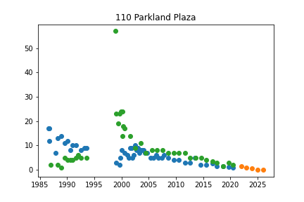

110 Parkland Plaza
['4141 Jackson Rd']

Initiated AutoTS object with best model: 
ZeroesNaive
{"fillna": "median", "transformations": {"0": "MaxAbsScaler", "1": "DifferencedTransformer", "2": "PositiveShift", "3": "PowerTransformer"}, "transformation_params": {"0": {}, "1": {}, "2": {}, "3": {}}}
{}
## 170 Aprill

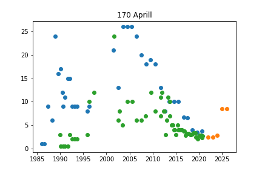

170 Aprill
['MW-35']

Initiated AutoTS object with best model: 
SeasonalNaive
{"fillna": "rolling_mean_24", "transformations": {"0": "ClipOutliers", "1": "ClipOutliers", "2": "MinMaxScaler", "3": "DifferencedTransformer"}, "transformation_params": {"0": {"method": "clip", "std_threshold": 1, "fillna": null}, "1": {"method": "clip", "std_threshold": 1, "fillna": null}, "2": {}, "3": {}}}
{"method": "Mean", "lag_1": 28, "lag_2": "None"}
## 175 Jackson Plaza

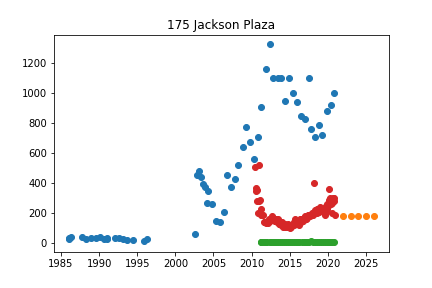

175 Jackson Plaza
['MW-134s', 'TW-21']

Initiated AutoTS object with best model: 
ZeroesNaive
{"fillna": "rolling_mean", "transformations": {"0": "ClipOutliers", "1": "Discretize", "2": "RobustScaler", "3": "PowerTransformer"}, "transformation_params": {"0": {"method": "clip", "std_threshold": 3.5, "fillna": null}, "1": {"discretization": "center", "n_bins": 5}, "2": {}, "3": {}}}
{}
## 2575 Valley

## 2819 Dexter Rd

## 3365 Jackson Rd

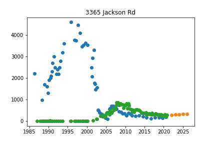

3365 Jackson Rd
['MW-17']

Initiated AutoTS object with best model: 
LastValueNaive
{"fillna": "rolling_mean", "transformations": {"0": "DifferencedTransformer", "1": "RobustScaler", "2": "QuantileTransformer", "3": "MinMaxScaler"}, "transformation_params": {"0": {}, "1": {}, "2": {"output_distribution": "normal", "n_quantiles": 9}, "3": {}}}
{}
## 3563 ELIZABETH RD

## 373 Pinewood Deep

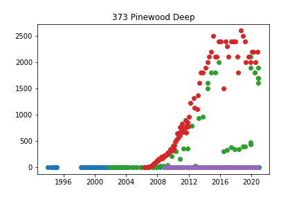

373 Pinewood Deep
['IW-2', 'MW-100', 'MW-122d']

Initiated AutoTS object with best model: 
AverageValueNaive
{"fillna": "ffill", "transformations": {"0": "MinMaxScaler", "1": "PowerTransformer", "2": "DifferencedTransformer"}, "transformation_params": {"0": {}, "1": {}, "2": {}}}
{"method": "Mean"}
## 373 Pinewood Shallow

## 4141 Jackson Rd

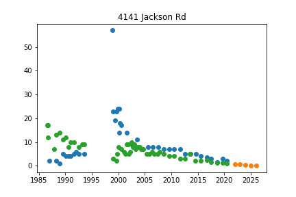

4141 Jackson Rd
['110 Parkland Plaza']

Initiated AutoTS object with best model: 
Ensemble
{}
{"model_name": "BestN", "model_count": 3, "model_metric": "mixed_metric", "models": {"11fd825f22dd2ff8071ccfe07ca549d4": {"Model": "GLM", "ModelParameters": "{\"family\": \"Gaussian\", \"constant\": false, \"regression_type\": null}", "TransformationParameters": "{\"fillna\": \"zero\", \"transformations\": {\"0\": \"bkfilter\", \"1\": \"Slice\", \"2\": \"Detrend\", \"3\": \"DifferencedTransformer\"}, \"transformation_params\": {\"0\": {}, \"1\": {\"method\": 100}, \"2\": {\"model\": \"Linear\"}, \"3\": {}}}"}, "c46c95d87b4cac720636007349e64723": {"Model": "UnobservedComponents", "ModelParameters": "{\"level\": false, \"trend\": false, \"cycle\": false, \"damped_cycle\": false, \"irregular\": false, \"stochastic_trend\": true, \"stochastic_level\": true, \"stochastic_cycle\": true, \"regression_type\": null}", "TransformationParameters": "{\"fillna\": \"fake_date\", \"transformations\": {\"0\": \"MaxAbsScaler\", \"1\": \"bkfilter\", \"2\": \"Detrend\", \"3\": \"Discretize\"}, \"transformation_params\": {\"0\": {}, \"1\": {}, \"2\": {\"model\": \"Linear\"}, \"3\": {\"discretization\": \"upper\", \"n_bins\": 10}}}"}, "cc3b3f9a3156d1c676f486c90c7691d6": {"Model": "ETS", "ModelParameters": "{\"damped_trend\": false, \"trend\": \"multiplicative\", \"seasonal\": null, \"seasonal_periods\": null}", "TransformationParameters": "{\"fillna\": \"zero\", \"transformations\": {\"0\": \"ClipOutliers\", \"1\": \"Discretize\", \"2\": \"Detrend\", \"3\": \"Detrend\"}, \"transformation_params\": {\"0\": {\"method\": \"clip\", \"std_threshold\": 3, \"fillna\": null}, \"1\": {\"discretization\": \"lower\", \"n_bins\": 20}, \"2\": {\"model\": \"Linear\"}, \"3\": {\"model\": \"Linear\"}}}"}}}
## 4401 Park West

## 4470 Jackson Rd

## 456 Clarendon

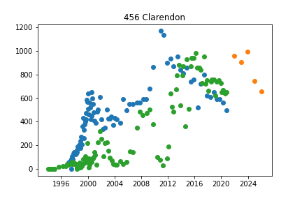

456 Clarendon
['MW-BE-1s']

Initiated AutoTS object with best model: 
ETS
{"fillna": "fake_date", "transformations": {"0": "SeasonalDifference", "1": "QuantileTransformer", "2": "Detrend"}, "transformation_params": {"0": {"lag_1": 7, "method": "Median"}, "1": {"output_distribution": "normal", "n_quantiles": 7}, "2": {"model": "Linear"}}}
{"damped_trend": false, "trend": null, "seasonal": null, "seasonal_periods": null}
## 4601 Park 4 inch

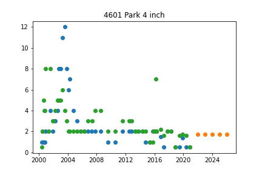

4601 Park 4 inch
['4601 Park 6 inch']

Initiated AutoTS object with best model: 
AverageValueNaive
{"fillna": "median", "transformations": {"0": "Slice"}, "transformation_params": {"0": {"method": 0.2}}}
{"method": "Mean"}
## 4601 Park 6 inch

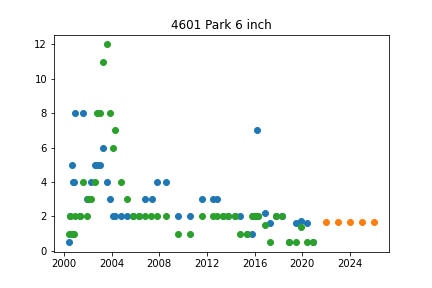

4601 Park 6 inch
['4601 Park 4 inch']

Initiated AutoTS object with best model: 
GLM
{"fillna": "ffill_mean_biased", "transformations": {"0": "ClipOutliers", "1": "Discretize", "2": "PowerTransformer", "3": "MaxAbsScaler", "4": "Discretize"}, "transformation_params": {"0": {"method": "clip", "std_threshold": 4, "fillna": null}, "1": {"discretization": "lower", "n_bins": 5}, "2": {}, "3": {}, "4": {"discretization": "upper", "n_bins": 10}}}
{"family": "NegativeBinomial", "constant": false, "regression_type": "datepart"}
## 465 Dupont

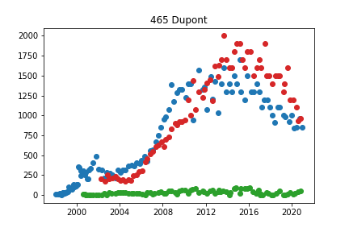

465 Dupont
['MW-54d', 'MW-77']

Initiated AutoTS object with best model: 
UnobservedComponents
{"fillna": "fake_date", "transformations": {"0": "PowerTransformer", "1": "DifferencedTransformer", "2": "PctChangeTransformer", "3": "PctChangeTransformer"}, "transformation_params": {"0": {}, "1": {}, "2": {}, "3": {}}}
{"level": true, "trend": false, "cycle": false, "damped_cycle": false, "irregular": true, "stochastic_trend": true, "stochastic_level": false, "stochastic_cycle": true, "regression_type": null}
## 4742 Park Rd

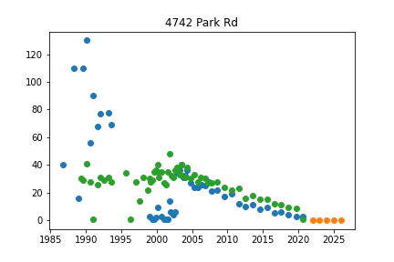

4742 Park Rd
['MW-31']

Initiated AutoTS object with best model: 
WindowRegression
{"fillna": "fake_date", "transformations": {"0": "DifferencedTransformer", "1": "bkfilter", "2": "Detrend", "3": "RollingMeanTransformer", "4": "Log", "5": "Slice"}, "transformation_params": {"0": {}, "1": {}, "2": {"model": "Linear"}, "3": {"fixed": true, "window": 12}, "4": {}, "5": {"method": 0.5}}}
{"window_size": 5, "regression_model": {"model": "Adaboost", "model_params": {"n_estimators": 50, "loss": "linear", "base_estimator": "DecisionTree", "learning_rate": 0.5}}, "input_dim": "multivariate", "output_dim": "1step", "normalize_window": false, "shuffle": false, "max_windows": 5000}
## 5005 Jackson Rd

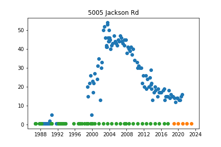

5005 Jackson Rd
['5115 Jackson Rd']

Initiated AutoTS object with best model: 
RollingRegression
{"fillna": "fake_date", "transformations": {"0": "ClipOutliers", "1": "Log", "2": "Detrend"}, "transformation_params": {"0": {"method": "clip", "std_threshold": 5, "fillna": null}, "1": {}, "2": {"model": "Linear"}}}
{"regression_model": {"model": "MLP", "model_params": {"hidden_layer_sizes": [25, 15, 25], "max_iter": 250, "activation": "logistic", "solver": "lbfgs", "early_stopping": false, "learning_rate_init": 0.001}}, "holiday": false, "mean_rolling_periods": 7, "macd_periods": null, "std_rolling_periods": 10, "max_rolling_periods": 24, "min_rolling_periods": 12, "ewm_alpha": null, "additional_lag_periods": 6, "abs_energy": false, "rolling_autocorr_periods": null, "add_date_part": null, "polynomial_degree": null, "x_transform": null, "regression_type": null}
## 5115 Jackson Rd

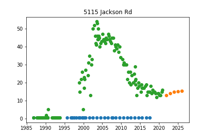

5115 Jackson Rd
['5005 Jackson Rd']

Initiated AutoTS object with best model: 
SeasonalNaive
{"fillna": "ffill_mean_biased", "transformations": {"0": "QuantileTransformer", "1": "RobustScaler", "2": "DifferencedTransformer", "3": "SeasonalDifference"}, "transformation_params": {"0": {"output_distribution": "uniform", "n_quantiles": 10}, "1": {}, "2": {}, "3": {"lag_1": 7, "method": "Mean"}}}
{"method": "Median", "lag_1": 7, "lag_2": 1}
## 697 South Wagner Rd

## A2 Cleaning Supply

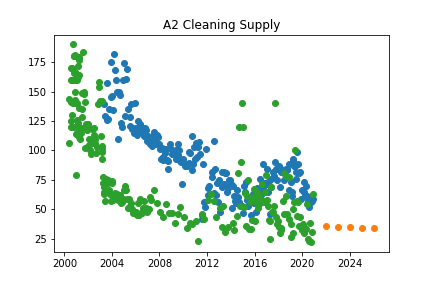

A2 Cleaning Supply
['MW-53i']

Initiated AutoTS object with best model: 
GLM
{"fillna": "rolling_mean", "transformations": {"0": "QuantileTransformer", "1": "Round"}, "transformation_params": {"0": {"output_distribution": "uniform", "n_quantiles": 5}, "1": {"model": "middle", "decimals": -1, "on_transform": true, "on_inverse": false}}}
{"family": "Binomial", "constant": false, "regression_type": null}
## AMW-1

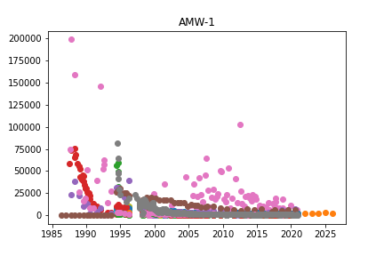

AMW-1
['AMW-2', 'MW-24', 'MW-25s', 'MW-2s', 'MW-5d', 'NMW-1d', 'NMW-1s', 'NMW-2d', 'NMW-2s', 'NMW-3d', 'NMW-3s', 'PMW-1', 'PMW-2', 'PMW-3', 'PMW-4', 'PW-1']

Initiated AutoTS object with best model: 
Ensemble
{}
{"model_name": "BestN", "model_count": 3, "model_metric": "best_score_unique", "models": {"9415699337d6e05013b41c1655f2d4f3": {"Model": "GLM", "ModelParameters": "{\"family\": \"Gamma\", \"constant\": false, \"regression_type\": null}", "TransformationParameters": "{\"fillna\": \"rolling_mean\", \"transformations\": {\"0\": \"bkfilter\", \"1\": \"PositiveShift\", \"2\": \"PowerTransformer\", \"3\": \"Discretize\", \"4\": \"PowerTransformer\"}, \"transformation_params\": {\"0\": {}, \"1\": {}, \"2\": {}, \"3\": {\"discretization\": \"upper\", \"n_bins\": 20}, \"4\": {}}}"}, "7f38e00f87087f3ee95b5d636da74e6d": {"Model": "WindowRegression", "ModelParameters": "{\"window_size\": 5, \"regression_model\": {\"model\": \"MLP\", \"model_params\": {\"hidden_layer_sizes\": [25, 15, 25], \"max_iter\": 500, \"activation\": \"relu\", \"solver\": \"sgd\", \"early_stopping\": true, \"learning_rate_init\": 0.001}}, \"input_dim\": \"multivariate\", \"output_dim\": \"1step\", \"normalize_window\": false, \"shuffle\": true, \"max_windows\": 5000}", "TransformationParameters": "{\"fillna\": \"rolling_mean\", \"transformations\": {\"0\": \"bkfilter\", \"1\": \"PowerTransformer\"}, \"transformation_params\": {\"0\": {}, \"1\": {}}}"}, "555e93178c4761ab2bf46716fdc2d4f0": {"Model": "ETS", "ModelParameters": "{\"damped_trend\": false, \"trend\": \"multiplicative\", \"seasonal\": null, \"seasonal_periods\": null}", "TransformationParameters": "{\"fillna\": \"rolling_mean\", \"transformations\": {\"0\": \"bkfilter\", \"1\": \"QuantileTransformer\", \"2\": \"QuantileTransformer\", \"3\": \"Discretize\"}, \"transformation_params\": {\"0\": {}, \"1\": {\"output_distribution\": \"normal\", \"n_quantiles\": 10}, \"2\": {\"output_distribution\": \"uniform\", \"n_quantiles\": 10}, \"3\": {\"discretization\": \"upper\", \"n_bins\": 20}}}"}}}
## AMW-2

AMW-2
['AMW-1', 'MW-24', 'MW-25s', 'MW-2s', 'MW-5d', 'NMW-1d', 'NMW-1s', 'NMW-2d', 'NMW-2s', 'NMW-3d', 'NMW-3s', 'PMW-1', 'PMW-2', 'PMW-3', 'PMW-4', 'PW-1']

Initiated AutoTS object with best model: 
DatepartRegression
{"fillna": "rolling_mean", "transformations": {"0": "PowerTransformer", "1": "DifferencedTransformer", "2": "Discretize", "3": "PowerTransformer"}, "transformation_params": {"0": {}, "1": {}, "2": {"discretization": "center", "n_bins": 10}, "3": {}}}
{"regression_model": {"model": "MLP", "model_params": {"hidden_layer_sizes": [72, 36, 72], "max_iter": 250, "activation": "tanh", "solver": "adam", "early_stopping": false, "learning_rate_init": 0.001}}, "datepart_method": "recurring", "regression_type": null}
## ARTESIAN #3

## Bethlehem Cemetery

## DOLPH

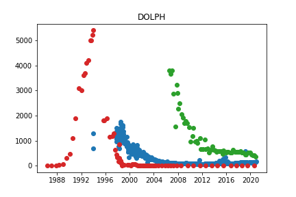

DOLPH
['MW-105s', 'MW-15d']

Initiated AutoTS object with best model: 
Ensemble
{}
{"model_name": "BestN", "model_count": 3, "model_metric": "mixed_metric", "models": {"eaaf7fe2ac1ad8dd3af50770ad927e5b": {"Model": "ZeroesNaive", "ModelParameters": "{}", "TransformationParameters": "{\"fillna\": null, \"transformations\": {\"0\": \"MaxAbsScaler\", \"1\": \"bkfilter\", \"2\": \"PowerTransformer\", \"3\": \"bkfilter\"}, \"transformation_params\": {\"0\": {}, \"1\": {}, \"2\": {}, \"3\": {}}}"}, "2dad13b31c8e76dc27deca0bdb1d528c": {"Model": "GLM", "ModelParameters": "{\"family\": \"NegativeBinomial\", \"constant\": false, \"regression_type\": null}", "TransformationParameters": "{\"fillna\": null, \"transformations\": {\"0\": \"MaxAbsScaler\", \"1\": \"bkfilter\", \"2\": \"PowerTransformer\"}, \"transformation_params\": {\"0\": {}, \"1\": {}, \"2\": {}}}"}, "8bde6ace83d4c288633f3ed68cd910f9": {"Model": "ZeroesNaive", "ModelParameters": "{}", "TransformationParameters": "{\"fillna\": \"ffill_mean_biased\", \"transformations\": {\"0\": \"MaxAbsScaler\", \"1\": \"RobustScaler\", \"2\": \"PowerTransformer\", \"3\": \"SeasonalDifference\"}, \"transformation_params\": {\"0\": {}, \"1\": {}, \"2\": {}, \"3\": {\"lag_1\": 7, \"method\": \"Mean\"}}}"}}}
## HZ-S

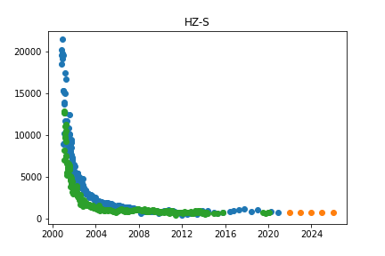

HZ-S
['TW-5']

Initiated AutoTS object with best model: 
GLM
{"fillna": "fake_date", "transformations": {"0": "Slice", "1": "MinMaxScaler", "2": "PowerTransformer", "3": "Discretize"}, "transformation_params": {"0": {"method": 0.5}, "1": {}, "2": {}, "3": {"discretization": "center", "n_bins": 5}}}
{"family": "Binomial", "constant": true, "regression_type": null}
## IW-2

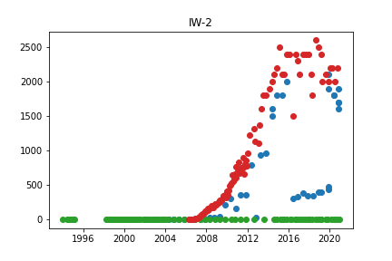

IW-2
['373 Pinewood Deep', 'MW-100']

Initiated AutoTS object with best model: 
Ensemble
{}
{"model_name": "BestN", "model_count": 3, "model_metric": "best_score_unique", "models": {"81d5dd12d3d7480a86d613ee1a2b26cf": {"Model": "GLM", "ModelParameters": "{\"family\": \"Gamma\", \"constant\": false, \"regression_type\": \"datepart\"}", "TransformationParameters": "{\"fillna\": \"zero\", \"transformations\": {\"0\": \"PowerTransformer\"}, \"transformation_params\": {\"0\": {}}}"}, "c485675e7952265376f257ef6df39cac": {"Model": "DatepartRegression", "ModelParameters": "{\"regression_model\": {\"model\": \"MLP\", \"model_params\": {\"hidden_layer_sizes\": [32, 32, 32], \"max_iter\": 250, \"activation\": \"tanh\", \"solver\": \"adam\", \"early_stopping\": true, \"learning_rate_init\": 0.0001}}, \"datepart_method\": \"expanded\", \"regression_type\": null}", "TransformationParameters": "{\"fillna\": \"zero\", \"transformations\": {\"0\": \"PowerTransformer\", \"1\": \"PowerTransformer\", \"2\": \"Detrend\"}, \"transformation_params\": {\"0\": {}, \"1\": {}, \"2\": {\"model\": \"Linear\"}}}"}, "27772d5683e7691cb07b3acf3695f0d9": {"Model": "LastValueNaive", "ModelParameters": "{}", "TransformationParameters": "{\"fillna\": \"fake_date\", \"transformations\": {\"0\": \"QuantileTransformer\", \"1\": \"SeasonalDifference\", \"2\": \"MinMaxScaler\", \"3\": \"PowerTransformer\"}, \"transformation_params\": {\"0\": {\"output_distribution\": \"normal\", \"n_quantiles\": 20}, \"1\": {\"lag_1\": 7, \"method\": \"Median\"}, \"2\": {}, \"3\": {}}}"}}}
## LB-1

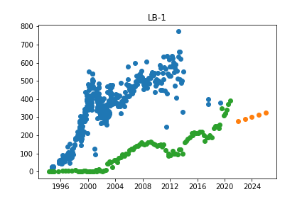

LB-1
['MW-KD-1d']

Initiated AutoTS object with best model: 
ETS
{"fillna": "fake_date", "transformations": {"0": "RobustScaler", "1": "MaxAbsScaler", "2": "Discretize", "3": "PowerTransformer"}, "transformation_params": {"0": {}, "1": {}, "2": {"discretization": "lower", "n_bins": 10}, "3": {}}}
{"damped_trend": true, "trend": "additive", "seasonal": null, "seasonal_periods": null}
## MW-1 Replacement

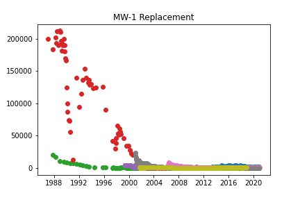

MW-1 Replacement
['MW-25d', 'MW-2d', 'MW-45d', 'MW-75', 'TW-20', 'TW-6', 'TW-8']

Initiated AutoTS object with best model: 
Ensemble
{}
{"model_name": "BestN", "model_count": 3, "model_metric": "best_score", "models": {"1589e5be4256cccd9d58b22bf51cb99d": {"Model": "GLM", "ModelParameters": "{\"family\": \"Binomial\", \"constant\": false, \"regression_type\": \"datepart\"}", "TransformationParameters": "{\"fillna\": \"mean\", \"transformations\": {\"0\": \"Discretize\", \"1\": \"PowerTransformer\", \"2\": \"DifferencedTransformer\", \"3\": \"ClipOutliers\"}, \"transformation_params\": {\"0\": {\"discretization\": \"center\", \"n_bins\": 5}, \"1\": {}, \"2\": {}, \"3\": {\"method\": \"clip\", \"std_threshold\": 4, \"fillna\": null}}}"}, "e0ab4f585770437238362f6d4d385c6d": {"Model": "GLM", "ModelParameters": "{\"family\": \"Poisson\", \"constant\": false, \"regression_type\": null}", "TransformationParameters": "{\"fillna\": \"mean\", \"transformations\": {\"0\": \"Discretize\", \"1\": \"PowerTransformer\", \"2\": \"DifferencedTransformer\", \"3\": \"ClipOutliers\"}, \"transformation_params\": {\"0\": {\"discretization\": \"center\", \"n_bins\": 5}, \"1\": {}, \"2\": {}, \"3\": {\"method\": \"clip\", \"std_threshold\": 4, \"fillna\": null}}}"}, "aab32aa882b99648a1bdb68d03f6e96b": {"Model": "GLM", "ModelParameters": "{\"family\": \"NegativeBinomial\", \"constant\": false, \"regression_type\": null}", "TransformationParameters": "{\"fillna\": \"median\", \"transformations\": {\"0\": \"Discretize\", \"1\": \"PowerTransformer\", \"2\": \"DifferencedTransformer\", \"3\": \"ClipOutliers\"}, \"transformation_params\": {\"0\": {\"discretization\": \"center\", \"n_bins\": 5}, \"1\": {}, \"2\": {}, \"3\": {\"method\": \"clip\", \"std_threshold\": 4, \"fillna\": null}}}"}}}
## MW-100

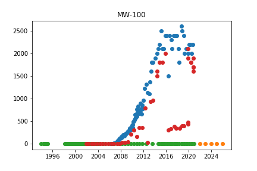

MW-100
['373 Pinewood Deep', 'IW-2']

Initiated AutoTS object with best model: 
SeasonalNaive
{"fillna": "mean", "transformations": {"0": "ClipOutliers", "1": "QuantileTransformer", "2": "PowerTransformer", "3": "Detrend"}, "transformation_params": {"0": {"method": "clip", "std_threshold": 1, "fillna": null}, "1": {"output_distribution": "uniform", "n_quantiles": 7}, "2": {}, "3": {"model": "Linear"}}}
{"method": "LastValue", "lag_1": 7, "lag_2": 1}
## MW-101

## MW-103d

## MW-103s

## MW-104

## MW-105d

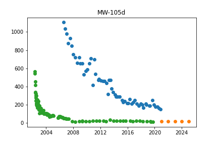

MW-105d
['TW-12']

Initiated AutoTS object with best model: 
UnobservedComponents
{"fillna": "zero", "transformations": {"0": "PctChangeTransformer"}, "transformation_params": {"0": {}}}
{"level": false, "trend": false, "cycle": true, "damped_cycle": true, "irregular": true, "stochastic_trend": false, "stochastic_level": true, "stochastic_cycle": true, "regression_type": null}
## MW-105s

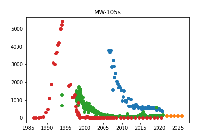

MW-105s
['DOLPH', 'MW-15d']

Initiated AutoTS object with best model: 
LastValueNaive
{"fillna": "median", "transformations": {"0": "PowerTransformer", "1": "Discretize", "2": "StandardScaler"}, "transformation_params": {"0": {}, "1": {"discretization": "upper", "n_bins": 20}, "2": {}}}
{}
## MW-106d

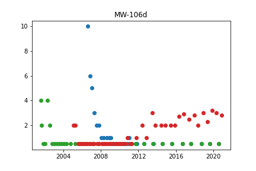

MW-106d
['MW-69', 'MW-94d']

Initiated AutoTS object with best model: 
Ensemble
{}
{"model_name": "BestN", "model_count": 3, "model_metric": "mixed_metric", "models": {"bb4527c72ff1cc619618e94d4d1024f1": {"Model": "DatepartRegression", "ModelParameters": "{\"regression_model\": {\"model\": \"MLP\", \"model_params\": {\"hidden_layer_sizes\": [25, 15, 25], \"max_iter\": 250, \"activation\": \"relu\", \"solver\": \"adam\", \"early_stopping\": false, \"learning_rate_init\": 0.001}}, \"datepart_method\": \"expanded\", \"regression_type\": null}", "TransformationParameters": "{\"fillna\": \"rolling_mean_24\", \"transformations\": {\"0\": \"ClipOutliers\", \"1\": \"Round\", \"2\": \"PowerTransformer\"}, \"transformation_params\": {\"0\": {\"method\": \"clip\", \"std_threshold\": 3, \"fillna\": null}, \"1\": {\"model\": \"middle\", \"decimals\": 2, \"on_transform\": false, \"on_inverse\": true}, \"2\": {}}}"}, "3f6483303a23fba7a23f634ef0770d26": {"Model": "DatepartRegression", "ModelParameters": "{\"regression_model\": {\"model\": \"DecisionTree\", \"model_params\": {\"max_depth\": 9, \"min_samples_split\": 2}}, \"datepart_method\": \"expanded\", \"regression_type\": null}", "TransformationParameters": "{\"fillna\": \"mean\", \"transformations\": {\"0\": \"Discretize\", \"1\": \"MinMaxScaler\", \"2\": \"PowerTransformer\", \"3\": \"PositiveShift\", \"4\": \"PositiveShift\"}, \"transformation_params\": {\"0\": {\"discretization\": \"upper\", \"n_bins\": 5}, \"1\": {}, \"2\": {}, \"3\": {}, \"4\": {}}}"}, "9ba56ff76127bc4c781d8bfa193f20fa": {"Model": "LastValueNaive", "ModelParameters": "{}", "TransformationParameters": "{\"fillna\": \"ffill\", \"transformations\": {\"0\": \"ClipOutliers\", \"1\": \"ClipOutliers\"}, \"transformation_params\": {\"0\": {\"method\": \"clip\", \"std_threshold\": 1, \"fillna\": null}, \"1\": {\"method\": \"clip\", \"std_threshold\": 1, \"fillna\": null}}}"}}}
## MW-106s

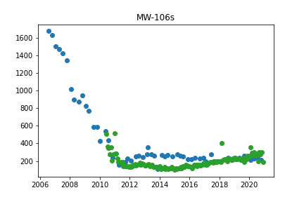

MW-106s
['TW-21']

Initiated AutoTS object with best model: 
Ensemble
{}
{"model_name": "BestN", "model_count": 3, "model_metric": "mixed_metric", "models": {"1dcd678b92847fc956977dff1a8772ee": {"Model": "GLM", "ModelParameters": "{\"family\": \"Gamma\", \"constant\": false, \"regression_type\": null}", "TransformationParameters": "{\"fillna\": \"median\", \"transformations\": {\"0\": \"PowerTransformer\", \"1\": \"PowerTransformer\", \"2\": \"Slice\"}, \"transformation_params\": {\"0\": {}, \"1\": {}, \"2\": {\"method\": 100}}}"}, "570bd9e4766652a33bcb6b4f43286a4d": {"Model": "GLS", "ModelParameters": "{}", "TransformationParameters": "{\"fillna\": \"zero\", \"transformations\": {\"0\": \"Round\", \"1\": \"PowerTransformer\", \"2\": \"MinMaxScaler\", \"3\": \"Round\"}, \"transformation_params\": {\"0\": {\"model\": \"middle\", \"decimals\": 0, \"on_transform\": false, \"on_inverse\": true}, \"1\": {}, \"2\": {}, \"3\": {\"model\": \"middle\", \"decimals\": 1, \"on_transform\": true, \"on_inverse\": true}}}"}, "3b5f35154ae35435a578b3543d089f5c": {"Model": "AverageValueNaive", "ModelParameters": "{\"method\": \"Mode\"}", "TransformationParameters": "{\"fillna\": \"rolling_mean\", \"transformations\": {\"0\": \"ClipOutliers\", \"1\": \"PowerTransformer\", \"2\": \"Round\", \"3\": \"Discretize\"}, \"transformation_params\": {\"0\": {\"method\": \"clip\", \"std_threshold\": 3.5, \"fillna\": null}, \"1\": {}, \"2\": {\"model\": \"middle\", \"decimals\": 2, \"on_transform\": true, \"on_inverse\": true}, \"3\": {\"discretization\": \"lower\", \"n_bins\": 10}}}"}}}
## MW-107

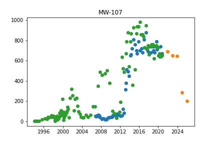

MW-107
['MW-BE-1s']

Initiated AutoTS object with best model: 
RollingRegression
{"fillna": "mean", "transformations": {"0": "bkfilter", "1": "SeasonalDifference", "2": "Detrend", "3": "PowerTransformer", "4": "DifferencedTransformer", "5": "MaxAbsScaler"}, "transformation_params": {"0": {}, "1": {"lag_1": 7, "method": "Median"}, "2": {"model": "Linear"}, "3": {}, "4": {}, "5": {}}}
{"regression_model": {"model": "Adaboost", "model_params": {"n_estimators": 100, "loss": "linear", "base_estimator": "DecisionTree", "learning_rate": 1.0}}, "holiday": false, "mean_rolling_periods": 5, "macd_periods": 28, "std_rolling_periods": 10, "max_rolling_periods": 84, "min_rolling_periods": 7, "ewm_alpha": 0.8, "additional_lag_periods": 3, "abs_energy": false, "rolling_autocorr_periods": null, "add_date_part": "recurring", "polynomial_degree": null, "x_transform": null, "regression_type": null}
## MW-108d

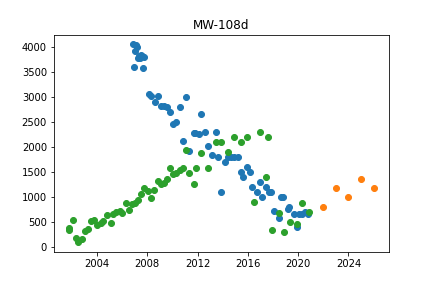

MW-108d
['MW-71']

Initiated AutoTS object with best model: 
UnobservedComponents
{"fillna": "fake_date", "transformations": {"0": "RobustScaler", "1": "DifferencedTransformer", "2": "RollingMean100thN", "3": "DifferencedTransformer", "4": "bkfilter"}, "transformation_params": {"0": {}, "1": {}, "2": {}, "3": {}, "4": {}}}
{"level": true, "trend": false, "cycle": true, "damped_cycle": true, "irregular": true, "stochastic_trend": true, "stochastic_level": true, "stochastic_cycle": true, "regression_type": null}
## MW-108s

## MW-10d

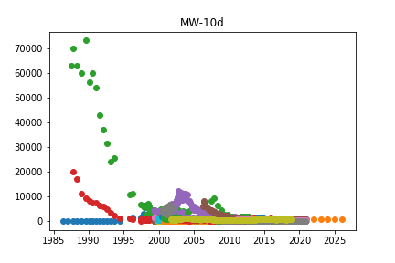

MW-10d
['MW-22', 'MW-25d', 'MW-45d', 'MW-45s', 'MW-46', 'MW-48', 'MW-49', 'MW-50', 'MW-52s', 'MW-57', 'MW-58s', 'MW-75', 'TW-10', 'TW-20', 'TW-22', 'TW-4', 'TW-8']

Initiated AutoTS object with best model: 
Ensemble
{}
{"model_name": "BestN", "model_count": 3, "model_metric": "best_score", "models": {"1d003891dba406065a39207e196b39ad": {"Model": "WindowRegression", "ModelParameters": "{\"window_size\": 10, \"regression_model\": {\"model\": \"KNN\", \"model_params\": {\"n_neighbors\": 3, \"weights\": \"uniform\"}}, \"input_dim\": \"multivariate\", \"output_dim\": \"1step\", \"normalize_window\": false, \"shuffle\": false, \"max_windows\": 5000}", "TransformationParameters": "{\"fillna\": \"rolling_mean_24\", \"transformations\": {\"0\": \"Slice\"}, \"transformation_params\": {\"0\": {\"method\": 0.5}}}"}, "6afee293104444c382699097a0e36885": {"Model": "WindowRegression", "ModelParameters": "{\"window_size\": 10, \"regression_model\": {\"model\": \"KNN\", \"model_params\": {\"n_neighbors\": 3, \"weights\": \"uniform\"}}, \"input_dim\": \"multivariate\", \"output_dim\": \"1step\", \"normalize_window\": false, \"shuffle\": true, \"max_windows\": 5000}", "TransformationParameters": "{\"fillna\": \"rolling_mean_24\", \"transformations\": {\"0\": \"Slice\", \"1\": \"Round\"}, \"transformation_params\": {\"0\": {\"method\": 0.5}, \"1\": {\"model\": \"middle\", \"decimals\": 1, \"on_transform\": false, \"on_inverse\": true}}}"}, "09406faded38abff60b25b6e03c553a1": {"Model": "WindowRegression", "ModelParameters": "{\"window_size\": 5, \"regression_model\": {\"model\": \"KNN\", \"model_params\": {\"n_neighbors\": 3, \"weights\": \"uniform\"}}, \"input_dim\": \"multivariate\", \"output_dim\": \"1step\", \"normalize_window\": false, \"shuffle\": true, \"max_windows\": 5000}", "TransformationParameters": "{\"fillna\": \"ffill\", \"transformations\": {\"0\": \"Slice\"}, \"transformation_params\": {\"0\": {\"method\": 0.5}}}"}}}
## MW-110

## MW-112d

## MW-112i

## MW-112s

## MW-113

## MW-116

MW-116
['MW-87d', 'MW-89']

Initiated AutoTS object with best model: 
Ensemble
{}
{"model_name": "BestN", "model_count": 3, "model_metric": "mixed_metric", "models": {"4c465ed6e2e1d16e3f5625a0ac475967": {"Model": "UnobservedComponents", "ModelParameters": "{\"level\": true, \"trend\": false, \"cycle\": false, \"damped_cycle\": false, \"irregular\": false, \"stochastic_trend\": false, \"stochastic_level\": false, \"stochastic_cycle\": true, \"regression_type\": null}", "TransformationParameters": "{\"fillna\": \"ffill\", \"transformations\": {\"0\": \"MinMaxScaler\", \"1\": \"ClipOutliers\", \"2\": \"PowerTransformer\", \"3\": \"DifferencedTransformer\", \"4\": \"QuantileTransformer\"}, \"transformation_params\": {\"0\": {}, \"1\": {\"method\": \"clip\", \"std_threshold\": 5, \"fillna\": null}, \"2\": {}, \"3\": {}, \"4\": {\"output_distribution\": \"uniform\", \"n_quantiles\": 4}}}"}, "8c60b3fd1653036f2ee5540ea4b359d9": {"Model": "UnobservedComponents", "ModelParameters": "{\"level\": false, \"trend\": false, \"cycle\": true, \"damped_cycle\": true, \"irregular\": false, \"stochastic_trend\": true, \"stochastic_level\": false, \"stochastic_cycle\": true, \"regression_type\": null}", "TransformationParameters": "{\"fillna\": \"ffill\", \"transformations\": {\"0\": \"MinMaxScaler\", \"1\": \"MinMaxScaler\", \"2\": \"PowerTransformer\", \"3\": \"DifferencedTransformer\", \"4\": \"QuantileTransformer\"}, \"transformation_params\": {\"0\": {}, \"1\": {}, \"2\": {}, \"3\": {}, \"4\": {\"output_distribution\": \"uniform\", \"n_quantiles\": 4}}}"}, "13d1c62f97aa5391209a942909829279": {"Model": "UnobservedComponents", "ModelParameters": "{\"level\": true, \"trend\": true, \"cycle\": false, \"damped_cycle\": false, \"irregular\": true, \"stochastic_trend\": false, \"stochastic_level\": true, \"stochastic_cycle\": false, \"regression_type\": null}", "TransformationParameters": "{\"fillna\": \"ffill\", \"transformations\": {\"0\": \"Discretize\", \"1\": \"MinMaxScaler\", \"2\": \"ClipOutliers\", \"3\": \"DifferencedTransformer\", \"4\": \"QuantileTransformer\"}, \"transformation_params\": {\"0\": {\"discretization\": \"center\", \"n_bins\": 20}, \"1\": {}, \"2\": {\"method\": \"clip\", \"std_threshold\": 3.5, \"fillna\": null}, \"3\": {}, \"4\": {\"output_distribution\": \"uniform\", \"n_quantiles\": 4}}}"}}}
## MW-117

## MW-118

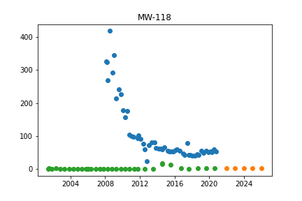

MW-118
['MW-30i']

Initiated AutoTS object with best model: 
LastValueNaive
{"fillna": "rolling_mean_24", "transformations": {"0": "ClipOutliers", "1": "PowerTransformer", "2": "Round"}, "transformation_params": {"0": {"method": "clip", "std_threshold": 3.5, "fillna": null}, "1": {}, "2": {"model": "middle", "decimals": 1, "on_transform": true, "on_inverse": false}}}
{}
## MW-119

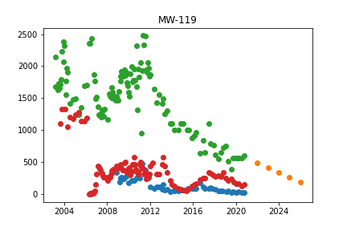

MW-119
['MW-85', 'MW-88']

Initiated AutoTS object with best model: 
GLS
{"fillna": "mean", "transformations": {"0": "DifferencedTransformer", "1": "Round", "2": "bkfilter", "3": "Round"}, "transformation_params": {"0": {}, "1": {"model": "middle", "decimals": 1, "on_transform": false, "on_inverse": true}, "2": {}, "3": {"model": "middle", "decimals": 0, "on_transform": false, "on_inverse": true}}}
{}
## MW-11d

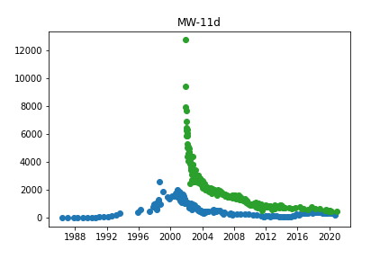

MW-11d
['TW-9']

Initiated AutoTS object with best model: 
GLM
{"fillna": "median", "transformations": {"0": "ClipOutliers", "1": "PowerTransformer", "2": "DifferencedTransformer"}, "transformation_params": {"0": {"method": "clip", "std_threshold": 4, "fillna": null}, "1": {}, "2": {}}}
{"family": "NegativeBinomial", "constant": false, "regression_type": null}
## MW-120d

## MW-120s

## MW-121d

## MW-121s

## MW-122d

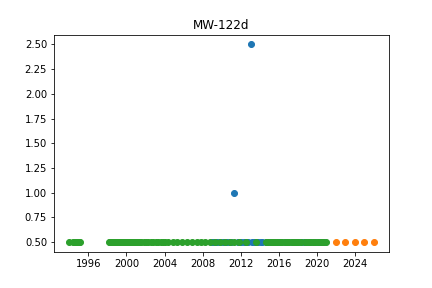

MW-122d
['373 Pinewood Deep']

Initiated AutoTS object with best model: 
LastValueNaive
{"fillna": "zero", "transformations": {"0": "PowerTransformer", "1": "PowerTransformer", "2": "Detrend"}, "transformation_params": {"0": {}, "1": {}, "2": {"model": "Linear"}}}
{}
## MW-122s

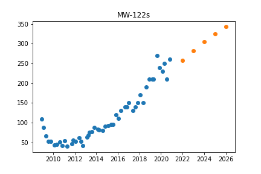

MW-122s
[]

Initiated AutoTS object with best model: 
FBProphet
{"fillna": "rolling_mean_24", "transformations": {"0": "DifferencedTransformer", "1": "PowerTransformer", "2": "Discretize", "3": "Detrend"}, "transformation_params": {"0": {}, "1": {}, "2": {"discretization": "lower", "n_bins": 20}, "3": {"model": "Linear"}}}
{"holiday": false, "regression_type": null}
## MW-123d

## MW-123s

## MW-124d

## MW-124s

## MW-125

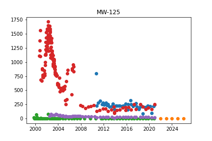

MW-125
['MW-49', 'MW-58s', 'MW-78']

Initiated AutoTS object with best model: 
LastValueNaive
{"fillna": "rolling_mean_24", "transformations": {"0": "PowerTransformer", "1": "QuantileTransformer", "2": "SeasonalDifference", "3": "Round"}, "transformation_params": {"0": {}, "1": {"output_distribution": "normal", "n_quantiles": 5}, "2": {"lag_1": 7, "method": "Mean"}, "3": {"model": "middle", "decimals": 0, "on_transform": false, "on_inverse": true}}}
{}
## MW-126d

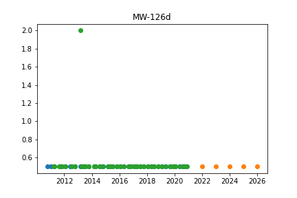

MW-126d
['MW-131d']

Initiated AutoTS object with best model: 
LastValueNaive
{"fillna": "ffill_mean_biased", "transformations": {"0": "Detrend", "1": "DifferencedTransformer", "2": "PositiveShift", "3": "PowerTransformer"}, "transformation_params": {"0": {"model": "Linear"}, "1": {}, "2": {}, "3": {}}}
{}
## MW-126s

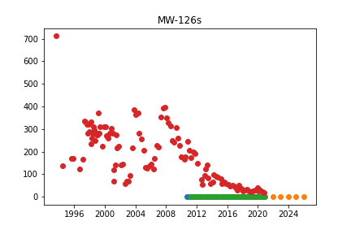

MW-126s
['MW-131s', 'MW-39d']

Initiated AutoTS object with best model: 
LastValueNaive
{"fillna": "ffill_mean_biased", "transformations": {"0": "ClipOutliers", "1": "MinMaxScaler", "2": "DifferencedTransformer", "3": "Round", "4": "StandardScaler"}, "transformation_params": {"0": {"method": "clip", "std_threshold": 2, "fillna": null}, "1": {}, "2": {}, "3": {"model": "middle", "decimals": 0, "on_transform": true, "on_inverse": false}, "4": {}}}
{}
## MW-127d

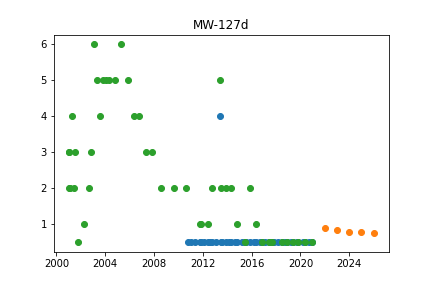

MW-127d
['Saginaw Forest Cabin #2']

Initiated AutoTS object with best model: 
Ensemble
{}
{"model_name": "BestN", "model_count": 3, "model_metric": "best_score_unique", "models": {"47eddd2021ce3728cc93029e7da0cc34": {"Model": "AverageValueNaive", "ModelParameters": "{\"method\": \"Median\"}", "TransformationParameters": "{\"fillna\": \"zero\", \"transformations\": {\"0\": \"PowerTransformer\", \"1\": \"QuantileTransformer\", \"2\": \"PctChangeTransformer\", \"3\": \"QuantileTransformer\", \"4\": \"DifferencedTransformer\"}, \"transformation_params\": {\"0\": {}, \"1\": {\"output_distribution\": \"uniform\", \"n_quantiles\": 5}, \"2\": {}, \"3\": {\"output_distribution\": \"uniform\", \"n_quantiles\": 1}, \"4\": {}}}"}, "119edf45a1014a48603677e6e5c3b9b3": {"Model": "RollingRegression", "ModelParameters": "{\"regression_model\": {\"model\": \"MLP\", \"model_params\": {\"hidden_layer_sizes\": [72, 36, 72], \"max_iter\": 1000, \"activation\": \"tanh\", \"solver\": \"sgd\", \"early_stopping\": true, \"learning_rate_init\": 0.001}}, \"holiday\": false, \"mean_rolling_periods\": 7, \"macd_periods\": null, \"std_rolling_periods\": 5, \"max_rolling_periods\": 22, \"min_rolling_periods\": null, \"ewm_alpha\": null, \"additional_lag_periods\": 11, \"abs_energy\": false, \"rolling_autocorr_periods\": 7, \"add_date_part\": null, \"polynomial_degree\": null, \"x_transform\": \"Nystroem\", \"regression_type\": null}", "TransformationParameters": "{\"fillna\": \"zero\", \"transformations\": {\"0\": \"PowerTransformer\", \"1\": \"QuantileTransformer\", \"2\": \"PctChangeTransformer\", \"3\": \"DifferencedTransformer\"}, \"transformation_params\": {\"0\": {}, \"1\": {\"output_distribution\": \"uniform\", \"n_quantiles\": 5}, \"2\": {}, \"3\": {}}}"}, "531e6ca49f2f1ce8892156cecf8dba67": {"Model": "UnobservedComponents", "ModelParameters": "{\"level\": true, \"trend\": false, \"cycle\": true, \"damped_cycle\": false, \"irregular\": true, \"stochastic_trend\": true, \"stochastic_level\": true, \"stochastic_cycle\": true, \"regression_type\": null}", "TransformationParameters": "{\"fillna\": \"ffill\", \"transformations\": {\"0\": \"Round\", \"1\": \"QuantileTransformer\", \"2\": \"PctChangeTransformer\", \"3\": \"DifferencedTransformer\", \"4\": \"Slice\"}, \"transformation_params\": {\"0\": {\"model\": \"middle\", \"decimals\": 1, \"on_transform\": false, \"on_inverse\": true}, \"1\": {\"output_distribution\": \"uniform\", \"n_quantiles\": 5}, \"2\": {}, \"3\": {}, \"4\": {\"method\": 100}}}"}}}
## MW-127s

## MW-128d

## MW-128s

## MW-129d

## MW-129i

## MW-129s

## MW-130d

## MW-130i

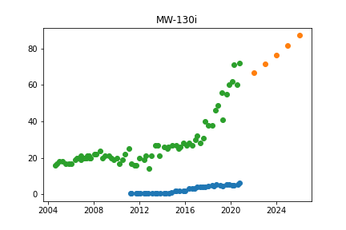

MW-130i
['MW-92']

Initiated AutoTS object with best model: 
GLS
{"fillna": "ffill_mean_biased", "transformations": {"0": "PositiveShift", "1": "DifferencedTransformer", "2": "MaxAbsScaler", "3": "MinMaxScaler"}, "transformation_params": {"0": {}, "1": {}, "2": {}, "3": {}}}
{}
## MW-130s

## MW-131d

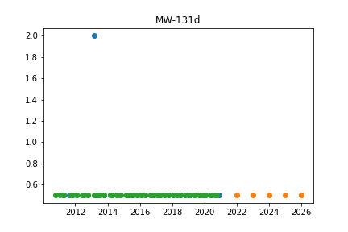

MW-131d
['MW-126d']

Initiated AutoTS object with best model: 
SeasonalNaive
{"fillna": "rolling_mean_24", "transformations": {"0": "SinTrend", "1": "Round", "2": "PowerTransformer"}, "transformation_params": {"0": {}, "1": {"model": "middle", "decimals": 2, "on_transform": false, "on_inverse": true}, "2": {}}}
{"method": "LastValue", "lag_1": 2, "lag_2": 7}
## MW-131s

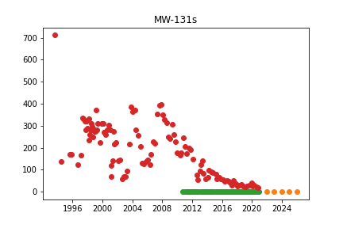

MW-131s
['MW-126s', 'MW-39d']

Initiated AutoTS object with best model: 
DatepartRegression
{"fillna": "mean", "transformations": {"0": "QuantileTransformer", "1": "DifferencedTransformer", "2": "RobustScaler", "3": "bkfilter"}, "transformation_params": {"0": {"output_distribution": "uniform", "n_quantiles": 7}, "1": {}, "2": {}, "3": {}}}
{"regression_model": {"model": "MLP", "model_params": {"hidden_layer_sizes": [25, 50, 25], "max_iter": 250, "activation": "logistic", "solver": "lbfgs", "early_stopping": false, "learning_rate_init": 0.001}}, "datepart_method": "simple", "regression_type": null}
## MW-133d

## MW-133i

## MW-133s

## MW-134d

## MW-134i

## MW-134s

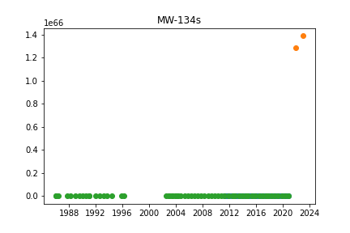

MW-134s
['175 Jackson Plaza']

Initiated AutoTS object with best model: 
Ensemble
{}
{"model_name": "BestN", "model_count": 3, "model_metric": "best_score", "models": {"b4f18938ade72e36fa340f2d25e06eee": {"Model": "DatepartRegression", "ModelParameters": "{\"regression_model\": {\"model\": \"MLP\", \"model_params\": {\"hidden_layer_sizes\": [25, 15, 25], \"max_iter\": 250, \"activation\": \"relu\", \"solver\": \"adam\", \"early_stopping\": false, \"learning_rate_init\": 0.001}}, \"datepart_method\": \"expanded\", \"regression_type\": null}", "TransformationParameters": "{\"fillna\": \"median\", \"transformations\": {\"0\": \"bkfilter\", \"1\": \"PowerTransformer\", \"2\": \"Detrend\", \"3\": \"Detrend\"}, \"transformation_params\": {\"0\": {}, \"1\": {}, \"2\": {\"model\": \"Linear\"}, \"3\": {\"model\": \"Linear\"}}}"}, "d305bdf6a0ff1d6cd0067937a199657c": {"Model": "RollingRegression", "ModelParameters": "{\"regression_model\": {\"model\": \"ElasticNet\", \"model_params\": {}}, \"holiday\": false, \"mean_rolling_periods\": 5, \"macd_periods\": 60, \"std_rolling_periods\": 7, \"max_rolling_periods\": null, \"min_rolling_periods\": null, \"ewm_alpha\": 0.8, \"additional_lag_periods\": 11, \"abs_energy\": true, \"rolling_autocorr_periods\": null, \"add_date_part\": null, \"polynomial_degree\": null, \"x_transform\": null, \"regression_type\": null}", "TransformationParameters": "{\"fillna\": \"rolling_mean\", \"transformations\": {\"0\": \"MinMaxScaler\", \"1\": \"PowerTransformer\", \"2\": \"Discretize\"}, \"transformation_params\": {\"0\": {}, \"1\": {}, \"2\": {\"discretization\": \"center\", \"n_bins\": 10}}}"}, "d3882c3a2cd28a926ba6825f7fac2e55": {"Model": "RollingRegression", "ModelParameters": "{\"regression_model\": {\"model\": \"ElasticNet\", \"model_params\": {}}, \"holiday\": false, \"mean_rolling_periods\": 5, \"macd_periods\": 32, \"std_rolling_periods\": 7, \"max_rolling_periods\": null, \"min_rolling_periods\": null, \"ewm_alpha\": 0.8, \"additional_lag_periods\": 11, \"abs_energy\": true, \"rolling_autocorr_periods\": null, \"add_date_part\": null, \"polynomial_degree\": null, \"x_transform\": null, \"regression_type\": null}", "TransformationParameters": "{\"fillna\": \"mean\", \"transformations\": {\"0\": \"DifferencedTransformer\", \"1\": \"Round\", \"2\": \"Detrend\"}, \"transformation_params\": {\"0\": {}, \"1\": {\"model\": \"middle\", \"decimals\": 1, \"on_transform\": false, \"on_inverse\": true}, \"2\": {\"model\": \"Linear\"}}}"}}}
## MW-135

## MW-15d

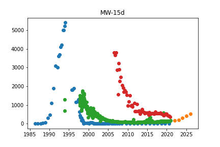

MW-15d
['DOLPH', 'MW-105s']

Initiated AutoTS object with best model: 
LastValueNaive
{"fillna": "median", "transformations": {"0": "QuantileTransformer", "1": "QuantileTransformer", "2": "RobustScaler", "3": "MaxAbsScaler", "4": "DifferencedTransformer", "5": "MaxAbsScaler"}, "transformation_params": {"0": {"output_distribution": "uniform", "n_quantiles": 7}, "1": {"output_distribution": "uniform", "n_quantiles": 7}, "2": {}, "3": {}, "4": {}, "5": {}}}
{}
## MW-15s

## MW-16

## MW-17

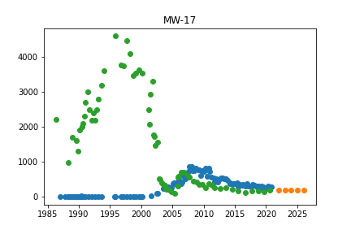

MW-17
['3365 Jackson Rd']

Initiated AutoTS object with best model: 
LastValueNaive
{"fillna": "rolling_mean_24", "transformations": {"0": "QuantileTransformer", "1": "DifferencedTransformer", "2": "Round", "3": "RollingMeanTransformer", "4": "PowerTransformer"}, "transformation_params": {"0": {"output_distribution": "uniform", "n_quantiles": 10}, "1": {}, "2": {"model": "middle", "decimals": 0, "on_transform": true, "on_inverse": false}, "3": {"fixed": true, "window": 7}, "4": {}}}
{}
## MW-18d

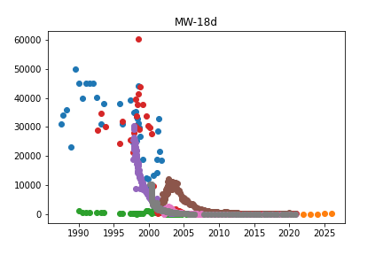

MW-18d
['MW-32', 'MW-37', 'TW-1', 'TW-10', 'TW-14', 'TW-3']

Initiated AutoTS object with best model: 
SeasonalNaive
{"fillna": "rolling_mean_24", "transformations": {"0": "QuantileTransformer", "1": "QuantileTransformer", "2": "Detrend", "3": "IntermittentOccurrence"}, "transformation_params": {"0": {"output_distribution": "uniform", "n_quantiles": 8}, "1": {"output_distribution": "uniform", "n_quantiles": 8}, "2": {"model": "Linear"}, "3": {"center": "mean"}}}
{"method": "LastValue", "lag_1": 364, "lag_2": 1}
## MW-20

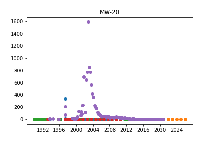

MW-20
['MW-34s', 'MW-38s', 'MW-39s']

Initiated AutoTS object with best model: 
Ensemble
{}
{"model_name": "BestN", "model_count": 3, "model_metric": "mixed_metric", "models": {"8f4981f8a713c16ae65755ec64c12cab": {"Model": "GLM", "ModelParameters": "{\"family\": \"Gamma\", \"constant\": false, \"regression_type\": null}", "TransformationParameters": "{\"fillna\": \"zero\", \"transformations\": {\"0\": \"PowerTransformer\", \"1\": \"ClipOutliers\", \"2\": \"DifferencedTransformer\", \"3\": \"PowerTransformer\"}, \"transformation_params\": {\"0\": {}, \"1\": {\"method\": \"clip\", \"std_threshold\": 5, \"fillna\": null}, \"2\": {}, \"3\": {}}}"}, "050edfaf0547ea559d630a90a6e97f6f": {"Model": "ETS", "ModelParameters": "{\"damped_trend\": false, \"trend\": null, \"seasonal\": null, \"seasonal_periods\": null}", "TransformationParameters": "{\"fillna\": \"ffill_mean_biased\", \"transformations\": {\"0\": \"PowerTransformer\", \"1\": \"ClipOutliers\"}, \"transformation_params\": {\"0\": {}, \"1\": {\"method\": \"clip\", \"std_threshold\": 5, \"fillna\": null}}}"}, "188a010bc138236849f11909f2e79d17": {"Model": "UnobservedComponents", "ModelParameters": "{\"level\": true, \"trend\": false, \"cycle\": false, \"damped_cycle\": false, \"irregular\": true, \"stochastic_trend\": false, \"stochastic_level\": true, \"stochastic_cycle\": true, \"regression_type\": null}", "TransformationParameters": "{\"fillna\": \"ffill_mean_biased\", \"transformations\": {\"0\": \"PowerTransformer\", \"1\": \"PositiveShift\", \"2\": \"DifferencedTransformer\", \"3\": \"QuantileTransformer\"}, \"transformation_params\": {\"0\": {}, \"1\": {}, \"2\": {}, \"3\": {\"output_distribution\": \"uniform\", \"n_quantiles\": 9}}}"}}}
## MW-22

## MW-23

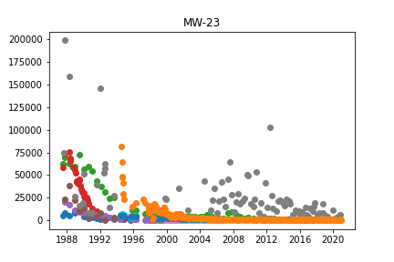

MW-23
['MW-22', 'MW-24', 'MW-25d', 'MW-25s', 'MW-45s', 'MW-5d', 'MW-75', 'NMW-1d', 'NMW-2d', 'PW-1']

Initiated AutoTS object with best model: 
WindowRegression
{"fillna": "ffill", "transformations": {"0": "ClipOutliers", "1": "PowerTransformer", "2": "MinMaxScaler", "3": "Discretize", "4": "PowerTransformer"}, "transformation_params": {"0": {"method": "clip", "std_threshold": 2, "fillna": null}, "1": {}, "2": {}, "3": {"discretization": "center", "n_bins": 5}, "4": {}}}
{"window_size": 5, "regression_model": {"model": "MLP", "model_params": {"hidden_layer_sizes": [72, 36, 72], "max_iter": 250, "activation": "relu", "solver": "lbfgs", "early_stopping": false, "learning_rate_init": 0.001}}, "input_dim": "multivariate", "output_dim": "1step", "normalize_window": false, "shuffle": false, "max_windows": 5000}
## MW-24

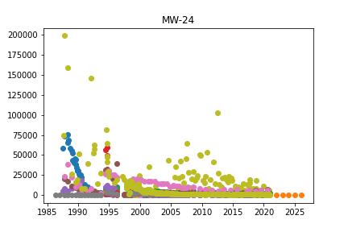

MW-24
['AMW-1', 'AMW-2', 'MW-23', 'MW-25d', 'MW-25s', 'MW-2s', 'MW-5d', 'NMW-1d', 'NMW-1s', 'NMW-2d', 'NMW-2s', 'NMW-3d', 'PMW-1', 'PMW-2', 'PMW-3', 'PMW-4', 'PW-1']

Initiated AutoTS object with best model: 
LastValueNaive
{"fillna": "median", "transformations": {"0": "RobustScaler", "1": "PowerTransformer", "2": "PowerTransformer", "3": "PowerTransformer", "4": "Round"}, "transformation_params": {"0": {}, "1": {}, "2": {}, "3": {}, "4": {"model": "middle", "decimals": 0, "on_transform": false, "on_inverse": true}}}
{}
## MW-25d

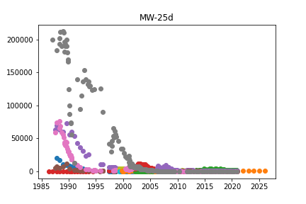

MW-25d
['MW-1 Replacement', 'MW-10d', 'MW-22', 'MW-23', 'MW-24', 'MW-2d', 'MW-45d', 'MW-45s', 'MW-48', 'MW-50', 'MW-75', 'TW-10', 'TW-20', 'TW-22', 'TW-4', 'TW-6']

Initiated AutoTS object with best model: 
DatepartRegression
{"fillna": "fake_date", "transformations": {"0": "ClipOutliers", "1": "PowerTransformer"}, "transformation_params": {"0": {"method": "clip", "std_threshold": 3, "fillna": null}, "1": {}}}
{"regression_model": {"model": "KNN", "model_params": {"n_neighbors": 3, "weights": "uniform"}}, "datepart_method": "expanded", "regression_type": null}
## MW-25s

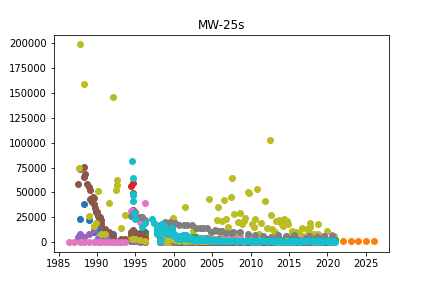

MW-25s
['AMW-1', 'AMW-2', 'MW-23', 'MW-24', 'MW-2s', 'MW-45s', 'MW-5d', 'NMW-1d', 'NMW-1s', 'NMW-2d', 'NMW-2s', 'NMW-3d', 'NMW-3s', 'PMW-1', 'PMW-2', 'PMW-3', 'PMW-4', 'PW-1']

Initiated AutoTS object with best model: 
LastValueNaive
{"fillna": "fake_date", "transformations": {"0": "bkfilter", "1": "Detrend", "2": "DifferencedTransformer"}, "transformation_params": {"0": {}, "1": {"model": "Linear"}, "2": {}}}
{}
## MW-28

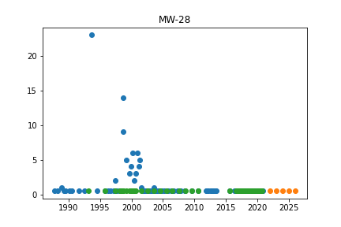

MW-28
['MW-38s']

Initiated AutoTS object with best model: 
RollingRegression
{"fillna": "rolling_mean", "transformations": {"0": "PctChangeTransformer", "1": "PowerTransformer"}, "transformation_params": {"0": {}, "1": {}}}
{"regression_model": {"model": "MLP", "model_params": {"hidden_layer_sizes": [25, 15, 25], "max_iter": 250, "activation": "tanh", "solver": "lbfgs", "early_stopping": false, "learning_rate_init": 0.001}}, "holiday": false, "mean_rolling_periods": 30, "macd_periods": 28, "std_rolling_periods": 30, "max_rolling_periods": 86, "min_rolling_periods": 20, "ewm_alpha": null, "additional_lag_periods": 11, "abs_energy": false, "rolling_autocorr_periods": null, "add_date_part": null, "polynomial_degree": null, "x_transform": null, "regression_type": null}
## MW-2d

MW-2d
['MW-1 Replacement', 'MW-25d', 'TW-20', 'TW-6']

Initiated AutoTS object with best model: 
SeasonalNaive
{"fillna": "mean", "transformations": {"0": "bkfilter", "1": "QuantileTransformer", "2": "Detrend"}, "transformation_params": {"0": {}, "1": {"output_distribution": "uniform", "n_quantiles": 9}, "2": {"model": "Linear"}}}
{"method": "Mean", "lag_1": 7, "lag_2": 2}
## MW-2s

MW-2s
['AMW-1', 'AMW-2', 'MW-24', 'MW-25s', 'MW-5d', 'NMW-1d', 'NMW-1s', 'NMW-2d', 'NMW-2s', 'NMW-3d', 'NMW-3s', 'PMW-1', 'PMW-2', 'PMW-3', 'PMW-4', 'PW-1']

Initiated AutoTS object with best model: 
Ensemble
{}
{"model_name": "BestN", "model_count": 3, "model_metric": "best_score", "models": {"e84409d4d8967ba5ae3ad2346c02c3f7": {"Model": "LastValueNaive", "ModelParameters": "{}", "TransformationParameters": "{\"fillna\": \"fake_date\", \"transformations\": {\"0\": \"RobustScaler\", \"1\": \"QuantileTransformer\", \"2\": \"Log\", \"3\": \"bkfilter\"}, \"transformation_params\": {\"0\": {}, \"1\": {\"output_distribution\": \"uniform\", \"n_quantiles\": 9}, \"2\": {}, \"3\": {}}}"}, "bcc1546388e74a0b5da4373693577770": {"Model": "LastValueNaive", "ModelParameters": "{}", "TransformationParameters": "{\"fillna\": \"rolling_mean\", \"transformations\": {\"0\": \"RobustScaler\", \"1\": \"QuantileTransformer\", \"2\": \"Log\", \"3\": \"bkfilter\"}, \"transformation_params\": {\"0\": {}, \"1\": {\"output_distribution\": \"uniform\", \"n_quantiles\": 9}, \"2\": {}, \"3\": {}}}"}, "87c200f2287287b7d69bf4b2f302931b": {"Model": "LastValueNaive", "ModelParameters": "{}", "TransformationParameters": "{\"fillna\": \"fake_date\", \"transformations\": {\"0\": \"PowerTransformer\", \"1\": \"QuantileTransformer\", \"2\": \"Log\", \"3\": \"bkfilter\"}, \"transformation_params\": {\"0\": {}, \"1\": {\"output_distribution\": \"uniform\", \"n_quantiles\": 9}, \"2\": {}, \"3\": {}}}"}}}
## MW-30d

## MW-30i

MW-30i
['MW-118']

Initiated AutoTS object with best model: 
Ensemble
{}
{"model_name": "BestN", "model_count": 3, "model_metric": "mixed_metric", "models": {"7f1de05f819975b9527607de484686f5": {"Model": "DatepartRegression", "ModelParameters": "{\"regression_model\": {\"model\": \"ElasticNet\", \"model_params\": {}}, \"datepart_method\": \"recurring\", \"regression_type\": null}", "TransformationParameters": "{\"fillna\": \"median\", \"transformations\": {\"0\": \"QuantileTransformer\", \"1\": \"QuantileTransformer\", \"2\": \"Detrend\", \"3\": \"Detrend\", \"4\": \"PowerTransformer\", \"5\": \"SeasonalDifference\"}, \"transformation_params\": {\"0\": {\"output_distribution\": \"uniform\", \"n_quantiles\": 2}, \"1\": {\"output_distribution\": \"normal\", \"n_quantiles\": 2}, \"2\": {\"model\": \"Linear\"}, \"3\": {\"model\": \"Linear\"}, \"4\": {}, \"5\": {\"lag_1\": 7, \"method\": \"LastValue\"}}}"}, "40746400eb55c2273968f9ad769f2ba3": {"Model": "AverageValueNaive", "ModelParameters": "{\"method\": \"Mean\"}", "TransformationParameters": "{\"fillna\": \"median\", \"transformations\": {\"0\": \"QuantileTransformer\", \"1\": \"QuantileTransformer\", \"2\": \"Discretize\", \"3\": \"Detrend\", \"4\": \"PowerTransformer\", \"5\": \"SeasonalDifference\"}, \"transformation_params\": {\"0\": {\"output_distribution\": \"uniform\", \"n_quantiles\": 2}, \"1\": {\"output_distribution\": \"normal\", \"n_quantiles\": 2}, \"2\": {\"discretization\": \"center\", \"n_bins\": 10}, \"3\": {\"model\": \"Linear\"}, \"4\": {}, \"5\": {\"lag_1\": 7, \"method\": \"LastValue\"}}}"}, "0aa2dada75475cde91f097042f58f987": {"Model": "UnobservedComponents", "ModelParameters": "{\"level\": false, \"trend\": false, \"cycle\": true, \"damped_cycle\": false, \"irregular\": true, \"stochastic_trend\": true, \"stochastic_level\": false, \"stochastic_cycle\": true, \"regression_type\": null}", "TransformationParameters": "{\"fillna\": \"fake_date\", \"transformations\": {\"0\": \"QuantileTransformer\", \"1\": \"DifferencedTransformer\", \"2\": \"PowerTransformer\", \"3\": \"Detrend\"}, \"transformation_params\": {\"0\": {\"output_distribution\": \"uniform\", \"n_quantiles\": 2}, \"1\": {}, \"2\": {}, \"3\": {\"model\": \"Linear\"}}}"}}}
## MW-31

MW-31
['4742 Park Rd', 'MW-61s']

Initiated AutoTS object with best model: 
DatepartRegression
{"fillna": "rolling_mean", "transformations": {"0": "DifferencedTransformer", "1": "PowerTransformer", "2": "PowerTransformer", "3": "QuantileTransformer"}, "transformation_params": {"0": {}, "1": {}, "2": {}, "3": {"output_distribution": "uniform", "n_quantiles": 10}}}
{"regression_model": {"model": "MLP", "model_params": {"hidden_layer_sizes": [72, 36, 72], "max_iter": 250, "activation": "tanh", "solver": "sgd", "early_stopping": true, "learning_rate_init": 0.001}}, "datepart_method": "expanded", "regression_type": null}
## MW-32

MW-32
['MW-18d', 'TW-1', 'TW-14']

Initiated AutoTS object with best model: 
ZeroesNaive
{"fillna": "ffill", "transformations": {"0": "MinMaxScaler", "1": "QuantileTransformer", "2": "Detrend"}, "transformation_params": {"0": {}, "1": {"output_distribution": "uniform", "n_quantiles": 9}, "2": {"model": "Linear"}}}
{}
## MW-34d

MW-34d
['MW-38d']

Initiated AutoTS object with best model: 
LastValueNaive
{"fillna": "fake_date", "transformations": {"0": "PowerTransformer", "1": "Discretize", "2": "MaxAbsScaler", "3": "DifferencedTransformer", "4": "ClipOutliers"}, "transformation_params": {"0": {}, "1": {"discretization": "lower", "n_bins": 20}, "2": {}, "3": {}, "4": {"method": "clip", "std_threshold": 3, "fillna": null}}}
{}
## MW-34s

MW-34s
['MW-20', 'MW-38s']

Initiated AutoTS object with best model: 
ZeroesNaive
{"fillna": "fake_date", "transformations": {"0": "Discretize", "1": "QuantileTransformer", "2": "Round"}, "transformation_params": {"0": {"discretization": "center", "n_bins": 5}, "1": {"output_distribution": "uniform", "n_quantiles": 8}, "2": {"model": "middle", "decimals": 2, "on_transform": true, "on_inverse": true}}}
{}
## MW-35

MW-35
['170 Aprill']

Initiated AutoTS object with best model: 
RollingRegression
{"fillna": "mean", "transformations": {"0": "bkfilter", "1": "DifferencedTransformer", "2": "CenterLastValue"}, "transformation_params": {"0": {}, "1": {}, "2": {"rows": 1}}}
{"regression_model": {"model": "Adaboost", "model_params": {"n_estimators": 50, "loss": "exponential", "base_estimator": "DecisionTree", "learning_rate": 1.0}}, "holiday": false, "mean_rolling_periods": 5, "macd_periods": 24, "std_rolling_periods": 30, "max_rolling_periods": null, "min_rolling_periods": null, "ewm_alpha": null, "additional_lag_periods": 6, "abs_energy": true, "rolling_autocorr_periods": null, "add_date_part": null, "polynomial_degree": null, "x_transform": null, "regression_type": null}
## MW-36

## MW-37

MW-37
['MW-18d', 'MW-38d', 'TW-1', 'TW-3']

Initiated AutoTS object with best model: 
SeasonalNaive
{"fillna": "ffill", "transformations": {"0": "StandardScaler", "1": "QuantileTransformer", "2": "Detrend", "3": "RobustScaler"}, "transformation_params": {"0": {}, "1": {"output_distribution": "uniform", "n_quantiles": 9}, "2": {"model": "Linear"}, "3": {}}}
{"method": "Mean", "lag_1": 12, "lag_2": 24}
## MW-38d

MW-38d
['MW-34d', 'MW-37', 'TW-3']

Initiated AutoTS object with best model: 
LastValueNaive
{"fillna": "rolling_mean", "transformations": {"0": "QuantileTransformer", "1": "QuantileTransformer", "2": "bkfilter", "3": "Discretize"}, "transformation_params": {"0": {"output_distribution": "uniform", "n_quantiles": 8}, "1": {"output_distribution": "uniform", "n_quantiles": 8}, "2": {}, "3": {"discretization": "upper", "n_bins": 5}}}
{}
## MW-38s

MW-38s
['MW-20', 'MW-28', 'MW-34s', 'MW-39s']

Initiated AutoTS object with best model: 
AverageValueNaive
{"fillna": "fake_date", "transformations": {"0": "PowerTransformer", "1": "PowerTransformer", "2": "DifferencedTransformer", "3": "DifferencedTransformer"}, "transformation_params": {"0": {}, "1": {}, "2": {}, "3": {}}}
{"method": "Mean"}
## MW-39d

MW-39d
['MW-126s', 'MW-131s', 'MW-56s']

Initiated AutoTS object with best model: 
Ensemble
{}
{"model_name": "BestN", "model_count": 3, "model_metric": "best_score", "models": {"951457fa5d17c916812d9108261b920c": {"Model": "LastValueNaive", "ModelParameters": "{}", "TransformationParameters": "{\"fillna\": \"fake_date\", \"transformations\": {\"0\": \"PctChangeTransformer\", \"1\": \"PowerTransformer\", \"2\": \"PowerTransformer\", \"3\": \"PowerTransformer\"}, \"transformation_params\": {\"0\": {}, \"1\": {}, \"2\": {}, \"3\": {}}}"}, "eea6465b2e79088bede858ce4b22260f": {"Model": "ETS", "ModelParameters": "{\"damped_trend\": true, \"trend\": null, \"seasonal\": null, \"seasonal_periods\": null}", "TransformationParameters": "{\"fillna\": \"fake_date\", \"transformations\": {\"0\": \"PctChangeTransformer\", \"1\": \"Round\", \"2\": \"PowerTransformer\", \"3\": \"PowerTransformer\", \"4\": \"Detrend\", \"5\": \"QuantileTransformer\"}, \"transformation_params\": {\"0\": {}, \"1\": {\"model\": \"middle\", \"decimals\": -1, \"on_transform\": true, \"on_inverse\": false}, \"2\": {}, \"3\": {}, \"4\": {\"model\": \"Linear\"}, \"5\": {\"output_distribution\": \"uniform\", \"n_quantiles\": 5}}}"}, "5c3d984f1ee3b3fb628da37df736148f": {"Model": "ETS", "ModelParameters": "{\"damped_trend\": false, \"trend\": \"additive\", \"seasonal\": \"additive\", \"seasonal_periods\": 28}", "TransformationParameters": "{\"fillna\": \"fake_date\", \"transformations\": {\"0\": \"PctChangeTransformer\", \"1\": \"Round\", \"2\": \"PowerTransformer\", \"3\": \"PowerTransformer\", \"4\": \"Detrend\", \"5\": \"QuantileTransformer\"}, \"transformation_params\": {\"0\": {}, \"1\": {\"model\": \"middle\", \"decimals\": -1, \"on_transform\": true, \"on_inverse\": false}, \"2\": {}, \"3\": {}, \"4\": {\"model\": \"Linear\"}, \"5\": {\"output_distribution\": \"uniform\", \"n_quantiles\": 5}}}"}}}
## MW-39s

MW-39s
['MW-20', 'MW-38s']

Initiated AutoTS object with best model: 
AverageValueNaive
{"fillna": "ffill_mean_biased", "transformations": {"0": "MinMaxScaler", "1": "Discretize", "2": "MinMaxScaler", "3": "RobustScaler", "4": "DifferencedTransformer"}, "transformation_params": {"0": {}, "1": {"discretization": "lower", "n_bins": 5}, "2": {}, "3": {}, "4": {}}}
{"method": "Mean"}
## MW-40d

## MW-40s

## MW-41d

## MW-41s

## MW-42d

## MW-42s

## MW-45d

MW-45d
['MW-1 Replacement', 'MW-10d', 'MW-22', 'MW-25d', 'MW-45s', 'MW-46', 'MW-48', 'MW-49', 'MW-50', 'MW-52s', 'MW-57', 'MW-58s', 'MW-75', 'TW-10', 'TW-20', 'TW-22', 'TW-4', 'TW-8']

Initiated AutoTS object with best model: 
UnobservedComponents
{"fillna": "rolling_mean", "transformations": {"0": "Detrend", "1": "MinMaxScaler", "2": "DifferencedTransformer"}, "transformation_params": {"0": {"model": "Linear"}, "1": {}, "2": {}}}
{"level": false, "trend": false, "cycle": false, "damped_cycle": false, "irregular": true, "stochastic_trend": false, "stochastic_level": true, "stochastic_cycle": false, "regression_type": null}
## MW-45s

MW-45s
['MW-10d', 'MW-22', 'MW-23', 'MW-25d', 'MW-25s', 'MW-45d', 'MW-50', 'MW-57', 'MW-5d', 'MW-75', 'TW-10', 'TW-20', 'TW-22']

Initiated AutoTS object with best model: 
LastValueNaive
{"fillna": "ffill_mean_biased", "transformations": {"0": "ClipOutliers", "1": "Detrend", "2": "Slice"}, "transformation_params": {"0": {"method": "clip", "std_threshold": 3, "fillna": null}, "1": {"model": "Linear"}, "2": {"method": 0.2}}}
{}
## MW-46

MW-46
['MW-10d', 'MW-22', 'MW-45d', 'MW-48', 'MW-49', 'MW-50', 'MW-52i', 'MW-52s', 'MW-57', 'MW-58s', 'MW-75', 'TW-22', 'TW-4', 'TW-8']

Initiated AutoTS object with best model: 
GLS
{"fillna": "median", "transformations": {"0": "ClipOutliers", "1": "QuantileTransformer", "2": "RobustScaler", "3": "Round", "4": "MaxAbsScaler"}, "transformation_params": {"0": {"method": "clip", "std_threshold": 3.5, "fillna": null}, "1": {"output_distribution": "uniform", "n_quantiles": 10}, "2": {}, "3": {"model": "middle", "decimals": 2, "on_transform": true, "on_inverse": true}, "4": {}}}
{}
## MW-48

MW-48
['MW-10d', 'MW-25d', 'MW-45d', 'MW-46', 'MW-49', 'MW-50', 'MW-52s', 'MW-57', 'MW-58s', 'MW-75', 'TW-22', 'TW-4', 'TW-8']

Initiated AutoTS object with best model: 
GLS
{"fillna": "median", "transformations": {"0": "ClipOutliers", "1": "QuantileTransformer", "2": "RobustScaler", "3": "Round", "4": "MaxAbsScaler"}, "transformation_params": {"0": {"method": "clip", "std_threshold": 3.5, "fillna": null}, "1": {"output_distribution": "uniform", "n_quantiles": 10}, "2": {}, "3": {"model": "middle", "decimals": 2, "on_transform": true, "on_inverse": true}, "4": {}}}
{}
## MW-49

MW-49
['MW-10d', 'MW-125', 'MW-45d', 'MW-46', 'MW-48', 'MW-50', 'MW-52i', 'MW-52s', 'MW-57', 'MW-58s', 'MW-78', 'TW-22', 'TW-4', 'TW-8']

Initiated AutoTS object with best model: 
RollingRegression
{"fillna": "mean", "transformations": {"0": "Discretize", "1": "MinMaxScaler", "2": "Discretize"}, "transformation_params": {"0": {"discretization": "upper", "n_bins": 20}, "1": {}, "2": {"discretization": "upper", "n_bins": 10}}}
{"regression_model": {"model": "Adaboost", "model_params": {"n_estimators": 50, "loss": "linear", "base_estimator": "DecisionTree", "learning_rate": 1.0}}, "holiday": false, "mean_rolling_periods": 5, "macd_periods": 42, "std_rolling_periods": 30, "max_rolling_periods": 2, "min_rolling_periods": 52, "ewm_alpha": 0.5, "additional_lag_periods": 23, "abs_energy": false, "rolling_autocorr_periods": null, "add_date_part": "expanded", "polynomial_degree": null, "x_transform": "RmZeroVariance", "regression_type": null}
## MW-4d

## MW-50

MW-50
['MW-10d', 'MW-22', 'MW-25d', 'MW-45d', 'MW-45s', 'MW-46', 'MW-48', 'MW-49', 'MW-52s', 'MW-57', 'MW-58s', 'MW-75', 'TW-10', 'TW-20', 'TW-22', 'TW-4', 'TW-8']

Initiated AutoTS object with best model: 
Ensemble
{}
{"model_name": "BestN", "model_count": 3, "model_metric": "mixed_metric", "models": {"c3648f99e1b5ed98053f5533ae2d1b2c": {"Model": "DatepartRegression", "ModelParameters": "{\"regression_model\": {\"model\": \"MLP\", \"model_params\": {\"hidden_layer_sizes\": [100], \"max_iter\": 250, \"activation\": \"relu\", \"solver\": \"lbfgs\", \"early_stopping\": false, \"learning_rate_init\": 0.001}}, \"datepart_method\": \"expanded\", \"regression_type\": null}", "TransformationParameters": "{\"fillna\": \"mean\", \"transformations\": {\"0\": \"MinMaxScaler\", \"1\": \"SeasonalDifference\", \"2\": \"PowerTransformer\"}, \"transformation_params\": {\"0\": {}, \"1\": {\"lag_1\": 7, \"method\": \"Median\"}, \"2\": {}}}"}, "4ebb565587551094c4b9219f24422652": {"Model": "SeasonalNaive", "ModelParameters": "{\"method\": \"Median\", \"lag_1\": 2, \"lag_2\": \"None\"}", "TransformationParameters": "{\"fillna\": \"ffill\", \"transformations\": {\"0\": \"ClipOutliers\", \"1\": \"Slice\", \"2\": \"PowerTransformer\"}, \"transformation_params\": {\"0\": {\"method\": \"clip\", \"std_threshold\": 1, \"fillna\": null}, \"1\": {\"method\": 0.5}, \"2\": {}}}"}, "4925056c511eb5992fa997b1476fd9ac": {"Model": "ZeroesNaive", "ModelParameters": "{}", "TransformationParameters": "{\"fillna\": \"mean\", \"transformations\": {\"0\": \"ClipOutliers\", \"1\": \"RobustScaler\"}, \"transformation_params\": {\"0\": {\"method\": \"clip\", \"std_threshold\": 1, \"fillna\": null}, \"1\": {}}}"}}}
## MW-51

## MW-52d

MW-52d
['MW-52i', 'MW-58d']

Initiated AutoTS object with best model: 
ETS
{"fillna": "ffill_mean_biased", "transformations": {"0": "PowerTransformer", "1": "Detrend", "2": "RollingMeanTransformer"}, "transformation_params": {"0": {}, "1": {"model": "Linear"}, "2": {"fixed": false, "window": 3}}}
{"damped_trend": false, "trend": "additive", "seasonal": null, "seasonal_periods": null}
## MW-52i

MW-52i
['MW-46', 'MW-49', 'MW-52d', 'MW-52s', 'MW-58d', 'MW-58s', 'TW-4', 'TW-8']

Initiated AutoTS object with best model: 
GLM
{"fillna": "zero", "transformations": {"0": "bkfilter", "1": "PowerTransformer", "2": "DifferencedTransformer", "3": "Round"}, "transformation_params": {"0": {}, "1": {}, "2": {}, "3": {"model": "middle", "decimals": 1, "on_transform": true, "on_inverse": true}}}
{"family": "Binomial", "constant": false, "regression_type": null}
## MW-52s

MW-52s
['MW-10d', 'MW-45d', 'MW-46', 'MW-48', 'MW-49', 'MW-50', 'MW-52i', 'MW-57', 'MW-58s', 'MW-75', 'TW-10', 'TW-20', 'TW-22', 'TW-4', 'TW-8']

Initiated AutoTS object with best model: 
GLS
{"fillna": "ffill_mean_biased", "transformations": {"0": "Detrend", "1": "QuantileTransformer", "2": "DifferencedTransformer", "3": "Round"}, "transformation_params": {"0": {"model": "Linear"}, "1": {"output_distribution": "uniform", "n_quantiles": 10}, "2": {}, "3": {"model": "middle", "decimals": 1, "on_transform": false, "on_inverse": true}}}
{}
## MW-53d

## MW-53i

MW-53i
['A2 Cleaning Supply']

Initiated AutoTS object with best model: 
AverageValueNaive
{"fillna": "ffill", "transformations": {"0": "ClipOutliers", "1": "bkfilter", "2": "DifferencedTransformer"}, "transformation_params": {"0": {"method": "clip", "std_threshold": 1, "fillna": null}, "1": {}, "2": {}}}
{"method": "Mode"}
## MW-53s

MW-53s
['MW-93']

Initiated AutoTS object with best model: 
ZeroesNaive
{"fillna": "ffill_mean_biased", "transformations": {"0": "Round", "1": "StandardScaler", "2": "Log"}, "transformation_params": {"0": {"model": "middle", "decimals": 0, "on_transform": true, "on_inverse": true}, "1": {}, "2": {}}}
{}
## MW-54d

MW-54d
['465 Dupont', 'MW-77']

Initiated AutoTS object with best model: 
GLS
{"fillna": "ffill_mean_biased", "transformations": {"0": "bkfilter", "1": "MaxAbsScaler", "2": "SeasonalDifference", "3": "MinMaxScaler", "4": "DifferencedTransformer"}, "transformation_params": {"0": {}, "1": {}, "2": {"lag_1": 7, "method": "Median"}, "3": {}, "4": {}}}
{}
## MW-54s

## MW-56d

MW-56d
['MW-62d']

Initiated AutoTS object with best model: 
Ensemble
{}
{"model_name": "BestN", "model_count": 3, "model_metric": "best_score_unique", "models": {"daa8b62a6c35430719d572d737aec7a1": {"Model": "WindowRegression", "ModelParameters": "{\"window_size\": 5, \"regression_model\": {\"model\": \"MLP\", \"model_params\": {\"hidden_layer_sizes\": [32, 64, 32], \"max_iter\": 250, \"activation\": \"tanh\", \"solver\": \"lbfgs\", \"early_stopping\": false, \"learning_rate_init\": 0.001}}, \"input_dim\": \"multivariate\", \"output_dim\": \"1step\", \"normalize_window\": false, \"shuffle\": true, \"max_windows\": 5000}", "TransformationParameters": "{\"fillna\": \"median\", \"transformations\": {\"0\": \"StandardScaler\", \"1\": \"MinMaxScaler\", \"2\": \"RobustScaler\", \"3\": \"DifferencedTransformer\", \"4\": \"MinMaxScaler\"}, \"transformation_params\": {\"0\": {}, \"1\": {}, \"2\": {}, \"3\": {}, \"4\": {}}}"}, "5029e9890081a65bd83a3ab8a9477f14": {"Model": "GLS", "ModelParameters": "{}", "TransformationParameters": "{\"fillna\": \"zero\", \"transformations\": {\"0\": \"PowerTransformer\", \"1\": \"PowerTransformer\", \"2\": \"SeasonalDifference\", \"3\": \"Discretize\", \"4\": \"MinMaxScaler\"}, \"transformation_params\": {\"0\": {}, \"1\": {}, \"2\": {\"lag_1\": 7, \"method\": \"Median\"}, \"3\": {\"discretization\": \"lower\", \"n_bins\": 20}, \"4\": {}}}"}, "40bbb330193630dd2351fbf9d3eb5e72": {"Model": "DatepartRegression", "ModelParameters": "{\"regression_model\": {\"model\": \"MLP\", \"model_params\": {\"hidden_layer_sizes\": [32, 32, 32], \"max_iter\": 250, \"activation\": \"logistic\", \"solver\": \"lbfgs\", \"early_stopping\": false, \"learning_rate_init\": 0.001}}, \"datepart_method\": \"recurring\", \"regression_type\": null}", "TransformationParameters": "{\"fillna\": \"median\", \"transformations\": {\"0\": \"CenterLastValue\", \"1\": \"DifferencedTransformer\"}, \"transformation_params\": {\"0\": {\"rows\": 6}, \"1\": {}}}"}}}
## MW-56s

MW-56s
['MW-39d', 'MW-62i']

Initiated AutoTS object with best model: 
ZeroesNaive
{"fillna": "rolling_mean_24", "transformations": {"0": "QuantileTransformer", "1": "DifferencedTransformer", "2": "PowerTransformer"}, "transformation_params": {"0": {"output_distribution": "uniform", "n_quantiles": 7}, "1": {}, "2": {}}}
{}
## MW-57

MW-57
['MW-10d', 'MW-45d', 'MW-45s', 'MW-46', 'MW-48', 'MW-49', 'MW-50', 'MW-52s', 'MW-75', 'TW-22', 'TW-4', 'TW-8']

Initiated AutoTS object with best model: 
SeasonalNaive
{"fillna": "fake_date", "transformations": {"0": "PowerTransformer", "1": "MinMaxScaler", "2": "QuantileTransformer", "3": "DifferencedTransformer"}, "transformation_params": {"0": {}, "1": {}, "2": {"output_distribution": "uniform", "n_quantiles": 10}, "3": {}}}
{"method": "Mean", "lag_1": 28, "lag_2": 7}
## MW-58d

MW-58d
['MW-52d', 'MW-52i']

Initiated AutoTS object with best model: 
Ensemble
{}
{"model_name": "BestN", "model_count": 3, "model_metric": "best_score", "models": {"11703c0a205bce407f6ca819a9914c3d": {"Model": "WindowRegression", "ModelParameters": "{\"window_size\": 5, \"regression_model\": {\"model\": \"KNN\", \"model_params\": {\"n_neighbors\": 5, \"weights\": \"uniform\"}}, \"input_dim\": \"multivariate\", \"output_dim\": \"1step\", \"normalize_window\": false, \"shuffle\": false, \"max_windows\": 1000}", "TransformationParameters": "{\"fillna\": \"median\", \"transformations\": {\"0\": \"Discretize\", \"1\": \"Detrend\", \"2\": \"RobustScaler\", \"3\": \"DifferencedTransformer\"}, \"transformation_params\": {\"0\": {\"discretization\": \"upper\", \"n_bins\": 20}, \"1\": {\"model\": \"Linear\"}, \"2\": {}, \"3\": {}}}"}, "cc373ccc675e760c04d5800f6ed82e29": {"Model": "WindowRegression", "ModelParameters": "{\"window_size\": 5, \"regression_model\": {\"model\": \"KNN\", \"model_params\": {\"n_neighbors\": 5, \"weights\": \"uniform\"}}, \"input_dim\": \"multivariate\", \"output_dim\": \"1step\", \"normalize_window\": false, \"shuffle\": false, \"max_windows\": 5000}", "TransformationParameters": "{\"fillna\": \"fake_date\", \"transformations\": {\"0\": \"MaxAbsScaler\", \"1\": \"Detrend\", \"2\": \"RobustScaler\", \"3\": \"DifferencedTransformer\"}, \"transformation_params\": {\"0\": {}, \"1\": {\"model\": \"Linear\"}, \"2\": {}, \"3\": {}}}"}, "de0ebd13574a016ab05c1371dade656e": {"Model": "WindowRegression", "ModelParameters": "{\"window_size\": 5, \"regression_model\": {\"model\": \"DecisionTree\", \"model_params\": {\"max_depth\": 3, \"min_samples_split\": 1.0}}, \"input_dim\": \"multivariate\", \"output_dim\": \"1step\", \"normalize_window\": false, \"shuffle\": false, \"max_windows\": 5000}", "TransformationParameters": "{\"fillna\": \"zero\", \"transformations\": {\"0\": \"ClipOutliers\", \"1\": \"Detrend\", \"2\": \"PCA\", \"3\": \"DifferencedTransformer\"}, \"transformation_params\": {\"0\": {\"method\": \"clip\", \"std_threshold\": 1, \"fillna\": null}, \"1\": {\"model\": \"Linear\"}, \"2\": {}, \"3\": {}}}"}}}
## MW-58s

MW-58s
['MW-10d', 'MW-125', 'MW-45d', 'MW-46', 'MW-48', 'MW-49', 'MW-50', 'MW-52i', 'MW-52s', 'MW-78', 'TW-10', 'TW-20', 'TW-22', 'TW-4', 'TW-8']

Initiated AutoTS object with best model: 
ETS
{"fillna": "zero", "transformations": {"0": "ClipOutliers", "1": "MinMaxScaler", "2": "Detrend"}, "transformation_params": {"0": {"method": "clip", "std_threshold": 2, "fillna": null}, "1": {}, "2": {"model": "Linear"}}}
{"damped_trend": false, "trend": null, "seasonal": null, "seasonal_periods": null}
## MW-59d

## MW-59s

## MW-5d

MW-5d
['AMW-1', 'AMW-2', 'MW-23', 'MW-24', 'MW-25s', 'MW-2s', 'MW-45s', 'NMW-1d', 'NMW-1s', 'NMW-2d', 'NMW-2s', 'NMW-3d', 'NMW-3s', 'PMW-1', 'PMW-2', 'PMW-3', 'PMW-4', 'PW-1']

Initiated AutoTS object with best model: 
GLS
{"fillna": "median", "transformations": {"0": "bkfilter", "1": "QuantileTransformer", "2": "DifferencedTransformer"}, "transformation_params": {"0": {}, "1": {"output_distribution": "uniform", "n_quantiles": 10}, "2": {}}}
{}
## MW-60

## MW-61d

## MW-61s

MW-61s
['MW-31']

Initiated AutoTS object with best model: 
ETS
{"fillna": "zero", "transformations": {"0": "Slice", "1": "Discretize", "2": "Detrend", "3": "DifferencedTransformer", "4": "QuantileTransformer", "5": "RobustScaler"}, "transformation_params": {"0": {"method": 0.5}, "1": {"discretization": "center", "n_bins": 10}, "2": {"model": "Linear"}, "3": {}, "4": {"output_distribution": "uniform", "n_quantiles": 4}, "5": {}}}
{"damped_trend": false, "trend": null, "seasonal": "multiplicative", "seasonal_periods": 28}
## MW-62d

MW-62d
['MW-56d']

Initiated AutoTS object with best model: 
UnobservedComponents
{"fillna": "rolling_mean_24", "transformations": {"0": "QuantileTransformer", "1": "Detrend", "2": "Detrend", "3": "PositiveShift"}, "transformation_params": {"0": {"output_distribution": "uniform", "n_quantiles": 5}, "1": {"model": "Linear"}, "2": {"model": "Linear"}, "3": {}}}
{"level": true, "trend": false, "cycle": true, "damped_cycle": false, "irregular": true, "stochastic_trend": true, "stochastic_level": true, "stochastic_cycle": true, "regression_type": null}
## MW-62i

MW-62i
['MW-56s', 'MW-63i']

Initiated AutoTS object with best model: 
RollingRegression
{"fillna": "ffill_mean_biased", "transformations": {"0": "IntermittentOccurrence", "1": "QuantileTransformer", "2": "Detrend"}, "transformation_params": {"0": {"center": "mean"}, "1": {"output_distribution": "uniform", "n_quantiles": 5}, "2": {"model": "Linear"}}}
{"regression_model": {"model": "ElasticNet", "model_params": {}}, "holiday": false, "mean_rolling_periods": 7, "macd_periods": 24, "std_rolling_periods": 30, "max_rolling_periods": null, "min_rolling_periods": 28, "ewm_alpha": null, "additional_lag_periods": 2, "abs_energy": false, "rolling_autocorr_periods": null, "add_date_part": null, "polynomial_degree": null, "x_transform": null, "regression_type": null}
## MW-62s

MW-62s
['MW-63s']

Initiated AutoTS object with best model: 
GLS
{"fillna": "zero", "transformations": {"0": "PowerTransformer", "1": "PowerTransformer", "2": "DifferencedTransformer"}, "transformation_params": {"0": {}, "1": {}, "2": {}}}
{}
## MW-63d

## MW-63i

MW-63i
['MW-62i']

Initiated AutoTS object with best model: 
Ensemble
{}
{"model_name": "BestN", "model_count": 3, "model_metric": "best_score_unique", "models": {"daa8b62a6c35430719d572d737aec7a1": {"Model": "WindowRegression", "ModelParameters": "{\"window_size\": 5, \"regression_model\": {\"model\": \"MLP\", \"model_params\": {\"hidden_layer_sizes\": [32, 64, 32], \"max_iter\": 250, \"activation\": \"tanh\", \"solver\": \"lbfgs\", \"early_stopping\": false, \"learning_rate_init\": 0.001}}, \"input_dim\": \"multivariate\", \"output_dim\": \"1step\", \"normalize_window\": false, \"shuffle\": true, \"max_windows\": 5000}", "TransformationParameters": "{\"fillna\": \"median\", \"transformations\": {\"0\": \"StandardScaler\", \"1\": \"MinMaxScaler\", \"2\": \"RobustScaler\", \"3\": \"DifferencedTransformer\", \"4\": \"MinMaxScaler\"}, \"transformation_params\": {\"0\": {}, \"1\": {}, \"2\": {}, \"3\": {}, \"4\": {}}}"}, "5029e9890081a65bd83a3ab8a9477f14": {"Model": "GLS", "ModelParameters": "{}", "TransformationParameters": "{\"fillna\": \"zero\", \"transformations\": {\"0\": \"PowerTransformer\", \"1\": \"PowerTransformer\", \"2\": \"SeasonalDifference\", \"3\": \"Discretize\", \"4\": \"MinMaxScaler\"}, \"transformation_params\": {\"0\": {}, \"1\": {}, \"2\": {\"lag_1\": 7, \"method\": \"Median\"}, \"3\": {\"discretization\": \"lower\", \"n_bins\": 20}, \"4\": {}}}"}, "40bbb330193630dd2351fbf9d3eb5e72": {"Model": "DatepartRegression", "ModelParameters": "{\"regression_model\": {\"model\": \"MLP\", \"model_params\": {\"hidden_layer_sizes\": [32, 32, 32], \"max_iter\": 250, \"activation\": \"logistic\", \"solver\": \"lbfgs\", \"early_stopping\": false, \"learning_rate_init\": 0.001}}, \"datepart_method\": \"recurring\", \"regression_type\": null}", "TransformationParameters": "{\"fillna\": \"median\", \"transformations\": {\"0\": \"CenterLastValue\", \"1\": \"DifferencedTransformer\"}, \"transformation_params\": {\"0\": {\"rows\": 6}, \"1\": {}}}"}}}
## MW-63s

MW-63s
['MW-62s']

Initiated AutoTS object with best model: 
ZeroesNaive
{"fillna": "ffill", "transformations": {"0": "DifferencedTransformer", "1": "CumSumTransformer"}, "transformation_params": {"0": {}, "1": {}}}
{}
## MW-64

## MW-65d

MW-65d
['TW-12']

Initiated AutoTS object with best model: 
Ensemble
{}
{"model_name": "BestN", "model_count": 3, "model_metric": "mixed_metric", "models": {"9edbdd5e0b0b864af8714a902c0fefae": {"Model": "GLM", "ModelParameters": "{\"family\": \"Poisson\", \"constant\": false, \"regression_type\": \"datepart\"}", "TransformationParameters": "{\"fillna\": \"zero\", \"transformations\": {\"0\": \"MaxAbsScaler\", \"1\": \"PowerTransformer\", \"2\": \"DifferencedTransformer\"}, \"transformation_params\": {\"0\": {}, \"1\": {}, \"2\": {}}}"}, "2d10c772997509f815ac5a161b87ef5d": {"Model": "DatepartRegression", "ModelParameters": "{\"regression_model\": {\"model\": \"MLP\", \"model_params\": {\"hidden_layer_sizes\": [25, 50, 25], \"max_iter\": 250, \"activation\": \"relu\", \"solver\": \"lbfgs\", \"early_stopping\": false, \"learning_rate_init\": 0.001}}, \"datepart_method\": \"expanded\", \"regression_type\": null}", "TransformationParameters": "{\"fillna\": \"zero\", \"transformations\": {\"0\": \"PowerTransformer\", \"1\": \"DifferencedTransformer\", \"2\": \"SeasonalDifference\", \"3\": \"Round\", \"4\": \"RollingMean100thN\"}, \"transformation_params\": {\"0\": {}, \"1\": {}, \"2\": {\"lag_1\": 12, \"method\": \"LastValue\"}, \"3\": {\"model\": \"middle\", \"decimals\": -2, \"on_transform\": false, \"on_inverse\": true}, \"4\": {}}}"}, "9a1e81978b8a5c70e4400a0e7a6e6bac": {"Model": "UnobservedComponents", "ModelParameters": "{\"level\": false, \"trend\": false, \"cycle\": true, \"damped_cycle\": false, \"irregular\": false, \"stochastic_trend\": false, \"stochastic_level\": true, \"stochastic_cycle\": true, \"regression_type\": null}", "TransformationParameters": "{\"fillna\": \"mean\", \"transformations\": {\"0\": \"Round\", \"1\": \"MaxAbsScaler\", \"2\": \"QuantileTransformer\"}, \"transformation_params\": {\"0\": {\"model\": \"middle\", \"decimals\": 0, \"on_transform\": false, \"on_inverse\": true}, \"1\": {}, \"2\": {\"output_distribution\": \"uniform\", \"n_quantiles\": 4}}}"}}}
## MW-65i

## MW-65s

## MW-66

## MW-68

## MW-69

MW-69
['MW-106d', 'MW-94d']

Initiated AutoTS object with best model: 
Ensemble
{}
{"model_name": "BestN", "model_count": 3, "model_metric": "best_score_unique", "models": {"65ad1a62b698f61193d0fafa7a50c908": {"Model": "DatepartRegression", "ModelParameters": "{\"regression_model\": {\"model\": \"MLP\", \"model_params\": {\"hidden_layer_sizes\": [72, 36, 72], \"max_iter\": 250, \"activation\": \"relu\", \"solver\": \"lbfgs\", \"early_stopping\": false, \"learning_rate_init\": 0.001}}, \"datepart_method\": \"simple\", \"regression_type\": null}", "TransformationParameters": "{\"fillna\": \"fake_date\", \"transformations\": {\"0\": \"Detrend\", \"1\": \"CumSumTransformer\", \"2\": \"PowerTransformer\", \"3\": \"PowerTransformer\"}, \"transformation_params\": {\"0\": {\"model\": \"Linear\"}, \"1\": {}, \"2\": {}, \"3\": {}}}"}, "ccdff0f9cec9adb58645d96115351276": {"Model": "SeasonalNaive", "ModelParameters": "{\"method\": \"Mean\", \"lag_1\": 12, \"lag_2\": 4}", "TransformationParameters": "{\"fillna\": \"ffill\", \"transformations\": {\"0\": \"Detrend\", \"1\": \"PositiveShift\"}, \"transformation_params\": {\"0\": {\"model\": \"Linear\"}, \"1\": {}}}"}, "590e9646b791706b5bdc5de1525dbaf1": {"Model": "ETS", "ModelParameters": "{\"damped_trend\": false, \"trend\": null, \"seasonal\": null, \"seasonal_periods\": null}", "TransformationParameters": "{\"fillna\": \"ffill\", \"transformations\": {\"0\": \"Detrend\", \"1\": \"CumSumTransformer\", \"2\": \"ClipOutliers\", \"3\": \"StandardScaler\", \"4\": \"IntermittentOccurrence\"}, \"transformation_params\": {\"0\": {\"model\": \"Linear\"}, \"1\": {}, \"2\": {\"method\": \"clip\", \"std_threshold\": 4, \"fillna\": null}, \"3\": {}, \"4\": {\"center\": \"mean\"}}}"}}}
## MW-70

## MW-71

MW-71
['MW-108d']

Initiated AutoTS object with best model: 
Ensemble
{}
{"model_name": "BestN", "model_count": 3, "model_metric": "mixed_metric", "models": {"97c665afce621ddefe3367e109169e8b": {"Model": "GLM", "ModelParameters": "{\"family\": \"NegativeBinomial\", \"constant\": false, \"regression_type\": null}", "TransformationParameters": "{\"fillna\": \"ffill_mean_biased\", \"transformations\": {\"0\": \"PowerTransformer\", \"1\": \"SeasonalDifference\", \"2\": \"Detrend\", \"3\": \"SeasonalDifference\", \"4\": \"Discretize\"}, \"transformation_params\": {\"0\": {}, \"1\": {\"lag_1\": 7, \"method\": \"Mean\"}, \"2\": {\"model\": \"Linear\"}, \"3\": {\"lag_1\": 12, \"method\": \"Mean\"}, \"4\": {\"discretization\": \"upper\", \"n_bins\": 10}}}"}, "e90961316f1337801900e6923c578460": {"Model": "GLM", "ModelParameters": "{\"family\": \"Binomial\", \"constant\": false, \"regression_type\": null}", "TransformationParameters": "{\"fillna\": \"ffill_mean_biased\", \"transformations\": {\"0\": \"PowerTransformer\", \"1\": \"SeasonalDifference\", \"2\": \"Detrend\", \"3\": \"SeasonalDifference\", \"4\": \"Discretize\"}, \"transformation_params\": {\"0\": {}, \"1\": {\"lag_1\": 7, \"method\": \"Mean\"}, \"2\": {\"model\": \"Linear\"}, \"3\": {\"lag_1\": 12, \"method\": \"Mean\"}, \"4\": {\"discretization\": \"upper\", \"n_bins\": 10}}}"}, "8e403f306872aa2fb2cd259b65ca377d": {"Model": "UnobservedComponents", "ModelParameters": "{\"level\": true, \"trend\": false, \"cycle\": false, \"damped_cycle\": false, \"irregular\": true, \"stochastic_trend\": false, \"stochastic_level\": false, \"stochastic_cycle\": true, \"regression_type\": \"Holiday\"}", "TransformationParameters": "{\"fillna\": \"fake_date\", \"transformations\": {\"0\": \"ClipOutliers\", \"1\": \"Detrend\", \"2\": \"Detrend\", \"3\": \"bkfilter\", \"4\": \"Detrend\"}, \"transformation_params\": {\"0\": {\"method\": \"clip\", \"std_threshold\": 1, \"fillna\": null}, \"1\": {\"model\": \"Linear\"}, \"2\": {\"model\": \"Linear\"}, \"3\": {}, \"4\": {\"model\": \"Linear\"}}}"}}}
## MW-72d

## MW-72s

## MW-75

MW-75
['MW-1 Replacement', 'MW-10d', 'MW-23', 'MW-25d', 'MW-45d', 'MW-45s', 'MW-46', 'MW-48', 'MW-50', 'MW-52s', 'MW-57', 'TW-20', 'TW-22', 'TW-4', 'TW-8']

Initiated AutoTS object with best model: 
Ensemble
{}
{"model_name": "BestN", "model_count": 3, "model_metric": "best_score_unique", "models": {"16d2b4962b4b522f901a916a55132985": {"Model": "ETS", "ModelParameters": "{\"damped_trend\": false, \"trend\": null, \"seasonal\": null, \"seasonal_periods\": null}", "TransformationParameters": "{\"fillna\": \"fake_date\", \"transformations\": {\"0\": \"MinMaxScaler\", \"1\": \"Discretize\", \"2\": \"ClipOutliers\"}, \"transformation_params\": {\"0\": {}, \"1\": {\"discretization\": \"upper\", \"n_bins\": 20}, \"2\": {\"method\": \"clip\", \"std_threshold\": 2, \"fillna\": null}}}"}, "2cb2adb1aefbb8b85c33344101cc75e8": {"Model": "ZeroesNaive", "ModelParameters": "{}", "TransformationParameters": "{\"fillna\": \"zero\", \"transformations\": {\"0\": \"QuantileTransformer\", \"1\": \"QuantileTransformer\", \"2\": \"DifferencedTransformer\", \"3\": \"CumSumTransformer\"}, \"transformation_params\": {\"0\": {\"output_distribution\": \"uniform\", \"n_quantiles\": 10}, \"1\": {\"output_distribution\": \"uniform\", \"n_quantiles\": 10}, \"2\": {}, \"3\": {}}}"}, "887215837d3ea351839c35a742c2417d": {"Model": "GLM", "ModelParameters": "{\"family\": \"Binomial\", \"constant\": false, \"regression_type\": null}", "TransformationParameters": "{\"fillna\": \"median\", \"transformations\": {\"0\": \"MaxAbsScaler\", \"1\": \"StandardScaler\", \"2\": \"RobustScaler\"}, \"transformation_params\": {\"0\": {}, \"1\": {}, \"2\": {}}}"}}}
## MW-76i

## MW-76s

## MW-77

MW-77
['465 Dupont', 'MW-54d']

Initiated AutoTS object with best model: 
Ensemble
{}
{"model_name": "BestN", "model_count": 3, "model_metric": "best_score_unique", "models": {"468f3a98fc90c62cab10f88c6f321d1f": {"Model": "AverageValueNaive", "ModelParameters": "{\"method\": \"Mode\"}", "TransformationParameters": "{\"fillna\": \"rolling_mean_24\", \"transformations\": {\"0\": \"CenterLastValue\", \"1\": \"PowerTransformer\", \"2\": \"DifferencedTransformer\", \"3\": \"PowerTransformer\"}, \"transformation_params\": {\"0\": {\"rows\": 6}, \"1\": {}, \"2\": {}, \"3\": {}}}"}, "240f7a683b38b33db11fdf61c6e15fbd": {"Model": "SeasonalNaive", "ModelParameters": "{\"method\": \"Mean\", \"lag_1\": 364, \"lag_2\": \"None\"}", "TransformationParameters": "{\"fillna\": \"ffill\", \"transformations\": {\"0\": \"CenterLastValue\", \"1\": \"PowerTransformer\", \"2\": \"DifferencedTransformer\"}, \"transformation_params\": {\"0\": {\"rows\": 6}, \"1\": {}, \"2\": {}}}"}, "475f5e3ca20103be145a83445eba6796": {"Model": "GLS", "ModelParameters": "{}", "TransformationParameters": "{\"fillna\": \"rolling_mean_24\", \"transformations\": {\"0\": \"CenterLastValue\", \"1\": \"PowerTransformer\", \"2\": \"DifferencedTransformer\"}, \"transformation_params\": {\"0\": {\"rows\": 6}, \"1\": {}, \"2\": {}}}"}}}
## MW-78

MW-78
['MW-125', 'MW-49', 'MW-58s']

Initiated AutoTS object with best model: 
ZeroesNaive
{"fillna": "ffill_mean_biased", "transformations": {"0": "ClipOutliers", "1": "PctChangeTransformer", "2": "Discretize", "3": "MaxAbsScaler", "4": "DifferencedTransformer"}, "transformation_params": {"0": {"method": "clip", "std_threshold": 4, "fillna": null}, "1": {}, "2": {"discretization": "lower", "n_bins": 5}, "3": {}, "4": {}}}
{}
## MW-79d

MW-79d
['TW-19']

Initiated AutoTS object with best model: 
Ensemble
{}
{"model_name": "BestN", "model_count": 3, "model_metric": "best_score_unique", "models": {"80951a706b583a358fd5fb12f8b44f08": {"Model": "GLM", "ModelParameters": "{\"family\": \"Binomial\", \"constant\": false, \"regression_type\": \"datepart\"}", "TransformationParameters": "{\"fillna\": \"rolling_mean\", \"transformations\": {\"0\": \"PowerTransformer\", \"1\": \"DifferencedTransformer\"}, \"transformation_params\": {\"0\": {}, \"1\": {}}}"}, "5bb4bc35f44ae698d932a819aff42d66": {"Model": "RollingRegression", "ModelParameters": "{\"regression_model\": {\"model\": \"MLP\", \"model_params\": {\"hidden_layer_sizes\": [72, 36, 72], \"max_iter\": 250, \"activation\": \"tanh\", \"solver\": \"lbfgs\", \"early_stopping\": false, \"learning_rate_init\": 0.001}}, \"holiday\": true, \"mean_rolling_periods\": 12, \"macd_periods\": null, \"std_rolling_periods\": 5, \"max_rolling_periods\": 28, \"min_rolling_periods\": null, \"ewm_alpha\": 0.5, \"additional_lag_periods\": 2, \"abs_energy\": true, \"rolling_autocorr_periods\": null, \"add_date_part\": \"recurring\", \"polynomial_degree\": null, \"x_transform\": null, \"regression_type\": null}", "TransformationParameters": "{\"fillna\": \"zero\", \"transformations\": {\"0\": \"PowerTransformer\", \"1\": \"DifferencedTransformer\", \"2\": \"SeasonalDifference\", \"3\": \"DifferencedTransformer\", \"4\": \"MinMaxScaler\"}, \"transformation_params\": {\"0\": {}, \"1\": {}, \"2\": {\"lag_1\": 7, \"method\": \"Median\"}, \"3\": {}, \"4\": {}}}"}, "d0b668daac55d81e93b7fc6d778128f8": {"Model": "GLS", "ModelParameters": "{}", "TransformationParameters": "{\"fillna\": \"rolling_mean\", \"transformations\": {\"0\": \"RollingMean100thN\", \"1\": \"DifferencedTransformer\"}, \"transformation_params\": {\"0\": {}, \"1\": {}}}"}}}
## MW-79s

MW-79s
['MW-84s', 'MW-88']

Initiated AutoTS object with best model: 
GLS
{"fillna": "fake_date", "transformations": {"0": "Discretize", "1": "PowerTransformer", "2": "DifferencedTransformer"}, "transformation_params": {"0": {"discretization": "upper", "n_bins": 20}, "1": {}, "2": {}}}
{}
## MW-81

## MW-82s

## MW-83s

MW-83s
['MW-84s']

Initiated AutoTS object with best model: 
Ensemble
{}
{"model_name": "BestN", "model_count": 3, "model_metric": "best_score_unique", "models": {"f6d4bbd20f9d7c22d0af89c417f69de1": {"Model": "SeasonalNaive", "ModelParameters": "{\"method\": \"Mean\", \"lag_1\": 2, \"lag_2\": \"None\"}", "TransformationParameters": "{\"fillna\": \"mean\", \"transformations\": {\"0\": \"DifferencedTransformer\", \"1\": \"Discretize\", \"2\": \"StandardScaler\"}, \"transformation_params\": {\"0\": {}, \"1\": {\"discretization\": \"lower\", \"n_bins\": 5}, \"2\": {}}}"}, "31a4d161a5529c290d951ca7f61a70b9": {"Model": "ETS", "ModelParameters": "{\"damped_trend\": false, \"trend\": null, \"seasonal\": null, \"seasonal_periods\": null}", "TransformationParameters": "{\"fillna\": \"mean\", \"transformations\": {\"0\": \"Round\", \"1\": \"Discretize\", \"2\": \"ClipOutliers\"}, \"transformation_params\": {\"0\": {\"model\": \"middle\", \"decimals\": -1, \"on_transform\": false, \"on_inverse\": true}, \"1\": {\"discretization\": \"lower\", \"n_bins\": 5}, \"2\": {\"method\": \"clip\", \"std_threshold\": 4, \"fillna\": null}}}"}, "f54f9af263d04782e98cd420ad364800": {"Model": "ZeroesNaive", "ModelParameters": "{}", "TransformationParameters": "{\"fillna\": \"mean\", \"transformations\": {\"0\": \"PowerTransformer\", \"1\": \"StandardScaler\", \"2\": \"DifferencedTransformer\", \"3\": \"IntermittentOccurrence\", \"4\": \"SeasonalDifference\", \"5\": \"DifferencedTransformer\"}, \"transformation_params\": {\"0\": {}, \"1\": {}, \"2\": {}, \"3\": {\"center\": \"mean\"}, \"4\": {\"lag_1\": 7, \"method\": \"Mean\"}, \"5\": {}}}"}}}
## MW-84s

MW-84s
['MW-79s', 'MW-83s']

Initiated AutoTS object with best model: 
Ensemble
{}
{"model_name": "BestN", "model_count": 3, "model_metric": "mixed_metric", "models": {"8ffb9347f9f7538fdcc7789b64ce43ec": {"Model": "DatepartRegression", "ModelParameters": "{\"regression_model\": {\"model\": \"KNN\", \"model_params\": {\"n_neighbors\": 10, \"weights\": \"distance\"}}, \"datepart_method\": \"expanded\", \"regression_type\": null}", "TransformationParameters": "{\"fillna\": \"rolling_mean\", \"transformations\": {\"0\": \"PowerTransformer\", \"1\": \"Round\", \"2\": \"Round\", \"3\": \"MaxAbsScaler\"}, \"transformation_params\": {\"0\": {}, \"1\": {\"model\": \"middle\", \"decimals\": 0, \"on_transform\": true, \"on_inverse\": true}, \"2\": {\"model\": \"middle\", \"decimals\": 0, \"on_transform\": true, \"on_inverse\": false}, \"3\": {}}}"}, "5a5fe74c9bf23b344b8dd35e7287fecf": {"Model": "WindowRegression", "ModelParameters": "{\"window_size\": 7, \"regression_model\": {\"model\": \"HistGradientBoost\", \"model_params\": {\"loss\": \"least_squares\", \"learning_rate\": 0.1}}, \"input_dim\": \"univariate\", \"output_dim\": \"forecast_length\", \"normalize_window\": false, \"shuffle\": false, \"max_windows\": 5000}", "TransformationParameters": "{\"fillna\": \"rolling_mean_24\", \"transformations\": {\"0\": \"ClipOutliers\", \"1\": \"ClipOutliers\", \"2\": \"DifferencedTransformer\", \"3\": \"MinMaxScaler\"}, \"transformation_params\": {\"0\": {\"method\": \"clip\", \"std_threshold\": 1, \"fillna\": null}, \"1\": {\"method\": \"clip\", \"std_threshold\": 4, \"fillna\": null}, \"2\": {}, \"3\": {}}}"}, "242f942fd810683c5938036d86f5d5eb": {"Model": "LastValueNaive", "ModelParameters": "{}", "TransformationParameters": "{\"fillna\": \"mean\", \"transformations\": {\"0\": \"ClipOutliers\", \"1\": \"QuantileTransformer\"}, \"transformation_params\": {\"0\": {\"method\": \"clip\", \"std_threshold\": 1, \"fillna\": null}, \"1\": {\"output_distribution\": \"uniform\", \"n_quantiles\": 4}}}"}}}
## MW-85

MW-85
['MW-119', 'MW-88', 'TW-19']

Initiated AutoTS object with best model: 
Ensemble
{}
{"model_name": "BestN", "model_count": 3, "model_metric": "best_score_unique", "models": {"8747f8c27223853b913b29989a1f05fc": {"Model": "ZeroesNaive", "ModelParameters": "{}", "TransformationParameters": "{\"fillna\": \"mean\", \"transformations\": {\"0\": \"RollingMean100thN\", \"1\": \"DifferencedTransformer\"}, \"transformation_params\": {\"0\": {}, \"1\": {}}}"}, "7e0a9e86702917590bed19db78c67564": {"Model": "UnobservedComponents", "ModelParameters": "{\"level\": false, \"trend\": false, \"cycle\": true, \"damped_cycle\": true, \"irregular\": false, \"stochastic_trend\": true, \"stochastic_level\": false, \"stochastic_cycle\": false, \"regression_type\": \"Holiday\"}", "TransformationParameters": "{\"fillna\": \"mean\", \"transformations\": {\"0\": \"RollingMean100thN\", \"1\": \"PowerTransformer\", \"2\": \"QuantileTransformer\", \"3\": \"DifferencedTransformer\", \"4\": \"Slice\"}, \"transformation_params\": {\"0\": {}, \"1\": {}, \"2\": {\"output_distribution\": \"uniform\", \"n_quantiles\": 4}, \"3\": {}, \"4\": {\"method\": 0.2}}}"}, "a17f70aec01f5486c8c5cacdf7c80303": {"Model": "LastValueNaive", "ModelParameters": "{}", "TransformationParameters": "{\"fillna\": \"median\", \"transformations\": {\"0\": \"RollingMean100thN\", \"1\": \"QuantileTransformer\", \"2\": \"PowerTransformer\"}, \"transformation_params\": {\"0\": {}, \"1\": {\"output_distribution\": \"uniform\", \"n_quantiles\": 4}, \"2\": {}}}"}}}
## MW-87d

MW-87d
['MW-116', 'MW-89']

Initiated AutoTS object with best model: 
LastValueNaive
{"fillna": "ffill", "transformations": {"0": "RobustScaler", "1": "MinMaxScaler"}, "transformation_params": {"0": {}, "1": {}}}
{}
## MW-87s

## MW-88

MW-88
['MW-119', 'MW-79s', 'MW-85']

Initiated AutoTS object with best model: 
LastValueNaive
{"fillna": "mean", "transformations": {"0": "ClipOutliers"}, "transformation_params": {"0": {"method": "clip", "std_threshold": 1, "fillna": null}}}
{}
## MW-89

MW-89
['MW-116', 'MW-87d']

Initiated AutoTS object with best model: 
GLS
{"fillna": "fake_date", "transformations": {"0": "PowerTransformer", "1": "DifferencedTransformer"}, "transformation_params": {"0": {}, "1": {}}}
{}
## MW-90

## MW-91

## MW-92

MW-92
['MW-130i']

Initiated AutoTS object with best model: 
Ensemble
{}
{"model_name": "BestN", "model_count": 3, "model_metric": "mixed_metric", "models": {"5bc14324d2f7d9c93014292d163c3aee": {"Model": "GLS", "ModelParameters": "{}", "TransformationParameters": "{\"fillna\": \"zero\", \"transformations\": {\"0\": \"IntermittentOccurrence\", \"1\": \"PowerTransformer\", \"2\": \"DifferencedTransformer\", \"3\": \"Discretize\", \"4\": \"Discretize\"}, \"transformation_params\": {\"0\": {\"center\": \"mean\"}, \"1\": {}, \"2\": {}, \"3\": {\"discretization\": \"upper\", \"n_bins\": 20}, \"4\": {\"discretization\": \"upper\", \"n_bins\": 5}}}"}, "47debbefbdca4dc34a370d7f5b0d2a8a": {"Model": "ETS", "ModelParameters": "{\"damped_trend\": false, \"trend\": null, \"seasonal\": null, \"seasonal_periods\": null}", "TransformationParameters": "{\"fillna\": \"ffill\", \"transformations\": {\"0\": \"IntermittentOccurrence\", \"1\": \"PowerTransformer\", \"2\": \"DifferencedTransformer\", \"3\": \"Discretize\", \"4\": \"Discretize\"}, \"transformation_params\": {\"0\": {\"center\": \"mean\"}, \"1\": {}, \"2\": {}, \"3\": {\"discretization\": \"upper\", \"n_bins\": 20}, \"4\": {\"discretization\": \"upper\", \"n_bins\": 5}}}"}, "820853587bff1757759523357af530aa": {"Model": "AverageValueNaive", "ModelParameters": "{\"method\": \"Mean\"}", "TransformationParameters": "{\"fillna\": \"fake_date\", \"transformations\": {\"0\": \"MaxAbsScaler\", \"1\": \"DifferencedTransformer\", \"2\": \"Discretize\"}, \"transformation_params\": {\"0\": {}, \"1\": {}, \"2\": {\"discretization\": \"upper\", \"n_bins\": 20}}}"}}}
## MW-93

MW-93
['MW-53s']

Initiated AutoTS object with best model: 
UnobservedComponents
{"fillna": "mean", "transformations": {"0": "ClipOutliers", "1": "MinMaxScaler", "2": "QuantileTransformer", "3": "RollingMeanTransformer"}, "transformation_params": {"0": {"method": "clip", "std_threshold": 3, "fillna": null}, "1": {}, "2": {"output_distribution": "uniform", "n_quantiles": 5}, "3": {"fixed": true, "window": 7}}}
{"level": false, "trend": false, "cycle": false, "damped_cycle": false, "irregular": false, "stochastic_trend": true, "stochastic_level": false, "stochastic_cycle": false, "regression_type": null}
## MW-94d

MW-94d
['MW-106d', 'MW-69']

Initiated AutoTS object with best model: 
ZeroesNaive
{"fillna": "mean", "transformations": {"0": "ClipOutliers", "1": "DifferencedTransformer", "2": "Slice"}, "transformation_params": {"0": {"method": "clip", "std_threshold": 2, "fillna": null}, "1": {}, "2": {"method": 0.2}}}
{}
## MW-94s

## MW-95

MW-95
['TW-18']

Initiated AutoTS object with best model: 
Ensemble
{}
{"model_name": "BestN", "model_count": 3, "model_metric": "best_score_unique", "models": {"5e4186e89da683bde9b779fd78ceae31": {"Model": "RollingRegression", "ModelParameters": "{\"regression_model\": {\"model\": \"MLP\", \"model_params\": {\"hidden_layer_sizes\": [72, 36, 72], \"max_iter\": 250, \"activation\": \"tanh\", \"solver\": \"lbfgs\", \"early_stopping\": false, \"learning_rate_init\": 0.001}}, \"holiday\": true, \"mean_rolling_periods\": 7, \"macd_periods\": 364, \"std_rolling_periods\": 7, \"max_rolling_periods\": 41, \"min_rolling_periods\": 12, \"ewm_alpha\": 0.5, \"additional_lag_periods\": 6, \"abs_energy\": false, \"rolling_autocorr_periods\": null, \"add_date_part\": null, \"polynomial_degree\": null, \"x_transform\": null, \"regression_type\": null}", "TransformationParameters": "{\"fillna\": \"mean\", \"transformations\": {\"0\": \"PowerTransformer\", \"1\": \"PowerTransformer\"}, \"transformation_params\": {\"0\": {}, \"1\": {}}}"}, "62a3f0665915a691fd50d2ef31cf912a": {"Model": "LastValueNaive", "ModelParameters": "{}", "TransformationParameters": "{\"fillna\": \"rolling_mean\", \"transformations\": {\"0\": \"PowerTransformer\", \"1\": \"PowerTransformer\", \"2\": \"SeasonalDifference\", \"3\": \"PctChangeTransformer\"}, \"transformation_params\": {\"0\": {}, \"1\": {}, \"2\": {\"lag_1\": 12, \"method\": \"Median\"}, \"3\": {}}}"}, "96918d39a68516ed3159504169fc5ba8": {"Model": "GLM", "ModelParameters": "{\"family\": \"Poisson\", \"constant\": false, \"regression_type\": \"datepart\"}", "TransformationParameters": "{\"fillna\": \"median\", \"transformations\": {\"0\": \"bkfilter\", \"1\": \"PowerTransformer\"}, \"transformation_params\": {\"0\": {}, \"1\": {}}}"}}}
## MW-96

MW-96
['TW-18']

Initiated AutoTS object with best model: 
Ensemble
{}
{"model_name": "BestN", "model_count": 3, "model_metric": "best_score_unique", "models": {"624f24b6dff78b92a64fbf80eab65822": {"Model": "GLM", "ModelParameters": "{\"family\": \"NegativeBinomial\", \"constant\": false, \"regression_type\": null}", "TransformationParameters": "{\"fillna\": \"ffill_mean_biased\", \"transformations\": {\"0\": \"ClipOutliers\", \"1\": \"PowerTransformer\", \"2\": \"MaxAbsScaler\"}, \"transformation_params\": {\"0\": {\"method\": \"clip\", \"std_threshold\": 3.5, \"fillna\": null}, \"1\": {}, \"2\": {}}}"}, "54a9626c6fe2c768cb3b616eef9f3f68": {"Model": "LastValueNaive", "ModelParameters": "{}", "TransformationParameters": "{\"fillna\": \"median\", \"transformations\": {\"0\": \"RobustScaler\", \"1\": \"QuantileTransformer\"}, \"transformation_params\": {\"0\": {}, \"1\": {\"output_distribution\": \"uniform\", \"n_quantiles\": 3}}}"}, "c8c7a628fd5970af98e048a04959e991": {"Model": "ZeroesNaive", "ModelParameters": "{}", "TransformationParameters": "{\"fillna\": \"zero\", \"transformations\": {\"0\": \"ClipOutliers\", \"1\": \"MinMaxScaler\", \"2\": \"DifferencedTransformer\"}, \"transformation_params\": {\"0\": {\"method\": \"clip\", \"std_threshold\": 2, \"fillna\": null}, \"1\": {}, \"2\": {}}}"}}}
## MW-97d

## MW-97s

## MW-98d

## MW-98s

## MW-99d

## MW-99s

## MW-BE-1d

## MW-BE-1s

MW-BE-1s
['456 Clarendon', 'MW-107']

Initiated AutoTS object with best model: 
AverageValueNaive
{"fillna": "mean", "transformations": {"0": "ClipOutliers", "1": "QuantileTransformer", "2": "DifferencedTransformer"}, "transformation_params": {"0": {"method": "clip", "std_threshold": 3, "fillna": null}, "1": {"output_distribution": "uniform", "n_quantiles": 6}, "2": {}}}
{"method": "Mode"}
## MW-KD-1d

MW-KD-1d
['LB-1']

Initiated AutoTS object with best model: 
SeasonalNaive
{"fillna": "rolling_mean_24", "transformations": {"0": "SinTrend", "1": "MinMaxScaler", "2": "PowerTransformer"}, "transformation_params": {"0": {}, "1": {}, "2": {}}}
{"method": "LastValue", "lag_1": 2, "lag_2": 7}
## MW-KD-1s

## NMW-1d

NMW-1d
['AMW-1', 'AMW-2', 'MW-23', 'MW-24', 'MW-25s', 'MW-2s', 'MW-5d', 'NMW-1s', 'NMW-2d', 'NMW-2s', 'NMW-3d', 'NMW-3s', 'PMW-1', 'PMW-2', 'PMW-3', 'PMW-4', 'PW-1']

Initiated AutoTS object with best model: 
GLS
{"fillna": "median", "transformations": {"0": "bkfilter", "1": "QuantileTransformer", "2": "DifferencedTransformer"}, "transformation_params": {"0": {}, "1": {"output_distribution": "uniform", "n_quantiles": 10}, "2": {}}}
{}
## NMW-1s

NMW-1s
['AMW-1', 'AMW-2', 'MW-24', 'MW-25s', 'MW-2s', 'MW-5d', 'NMW-1d', 'NMW-2d', 'NMW-2s', 'NMW-3d', 'NMW-3s', 'PMW-1', 'PMW-2', 'PMW-3', 'PMW-4', 'PW-1']

Initiated AutoTS object with best model: 
LastValueNaive
{"fillna": "median", "transformations": {"0": "QuantileTransformer", "1": "QuantileTransformer", "2": "PowerTransformer", "3": "bkfilter"}, "transformation_params": {"0": {"output_distribution": "normal", "n_quantiles": 10}, "1": {"output_distribution": "uniform", "n_quantiles": 10}, "2": {}, "3": {}}}
{}
## NMW-2d

NMW-2d
['AMW-1', 'AMW-2', 'MW-23', 'MW-24', 'MW-25s', 'MW-2s', 'MW-5d', 'NMW-1d', 'NMW-1s', 'NMW-2s', 'NMW-3d', 'NMW-3s', 'PMW-1', 'PMW-2', 'PMW-3', 'PMW-4', 'PW-1']

Initiated AutoTS object with best model: 
ETS
{"fillna": "rolling_mean_24", "transformations": {"0": "PowerTransformer", "1": "QuantileTransformer", "2": "MinMaxScaler", "3": "Discretize", "4": "bkfilter"}, "transformation_params": {"0": {}, "1": {"output_distribution": "uniform", "n_quantiles": 10}, "2": {}, "3": {"discretization": "upper", "n_bins": 10}, "4": {}}}
{"damped_trend": false, "trend": "multiplicative", "seasonal": null, "seasonal_periods": null}
## NMW-2s

NMW-2s
['AMW-1', 'AMW-2', 'MW-24', 'MW-25s', 'MW-2s', 'MW-5d', 'NMW-1d', 'NMW-1s', 'NMW-2d', 'NMW-3d', 'NMW-3s', 'PMW-1', 'PMW-2', 'PMW-3', 'PMW-4', 'PW-1']

Initiated AutoTS object with best model: 
ZeroesNaive
{"fillna": "zero", "transformations": {"0": "ClipOutliers", "1": "PowerTransformer", "2": "Round", "3": "IntermittentOccurrence", "4": "Detrend"}, "transformation_params": {"0": {"method": "clip", "std_threshold": 3, "fillna": null}, "1": {}, "2": {"model": "middle", "decimals": 0, "on_transform": true, "on_inverse": true}, "3": {"center": "mean"}, "4": {"model": "Linear"}}}
{}
## NMW-3d

NMW-3d
['AMW-1', 'AMW-2', 'MW-24', 'MW-25s', 'MW-2s', 'MW-5d', 'NMW-1d', 'NMW-1s', 'NMW-2d', 'NMW-2s', 'NMW-3s', 'PMW-1', 'PMW-2', 'PMW-3', 'PMW-4', 'PW-1']

Initiated AutoTS object with best model: 
Ensemble
{}
{"model_name": "BestN", "model_count": 3, "model_metric": "best_score_unique", "models": {"984bab5f076c5b7f0cca883022a50e89": {"Model": "GLM", "ModelParameters": "{\"family\": \"Binomial\", \"constant\": false, \"regression_type\": null}", "TransformationParameters": "{\"fillna\": \"mean\", \"transformations\": {\"0\": \"Discretize\", \"1\": \"PowerTransformer\"}, \"transformation_params\": {\"0\": {\"discretization\": \"center\", \"n_bins\": 20}, \"1\": {}}}"}, "84202cab190d9f026fcfce204ac640fe": {"Model": "ZeroesNaive", "ModelParameters": "{}", "TransformationParameters": "{\"fillna\": \"fake_date\", \"transformations\": {\"0\": \"PositiveShift\", \"1\": \"QuantileTransformer\", \"2\": \"bkfilter\", \"3\": \"DifferencedTransformer\"}, \"transformation_params\": {\"0\": {}, \"1\": {\"output_distribution\": \"uniform\", \"n_quantiles\": 10}, \"2\": {}, \"3\": {}}}"}, "2f260ed5317a8fe4ff31548122eb5885": {"Model": "LastValueNaive", "ModelParameters": "{}", "TransformationParameters": "{\"fillna\": \"fake_date\", \"transformations\": {\"0\": \"bkfilter\", \"1\": \"PowerTransformer\", \"2\": \"QuantileTransformer\", \"3\": \"MinMaxScaler\"}, \"transformation_params\": {\"0\": {}, \"1\": {}, \"2\": {\"output_distribution\": \"uniform\", \"n_quantiles\": 10}, \"3\": {}}}"}}}
## NMW-3s

NMW-3s
['AMW-1', 'AMW-2', 'MW-25s', 'MW-2s', 'MW-5d', 'NMW-1d', 'NMW-1s', 'NMW-2d', 'NMW-2s', 'NMW-3d', 'PMW-1', 'PMW-2', 'PMW-3', 'PMW-4', 'PW-1']

Initiated AutoTS object with best model: 
AverageValueNaive
{"fillna": "ffill", "transformations": {"0": "bkfilter", "1": "QuantileTransformer", "2": "MinMaxScaler", "3": "PowerTransformer", "4": "PowerTransformer"}, "transformation_params": {"0": {}, "1": {"output_distribution": "uniform", "n_quantiles": 10}, "2": {}, "3": {}, "4": {}}}
{"method": "Mode"}
## PMW-1

PMW-1
['AMW-1', 'AMW-2', 'MW-24', 'MW-25s', 'MW-2s', 'MW-5d', 'NMW-1d', 'NMW-1s', 'NMW-2d', 'NMW-2s', 'NMW-3d', 'NMW-3s', 'PMW-2', 'PMW-3', 'PMW-4', 'PW-1']

Initiated AutoTS object with best model: 
Ensemble
{}
{"model_name": "BestN", "model_count": 3, "model_metric": "best_score", "models": {"a9cd67486cb2b5d1eba4c3ac4c36ea03": {"Model": "RollingRegression", "ModelParameters": "{\"regression_model\": {\"model\": \"MLP\", \"model_params\": {\"hidden_layer_sizes\": [72, 36, 72], \"max_iter\": 1000, \"activation\": \"tanh\", \"solver\": \"lbfgs\", \"early_stopping\": false, \"learning_rate_init\": 0.001}}, \"holiday\": false, \"mean_rolling_periods\": 30, \"macd_periods\": 7, \"std_rolling_periods\": 10, \"max_rolling_periods\": 4, \"min_rolling_periods\": 12, \"ewm_alpha\": 0.2, \"additional_lag_periods\": 11, \"abs_energy\": false, \"rolling_autocorr_periods\": null, \"add_date_part\": \"expanded\", \"polynomial_degree\": null, \"x_transform\": null, \"regression_type\": null}", "TransformationParameters": "{\"fillna\": \"mean\", \"transformations\": {\"0\": \"bkfilter\", \"1\": \"PowerTransformer\", \"2\": \"RollingMeanTransformer\", \"3\": \"MaxAbsScaler\"}, \"transformation_params\": {\"0\": {}, \"1\": {}, \"2\": {\"fixed\": true, \"window\": 10}, \"3\": {}}}"}, "9ffcba55ee45c58b606caac7ddcc0dea": {"Model": "GLM", "ModelParameters": "{\"family\": \"NegativeBinomial\", \"constant\": false, \"regression_type\": null}", "TransformationParameters": "{\"fillna\": \"mean\", \"transformations\": {\"0\": \"Discretize\", \"1\": \"ClipOutliers\", \"2\": \"bkfilter\", \"3\": \"PowerTransformer\", \"4\": \"SeasonalDifference\"}, \"transformation_params\": {\"0\": {\"discretization\": \"lower\", \"n_bins\": 5}, \"1\": {\"method\": \"clip\", \"std_threshold\": 3.5, \"fillna\": null}, \"2\": {}, \"3\": {}, \"4\": {\"lag_1\": 12, \"method\": \"Median\"}}}"}, "eabce8349867c2995a7ac19d0ff9f27a": {"Model": "GLM", "ModelParameters": "{\"family\": \"NegativeBinomial\", \"constant\": false, \"regression_type\": null}", "TransformationParameters": "{\"fillna\": \"mean\", \"transformations\": {\"0\": \"Discretize\", \"1\": \"ClipOutliers\", \"2\": \"bkfilter\", \"3\": \"PowerTransformer\"}, \"transformation_params\": {\"0\": {\"discretization\": \"lower\", \"n_bins\": 5}, \"1\": {\"method\": \"clip\", \"std_threshold\": 3.5, \"fillna\": null}, \"2\": {}, \"3\": {}}}"}}}
## PMW-2

PMW-2
['AMW-1', 'AMW-2', 'MW-24', 'MW-25s', 'MW-2s', 'MW-5d', 'NMW-1d', 'NMW-1s', 'NMW-2d', 'NMW-2s', 'NMW-3d', 'NMW-3s', 'PMW-1', 'PMW-3', 'PMW-4', 'PW-1']

Initiated AutoTS object with best model: 
UnobservedComponents
{"fillna": "median", "transformations": {"0": "DifferencedTransformer", "1": "Round", "2": "bkfilter"}, "transformation_params": {"0": {}, "1": {"model": "middle", "decimals": 1, "on_transform": false, "on_inverse": true}, "2": {}}}
{"level": true, "trend": false, "cycle": false, "damped_cycle": false, "irregular": false, "stochastic_trend": false, "stochastic_level": true, "stochastic_cycle": true, "regression_type": null}
## PMW-3

PMW-3
['AMW-1', 'AMW-2', 'MW-24', 'MW-25s', 'MW-2s', 'MW-5d', 'NMW-1d', 'NMW-1s', 'NMW-2d', 'NMW-2s', 'NMW-3d', 'NMW-3s', 'PMW-1', 'PMW-2', 'PMW-4', 'PW-1']

Initiated AutoTS object with best model: 
DatepartRegression
{"fillna": "mean", "transformations": {"0": "MinMaxScaler", "1": "DifferencedTransformer", "2": "ClipOutliers"}, "transformation_params": {"0": {}, "1": {}, "2": {"method": "clip", "std_threshold": 4, "fillna": null}}}
{"regression_model": {"model": "BayesianRidge", "model_params": {}}, "datepart_method": "recurring", "regression_type": null}
## PMW-4

PMW-4
['AMW-1', 'AMW-2', 'MW-24', 'MW-25s', 'MW-2s', 'MW-5d', 'NMW-1d', 'NMW-1s', 'NMW-2d', 'NMW-2s', 'NMW-3d', 'NMW-3s', 'PMW-1', 'PMW-2', 'PMW-3', 'PW-1']

Initiated AutoTS object with best model: 
Ensemble
{}
{"model_name": "BestN", "model_count": 3, "model_metric": "best_score_unique", "models": {"0074f3cd79369ed323449e3416ee56a9": {"Model": "SeasonalNaive", "ModelParameters": "{\"method\": \"LastValue\", \"lag_1\": 7, \"lag_2\": 2}", "TransformationParameters": "{\"fillna\": \"rolling_mean\", \"transformations\": {\"0\": \"bkfilter\", \"1\": \"Round\", \"2\": \"PositiveShift\", \"3\": \"Discretize\"}, \"transformation_params\": {\"0\": {}, \"1\": {\"model\": \"middle\", \"decimals\": -1, \"on_transform\": false, \"on_inverse\": true}, \"2\": {}, \"3\": {\"discretization\": \"center\", \"n_bins\": 20}}}"}, "8c4921381791fb9a1bf3d29a4a4d453d": {"Model": "ETS", "ModelParameters": "{\"damped_trend\": false, \"trend\": \"multiplicative\", \"seasonal\": null, \"seasonal_periods\": null}", "TransformationParameters": "{\"fillna\": \"ffill_mean_biased\", \"transformations\": {\"0\": \"bkfilter\", \"1\": \"QuantileTransformer\", \"2\": \"PositiveShift\"}, \"transformation_params\": {\"0\": {}, \"1\": {\"output_distribution\": \"uniform\", \"n_quantiles\": 20}, \"2\": {}}}"}, "5d1718e690684b9cfb2178896325abe4": {"Model": "LastValueNaive", "ModelParameters": "{}", "TransformationParameters": "{\"fillna\": \"rolling_mean\", \"transformations\": {\"0\": \"bkfilter\", \"1\": \"Round\", \"2\": \"PositiveShift\", \"3\": \"PowerTransformer\", \"4\": \"QuantileTransformer\"}, \"transformation_params\": {\"0\": {}, \"1\": {\"model\": \"middle\", \"decimals\": -1, \"on_transform\": false, \"on_inverse\": true}, \"2\": {}, \"3\": {}, \"4\": {\"output_distribution\": \"uniform\", \"n_quantiles\": 20}}}"}}}
## PW-1

PW-1
['AMW-1', 'AMW-2', 'MW-23', 'MW-24', 'MW-25s', 'MW-2s', 'MW-5d', 'NMW-1d', 'NMW-1s', 'NMW-2d', 'NMW-2s', 'NMW-3d', 'NMW-3s', 'PMW-1', 'PMW-2', 'PMW-3', 'PMW-4']

Initiated AutoTS object with best model: 
Ensemble
{}
{"model_name": "BestN", "model_count": 3, "model_metric": "mixed_metric", "models": {"1b70e4da1c86f81737a120fa8bfd6391": {"Model": "DatepartRegression", "ModelParameters": "{\"regression_model\": {\"model\": \"MLP\", \"model_params\": {\"hidden_layer_sizes\": [72, 36, 72], \"max_iter\": 1000, \"activation\": \"relu\", \"solver\": \"adam\", \"early_stopping\": true, \"learning_rate_init\": 0.001}}, \"datepart_method\": \"recurring\", \"regression_type\": null}", "TransformationParameters": "{\"fillna\": \"rolling_mean\", \"transformations\": {\"0\": \"QuantileTransformer\", \"1\": \"Discretize\"}, \"transformation_params\": {\"0\": {\"output_distribution\": \"uniform\", \"n_quantiles\": 10}, \"1\": {\"discretization\": \"center\", \"n_bins\": 5}}}"}, "5afd9723fc52b9f857bd39770a5681e5": {"Model": "WindowRegression", "ModelParameters": "{\"window_size\": 5, \"regression_model\": {\"model\": \"DecisionTree\", \"model_params\": {\"max_depth\": null, \"min_samples_split\": 1.0}}, \"input_dim\": \"univariate\", \"output_dim\": \"forecast_length\", \"normalize_window\": false, \"shuffle\": true, \"max_windows\": 5000}", "TransformationParameters": "{\"fillna\": \"ffill\", \"transformations\": {\"0\": \"QuantileTransformer\"}, \"transformation_params\": {\"0\": {\"output_distribution\": \"uniform\", \"n_quantiles\": 10}}}"}, "44253f70c99cbacbbc5ea5e6a47d6662": {"Model": "WindowRegression", "ModelParameters": "{\"window_size\": 5, \"regression_model\": {\"model\": \"DecisionTree\", \"model_params\": {\"max_depth\": null, \"min_samples_split\": 1.0}}, \"input_dim\": \"multivariate\", \"output_dim\": \"forecast_length\", \"normalize_window\": false, \"shuffle\": true, \"max_windows\": 5000}", "TransformationParameters": "{\"fillna\": \"ffill\", \"transformations\": {\"0\": \"QuantileTransformer\"}, \"transformation_params\": {\"0\": {\"output_distribution\": \"uniform\", \"n_quantiles\": 10}}}"}}}
## Saginaw Forest Cabin #1

## Saginaw Forest Cabin #2

Saginaw Forest Cabin #2
['MW-127d']

Initiated AutoTS object with best model: 
SeasonalNaive
{"fillna": "rolling_mean_24", "transformations": {"0": "SinTrend", "1": "Round", "2": "PowerTransformer"}, "transformation_params": {"0": {}, "1": {"model": "middle", "decimals": 2, "on_transform": false, "on_inverse": true}, "2": {}}}
{"method": "LastValue", "lag_1": 2, "lag_2": 7}
## TW-1

TW-1
['MW-18d', 'MW-32', 'MW-37', 'TW-14', 'TW-3']

Initiated AutoTS object with best model: 
ZeroesNaive
{"fillna": "rolling_mean_24", "transformations": {"0": "PowerTransformer", "1": "Discretize", "2": "StandardScaler", "3": "PctChangeTransformer", "4": "Discretize"}, "transformation_params": {"0": {}, "1": {"discretization": "lower", "n_bins": 5}, "2": {}, "3": {}, "4": {"discretization": "lower", "n_bins": 20}}}
{}
## TW-10

TW-10
['MW-10d', 'MW-18d', 'MW-22', 'MW-25d', 'MW-45d', 'MW-45s', 'MW-50', 'MW-52s', 'MW-58s', 'TW-14', 'TW-20', 'TW-22', 'TW-4', 'TW-6', 'TW-8']

Initiated AutoTS object with best model: 
LastValueNaive
{"fillna": "zero", "transformations": {"0": "MinMaxScaler", "1": "bkfilter", "2": "QuantileTransformer"}, "transformation_params": {"0": {}, "1": {}, "2": {"output_distribution": "uniform", "n_quantiles": 10}}}
{}
## TW-11

## TW-12

TW-12
['MW-105d', 'MW-65d']

Initiated AutoTS object with best model: 
ZeroesNaive
{"fillna": "median", "transformations": {"0": "IntermittentOccurrence", "1": "RobustScaler", "2": "Discretize"}, "transformation_params": {"0": {"center": "mean"}, "1": {}, "2": {"discretization": "center", "n_bins": 20}}}
{}
## TW-14

TW-14
['MW-18d', 'MW-22', 'MW-32', 'TW-1', 'TW-10']

Initiated AutoTS object with best model: 
Ensemble
{}
{"model_name": "BestN", "model_count": 3, "model_metric": "best_score_unique", "models": {"bebbf46be0f536662cc45edaad37c8fa": {"Model": "GLM", "ModelParameters": "{\"family\": \"Poisson\", \"constant\": false, \"regression_type\": \"datepart\"}", "TransformationParameters": "{\"fillna\": \"rolling_mean\", \"transformations\": {\"0\": \"Discretize\", \"1\": \"Slice\", \"2\": \"PowerTransformer\", \"3\": \"PowerTransformer\"}, \"transformation_params\": {\"0\": {\"discretization\": \"lower\", \"n_bins\": 10}, \"1\": {\"method\": 0.5}, \"2\": {}, \"3\": {}}}"}, "81dc6b22241dd7eee3d0d3621c421824": {"Model": "GLS", "ModelParameters": "{}", "TransformationParameters": "{\"fillna\": \"rolling_mean_24\", \"transformations\": {\"0\": \"Discretize\", \"1\": \"Discretize\", \"2\": \"PowerTransformer\", \"3\": \"PositiveShift\"}, \"transformation_params\": {\"0\": {\"discretization\": \"lower\", \"n_bins\": 10}, \"1\": {\"discretization\": \"upper\", \"n_bins\": 20}, \"2\": {}, \"3\": {}}}"}, "a4ce2297918989a202770a1147321614": {"Model": "DatepartRegression", "ModelParameters": "{\"regression_model\": {\"model\": \"MLP\", \"model_params\": {\"hidden_layer_sizes\": [25, 15, 25], \"max_iter\": 250, \"activation\": \"tanh\", \"solver\": \"sgd\", \"early_stopping\": true, \"learning_rate_init\": 0.0001}}, \"datepart_method\": \"recurring\", \"regression_type\": null}", "TransformationParameters": "{\"fillna\": \"mean\", \"transformations\": {\"0\": \"Discretize\", \"1\": \"Discretize\", \"2\": \"PowerTransformer\", \"3\": \"PowerTransformer\", \"4\": \"DifferencedTransformer\"}, \"transformation_params\": {\"0\": {\"discretization\": \"lower\", \"n_bins\": 10}, \"1\": {\"discretization\": \"upper\", \"n_bins\": 20}, \"2\": {}, \"3\": {}, \"4\": {}}}"}}}
## TW-17

TW-17
['MW-64']

Initiated AutoTS object with best model: 
Ensemble
{}
{"model_name": "BestN", "model_count": 3, "model_metric": "mixed_metric", "models": {"a3a7c107af30cb57110a6c780deba624": {"Model": "GLM", "ModelParameters": "{\"family\": \"NegativeBinomial\", \"constant\": false, \"regression_type\": \"datepart\"}", "TransformationParameters": "{\"fillna\": \"fake_date\", \"transformations\": {\"0\": \"PowerTransformer\", \"1\": \"StandardScaler\", \"2\": \"Detrend\", \"3\": \"Detrend\", \"4\": \"bkfilter\"}, \"transformation_params\": {\"0\": {}, \"1\": {}, \"2\": {\"model\": \"Linear\"}, \"3\": {\"model\": \"Linear\"}, \"4\": {}}}"}, "f9e48f54412d8b0e5f0a6689cee19fae": {"Model": "GLM", "ModelParameters": "{\"family\": \"NegativeBinomial\", \"constant\": false, \"regression_type\": \"datepart\"}", "TransformationParameters": "{\"fillna\": \"median\", \"transformations\": {\"0\": \"PowerTransformer\", \"1\": \"StandardScaler\", \"2\": \"Detrend\", \"3\": \"bkfilter\"}, \"transformation_params\": {\"0\": {}, \"1\": {}, \"2\": {\"model\": \"Linear\"}, \"3\": {}}}"}, "18e901e02d80e104a2375e81c97adc9b": {"Model": "DatepartRegression", "ModelParameters": "{\"regression_model\": {\"model\": \"MLP\", \"model_params\": {\"hidden_layer_sizes\": [25, 15, 25], \"max_iter\": 250, \"activation\": \"tanh\", \"solver\": \"lbfgs\", \"early_stopping\": false, \"learning_rate_init\": 0.001}}, \"datepart_method\": \"expanded\", \"regression_type\": null}", "TransformationParameters": "{\"fillna\": \"mean\", \"transformations\": {\"0\": \"Round\", \"1\": \"QuantileTransformer\", \"2\": \"Detrend\"}, \"transformation_params\": {\"0\": {\"model\": \"middle\", \"decimals\": -1, \"on_transform\": true, \"on_inverse\": false}, \"1\": {\"output_distribution\": \"uniform\", \"n_quantiles\": 5}, \"2\": {\"model\": \"Linear\"}}}"}}}
## TW-18

TW-18
['MW-95', 'MW-96']

Initiated AutoTS object with best model: 
ZeroesNaive
{"fillna": "zero", "transformations": {"0": "ClipOutliers", "1": "PowerTransformer"}, "transformation_params": {"0": {"method": "clip", "std_threshold": 3.5, "fillna": null}, "1": {}}}
{}
## TW-19

TW-19
['MW-79d', 'MW-85']

Initiated AutoTS object with best model: 
UnobservedComponents
{"fillna": "median", "transformations": {"0": "PowerTransformer", "1": "PowerTransformer", "2": "PctChangeTransformer", "3": "DifferencedTransformer", "4": "PowerTransformer"}, "transformation_params": {"0": {}, "1": {}, "2": {}, "3": {}, "4": {}}}
{"level": false, "trend": false, "cycle": true, "damped_cycle": false, "irregular": true, "stochastic_trend": false, "stochastic_level": false, "stochastic_cycle": false, "regression_type": "Holiday"}
## TW-20

TW-20
['MW-1 Replacement', 'MW-10d', 'MW-22', 'MW-25d', 'MW-2d', 'MW-45d', 'MW-45s', 'MW-50', 'MW-52s', 'MW-58s', 'MW-75', 'TW-10', 'TW-22', 'TW-4', 'TW-6', 'TW-8']

Initiated AutoTS object with best model: 
AverageValueNaive
{"fillna": "median", "transformations": {"0": "ClipOutliers", "1": "Round", "2": "Log", "3": "CenterLastValue"}, "transformation_params": {"0": {"method": "clip", "std_threshold": 3, "fillna": null}, "1": {"model": "middle", "decimals": -1, "on_transform": true, "on_inverse": false}, "2": {}, "3": {"rows": 1}}}
{"method": "Mean"}
## TW-21

TW-21
['175 Jackson Plaza', 'MW-106s']

Initiated AutoTS object with best model: 
RollingRegression
{"fillna": "fake_date", "transformations": {"0": "ClipOutliers", "1": "QuantileTransformer", "2": "Slice"}, "transformation_params": {"0": {"method": "clip", "std_threshold": 3, "fillna": null}, "1": {"output_distribution": "normal", "n_quantiles": 8}, "2": {"method": 100}}}
{"regression_model": {"model": "Adaboost", "model_params": {"n_estimators": 50, "loss": "linear", "base_estimator": "DecisionTree", "learning_rate": 1.0}}, "holiday": false, "mean_rolling_periods": null, "macd_periods": null, "std_rolling_periods": 10, "max_rolling_periods": 12, "min_rolling_periods": 28, "ewm_alpha": 0.8, "additional_lag_periods": 2, "abs_energy": true, "rolling_autocorr_periods": null, "add_date_part": null, "polynomial_degree": null, "x_transform": null, "regression_type": null}
## TW-22

TW-22
['MW-10d', 'MW-22', 'MW-25d', 'MW-45d', 'MW-45s', 'MW-46', 'MW-48', 'MW-49', 'MW-50', 'MW-52s', 'MW-57', 'MW-58s', 'MW-75', 'TW-10', 'TW-20', 'TW-4', 'TW-8']

Initiated AutoTS object with best model: 
LastValueNaive
{"fillna": "zero", "transformations": {"0": "Round", "1": "Detrend", "2": "MaxAbsScaler"}, "transformation_params": {"0": {"model": "middle", "decimals": -2, "on_transform": false, "on_inverse": true}, "1": {"model": "Linear"}, "2": {}}}
{}
## TW-3

TW-3
['MW-18d', 'MW-37', 'MW-38d', 'TW-1']

Initiated AutoTS object with best model: 
GLM
{"fillna": "ffill_mean_biased", "transformations": {"0": "PowerTransformer", "1": "DifferencedTransformer", "2": "ClipOutliers"}, "transformation_params": {"0": {}, "1": {}, "2": {"method": "clip", "std_threshold": 1, "fillna": null}}}
{"family": "NegativeBinomial", "constant": false, "regression_type": null}
## TW-4

TW-4
['MW-10d', 'MW-22', 'MW-25d', 'MW-45d', 'MW-46', 'MW-48', 'MW-49', 'MW-50', 'MW-52i', 'MW-52s', 'MW-57', 'MW-58s', 'MW-75', 'TW-10', 'TW-20', 'TW-22', 'TW-8']

Initiated AutoTS object with best model: 
Ensemble
{}
{"model_name": "BestN", "model_count": 3, "model_metric": "best_score_unique", "models": {"71b499005ddf39659f5eb34865dd5d9b": {"Model": "GLM", "ModelParameters": "{\"family\": \"Gamma\", \"constant\": false, \"regression_type\": \"datepart\"}", "TransformationParameters": "{\"fillna\": \"rolling_mean\", \"transformations\": {\"0\": \"RobustScaler\", \"1\": \"bkfilter\", \"2\": \"PowerTransformer\"}, \"transformation_params\": {\"0\": {}, \"1\": {}, \"2\": {}}}"}, "26257006b453f802c499b2e92b1a8e22": {"Model": "WindowRegression", "ModelParameters": "{\"window_size\": 20, \"regression_model\": {\"model\": \"Adaboost\", \"model_params\": {\"n_estimators\": 50, \"loss\": \"linear\", \"base_estimator\": \"DecisionTree\", \"learning_rate\": 1.0}}, \"input_dim\": \"multivariate\", \"output_dim\": \"1step\", \"normalize_window\": false, \"shuffle\": true, \"max_windows\": 5000}", "TransformationParameters": "{\"fillna\": \"rolling_mean\", \"transformations\": {\"0\": \"RobustScaler\", \"1\": \"PowerTransformer\"}, \"transformation_params\": {\"0\": {}, \"1\": {}}}"}, "9475e3f53a185c5724074f498c31660c": {"Model": "RollingRegression", "ModelParameters": "{\"regression_model\": {\"model\": \"BayesianRidge\", \"model_params\": {}}, \"holiday\": false, \"mean_rolling_periods\": 12, \"macd_periods\": 84, \"std_rolling_periods\": 10, \"max_rolling_periods\": 364, \"min_rolling_periods\": 60, \"ewm_alpha\": 0.8, \"additional_lag_periods\": 11, \"abs_energy\": false, \"rolling_autocorr_periods\": null, \"add_date_part\": null, \"polynomial_degree\": null, \"x_transform\": \"RmZeroVariance\", \"regression_type\": null}", "TransformationParameters": "{\"fillna\": \"rolling_mean_24\", \"transformations\": {\"0\": \"ClipOutliers\", \"1\": \"bkfilter\", \"2\": \"bkfilter\"}, \"transformation_params\": {\"0\": {\"method\": \"clip\", \"std_threshold\": 2, \"fillna\": null}, \"1\": {}, \"2\": {}}}"}}}
## TW-5

TW-5
['HZ-S']

Initiated AutoTS object with best model: 
DatepartRegression
{"fillna": "ffill", "transformations": {"0": "bkfilter", "1": "PowerTransformer", "2": "Detrend", "3": "PositiveShift"}, "transformation_params": {"0": {}, "1": {}, "2": {"model": "Linear"}, "3": {}}}
{"regression_model": {"model": "Adaboost", "model_params": {"n_estimators": 50, "loss": "square", "base_estimator": "SVR", "learning_rate": 1.0}}, "datepart_method": "simple", "regression_type": null}
## TW-6

TW-6
['MW-1 Replacement', 'MW-22', 'MW-25d', 'MW-2d', 'TW-10', 'TW-20']

Initiated AutoTS object with best model: 
ZeroesNaive
{"fillna": "zero", "transformations": {"0": "MinMaxScaler", "1": "PowerTransformer", "2": "PowerTransformer", "3": "PositiveShift", "4": "PositiveShift", "5": "RobustScaler"}, "transformation_params": {"0": {}, "1": {}, "2": {}, "3": {}, "4": {}, "5": {}}}
{}
## TW-8

TW-8
['MW-1 Replacement', 'MW-10d', 'MW-22', 'MW-45d', 'MW-46', 'MW-48', 'MW-49', 'MW-50', 'MW-52i', 'MW-52s', 'MW-57', 'MW-58s', 'MW-75', 'TW-10', 'TW-20', 'TW-22', 'TW-4']

Initiated AutoTS object with best model: 
ZeroesNaive
{"fillna": "ffill", "transformations": {"0": "ClipOutliers", "1": "Round", "2": "Detrend", "3": "DifferencedTransformer"}, "transformation_params": {"0": {"method": "clip", "std_threshold": 3.5, "fillna": null}, "1": {"model": "middle", "decimals": 0, "on_transform": true, "on_inverse": false}, "2": {"model": "Linear"}, "3": {}}}
{}
## TW-9

TW-9
['MW-11d']

Initiated AutoTS object with best model: 
DatepartRegression
{"fillna": "ffill", "transformations": {"0": "IntermittentOccurrence", "1": "RollingMeanTransformer", "2": "RollingMeanTransformer"}, "transformation_params": {"0": {"center": "mean"}, "1": {"fixed": true, "window": 12}, "2": {"fixed": true, "window": 12}}}
{"regression_model": {"model": "ElasticNet", "model_params": {}}, "datepart_method": "recurring", "regression_type": null}
