# Summary
## 110 Parkland Plaza
`
Initiated AutoTS object with best model: 
Ensemble
{}
{
  "model_name": "BestN",
  "model_count": 3,
  "model_metric": "best_score_unique",
  "models": {
    "11529b9377f38a41cecc76e3f2d50740": {
      "Model": "DatepartRegression",
      "ModelParameters": {
        "regression_model": {
          "model": "Adaboost",
          "model_params": {
            "n_estimators": 100,
            "loss": "linear",
            "base_estimator": "DecisionTree",
            "learning_rate": 1.0
          }
        },
        "datepart_method": "expanded",
        "regression_type": null
      },
      "TransformationParameters": {
        "fillna": "rolling_mean_24",
        "transformations": {
          "0": "StandardScaler",
          "1": "Detrend",
          "2": "Discretize"
        },
        "transformation_params": {
          "0": {},
          "1": {
            "model": "Linear"
          },
          "2": {
            "discretization": "upper",
            "n_bins": 10
          }
        }
      }
    },
    "4cea8351b8dfdd6f1a0ca2156cceea47": {
      "Model": "GLS",
      "ModelParameters": {},
      "TransformationParameters": {
        "fillna": "median",
        "transformations": {
          "0": "ClipOutliers",
          "1": "Detrend",
          "2": "RobustScaler",
          "3": "MaxAbsScaler"
        },
        "transformation_params": {
          "0": {
            "method": "clip",
            "std_threshold": 3.5,
            "fillna": null
          },
          "1": {
            "model": "Linear"
          },
          "2": {},
          "3": {}
        }
      }
    },
    "db1747805e3221ef34f4b32d6141755b": {
      "Model": "AverageValueNaive",
      "ModelParameters": {
        "method": "Median"
      },
      "TransformationParameters": {
        "fillna": "rolling_mean_24",
        "transformations": {
          "0": "StandardScaler",
          "1": "Detrend"
        },
        "transformation_params": {
          "0": {},
          "1": {
            "model": "Linear"
          }
        }
      }
    }
  }
}
`

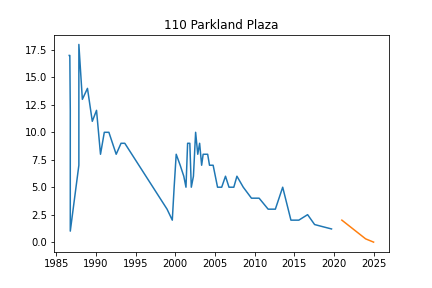
## 170 Aprill
`
Initiated AutoTS object with best model: 
GLS
{
  "fillna": "median",
  "transformations": {
    "0": "DifferencedTransformer",
    "1": "Log",
    "2": "RobustScaler",
    "3": "MaxAbsScaler"
  },
  "transformation_params": {
    "0": {},
    "1": {},
    "2": {},
    "3": {}
  }
}
{}
`

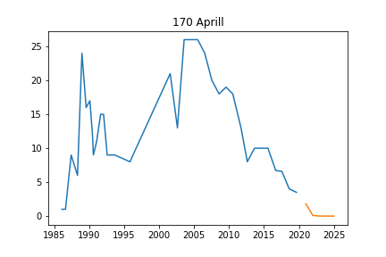
## 175 Jackson Plaza
`
Initiated AutoTS object with best model: 
ETS
{
  "fillna": "zero",
  "transformations": {
    "0": "ClipOutliers",
    "1": "ClipOutliers"
  },
  "transformation_params": {
    "0": {
      "method": "clip",
      "std_threshold": 2,
      "fillna": null
    },
    "1": {
      "method": "clip",
      "std_threshold": 4,
      "fillna": null
    }
  }
}
{
  "damped_trend": false,
  "trend": null,
  "seasonal": null,
  "seasonal_periods": null
}
`

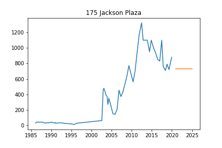
## 2575 Valley
`
Initiated AutoTS object with best model: 
UnobservedComponents
{
  "fillna": "median",
  "transformations": {
    "0": "Discretize",
    "1": "Round",
    "2": "DifferencedTransformer",
    "3": "StandardScaler",
    "4": "RollingMeanTransformer"
  },
  "transformation_params": {
    "0": {
      "discretization": "lower",
      "n_bins": 10
    },
    "1": {
      "model": "middle",
      "decimals": 2,
      "on_transform": false,
      "on_inverse": true
    },
    "2": {},
    "3": {},
    "4": {
      "fixed": false,
      "window": 12
    }
  }
}
{
  "level": false,
  "trend": false,
  "cycle": true,
  "damped_cycle": false,
  "irregular": false,
  "stochastic_trend": true,
  "stochastic_level": true,
  "stochastic_cycle": true,
  "regression_type": null
}
`

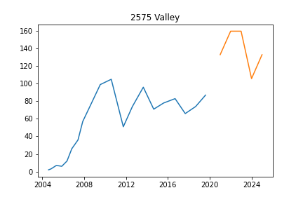
## 2643 Dexter Rd
`
Initiated AutoTS object with best model: 
Ensemble
{}
{
  "model_name": "BestN",
  "model_count": 3,
  "model_metric": "best_score_unique",
  "models": {
    "95564026d3982f0df3b03cfa503b81ed": {
      "Model": "LastValueNaive",
      "ModelParameters": {},
      "TransformationParameters": {
        "fillna": "fake_date",
        "transformations": {
          "0": "ClipOutliers",
          "1": "QuantileTransformer",
          "2": "Detrend",
          "3": "QuantileTransformer",
          "4": "PowerTransformer",
          "5": "DifferencedTransformer"
        },
        "transformation_params": {
          "0": {
            "method": "clip",
            "std_threshold": 4,
            "fillna": null
          },
          "1": {
            "output_distribution": "uniform",
            "n_quantiles": 2
          },
          "2": {
            "model": "Linear"
          },
          "3": {
            "output_distribution": "uniform",
            "n_quantiles": 2
          },
          "4": {},
          "5": {}
        }
      }
    },
    "b5e6658525537aab33458724c144d6e1": {
      "Model": "UnobservedComponents",
      "ModelParameters": {
        "level": true,
        "trend": true,
        "cycle": false,
        "damped_cycle": false,
        "irregular": true,
        "stochastic_trend": false,
        "stochastic_level": false,
        "stochastic_cycle": false,
        "regression_type": null
      },
      "TransformationParameters": {
        "fillna": "fake_date",
        "transformations": {
          "0": "ClipOutliers",
          "1": "PowerTransformer",
          "2": "Detrend",
          "3": "Round",
          "4": "DifferencedTransformer"
        },
        "transformation_params": {
          "0": {
            "method": "clip",
            "std_threshold": 4,
            "fillna": null
          },
          "1": {},
          "2": {
            "model": "Linear"
          },
          "3": {
            "model": "middle",
            "decimals": 0,
            "on_transform": true,
            "on_inverse": false
          },
          "4": {}
        }
      }
    },
    "9a9c4914e083278e4b20076d1822f372": {
      "Model": "ZeroesNaive",
      "ModelParameters": {},
      "TransformationParameters": {
        "fillna": "fake_date",
        "transformations": {
          "0": "ClipOutliers",
          "1": "PowerTransformer",
          "2": "Detrend",
          "3": "DifferencedTransformer",
          "4": "Discretize"
        },
        "transformation_params": {
          "0": {
            "method": "clip",
            "std_threshold": 4,
            "fillna": null
          },
          "1": {},
          "2": {
            "model": "Linear"
          },
          "3": {},
          "4": {
            "discretization": "upper",
            "n_bins": 5
          }
        }
      }
    }
  }
}
`

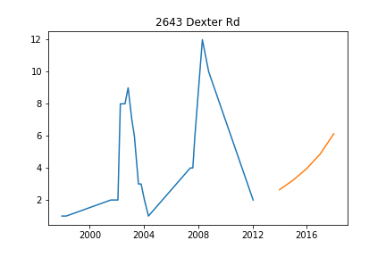
## 2652 Dexter Rd
`
Initiated AutoTS object with best model: 
DatepartRegression
{
  "fillna": "ffill",
  "transformations": {
    "0": "ClipOutliers",
    "1": "bkfilter",
    "2": "PowerTransformer"
  },
  "transformation_params": {
    "0": {
      "method": "clip",
      "std_threshold": 1,
      "fillna": null
    },
    "1": {},
    "2": {}
  }
}
{
  "regression_model": {
    "model": "SVM",
    "model_params": {}
  },
  "datepart_method": "expanded",
  "regression_type": null
}
`

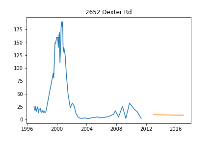
## 2700 Dexter Rd
`
Initiated AutoTS object with best model: 
DatepartRegression
{
  "fillna": "fake_date",
  "transformations": {
    "0": "Discretize",
    "1": "PowerTransformer",
    "2": "Detrend",
    "3": "PowerTransformer",
    "4": "Discretize",
    "5": "CumSumTransformer"
  },
  "transformation_params": {
    "0": {
      "discretization": "lower",
      "n_bins": 20
    },
    "1": {},
    "2": {
      "model": "Linear"
    },
    "3": {},
    "4": {
      "discretization": "upper",
      "n_bins": 5
    },
    "5": {}
  }
}
{
  "regression_model": {
    "model": "Adaboost",
    "model_params": {
      "n_estimators": 100,
      "loss": "linear",
      "base_estimator": "DecisionTree",
      "learning_rate": 1.0
    }
  },
  "datepart_method": "expanded",
  "regression_type": null
}
`

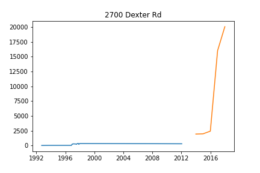
## 2805 Dexter Rd
`
Initiated AutoTS object with best model: 
AverageValueNaive
{
  "fillna": "fake_date",
  "transformations": {
    "0": "DifferencedTransformer",
    "1": "PowerTransformer",
    "2": "PowerTransformer",
    "3": "StandardScaler"
  },
  "transformation_params": {
    "0": {},
    "1": {},
    "2": {},
    "3": {}
  }
}
{
  "method": "Mean"
}
`

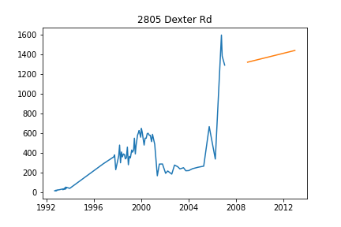
## 2819 Dexter Rd
`
Initiated AutoTS object with best model: 
ETS
{
  "fillna": "ffill_mean_biased",
  "transformations": {
    "0": "DifferencedTransformer"
  },
  "transformation_params": {
    "0": {}
  }
}
{
  "damped_trend": false,
  "trend": null,
  "seasonal": null,
  "seasonal_periods": null
}
`

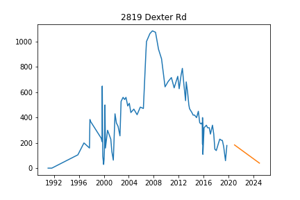
## 305 Pinewood
`
Initiated AutoTS object with best model: 
Ensemble
{}
{
  "model_name": "BestN",
  "model_count": 3,
  "model_metric": "mixed_metric",
  "models": {
    "59bf20c19a90a049c099ef42ffd76877": {
      "Model": "ETS",
      "ModelParameters": {
        "damped_trend": false,
        "trend": null,
        "seasonal": null,
        "seasonal_periods": null
      },
      "TransformationParameters": {
        "fillna": "fake_date",
        "transformations": {
          "0": "ClipOutliers",
          "1": "IntermittentOccurrence"
        },
        "transformation_params": {
          "0": {
            "method": "clip",
            "std_threshold": 3,
            "fillna": null
          },
          "1": {
            "center": "mean"
          }
        }
      }
    },
    "896c8e52a649bf7793ec390cbb880fa4": {
      "Model": "ETS",
      "ModelParameters": {
        "damped_trend": false,
        "trend": "multiplicative",
        "seasonal": null,
        "seasonal_periods": null
      },
      "TransformationParameters": {
        "fillna": "fake_date",
        "transformations": {
          "0": "ClipOutliers",
          "1": "IntermittentOccurrence",
          "2": "Discretize"
        },
        "transformation_params": {
          "0": {
            "method": "clip",
            "std_threshold": 3,
            "fillna": null
          },
          "1": {
            "center": "mean"
          },
          "2": {
            "discretization": "lower",
            "n_bins": 20
          }
        }
      }
    },
    "c18302e137c85d68ee391ed552069e19": {
      "Model": "DatepartRegression",
      "ModelParameters": {
        "regression_model": {
          "model": "HistGradientBoost",
          "model_params": {
            "loss": "poisson",
            "learning_rate": 1.0
          }
        },
        "datepart_method": "expanded",
        "regression_type": null
      },
      "TransformationParameters": {
        "fillna": "zero",
        "transformations": {
          "0": "MinMaxScaler",
          "1": "DifferencedTransformer",
          "2": "IntermittentOccurrence",
          "3": "DifferencedTransformer"
        },
        "transformation_params": {
          "0": {},
          "1": {},
          "2": {
            "center": "mean"
          },
          "3": {}
        }
      }
    }
  }
}
`

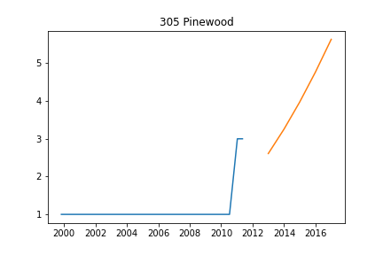
## 3245 Kingwood
`
Initiated AutoTS object with best model: 
FBProphet
{
  "fillna": "ffill",
  "transformations": {
    "0": "PctChangeTransformer",
    "1": "SeasonalDifference",
    "2": "StandardScaler",
    "3": "DifferencedTransformer"
  },
  "transformation_params": {
    "0": {},
    "1": {
      "lag_1": 7,
      "method": "Mean"
    },
    "2": {},
    "3": {}
  }
}
{
  "holiday": false,
  "regression_type": null
}
`

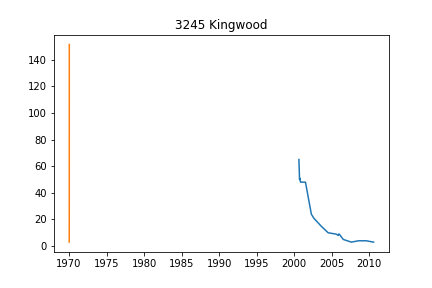
## 333 Jackson Plaza
`
Initiated AutoTS object with best model: 
Ensemble
{}
{
  "model_name": "BestN",
  "model_count": 3,
  "model_metric": "best_score",
  "models": {
    "e7345c762863059c9a1a53ce8992ea3c": {
      "Model": "GLM",
      "ModelParameters": {
        "family": "Binomial",
        "constant": false,
        "regression_type": "datepart"
      },
      "TransformationParameters": {
        "fillna": "rolling_mean",
        "transformations": {
          "0": "PctChangeTransformer",
          "1": "MinMaxScaler"
        },
        "transformation_params": {
          "0": {},
          "1": {}
        }
      }
    },
    "5cf9d66e26e7454c66f0f634bc9e5c83": {
      "Model": "WindowRegression",
      "ModelParameters": {
        "window_size": 5,
        "regression_model": {
          "model": "MLP",
          "model_params": {
            "hidden_layer_sizes": [
              100
            ],
            "max_iter": 250,
            "activation": "tanh",
            "solver": "lbfgs",
            "early_stopping": false,
            "learning_rate_init": 0.001
          }
        },
        "input_dim": "univariate",
        "output_dim": "forecast_length",
        "normalize_window": false,
        "shuffle": true,
        "max_windows": 5000
      },
      "TransformationParameters": {
        "fillna": "rolling_mean",
        "transformations": {
          "0": "PctChangeTransformer",
          "1": "PowerTransformer",
          "2": "RobustScaler",
          "3": "QuantileTransformer",
          "4": "Round"
        },
        "transformation_params": {
          "0": {},
          "1": {},
          "2": {},
          "3": {
            "output_distribution": "normal",
            "n_quantiles": 20
          },
          "4": {
            "model": "middle",
            "decimals": -1,
            "on_transform": true,
            "on_inverse": true
          }
        }
      }
    },
    "1fa4520f07d4afc14e9d807450420a67": {
      "Model": "ZeroesNaive",
      "ModelParameters": {},
      "TransformationParameters": {
        "fillna": "rolling_mean",
        "transformations": {
          "0": "PctChangeTransformer",
          "1": "MinMaxScaler",
          "2": "Discretize",
          "3": "RobustScaler",
          "4": "QuantileTransformer"
        },
        "transformation_params": {
          "0": {},
          "1": {},
          "2": {
            "discretization": "center",
            "n_bins": 20
          },
          "3": {},
          "4": {
            "output_distribution": "normal",
            "n_quantiles": 20
          }
        }
      }
    }
  }
}
`

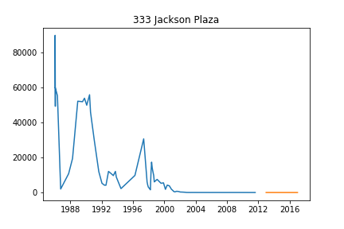
## 3365 Jackson Rd
`
Initiated AutoTS object with best model: 
LastValueNaive
{
  "fillna": "median",
  "transformations": {
    "0": "ClipOutliers",
    "1": "PowerTransformer",
    "2": "Detrend",
    "3": "PowerTransformer"
  },
  "transformation_params": {
    "0": {
      "method": "clip",
      "std_threshold": 3,
      "fillna": null
    },
    "1": {},
    "2": {
      "model": "Linear"
    },
    "3": {}
  }
}
{}
`

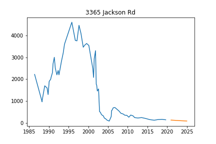
## 350 Rose
`
Initiated AutoTS object with best model: 
Ensemble
{}
{
  "model_name": "BestN",
  "model_count": 3,
  "model_metric": "mixed_metric",
  "models": {
    "81ee17c8edbbfef6156d5dbe7f5a466b": {
      "Model": "FBProphet",
      "ModelParameters": {
        "holiday": true,
        "regression_type": null
      },
      "TransformationParameters": {
        "fillna": "rolling_mean_24",
        "transformations": {
          "0": "MinMaxScaler",
          "1": "Detrend",
          "2": "SeasonalDifference",
          "3": "MaxAbsScaler",
          "4": "StandardScaler"
        },
        "transformation_params": {
          "0": {},
          "1": {
            "model": "Linear"
          },
          "2": {
            "lag_1": 12,
            "method": "Median"
          },
          "3": {},
          "4": {}
        }
      }
    },
    "2384f8753155e4fe21073217010a9a89": {
      "Model": "FBProphet",
      "ModelParameters": {
        "holiday": true,
        "regression_type": null
      },
      "TransformationParameters": {
        "fillna": "rolling_mean_24",
        "transformations": {
          "0": "MinMaxScaler",
          "1": "Detrend",
          "2": "Detrend"
        },
        "transformation_params": {
          "0": {},
          "1": {
            "model": "Linear"
          },
          "2": {
            "model": "Linear"
          }
        }
      }
    },
    "7a37254bb26fdd15660ed865e84a8690": {
      "Model": "FBProphet",
      "ModelParameters": {
        "holiday": false,
        "regression_type": null
      },
      "TransformationParameters": {
        "fillna": "median",
        "transformations": {
          "0": "RollingMeanTransformer",
          "1": "RobustScaler",
          "2": "Detrend"
        },
        "transformation_params": {
          "0": {
            "fixed": true,
            "window": 3
          },
          "1": {},
          "2": {
            "model": "Linear"
          }
        }
      }
    }
  }
}
`

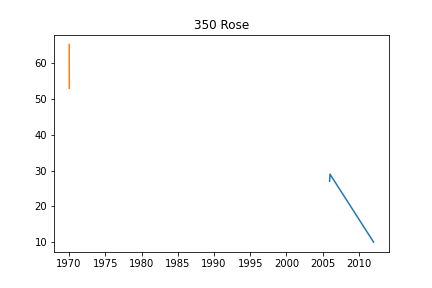
## 354 Pinewood
`
Initiated AutoTS object with best model: 
GLM
{
  "fillna": "fake_date",
  "transformations": {
    "0": "Round",
    "1": "Round"
  },
  "transformation_params": {
    "0": {
      "model": "middle",
      "decimals": 1,
      "on_transform": false,
      "on_inverse": true
    },
    "1": {
      "model": "middle",
      "decimals": 0,
      "on_transform": false,
      "on_inverse": true
    }
  }
}
{
  "family": "NegativeBinomial",
  "constant": false,
  "regression_type": "datepart"
}
`

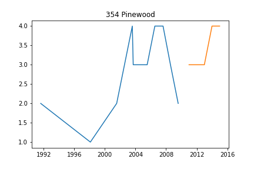
## 3563 Elizabeth Rd
`
Initiated AutoTS object with best model: 
Ensemble
{}
{
  "model_name": "BestN",
  "model_count": 3,
  "model_metric": "mixed_metric",
  "models": {
    "dff9733e8ec3b4bea69698a167696781": {
      "Model": "AverageValueNaive",
      "ModelParameters": {
        "method": "Mean"
      },
      "TransformationParameters": {
        "fillna": "mean",
        "transformations": {
          "0": "ClipOutliers",
          "1": "QuantileTransformer",
          "2": "DifferencedTransformer"
        },
        "transformation_params": {
          "0": {
            "method": "clip",
            "std_threshold": 3,
            "fillna": null
          },
          "1": {
            "output_distribution": "uniform",
            "n_quantiles": 6
          },
          "2": {}
        }
      }
    },
    "c027d5541c5cba2389a8ccaee0479e26": {
      "Model": "DatepartRegression",
      "ModelParameters": {
        "regression_model": {
          "model": "Adaboost",
          "model_params": {
            "n_estimators": 100,
            "loss": "exponential",
            "base_estimator": "LinReg",
            "learning_rate": 1.0
          }
        },
        "datepart_method": "recurring",
        "regression_type": null
      },
      "TransformationParameters": {
        "fillna": "fake_date",
        "transformations": {
          "0": "DifferencedTransformer"
        },
        "transformation_params": {
          "0": {}
        }
      }
    },
    "90b2ed1d9febaa3cea910fd7c9f799d4": {
      "Model": "ETS",
      "ModelParameters": {
        "damped_trend": false,
        "trend": null,
        "seasonal": null,
        "seasonal_periods": null
      },
      "TransformationParameters": {
        "fillna": "mean",
        "transformations": {
          "0": "PowerTransformer",
          "1": "SeasonalDifference",
          "2": "MinMaxScaler"
        },
        "transformation_params": {
          "0": {},
          "1": {
            "lag_1": 7,
            "method": "Mean"
          },
          "2": {}
        }
      }
    }
  }
}
`

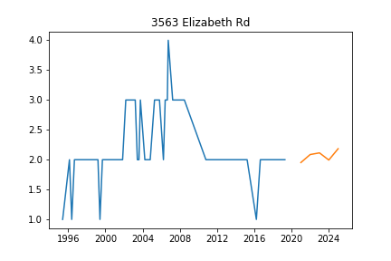
## 373 Pinewood Shallow
`
Initiated AutoTS object with best model: 
Ensemble
{}
{
  "model_name": "BestN",
  "model_count": 3,
  "model_metric": "best_score",
  "models": {
    "e235d716be05db447563b16819375f94": {
      "Model": "UnobservedComponents",
      "ModelParameters": {
        "level": false,
        "trend": false,
        "cycle": false,
        "damped_cycle": false,
        "irregular": true,
        "stochastic_trend": false,
        "stochastic_level": true,
        "stochastic_cycle": false,
        "regression_type": null
      },
      "TransformationParameters": {
        "fillna": "ffill_mean_biased",
        "transformations": {
          "0": "QuantileTransformer",
          "1": "Detrend",
          "2": "Discretize",
          "3": "DifferencedTransformer",
          "4": "PowerTransformer"
        },
        "transformation_params": {
          "0": {
            "output_distribution": "uniform",
            "n_quantiles": 8
          },
          "1": {
            "model": "Linear"
          },
          "2": {
            "discretization": "lower",
            "n_bins": 20
          },
          "3": {},
          "4": {}
        }
      }
    },
    "e155e240e2f80d2457cfee65dc3081bf": {
      "Model": "UnobservedComponents",
      "ModelParameters": {
        "level": false,
        "trend": false,
        "cycle": false,
        "damped_cycle": false,
        "irregular": true,
        "stochastic_trend": false,
        "stochastic_level": true,
        "stochastic_cycle": true,
        "regression_type": null
      },
      "TransformationParameters": {
        "fillna": "ffill_mean_biased",
        "transformations": {
          "0": "QuantileTransformer",
          "1": "Detrend",
          "2": "Discretize",
          "3": "DifferencedTransformer",
          "4": "PowerTransformer"
        },
        "transformation_params": {
          "0": {
            "output_distribution": "uniform",
            "n_quantiles": 8
          },
          "1": {
            "model": "Linear"
          },
          "2": {
            "discretization": "lower",
            "n_bins": 20
          },
          "3": {},
          "4": {}
        }
      }
    },
    "f5dba99150defbbdb9be1d62364562ac": {
      "Model": "UnobservedComponents",
      "ModelParameters": {
        "level": true,
        "trend": false,
        "cycle": true,
        "damped_cycle": false,
        "irregular": false,
        "stochastic_trend": false,
        "stochastic_level": false,
        "stochastic_cycle": false,
        "regression_type": "Holiday"
      },
      "TransformationParameters": {
        "fillna": "ffill_mean_biased",
        "transformations": {
          "0": "QuantileTransformer",
          "1": "Detrend",
          "2": "Discretize",
          "3": "DifferencedTransformer",
          "4": "PowerTransformer"
        },
        "transformation_params": {
          "0": {
            "output_distribution": "uniform",
            "n_quantiles": 8
          },
          "1": {
            "model": "Linear"
          },
          "2": {
            "discretization": "lower",
            "n_bins": 20
          },
          "3": {},
          "4": {}
        }
      }
    }
  }
}
`

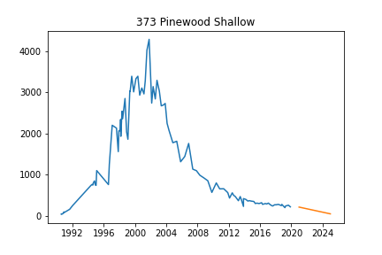
## 4141 Jackson Rd
`
Initiated AutoTS object with best model: 
GLS
{
  "fillna": "rolling_mean_24",
  "transformations": {
    "0": "ClipOutliers",
    "1": "ClipOutliers",
    "2": "Detrend",
    "3": "DifferencedTransformer",
    "4": "Discretize"
  },
  "transformation_params": {
    "0": {
      "method": "clip",
      "std_threshold": 4,
      "fillna": null
    },
    "1": {
      "method": "clip",
      "std_threshold": 2,
      "fillna": null
    },
    "2": {
      "model": "Linear"
    },
    "3": {},
    "4": {
      "discretization": "lower",
      "n_bins": 10
    }
  }
}
{}
`

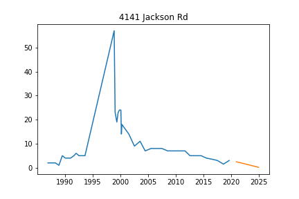
## 420 Parkwood
`
Initiated AutoTS object with best model: 
Ensemble
{}
{
  "model_name": "BestN",
  "model_count": 3,
  "model_metric": "mixed_metric",
  "models": {
    "4449778ad61ee0bf522974fd23d12192": {
      "Model": "GLM",
      "ModelParameters": {
        "family": "Poisson",
        "constant": false,
        "regression_type": "datepart"
      },
      "TransformationParameters": {
        "fillna": "ffill_mean_biased",
        "transformations": {
          "0": "PowerTransformer",
          "1": "MaxAbsScaler",
          "2": "SeasonalDifference"
        },
        "transformation_params": {
          "0": {},
          "1": {},
          "2": {
            "lag_1": 12,
            "method": "LastValue"
          }
        }
      }
    },
    "18a8e43367eef4f2a556557586452c92": {
      "Model": "DatepartRegression",
      "ModelParameters": {
        "regression_model": {
          "model": "MLP",
          "model_params": {
            "hidden_layer_sizes": [
              25,
              50,
              25
            ],
            "max_iter": 250,
            "activation": "tanh",
            "solver": "adam",
            "early_stopping": true,
            "learning_rate_init": 0.01
          }
        },
        "datepart_method": "recurring",
        "regression_type": null
      },
      "TransformationParameters": {
        "fillna": "ffill_mean_biased",
        "transformations": {
          "0": "Log",
          "1": "Discretize",
          "2": "SeasonalDifference"
        },
        "transformation_params": {
          "0": {},
          "1": {
            "discretization": "center",
            "n_bins": 5
          },
          "2": {
            "lag_1": 12,
            "method": "Median"
          }
        }
      }
    },
    "585f48836ebd6642e8d25316372b9069": {
      "Model": "GLM",
      "ModelParameters": {
        "family": "Gaussian",
        "constant": false,
        "regression_type": "datepart"
      },
      "TransformationParameters": {
        "fillna": "ffill_mean_biased",
        "transformations": {
          "0": "Discretize",
          "1": "StandardScaler",
          "2": "StandardScaler",
          "3": "PositiveShift",
          "4": "PctChangeTransformer"
        },
        "transformation_params": {
          "0": {
            "discretization": "lower",
            "n_bins": 5
          },
          "1": {},
          "2": {},
          "3": {},
          "4": {}
        }
      }
    }
  }
}
`

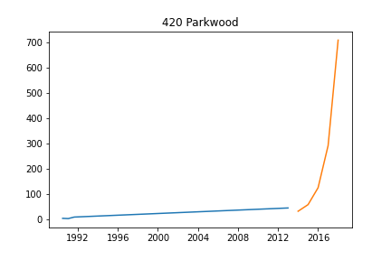
## 430 Barber East
`
Initiated AutoTS object with best model: 
LastValueNaive
{
  "fillna": "mean",
  "transformations": {
    "0": "DifferencedTransformer",
    "1": "SeasonalDifference",
    "2": "PowerTransformer"
  },
  "transformation_params": {
    "0": {},
    "1": {
      "lag_1": 7,
      "method": "Mean"
    },
    "2": {}
  }
}
{}
`

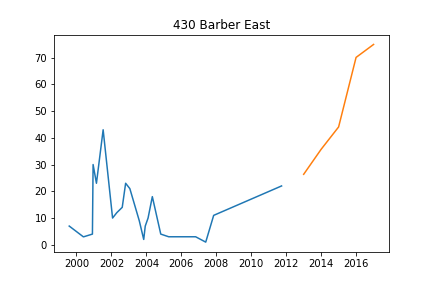
## 430 Barber West
`
Initiated AutoTS object with best model: 
ETS
{
  "fillna": "ffill",
  "transformations": {
    "0": "ClipOutliers",
    "1": "IntermittentOccurrence",
    "2": "StandardScaler"
  },
  "transformation_params": {
    "0": {
      "method": "clip",
      "std_threshold": 1,
      "fillna": null
    },
    "1": {
      "center": "mean"
    },
    "2": {}
  }
}
{
  "damped_trend": false,
  "trend": null,
  "seasonal": null,
  "seasonal_periods": null
}
`

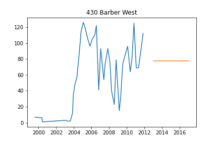
## 435 Barber
`
Initiated AutoTS object with best model: 
LastValueNaive
{
  "fillna": "rolling_mean_24",
  "transformations": {
    "0": "ClipOutliers",
    "1": "PositiveShift",
    "2": "Detrend",
    "3": "PositiveShift"
  },
  "transformation_params": {
    "0": {
      "method": "clip",
      "std_threshold": 3.5,
      "fillna": null
    },
    "1": {},
    "2": {
      "model": "Linear"
    },
    "3": {}
  }
}
{}
`

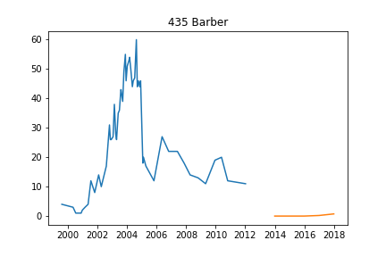
## 440 Clarendon
`
Initiated AutoTS object with best model: 
Ensemble
{}
{
  "model_name": "BestN",
  "model_count": 3,
  "model_metric": "mixed_metric",
  "models": {
    "f67da678bcbaf6f27b5f41396a05d516": {
      "Model": "GLM",
      "ModelParameters": {
        "family": "Tweedie",
        "constant": false,
        "regression_type": "datepart"
      },
      "TransformationParameters": {
        "fillna": "mean",
        "transformations": {
          "0": "PowerTransformer",
          "1": "Discretize",
          "2": "RobustScaler"
        },
        "transformation_params": {
          "0": {},
          "1": {
            "discretization": "lower",
            "n_bins": 5
          },
          "2": {}
        }
      }
    },
    "1c8a484add63ecb78cc2003cf1eec622": {
      "Model": "GLM",
      "ModelParameters": {
        "family": "Tweedie",
        "constant": false,
        "regression_type": "datepart"
      },
      "TransformationParameters": {
        "fillna": "median",
        "transformations": {
          "0": "PowerTransformer",
          "1": "Discretize",
          "2": "RobustScaler"
        },
        "transformation_params": {
          "0": {},
          "1": {
            "discretization": "center",
            "n_bins": 20
          },
          "2": {}
        }
      }
    },
    "1ae998852e09210261cf211b14a65a27": {
      "Model": "DatepartRegression",
      "ModelParameters": {
        "regression_model": {
          "model": "DecisionTree",
          "model_params": {
            "max_depth": 3,
            "min_samples_split": 1.0
          }
        },
        "datepart_method": "simple",
        "regression_type": null
      },
      "TransformationParameters": {
        "fillna": "mean",
        "transformations": {
          "0": "ClipOutliers",
          "1": "Discretize",
          "2": "DifferencedTransformer"
        },
        "transformation_params": {
          "0": {
            "method": "clip",
            "std_threshold": 3,
            "fillna": null
          },
          "1": {
            "discretization": "lower",
            "n_bins": 5
          },
          "2": {}
        }
      }
    }
  }
}
`

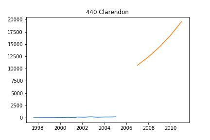
## 4401 Park West
`
Initiated AutoTS object with best model: 
ETS
{
  "fillna": "rolling_mean",
  "transformations": {
    "0": "bkfilter",
    "1": "PowerTransformer"
  },
  "transformation_params": {
    "0": {},
    "1": {}
  }
}
{
  "damped_trend": false,
  "trend": null,
  "seasonal": null,
  "seasonal_periods": null
}
`

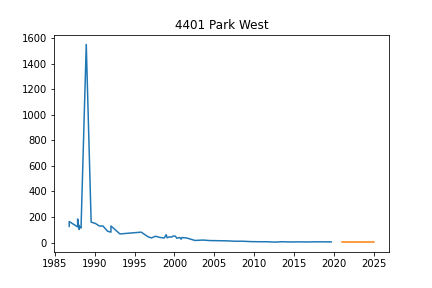
## 441 Parkwood
`
Initiated AutoTS object with best model: 
DatepartRegression
{
  "fillna": "rolling_mean",
  "transformations": {
    "0": "ClipOutliers",
    "1": "PowerTransformer",
    "2": "Detrend",
    "3": "bkfilter",
    "4": "Discretize"
  },
  "transformation_params": {
    "0": {
      "method": "clip",
      "std_threshold": 2,
      "fillna": null
    },
    "1": {},
    "2": {
      "model": "Linear"
    },
    "3": {},
    "4": {
      "discretization": "upper",
      "n_bins": 10
    }
  }
}
{
  "regression_model": {
    "model": "Adaboost",
    "model_params": {
      "n_estimators": 100,
      "loss": "linear",
      "base_estimator": "DecisionTree",
      "learning_rate": 1.0
    }
  },
  "datepart_method": "simple",
  "regression_type": null
}
`

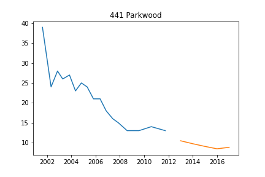
## 453 Dupont
`
Initiated AutoTS object with best model: 
ETS
{
  "fillna": "fake_date",
  "transformations": {
    "0": "ClipOutliers",
    "1": "PowerTransformer",
    "2": "Discretize"
  },
  "transformation_params": {
    "0": {
      "method": "clip",
      "std_threshold": 4,
      "fillna": null
    },
    "1": {},
    "2": {
      "discretization": "upper",
      "n_bins": 20
    }
  }
}
{
  "damped_trend": false,
  "trend": null,
  "seasonal": null,
  "seasonal_periods": null
}
`

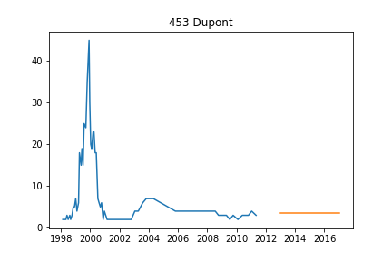
## 456 Clarendon
`
Initiated AutoTS object with best model: 
LastValueNaive
{
  "fillna": "ffill_mean_biased",
  "transformations": {
    "0": "ClipOutliers"
  },
  "transformation_params": {
    "0": {
      "method": "clip",
      "std_threshold": 1,
      "fillna": null
    }
  }
}
{}
`

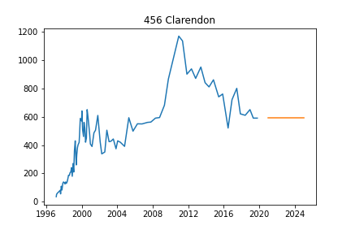
## 4601 Park 4 inch
`
Initiated AutoTS object with best model: 
ZeroesNaive
{
  "fillna": "mean",
  "transformations": {
    "0": "ClipOutliers",
    "1": "RobustScaler"
  },
  "transformation_params": {
    "0": {
      "method": "clip",
      "std_threshold": 1,
      "fillna": null
    },
    "1": {}
  }
}
{}
`

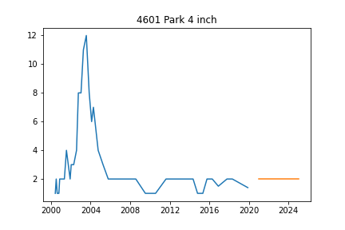
## 4601 Park 6 inch
`
Initiated AutoTS object with best model: 
AverageValueNaive
{
  "fillna": "rolling_mean",
  "transformations": {
    "0": "MinMaxScaler",
    "1": "Detrend"
  },
  "transformation_params": {
    "0": {},
    "1": {
      "model": "Linear"
    }
  }
}
{
  "method": "Mode"
}
`

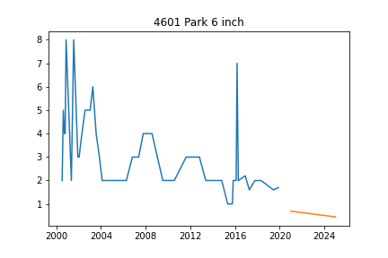
## 465 Dupont
`
Initiated AutoTS object with best model: 
AverageValueNaive
{
  "fillna": "fake_date",
  "transformations": {
    "0": "ClipOutliers",
    "1": "SinTrend"
  },
  "transformation_params": {
    "0": {
      "method": "clip",
      "std_threshold": 3.5,
      "fillna": null
    },
    "1": {}
  }
}
{
  "method": "Mean"
}
`

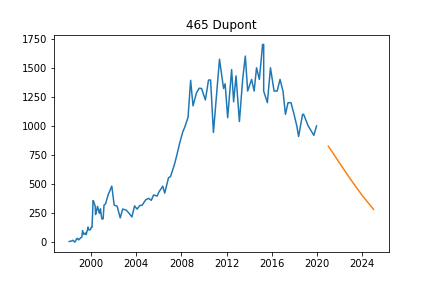
## 4742 Park Rd
`
Initiated AutoTS object with best model: 
UnobservedComponents
{
  "fillna": "mean",
  "transformations": {
    "0": "ClipOutliers",
    "1": "PowerTransformer",
    "2": "Detrend",
    "3": "DifferencedTransformer"
  },
  "transformation_params": {
    "0": {
      "method": "clip",
      "std_threshold": 3,
      "fillna": null
    },
    "1": {},
    "2": {
      "model": "Linear"
    },
    "3": {}
  }
}
{
  "level": true,
  "trend": true,
  "cycle": false,
  "damped_cycle": false,
  "irregular": true,
  "stochastic_trend": false,
  "stochastic_level": false,
  "stochastic_cycle": true,
  "regression_type": null
}
`

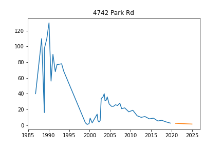
## 476 Barber
`
Initiated AutoTS object with best model: 
Ensemble
{}
{
  "model_name": "BestN",
  "model_count": 3,
  "model_metric": "mixed_metric",
  "models": {
    "b8b4b0dda7914da650b6498a5ee5740c": {
      "Model": "ZeroesNaive",
      "ModelParameters": {},
      "TransformationParameters": {
        "fillna": "fake_date",
        "transformations": {
          "0": "ClipOutliers",
          "1": "CumSumTransformer",
          "2": "Detrend"
        },
        "transformation_params": {
          "0": {
            "method": "clip",
            "std_threshold": 4,
            "fillna": null
          },
          "1": {},
          "2": {
            "model": "Linear"
          }
        }
      }
    },
    "a0093944d83e973b97b606faa87958e7": {
      "Model": "DatepartRegression",
      "ModelParameters": {
        "regression_model": {
          "model": "MLP",
          "model_params": {
            "hidden_layer_sizes": [
              25,
              15,
              25
            ],
            "max_iter": 250,
            "activation": "tanh",
            "solver": "sgd",
            "early_stopping": false,
            "learning_rate_init": 0.001
          }
        },
        "datepart_method": "simple",
        "regression_type": null
      },
      "TransformationParameters": {
        "fillna": "mean",
        "transformations": {
          "0": "RollingMean100thN",
          "1": "MaxAbsScaler",
          "2": "DifferencedTransformer"
        },
        "transformation_params": {
          "0": {},
          "1": {},
          "2": {}
        }
      }
    },
    "8ce4f78c3fe31489e1cd754640056adb": {
      "Model": "GLM",
      "ModelParameters": {
        "family": "NegativeBinomial",
        "constant": false,
        "regression_type": "datepart"
      },
      "TransformationParameters": {
        "fillna": "ffill",
        "transformations": {
          "0": "ClipOutliers",
          "1": "DifferencedTransformer"
        },
        "transformation_params": {
          "0": {
            "method": "clip",
            "std_threshold": 2,
            "fillna": null
          },
          "1": {}
        }
      }
    }
  }
}
`

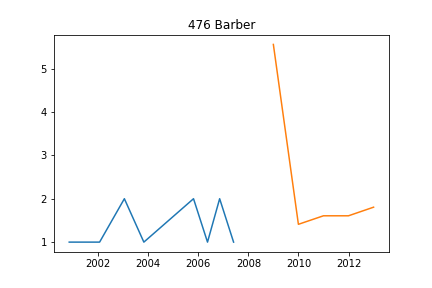
## 5005 Jackson Rd
`
Initiated AutoTS object with best model: 
AverageValueNaive
{
  "fillna": "ffill",
  "transformations": {
    "0": "MinMaxScaler",
    "1": "DifferencedTransformer",
    "2": "MinMaxScaler"
  },
  "transformation_params": {
    "0": {},
    "1": {},
    "2": {}
  }
}
{
  "method": "Mean"
}
`

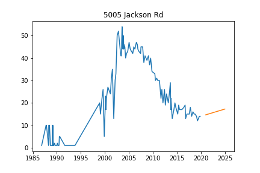
## 544 Allison
`
Initiated AutoTS object with best model: 
FBProphet
{
  "fillna": "ffill_mean_biased",
  "transformations": {
    "0": "ClipOutliers",
    "1": "RollingMeanTransformer"
  },
  "transformation_params": {
    "0": {
      "method": "clip",
      "std_threshold": 2,
      "fillna": null
    },
    "1": {
      "fixed": true,
      "window": 10
    }
  }
}
{
  "holiday": true,
  "regression_type": null
}
`

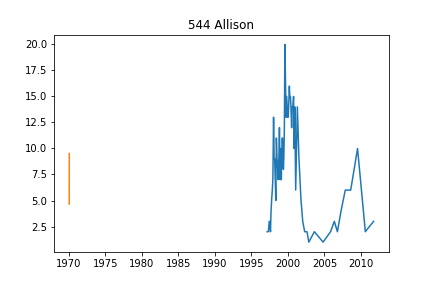
## 545 Allison
`
Initiated AutoTS object with best model: 
Ensemble
{}
{
  "model_name": "BestN",
  "model_count": 3,
  "model_metric": "mixed_metric",
  "models": {
    "627badd275bfb1d5e1575595507ad822": {
      "Model": "DatepartRegression",
      "ModelParameters": {
        "regression_model": {
          "model": "Adaboost",
          "model_params": {
            "n_estimators": 50,
            "loss": "square",
            "base_estimator": "LinReg",
            "learning_rate": 1.0
          }
        },
        "datepart_method": "expanded",
        "regression_type": null
      },
      "TransformationParameters": {
        "fillna": "zero",
        "transformations": {
          "0": "ClipOutliers",
          "1": "PowerTransformer",
          "2": "Detrend",
          "3": "DifferencedTransformer"
        },
        "transformation_params": {
          "0": {
            "method": "clip",
            "std_threshold": 3.5,
            "fillna": null
          },
          "1": {},
          "2": {
            "model": "Linear"
          },
          "3": {}
        }
      }
    },
    "a4f6ccf420af934751c83f25a3e7f181": {
      "Model": "DatepartRegression",
      "ModelParameters": {
        "regression_model": {
          "model": "DecisionTree",
          "model_params": {
            "max_depth": 3,
            "min_samples_split": 0.05
          }
        },
        "datepart_method": "simple",
        "regression_type": null
      },
      "TransformationParameters": {
        "fillna": "zero",
        "transformations": {
          "0": "ClipOutliers",
          "1": "PowerTransformer",
          "2": "DifferencedTransformer"
        },
        "transformation_params": {
          "0": {
            "method": "clip",
            "std_threshold": 3.5,
            "fillna": null
          },
          "1": {},
          "2": {}
        }
      }
    },
    "039e83eb1ecd77a5b012ff60e0577ece": {
      "Model": "SeasonalNaive",
      "ModelParameters": {
        "method": "Median",
        "lag_1": 7,
        "lag_2": 24
      },
      "TransformationParameters": {
        "fillna": "zero",
        "transformations": {
          "0": "Discretize",
          "1": "DifferencedTransformer",
          "2": "Detrend"
        },
        "transformation_params": {
          "0": {
            "discretization": "lower",
            "n_bins": 5
          },
          "1": {},
          "2": {
            "model": "Linear"
          }
        }
      }
    }
  }
}
`

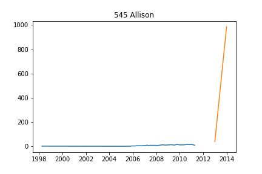
## 580 Allison
`
Initiated AutoTS object with best model: 
LastValueNaive
{
  "fillna": "rolling_mean_24",
  "transformations": {
    "0": "PositiveShift",
    "1": "SinTrend",
    "2": "bkfilter"
  },
  "transformation_params": {
    "0": {},
    "1": {},
    "2": {}
  }
}
{}
`

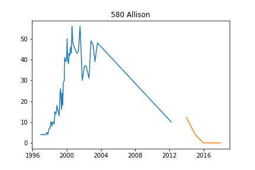
## 584 Allison
`
Initiated AutoTS object with best model: 
AverageValueNaive
{
  "fillna": "median",
  "transformations": {
    "0": "PowerTransformer",
    "1": "PowerTransformer",
    "2": "Round",
    "3": "Detrend",
    "4": "PowerTransformer",
    "5": "Round"
  },
  "transformation_params": {
    "0": {},
    "1": {},
    "2": {
      "model": "middle",
      "decimals": 0,
      "on_transform": false,
      "on_inverse": true
    },
    "3": {
      "model": "Linear"
    },
    "4": {},
    "5": {
      "model": "middle",
      "decimals": 1,
      "on_transform": true,
      "on_inverse": false
    }
  }
}
{
  "method": "Median"
}
`

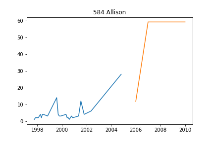
## 593 Allison
`
Initiated AutoTS object with best model: 
DatepartRegression
{
  "fillna": "mean",
  "transformations": {
    "0": "StandardScaler",
    "1": "DifferencedTransformer",
    "2": "SeasonalDifference",
    "3": "PowerTransformer"
  },
  "transformation_params": {
    "0": {},
    "1": {},
    "2": {
      "lag_1": 7,
      "method": "Median"
    },
    "3": {}
  }
}
{
  "regression_model": {
    "model": "DecisionTree",
    "model_params": {
      "max_depth": null,
      "min_samples_split": 1.0
    }
  },
  "datepart_method": "recurring",
  "regression_type": null
}
`

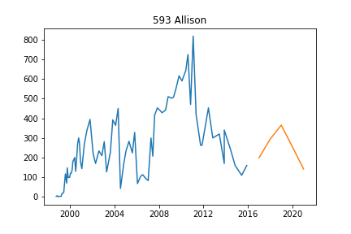
## 597 Allison
`
Initiated AutoTS object with best model: 
Ensemble
{}
{
  "model_name": "BestN",
  "model_count": 3,
  "model_metric": "mixed_metric",
  "models": {
    "397f1b2cceb067fdd4192d542ab5111c": {
      "Model": "UnobservedComponents",
      "ModelParameters": {
        "level": false,
        "trend": false,
        "cycle": true,
        "damped_cycle": false,
        "irregular": false,
        "stochastic_trend": false,
        "stochastic_level": false,
        "stochastic_cycle": false,
        "regression_type": null
      },
      "TransformationParameters": {
        "fillna": "fake_date",
        "transformations": {
          "0": "PctChangeTransformer",
          "1": "SeasonalDifference",
          "2": "Round"
        },
        "transformation_params": {
          "0": {},
          "1": {
            "lag_1": 12,
            "method": "LastValue"
          },
          "2": {
            "model": "middle",
            "decimals": -2,
            "on_transform": true,
            "on_inverse": false
          }
        }
      }
    },
    "4d974cedcbd18492437184212b14867a": {
      "Model": "ETS",
      "ModelParameters": {
        "damped_trend": false,
        "trend": "additive",
        "seasonal": null,
        "seasonal_periods": null
      },
      "TransformationParameters": {
        "fillna": "fake_date",
        "transformations": {
          "0": "MaxAbsScaler",
          "1": "PowerTransformer",
          "2": "Detrend"
        },
        "transformation_params": {
          "0": {},
          "1": {},
          "2": {
            "model": "Linear"
          }
        }
      }
    },
    "aaf9077c118d01eabd1e3694ce368bf3": {
      "Model": "ETS",
      "ModelParameters": {
        "damped_trend": true,
        "trend": "additive",
        "seasonal": null,
        "seasonal_periods": null
      },
      "TransformationParameters": {
        "fillna": "fake_date",
        "transformations": {
          "0": "MaxAbsScaler",
          "1": "PowerTransformer",
          "2": "Detrend"
        },
        "transformation_params": {
          "0": {},
          "1": {},
          "2": {
            "model": "Linear"
          }
        }
      }
    }
  }
}
`

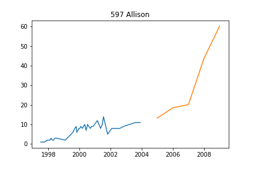
## 723 S. Wagner Road
`
Initiated AutoTS object with best model: 
Ensemble
{}
{
  "model_name": "BestN",
  "model_count": 3,
  "model_metric": "best_score",
  "models": {
    "ee6f78698a39d56dd501c0922e05da47": {
      "Model": "FBProphet",
      "ModelParameters": {
        "holiday": false,
        "regression_type": null
      },
      "TransformationParameters": {
        "fillna": "mean",
        "transformations": {
          "0": "PowerTransformer",
          "1": "DifferencedTransformer"
        },
        "transformation_params": {
          "0": {},
          "1": {}
        }
      }
    },
    "cf8f058dde4adf58781459467d0facdd": {
      "Model": "FBProphet",
      "ModelParameters": {
        "holiday": true,
        "regression_type": null
      },
      "TransformationParameters": {
        "fillna": "mean",
        "transformations": {
          "0": "PowerTransformer",
          "1": "DifferencedTransformer"
        },
        "transformation_params": {
          "0": {},
          "1": {}
        }
      }
    },
    "36e486c1a4617cc9be16385fdae7b081": {
      "Model": "FBProphet",
      "ModelParameters": {
        "holiday": false,
        "regression_type": null
      },
      "TransformationParameters": {
        "fillna": "ffill",
        "transformations": {
          "0": "PowerTransformer",
          "1": "DifferencedTransformer",
          "2": "PowerTransformer"
        },
        "transformation_params": {
          "0": {},
          "1": {},
          "2": {}
        }
      }
    }
  }
}
`

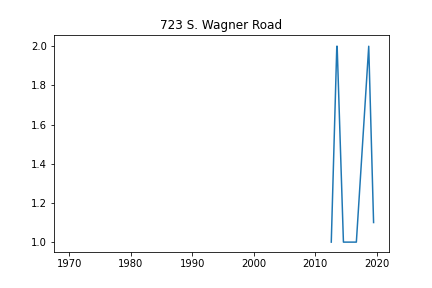
## A2 Cleaning Supply
`
Initiated AutoTS object with best model: 
UnobservedComponents
{
  "fillna": "mean",
  "transformations": {
    "0": "ClipOutliers",
    "1": "DifferencedTransformer",
    "2": "bkfilter",
    "3": "ClipOutliers"
  },
  "transformation_params": {
    "0": {
      "method": "clip",
      "std_threshold": 3,
      "fillna": null
    },
    "1": {},
    "2": {},
    "3": {
      "method": "clip",
      "std_threshold": 2,
      "fillna": null
    }
  }
}
{
  "level": false,
  "trend": false,
  "cycle": false,
  "damped_cycle": false,
  "irregular": false,
  "stochastic_trend": true,
  "stochastic_level": true,
  "stochastic_cycle": false,
  "regression_type": null
}
`

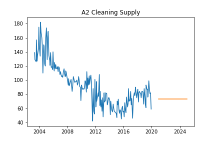
## AE-1
`
Initiated AutoTS object with best model: 
GLM
{
  "fillna": "zero",
  "transformations": {
    "0": "ClipOutliers",
    "1": "ClipOutliers",
    "2": "Detrend"
  },
  "transformation_params": {
    "0": {
      "method": "clip",
      "std_threshold": 4,
      "fillna": null
    },
    "1": {
      "method": "clip",
      "std_threshold": 3.5,
      "fillna": null
    },
    "2": {
      "model": "Linear"
    }
  }
}
{
  "family": "Binomial",
  "constant": false,
  "regression_type": null
}
`

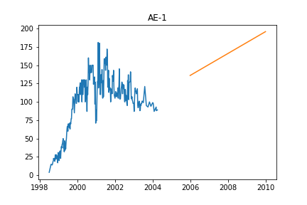
## AE-2
`
Initiated AutoTS object with best model: 
Ensemble
{}
{
  "model_name": "BestN",
  "model_count": 3,
  "model_metric": "mixed_metric",
  "models": {
    "431e42b441d3cd382fb693e68264cf25": {
      "Model": "UnobservedComponents",
      "ModelParameters": {
        "level": true,
        "trend": false,
        "cycle": false,
        "damped_cycle": false,
        "irregular": false,
        "stochastic_trend": false,
        "stochastic_level": true,
        "stochastic_cycle": true,
        "regression_type": null
      },
      "TransformationParameters": {
        "fillna": "zero",
        "transformations": {
          "0": "ClipOutliers",
          "1": "SeasonalDifference"
        },
        "transformation_params": {
          "0": {
            "method": "clip",
            "std_threshold": 2,
            "fillna": null
          },
          "1": {
            "lag_1": 12,
            "method": "Median"
          }
        }
      }
    },
    "aaa29738cd88aff1cce38359ad765a07": {
      "Model": "ZeroesNaive",
      "ModelParameters": {},
      "TransformationParameters": {
        "fillna": "zero",
        "transformations": {
          "0": "ClipOutliers",
          "1": "SeasonalDifference",
          "2": "RobustScaler"
        },
        "transformation_params": {
          "0": {
            "method": "clip",
            "std_threshold": 2,
            "fillna": null
          },
          "1": {
            "lag_1": 12,
            "method": "Median"
          },
          "2": {}
        }
      }
    },
    "8f01ae7478fd79eb675c276a1bc0b2f2": {
      "Model": "DatepartRegression",
      "ModelParameters": {
        "regression_model": {
          "model": "MLP",
          "model_params": {
            "hidden_layer_sizes": [
              25,
              15,
              25
            ],
            "max_iter": 250,
            "activation": "relu",
            "solver": "adam",
            "early_stopping": false,
            "learning_rate_init": 0.001
          }
        },
        "datepart_method": "recurring",
        "regression_type": null
      },
      "TransformationParameters": {
        "fillna": "rolling_mean",
        "transformations": {
          "0": "MinMaxScaler",
          "1": "MinMaxScaler"
        },
        "transformation_params": {
          "0": {},
          "1": {}
        }
      }
    }
  }
}
`

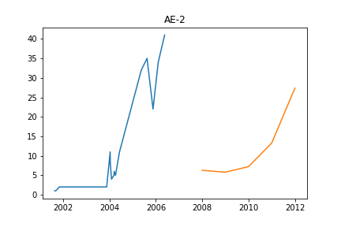
## AE-3
`
Initiated AutoTS object with best model: 
FBProphet
{
  "fillna": "zero",
  "transformations": {
    "0": "ClipOutliers",
    "1": "PowerTransformer",
    "2": "Detrend",
    "3": "Log",
    "4": "SeasonalDifference",
    "5": "CumSumTransformer"
  },
  "transformation_params": {
    "0": {
      "method": "clip",
      "std_threshold": 2,
      "fillna": null
    },
    "1": {},
    "2": {
      "model": "Linear"
    },
    "3": {},
    "4": {
      "lag_1": 12,
      "method": "Median"
    },
    "5": {}
  }
}
{
  "holiday": true,
  "regression_type": null
}
`

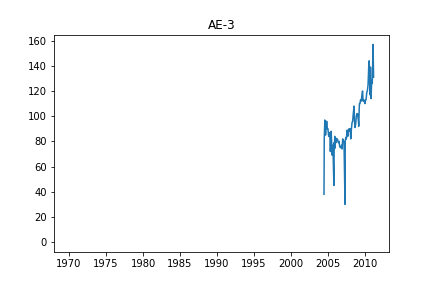
## AMW-1
`
Initiated AutoTS object with best model: 
Ensemble
{}
{
  "model_name": "BestN",
  "model_count": 3,
  "model_metric": "best_score",
  "models": {
    "c1f6362f9c6b41cedde365f47fc9ce90": {
      "Model": "ETS",
      "ModelParameters": {
        "damped_trend": false,
        "trend": null,
        "seasonal": null,
        "seasonal_periods": null
      },
      "TransformationParameters": {
        "fillna": "fake_date",
        "transformations": {
          "0": "PctChangeTransformer",
          "1": "QuantileTransformer"
        },
        "transformation_params": {
          "0": {},
          "1": {
            "output_distribution": "uniform",
            "n_quantiles": 7
          }
        }
      }
    },
    "a6651612bb7b0235be81b396802f59ad": {
      "Model": "ETS",
      "ModelParameters": {
        "damped_trend": false,
        "trend": null,
        "seasonal": null,
        "seasonal_periods": null
      },
      "TransformationParameters": {
        "fillna": "rolling_mean",
        "transformations": {
          "0": "Round"
        },
        "transformation_params": {
          "0": {
            "model": "middle",
            "decimals": 1,
            "on_transform": true,
            "on_inverse": false
          }
        }
      }
    },
    "a2c48c6e85447ff0bdd3c49fdb1eae57": {
      "Model": "ETS",
      "ModelParameters": {
        "damped_trend": false,
        "trend": null,
        "seasonal": null,
        "seasonal_periods": null
      },
      "TransformationParameters": {
        "fillna": "fake_date",
        "transformations": {
          "0": "Round",
          "1": "QuantileTransformer"
        },
        "transformation_params": {
          "0": {
            "model": "middle",
            "decimals": 1,
            "on_transform": true,
            "on_inverse": false
          },
          "1": {
            "output_distribution": "uniform",
            "n_quantiles": 7
          }
        }
      }
    }
  }
}
`

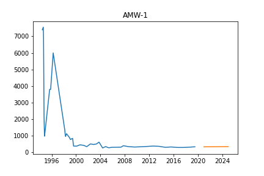
## AMW-2
`
Initiated AutoTS object with best model: 
DatepartRegression
{
  "fillna": "mean",
  "transformations": {
    "0": "PowerTransformer",
    "1": "MaxAbsScaler",
    "2": "PositiveShift"
  },
  "transformation_params": {
    "0": {},
    "1": {},
    "2": {}
  }
}
{
  "regression_model": {
    "model": "MLP",
    "model_params": {
      "hidden_layer_sizes": [
        32,
        64,
        32
      ],
      "max_iter": 500,
      "activation": "relu",
      "solver": "adam",
      "early_stopping": false,
      "learning_rate_init": 0.001
    }
  },
  "datepart_method": "simple",
  "regression_type": null
}
`

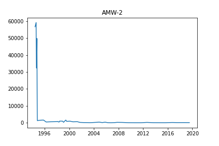
## ARTESIAN #1
`
Initiated AutoTS object with best model: 
RollingRegression
{
  "fillna": "median",
  "transformations": {
    "0": "ClipOutliers",
    "1": "DifferencedTransformer",
    "2": "Discretize",
    "3": "PowerTransformer"
  },
  "transformation_params": {
    "0": {
      "method": "clip",
      "std_threshold": 4,
      "fillna": null
    },
    "1": {},
    "2": {
      "discretization": "center",
      "n_bins": 20
    },
    "3": {}
  }
}
{
  "regression_model": {
    "model": "DecisionTree",
    "model_params": {
      "max_depth": 3,
      "min_samples_split": 1.0
    }
  },
  "holiday": true,
  "mean_rolling_periods": 30,
  "macd_periods": 364,
  "std_rolling_periods": 5,
  "max_rolling_periods": 24,
  "min_rolling_periods": 12,
  "ewm_alpha": null,
  "additional_lag_periods": 2,
  "abs_energy": false,
  "rolling_autocorr_periods": null,
  "add_date_part": "recurring",
  "polynomial_degree": null,
  "x_transform": null,
  "regression_type": null
}
`

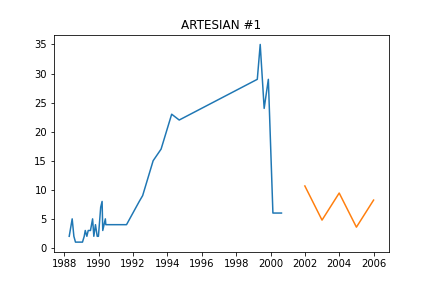
## ARTESIAN #2
`
Initiated AutoTS object with best model: 
Ensemble
{}
{
  "model_name": "BestN",
  "model_count": 3,
  "model_metric": "mixed_metric",
  "models": {
    "89666674b1b8fab0d177003a4517757b": {
      "Model": "DatepartRegression",
      "ModelParameters": {
        "regression_model": {
          "model": "DecisionTree",
          "model_params": {
            "max_depth": 3,
            "min_samples_split": 2
          }
        },
        "datepart_method": "recurring",
        "regression_type": null
      },
      "TransformationParameters": {
        "fillna": "mean",
        "transformations": {
          "0": "ClipOutliers",
          "1": "QuantileTransformer",
          "2": "DifferencedTransformer"
        },
        "transformation_params": {
          "0": {
            "method": "clip",
            "std_threshold": 3,
            "fillna": null
          },
          "1": {
            "output_distribution": "uniform",
            "n_quantiles": 3
          },
          "2": {}
        }
      }
    },
    "44d7294c03ba9c6306aad7d58527f9c4": {
      "Model": "ETS",
      "ModelParameters": {
        "damped_trend": true,
        "trend": "additive",
        "seasonal": null,
        "seasonal_periods": null
      },
      "TransformationParameters": {
        "fillna": "mean",
        "transformations": {
          "0": "MinMaxScaler",
          "1": "PowerTransformer",
          "2": "Slice",
          "3": "Round"
        },
        "transformation_params": {
          "0": {},
          "1": {},
          "2": {
            "method": 0.5
          },
          "3": {
            "model": "middle",
            "decimals": 1,
            "on_transform": true,
            "on_inverse": false
          }
        }
      }
    },
    "4b2aad44634a2b0c4c213c1e0cccf469": {
      "Model": "ETS",
      "ModelParameters": {
        "damped_trend": false,
        "trend": null,
        "seasonal": null,
        "seasonal_periods": null
      },
      "TransformationParameters": {
        "fillna": "median",
        "transformations": {
          "0": "ClipOutliers",
          "1": "SeasonalDifference"
        },
        "transformation_params": {
          "0": {
            "method": "clip",
            "std_threshold": 4,
            "fillna": null
          },
          "1": {
            "lag_1": 12,
            "method": "Median"
          }
        }
      }
    }
  }
}
`

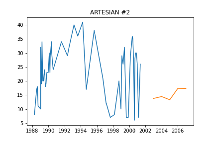
## ARTESIAN #3
`
Initiated AutoTS object with best model: 
SeasonalNaive
{
  "fillna": "rolling_mean",
  "transformations": {
    "0": "ClipOutliers",
    "1": "DifferencedTransformer",
    "2": "MinMaxScaler"
  },
  "transformation_params": {
    "0": {
      "method": "clip",
      "std_threshold": 3,
      "fillna": null
    },
    "1": {},
    "2": {}
  }
}
{
  "method": "LastValue",
  "lag_1": 63,
  "lag_2": 4
}
`

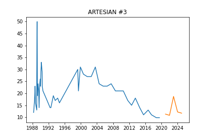
## DOLPH
`
Initiated AutoTS object with best model: 
UnobservedComponents
{
  "fillna": "mean",
  "transformations": {
    "0": "Round",
    "1": "PctChangeTransformer",
    "2": "DifferencedTransformer"
  },
  "transformation_params": {
    "0": {
      "model": "middle",
      "decimals": 1,
      "on_transform": true,
      "on_inverse": true
    },
    "1": {},
    "2": {}
  }
}
{
  "level": false,
  "trend": false,
  "cycle": true,
  "damped_cycle": false,
  "irregular": true,
  "stochastic_trend": true,
  "stochastic_level": true,
  "stochastic_cycle": true,
  "regression_type": null
}
`

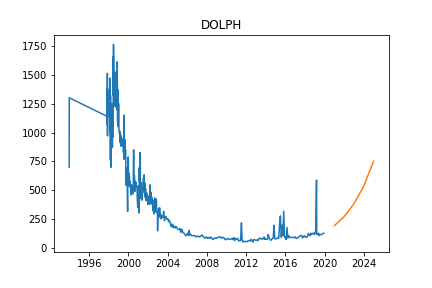
## EFF-UV1-A
`
Initiated AutoTS object with best model: 
Ensemble
{}
{
  "model_name": "BestN",
  "model_count": 3,
  "model_metric": "mixed_metric",
  "models": {
    "3de97d31e5bbea74fea086ed28fd5184": {
      "Model": "ZeroesNaive",
      "ModelParameters": {},
      "TransformationParameters": {
        "fillna": "zero",
        "transformations": {
          "0": "ClipOutliers",
          "1": "PowerTransformer"
        },
        "transformation_params": {
          "0": {
            "method": "clip",
            "std_threshold": 2,
            "fillna": null
          },
          "1": {}
        }
      }
    },
    "fa0e28e1c4d42df8cda7b59496cd5876": {
      "Model": "UnobservedComponents",
      "ModelParameters": {
        "level": false,
        "trend": false,
        "cycle": false,
        "damped_cycle": false,
        "irregular": false,
        "stochastic_trend": true,
        "stochastic_level": true,
        "stochastic_cycle": true,
        "regression_type": null
      },
      "TransformationParameters": {
        "fillna": "zero",
        "transformations": {
          "0": "ClipOutliers",
          "1": "PowerTransformer",
          "2": "RobustScaler"
        },
        "transformation_params": {
          "0": {
            "method": "clip",
            "std_threshold": 2,
            "fillna": null
          },
          "1": {},
          "2": {}
        }
      }
    },
    "bea9655038ab2c1afbdb1880cd512855": {
      "Model": "GLS",
      "ModelParameters": {},
      "TransformationParameters": {
        "fillna": "zero",
        "transformations": {
          "0": null
        },
        "transformation_params": {
          "0": {}
        }
      }
    }
  }
}
`

## EFF-UV2-A
`
Initiated AutoTS object with best model: 
Ensemble
{}
{
  "model_name": "BestN",
  "model_count": 3,
  "model_metric": "mixed_metric",
  "models": {
    "4925056c511eb5992fa997b1476fd9ac": {
      "Model": "ZeroesNaive",
      "ModelParameters": {},
      "TransformationParameters": {
        "fillna": "mean",
        "transformations": {
          "0": "ClipOutliers",
          "1": "RobustScaler"
        },
        "transformation_params": {
          "0": {
            "method": "clip",
            "std_threshold": 1,
            "fillna": null
          },
          "1": {}
        }
      }
    },
    "8efe409f3f8a718cb3326aad25974f5c": {
      "Model": "UnobservedComponents",
      "ModelParameters": {
        "level": true,
        "trend": true,
        "cycle": false,
        "damped_cycle": false,
        "irregular": true,
        "stochastic_trend": true,
        "stochastic_level": true,
        "stochastic_cycle": true,
        "regression_type": null
      },
      "TransformationParameters": {
        "fillna": "median",
        "transformations": {
          "0": "ClipOutliers",
          "1": "PowerTransformer"
        },
        "transformation_params": {
          "0": {
            "method": "clip",
            "std_threshold": 3,
            "fillna": null
          },
          "1": {}
        }
      }
    },
    "96723ee84d9e0ff283c1aeed681b1845": {
      "Model": "GLM",
      "ModelParameters": {
        "family": "Binomial",
        "constant": false,
        "regression_type": null
      },
      "TransformationParameters": {
        "fillna": "ffill_mean_biased",
        "transformations": {
          "0": "PowerTransformer",
          "1": "RobustScaler"
        },
        "transformation_params": {
          "0": {},
          "1": {}
        }
      }
    }
  }
}
`

## EFF-UV2-B
`
Initiated AutoTS object with best model: 
Ensemble
{}
{
  "model_name": "BestN",
  "model_count": 3,
  "model_metric": "mixed_metric",
  "models": {
    "f4e3c5721c02a9ddfd399e8e06306f44": {
      "Model": "ETS",
      "ModelParameters": {
        "damped_trend": false,
        "trend": "multiplicative",
        "seasonal": null,
        "seasonal_periods": null
      },
      "TransformationParameters": {
        "fillna": "median",
        "transformations": {
          "0": "ClipOutliers",
          "1": "StandardScaler"
        },
        "transformation_params": {
          "0": {
            "method": "clip",
            "std_threshold": 5,
            "fillna": null
          },
          "1": {}
        }
      }
    },
    "da2530597c92497f4ebc1a30c2ecae23": {
      "Model": "ZeroesNaive",
      "ModelParameters": {},
      "TransformationParameters": {
        "fillna": "ffill",
        "transformations": {
          "0": "ClipOutliers",
          "1": "PowerTransformer"
        },
        "transformation_params": {
          "0": {
            "method": "clip",
            "std_threshold": 3.5,
            "fillna": null
          },
          "1": {}
        }
      }
    },
    "530772dfd4a6cceb9b62499ef261bd60": {
      "Model": "GLM",
      "ModelParameters": {
        "family": "Binomial",
        "constant": false,
        "regression_type": null
      },
      "TransformationParameters": {
        "fillna": "ffill",
        "transformations": {
          "0": "CenterLastValue",
          "1": "StandardScaler",
          "2": "PositiveShift",
          "3": "SeasonalDifference",
          "4": "MinMaxScaler"
        },
        "transformation_params": {
          "0": {
            "rows": 6
          },
          "1": {},
          "2": {},
          "3": {
            "lag_1": 12,
            "method": "Mean"
          },
          "4": {}
        }
      }
    }
  }
}
`

## HZ-N
`
Initiated AutoTS object with best model: 
Ensemble
{}
{
  "model_name": "BestN",
  "model_count": 3,
  "model_metric": "mixed_metric",
  "models": {
    "4925056c511eb5992fa997b1476fd9ac": {
      "Model": "ZeroesNaive",
      "ModelParameters": {},
      "TransformationParameters": {
        "fillna": "mean",
        "transformations": {
          "0": "ClipOutliers",
          "1": "RobustScaler"
        },
        "transformation_params": {
          "0": {
            "method": "clip",
            "std_threshold": 1,
            "fillna": null
          },
          "1": {}
        }
      }
    },
    "8efe409f3f8a718cb3326aad25974f5c": {
      "Model": "UnobservedComponents",
      "ModelParameters": {
        "level": true,
        "trend": true,
        "cycle": false,
        "damped_cycle": false,
        "irregular": true,
        "stochastic_trend": true,
        "stochastic_level": true,
        "stochastic_cycle": true,
        "regression_type": null
      },
      "TransformationParameters": {
        "fillna": "median",
        "transformations": {
          "0": "ClipOutliers",
          "1": "PowerTransformer"
        },
        "transformation_params": {
          "0": {
            "method": "clip",
            "std_threshold": 3,
            "fillna": null
          },
          "1": {}
        }
      }
    },
    "642667f034472ceb3b6a2640cb288ba2": {
      "Model": "GLM",
      "ModelParameters": {
        "family": "Binomial",
        "constant": false,
        "regression_type": null
      },
      "TransformationParameters": {
        "fillna": "ffill",
        "transformations": {
          "0": "ClipOutliers",
          "1": "DifferencedTransformer"
        },
        "transformation_params": {
          "0": {
            "method": "clip",
            "std_threshold": 4,
            "fillna": null
          },
          "1": {}
        }
      }
    }
  }
}
`

## HZ-S
`
Initiated AutoTS object with best model: 
ZeroesNaive
{
  "fillna": "ffill",
  "transformations": {
    "0": "ClipOutliers",
    "1": "RobustScaler",
    "2": "DifferencedTransformer",
    "3": "Discretize"
  },
  "transformation_params": {
    "0": {
      "method": "clip",
      "std_threshold": 3.5,
      "fillna": null
    },
    "1": {},
    "2": {},
    "3": {
      "discretization": "lower",
      "n_bins": 5
    }
  }
}
{}
`

## IW-2
`
Initiated AutoTS object with best model: 
FBProphet
{
  "fillna": "rolling_mean_24",
  "transformations": {
    "0": "ClipOutliers",
    "1": "RobustScaler"
  },
  "transformation_params": {
    "0": {
      "method": "clip",
      "std_threshold": 3.5,
      "fillna": null
    },
    "1": {}
  }
}
{
  "holiday": true,
  "regression_type": null
}
`

## LB-1
`
Initiated AutoTS object with best model: 
LastValueNaive
{
  "fillna": "rolling_mean_24",
  "transformations": {
    "0": "Discretize",
    "1": "Round",
    "2": "PowerTransformer"
  },
  "transformation_params": {
    "0": {
      "discretization": "center",
      "n_bins": 10
    },
    "1": {
      "model": "middle",
      "decimals": 2,
      "on_transform": false,
      "on_inverse": true
    },
    "2": {}
  }
}
{}
`

## LB-2
`
Initiated AutoTS object with best model: 
Ensemble
{}
{
  "model_name": "BestN",
  "model_count": 3,
  "model_metric": "mixed_metric",
  "models": {
    "a2a76cd8d5cc2e56326d6e4cfc3dd939": {
      "Model": "LastValueNaive",
      "ModelParameters": {},
      "TransformationParameters": {
        "fillna": "mean",
        "transformations": {
          "0": "bkfilter",
          "1": "RollingMeanTransformer",
          "2": "Detrend",
          "3": "QuantileTransformer"
        },
        "transformation_params": {
          "0": {},
          "1": {
            "fixed": true,
            "window": 10
          },
          "2": {
            "model": "Linear"
          },
          "3": {
            "output_distribution": "uniform",
            "n_quantiles": 1
          }
        }
      }
    },
    "35f94a7883e518444c8d048716fcb4fe": {
      "Model": "DatepartRegression",
      "ModelParameters": {
        "regression_model": {
          "model": "MLP",
          "model_params": {
            "hidden_layer_sizes": [
              32,
              64,
              32
            ],
            "max_iter": 250,
            "activation": "logistic",
            "solver": "lbfgs",
            "early_stopping": false,
            "learning_rate_init": 0.001
          }
        },
        "datepart_method": "expanded",
        "regression_type": null
      },
      "TransformationParameters": {
        "fillna": "mean",
        "transformations": {
          "0": "bkfilter",
          "1": "RollingMeanTransformer",
          "2": "Detrend",
          "3": "QuantileTransformer"
        },
        "transformation_params": {
          "0": {},
          "1": {
            "fixed": true,
            "window": 10
          },
          "2": {
            "model": "Linear"
          },
          "3": {
            "output_distribution": "uniform",
            "n_quantiles": 1
          }
        }
      }
    },
    "b0d6ee39b0eafb0baff211cfdee825e3": {
      "Model": "AverageValueNaive",
      "ModelParameters": {
        "method": "Mean"
      },
      "TransformationParameters": {
        "fillna": "rolling_mean",
        "transformations": {
          "0": "bkfilter",
          "1": "Round"
        },
        "transformation_params": {
          "0": {},
          "1": {
            "model": "middle",
            "decimals": 0,
            "on_transform": true,
            "on_inverse": false
          }
        }
      }
    }
  }
}
`

## LB-3
`
Initiated AutoTS object with best model: 
ETS
{
  "fillna": "median",
  "transformations": {
    "0": "DifferencedTransformer",
    "1": "RobustScaler",
    "2": "PowerTransformer"
  },
  "transformation_params": {
    "0": {},
    "1": {},
    "2": {}
  }
}
{
  "damped_trend": false,
  "trend": "additive",
  "seasonal": null,
  "seasonal_periods": null
}
`

## LB-4
`
Initiated AutoTS object with best model: 
Ensemble
{}
{
  "model_name": "BestN",
  "model_count": 3,
  "model_metric": "mixed_metric",
  "models": {
    "441bc0ed76e5c78265bd076202538d69": {
      "Model": "ETS",
      "ModelParameters": {
        "damped_trend": false,
        "trend": "multiplicative",
        "seasonal": null,
        "seasonal_periods": null
      },
      "TransformationParameters": {
        "fillna": "ffill_mean_biased",
        "transformations": {
          "0": "PowerTransformer",
          "1": "PositiveShift",
          "2": "ClipOutliers"
        },
        "transformation_params": {
          "0": {},
          "1": {},
          "2": {
            "method": "clip",
            "std_threshold": 3.5,
            "fillna": null
          }
        }
      }
    },
    "07bfcdbe2a62edd6b06b2542c812d371": {
      "Model": "ETS",
      "ModelParameters": {
        "damped_trend": false,
        "trend": "multiplicative",
        "seasonal": "additive",
        "seasonal_periods": 364
      },
      "TransformationParameters": {
        "fillna": "ffill_mean_biased",
        "transformations": {
          "0": "PowerTransformer",
          "1": "PositiveShift",
          "2": "ClipOutliers"
        },
        "transformation_params": {
          "0": {},
          "1": {},
          "2": {
            "method": "clip",
            "std_threshold": 3.5,
            "fillna": null
          }
        }
      }
    },
    "ed92e8f0cf622526b38161baabbb9767": {
      "Model": "LastValueNaive",
      "ModelParameters": {},
      "TransformationParameters": {
        "fillna": "mean",
        "transformations": {
          "0": "ClipOutliers"
        },
        "transformation_params": {
          "0": {
            "method": "clip",
            "std_threshold": 2,
            "fillna": null
          }
        }
      }
    }
  }
}
`

## MOW-1
`
Initiated AutoTS object with best model: 
Ensemble
{}
{
  "model_name": "BestN",
  "model_count": 3,
  "model_metric": "mixed_metric",
  "models": {
    "4799e28bdbb594aa8e4a27f78714e7d8": {
      "Model": "GLM",
      "ModelParameters": {
        "family": "Poisson",
        "constant": false,
        "regression_type": null
      },
      "TransformationParameters": {
        "fillna": "mean",
        "transformations": {
          "0": "PowerTransformer",
          "1": "ClipOutliers"
        },
        "transformation_params": {
          "0": {},
          "1": {
            "method": "clip",
            "std_threshold": 2,
            "fillna": null
          }
        }
      }
    },
    "3a089d51b59986d303cf53e7aae8dd35": {
      "Model": "GLM",
      "ModelParameters": {
        "family": "NegativeBinomial",
        "constant": false,
        "regression_type": "datepart"
      },
      "TransformationParameters": {
        "fillna": "mean",
        "transformations": {
          "0": "PowerTransformer",
          "1": "ClipOutliers"
        },
        "transformation_params": {
          "0": {},
          "1": {
            "method": "clip",
            "std_threshold": 2,
            "fillna": null
          }
        }
      }
    },
    "c620253f1afbdf26e5c4c6b7cf6e1456": {
      "Model": "UnobservedComponents",
      "ModelParameters": {
        "level": true,
        "trend": false,
        "cycle": true,
        "damped_cycle": false,
        "irregular": true,
        "stochastic_trend": false,
        "stochastic_level": true,
        "stochastic_cycle": false,
        "regression_type": null
      },
      "TransformationParameters": {
        "fillna": "mean",
        "transformations": {
          "0": "QuantileTransformer",
          "1": "QuantileTransformer"
        },
        "transformation_params": {
          "0": {
            "output_distribution": "uniform",
            "n_quantiles": 7
          },
          "1": {
            "output_distribution": "uniform",
            "n_quantiles": 7
          }
        }
      }
    }
  }
}
`

## MW-1
`
Initiated AutoTS object with best model: 
UnobservedComponents
{
  "fillna": "fake_date",
  "transformations": {
    "0": "SeasonalDifference",
    "1": "SinTrend",
    "2": "DifferencedTransformer",
    "3": "PowerTransformer",
    "4": "Detrend",
    "5": "Round"
  },
  "transformation_params": {
    "0": {
      "lag_1": 12,
      "method": "Median"
    },
    "1": {},
    "2": {},
    "3": {},
    "4": {
      "model": "Linear"
    },
    "5": {
      "model": "middle",
      "decimals": 2,
      "on_transform": false,
      "on_inverse": true
    }
  }
}
{
  "level": false,
  "trend": false,
  "cycle": false,
  "damped_cycle": false,
  "irregular": true,
  "stochastic_trend": true,
  "stochastic_level": true,
  "stochastic_cycle": false,
  "regression_type": null
}
`

## MW-1 Replacement
`
Initiated AutoTS object with best model: 
FBProphet
{
  "fillna": "ffill_mean_biased",
  "transformations": {
    "0": "ClipOutliers",
    "1": "PowerTransformer",
    "2": "Detrend",
    "3": "DifferencedTransformer",
    "4": "Discretize"
  },
  "transformation_params": {
    "0": {
      "method": "clip",
      "std_threshold": 1,
      "fillna": null
    },
    "1": {},
    "2": {
      "model": "Linear"
    },
    "3": {},
    "4": {
      "discretization": "upper",
      "n_bins": 10
    }
  }
}
{
  "holiday": true,
  "regression_type": null
}
`

## MW-100
`
Initiated AutoTS object with best model: 
GLM
{
  "fillna": "mean",
  "transformations": {
    "0": "DifferencedTransformer",
    "1": "PowerTransformer",
    "2": "QuantileTransformer",
    "3": "Log"
  },
  "transformation_params": {
    "0": {},
    "1": {},
    "2": {
      "output_distribution": "uniform",
      "n_quantiles": 3
    },
    "3": {}
  }
}
{
  "family": "Poisson",
  "constant": false,
  "regression_type": "datepart"
}
`

## MW-101
`
Initiated AutoTS object with best model: 
AverageValueNaive
{
  "fillna": "ffill_mean_biased",
  "transformations": {
    "0": "PositiveShift",
    "1": "RobustScaler",
    "2": "DifferencedTransformer"
  },
  "transformation_params": {
    "0": {},
    "1": {},
    "2": {}
  }
}
{
  "method": "Mode"
}
`

## MW-103d
`
Initiated AutoTS object with best model: 
ZeroesNaive
{
  "fillna": "mean",
  "transformations": {
    "0": "ClipOutliers",
    "1": "QuantileTransformer",
    "2": "DifferencedTransformer",
    "3": "ClipOutliers",
    "4": "Detrend"
  },
  "transformation_params": {
    "0": {
      "method": "clip",
      "std_threshold": 1,
      "fillna": null
    },
    "1": {
      "output_distribution": "uniform",
      "n_quantiles": 3
    },
    "2": {},
    "3": {
      "method": "clip",
      "std_threshold": 4,
      "fillna": null
    },
    "4": {
      "model": "Linear"
    }
  }
}
{}
`

## MW-103s
`
Initiated AutoTS object with best model: 
UnobservedComponents
{
  "fillna": "ffill",
  "transformations": {
    "0": "ClipOutliers",
    "1": "ClipOutliers",
    "2": "Detrend",
    "3": "Discretize"
  },
  "transformation_params": {
    "0": {
      "method": "clip",
      "std_threshold": 1,
      "fillna": null
    },
    "1": {
      "method": "clip",
      "std_threshold": 3,
      "fillna": null
    },
    "2": {
      "model": "Linear"
    },
    "3": {
      "discretization": "upper",
      "n_bins": 5
    }
  }
}
{
  "level": false,
  "trend": false,
  "cycle": false,
  "damped_cycle": false,
  "irregular": true,
  "stochastic_trend": true,
  "stochastic_level": true,
  "stochastic_cycle": true,
  "regression_type": null
}
`

## MW-104
`
Initiated AutoTS object with best model: 
GLS
{
  "fillna": "mean",
  "transformations": {
    "0": "ClipOutliers",
    "1": "PowerTransformer",
    "2": "Detrend",
    "3": "MaxAbsScaler",
    "4": "bkfilter"
  },
  "transformation_params": {
    "0": {
      "method": "clip",
      "std_threshold": 3,
      "fillna": null
    },
    "1": {},
    "2": {
      "model": "Linear"
    },
    "3": {},
    "4": {}
  }
}
{}
`

## MW-105d
`
Initiated AutoTS object with best model: 
Ensemble
{}
{
  "model_name": "BestN",
  "model_count": 3,
  "model_metric": "best_score_unique",
  "models": {
    "c9e8c0f34d2f148a3d93f8755db7cf8b": {
      "Model": "AverageValueNaive",
      "ModelParameters": {
        "method": "Median"
      },
      "TransformationParameters": {
        "fillna": "ffill_mean_biased",
        "transformations": {
          "0": "DifferencedTransformer",
          "1": "Round",
          "2": "Detrend",
          "3": "StandardScaler"
        },
        "transformation_params": {
          "0": {},
          "1": {
            "model": "middle",
            "decimals": 0,
            "on_transform": true,
            "on_inverse": true
          },
          "2": {
            "model": "Linear"
          },
          "3": {}
        }
      }
    },
    "6181f170050eebbc2822aaca3ad36ade": {
      "Model": "GLS",
      "ModelParameters": {},
      "TransformationParameters": {
        "fillna": "mean",
        "transformations": {
          "0": "bkfilter",
          "1": "Log",
          "2": "Detrend",
          "3": "Round"
        },
        "transformation_params": {
          "0": {},
          "1": {},
          "2": {
            "model": "Linear"
          },
          "3": {
            "model": "middle",
            "decimals": 2,
            "on_transform": true,
            "on_inverse": true
          }
        }
      }
    },
    "270d692916843c1d29939f454280c098": {
      "Model": "ETS",
      "ModelParameters": {
        "damped_trend": false,
        "trend": null,
        "seasonal": null,
        "seasonal_periods": null
      },
      "TransformationParameters": {
        "fillna": "mean",
        "transformations": {
          "0": "ClipOutliers",
          "1": "Log",
          "2": "Detrend"
        },
        "transformation_params": {
          "0": {
            "method": "clip",
            "std_threshold": 3,
            "fillna": null
          },
          "1": {},
          "2": {
            "model": "Linear"
          }
        }
      }
    }
  }
}
`

## MW-105s
`
Initiated AutoTS object with best model: 
GLS
{
  "fillna": "fake_date",
  "transformations": {
    "0": "PCA",
    "1": "QuantileTransformer",
    "2": "DifferencedTransformer",
    "3": "PowerTransformer",
    "4": "Detrend"
  },
  "transformation_params": {
    "0": {},
    "1": {
      "output_distribution": "uniform",
      "n_quantiles": 3
    },
    "2": {},
    "3": {},
    "4": {
      "model": "Linear"
    }
  }
}
{}
`

## MW-106d
`
Initiated AutoTS object with best model: 
Ensemble
{}
{
  "model_name": "BestN",
  "model_count": 3,
  "model_metric": "mixed_metric",
  "models": {
    "f4341c6eb555bf4a50534971dfe6e2e2": {
      "Model": "ETS",
      "ModelParameters": {
        "damped_trend": true,
        "trend": "multiplicative",
        "seasonal": "multiplicative",
        "seasonal_periods": 420
      },
      "TransformationParameters": {
        "fillna": "fake_date",
        "transformations": {
          "0": "ClipOutliers",
          "1": "RobustScaler"
        },
        "transformation_params": {
          "0": {
            "method": "clip",
            "std_threshold": 2,
            "fillna": null
          },
          "1": {}
        }
      }
    },
    "e5cde671989a114958514c4a9732dd63": {
      "Model": "UnobservedComponents",
      "ModelParameters": {
        "level": true,
        "trend": true,
        "cycle": true,
        "damped_cycle": false,
        "irregular": true,
        "stochastic_trend": false,
        "stochastic_level": false,
        "stochastic_cycle": false,
        "regression_type": null
      },
      "TransformationParameters": {
        "fillna": "mean",
        "transformations": {
          "0": "ClipOutliers",
          "1": "MaxAbsScaler"
        },
        "transformation_params": {
          "0": {
            "method": "clip",
            "std_threshold": 1,
            "fillna": null
          },
          "1": {}
        }
      }
    },
    "df9447d34654a65c9d94db0aa879f2de": {
      "Model": "GLM",
      "ModelParameters": {
        "family": "NegativeBinomial",
        "constant": false,
        "regression_type": null
      },
      "TransformationParameters": {
        "fillna": "rolling_mean_24",
        "transformations": {
          "0": "ClipOutliers"
        },
        "transformation_params": {
          "0": {
            "method": "clip",
            "std_threshold": 2,
            "fillna": null
          }
        }
      }
    }
  }
}
`

## MW-106s
`
Initiated AutoTS object with best model: 
ETS
{
  "fillna": "mean",
  "transformations": {
    "0": "ClipOutliers",
    "1": "QuantileTransformer",
    "2": "DifferencedTransformer",
    "3": "PowerTransformer"
  },
  "transformation_params": {
    "0": {
      "method": "clip",
      "std_threshold": 3,
      "fillna": null
    },
    "1": {
      "output_distribution": "uniform",
      "n_quantiles": 3
    },
    "2": {},
    "3": {}
  }
}
{
  "damped_trend": false,
  "trend": "additive",
  "seasonal": null,
  "seasonal_periods": null
}
`

## MW-107
`
Initiated AutoTS object with best model: 
FBProphet
{
  "fillna": "mean",
  "transformations": {
    "0": "DifferencedTransformer",
    "1": "PowerTransformer",
    "2": "PowerTransformer",
    "3": "ClipOutliers"
  },
  "transformation_params": {
    "0": {},
    "1": {},
    "2": {},
    "3": {
      "method": "clip",
      "std_threshold": 1,
      "fillna": null
    }
  }
}
{
  "holiday": true,
  "regression_type": null
}
`

## MW-108d
`
Initiated AutoTS object with best model: 
ETS
{
  "fillna": "mean",
  "transformations": {
    "0": "MaxAbsScaler",
    "1": "bkfilter",
    "2": "PowerTransformer"
  },
  "transformation_params": {
    "0": {},
    "1": {},
    "2": {}
  }
}
{
  "damped_trend": false,
  "trend": "additive",
  "seasonal": null,
  "seasonal_periods": null
}
`

## MW-108s
`
Initiated AutoTS object with best model: 
FBProphet
{
  "fillna": "median",
  "transformations": {
    "0": "ClipOutliers",
    "1": "Log",
    "2": "PositiveShift",
    "3": "PowerTransformer",
    "4": "PowerTransformer"
  },
  "transformation_params": {
    "0": {
      "method": "clip",
      "std_threshold": 4,
      "fillna": null
    },
    "1": {},
    "2": {},
    "3": {},
    "4": {}
  }
}
{
  "holiday": true,
  "regression_type": null
}
`

## MW-10d
`
Initiated AutoTS object with best model: 
FBProphet
{
  "fillna": "fake_date",
  "transformations": {
    "0": "bkfilter",
    "1": "MinMaxScaler",
    "2": "PCA",
    "3": "PowerTransformer"
  },
  "transformation_params": {
    "0": {},
    "1": {},
    "2": {},
    "3": {}
  }
}
{
  "holiday": true,
  "regression_type": null
}
`

## MW-10s
`
Initiated AutoTS object with best model: 
UnobservedComponents
{
  "fillna": "fake_date",
  "transformations": {
    "0": "PositiveShift",
    "1": "Detrend",
    "2": "PowerTransformer",
    "3": "DifferencedTransformer",
    "4": "RobustScaler"
  },
  "transformation_params": {
    "0": {},
    "1": {
      "model": "Linear"
    },
    "2": {},
    "3": {},
    "4": {}
  }
}
{
  "level": true,
  "trend": false,
  "cycle": false,
  "damped_cycle": false,
  "irregular": false,
  "stochastic_trend": true,
  "stochastic_level": false,
  "stochastic_cycle": true,
  "regression_type": "Holiday"
}
`

## MW-110
`
Initiated AutoTS object with best model: 
DatepartRegression
{
  "fillna": "rolling_mean_24",
  "transformations": {
    "0": "PowerTransformer",
    "1": "PositiveShift",
    "2": "PositiveShift",
    "3": "DifferencedTransformer",
    "4": "Discretize"
  },
  "transformation_params": {
    "0": {},
    "1": {},
    "2": {},
    "3": {},
    "4": {
      "discretization": "center",
      "n_bins": 20
    }
  }
}
{
  "regression_model": {
    "model": "MLP",
    "model_params": {
      "hidden_layer_sizes": [
        25,
        50,
        25
      ],
      "max_iter": 1000,
      "activation": "tanh",
      "solver": "adam",
      "early_stopping": false,
      "learning_rate_init": 0.001
    }
  },
  "datepart_method": "simple",
  "regression_type": null
}
`

## MW-113
`
Initiated AutoTS object with best model: 
SeasonalNaive
{
  "fillna": "rolling_mean",
  "transformations": {
    "0": "Detrend",
    "1": "Discretize"
  },
  "transformation_params": {
    "0": {
      "model": "Linear"
    },
    "1": {
      "discretization": "center",
      "n_bins": 20
    }
  }
}
{
  "method": "Mean",
  "lag_1": 28,
  "lag_2": 364
}
`

## MW-115
`
Initiated AutoTS object with best model: 
GLS
{
  "fillna": "fake_date",
  "transformations": {
    "0": "PctChangeTransformer",
    "1": "SeasonalDifference",
    "2": "Round"
  },
  "transformation_params": {
    "0": {},
    "1": {
      "lag_1": 12,
      "method": "LastValue"
    },
    "2": {
      "model": "middle",
      "decimals": -2,
      "on_transform": true,
      "on_inverse": false
    }
  }
}
{}
`

## MW-116
`
Initiated AutoTS object with best model: 
Ensemble
{}
{
  "model_name": "BestN",
  "model_count": 3,
  "model_metric": "best_score_unique",
  "models": {
    "274a92ac0b8b10986cb393b134305bc4": {
      "Model": "GLM",
      "ModelParameters": {
        "family": "Binomial",
        "constant": false,
        "regression_type": null
      },
      "TransformationParameters": {
        "fillna": "rolling_mean",
        "transformations": {
          "0": "Round",
          "1": "PowerTransformer",
          "2": "DifferencedTransformer",
          "3": "MaxAbsScaler",
          "4": "MaxAbsScaler"
        },
        "transformation_params": {
          "0": {
            "model": "middle",
            "decimals": -1,
            "on_transform": true,
            "on_inverse": false
          },
          "1": {},
          "2": {},
          "3": {},
          "4": {}
        }
      }
    },
    "4b7ce9060f4da6e908c72af4a9e5fd9a": {
      "Model": "AverageValueNaive",
      "ModelParameters": {
        "method": "Mean"
      },
      "TransformationParameters": {
        "fillna": "rolling_mean",
        "transformations": {
          "0": "QuantileTransformer",
          "1": "PowerTransformer",
          "2": "DifferencedTransformer",
          "3": "MaxAbsScaler"
        },
        "transformation_params": {
          "0": {
            "output_distribution": "normal",
            "n_quantiles": 2
          },
          "1": {},
          "2": {},
          "3": {}
        }
      }
    },
    "e61dde3d0ebd21cda1aaee6d931251a7": {
      "Model": "ZeroesNaive",
      "ModelParameters": {},
      "TransformationParameters": {
        "fillna": "median",
        "transformations": {
          "0": "ClipOutliers",
          "1": "MinMaxScaler"
        },
        "transformation_params": {
          "0": {
            "method": "clip",
            "std_threshold": 1,
            "fillna": null
          },
          "1": {}
        }
      }
    }
  }
}
`

## MW-117
`
Initiated AutoTS object with best model: 
UnobservedComponents
{
  "fillna": "ffill_mean_biased",
  "transformations": {
    "0": "ClipOutliers",
    "1": "DifferencedTransformer",
    "2": "QuantileTransformer",
    "3": "Discretize",
    "4": "QuantileTransformer"
  },
  "transformation_params": {
    "0": {
      "method": "clip",
      "std_threshold": 3.5,
      "fillna": null
    },
    "1": {},
    "2": {
      "output_distribution": "uniform",
      "n_quantiles": 1
    },
    "3": {
      "discretization": "upper",
      "n_bins": 20
    },
    "4": {
      "output_distribution": "uniform",
      "n_quantiles": 1
    }
  }
}
{
  "level": true,
  "trend": true,
  "cycle": true,
  "damped_cycle": true,
  "irregular": false,
  "stochastic_trend": false,
  "stochastic_level": true,
  "stochastic_cycle": false,
  "regression_type": null
}
`

## MW-118
`
Initiated AutoTS object with best model: 
FBProphet
{
  "fillna": "rolling_mean",
  "transformations": {
    "0": "ClipOutliers",
    "1": "PowerTransformer",
    "2": "Detrend",
    "3": "PowerTransformer"
  },
  "transformation_params": {
    "0": {
      "method": "clip",
      "std_threshold": 4,
      "fillna": null
    },
    "1": {},
    "2": {
      "model": "Linear"
    },
    "3": {}
  }
}
{
  "holiday": true,
  "regression_type": null
}
`

## MW-119
`
Initiated AutoTS object with best model: 
GLM
{
  "fillna": "mean",
  "transformations": {
    "0": "PctChangeTransformer",
    "1": "SeasonalDifference"
  },
  "transformation_params": {
    "0": {},
    "1": {
      "lag_1": 7,
      "method": "Median"
    }
  }
}
{
  "family": "Poisson",
  "constant": false,
  "regression_type": null
}
`

## MW-11d
`
Initiated AutoTS object with best model: 
LastValueNaive
{
  "fillna": "median",
  "transformations": {
    "0": "ClipOutliers",
    "1": "DifferencedTransformer",
    "2": "Detrend",
    "3": "SeasonalDifference"
  },
  "transformation_params": {
    "0": {
      "method": "clip",
      "std_threshold": 5,
      "fillna": null
    },
    "1": {},
    "2": {
      "model": "Linear"
    },
    "3": {
      "lag_1": 7,
      "method": "Median"
    }
  }
}
{}
`

## MW-11i
`
Initiated AutoTS object with best model: 
LastValueNaive
{
  "fillna": "ffill",
  "transformations": {
    "0": "ClipOutliers",
    "1": "PowerTransformer",
    "2": "Detrend"
  },
  "transformation_params": {
    "0": {
      "method": "clip",
      "std_threshold": 3,
      "fillna": null
    },
    "1": {},
    "2": {
      "model": "Linear"
    }
  }
}
{}
`

## MW-11s
`
Initiated AutoTS object with best model: 
LastValueNaive
{
  "fillna": "ffill_mean_biased",
  "transformations": {
    "0": "ClipOutliers",
    "1": "StandardScaler"
  },
  "transformation_params": {
    "0": {
      "method": "clip",
      "std_threshold": 3.5,
      "fillna": null
    },
    "1": {}
  }
}
{}
`

## MW-121d
`
Initiated AutoTS object with best model: 
Ensemble
{}
{
  "model_name": "BestN",
  "model_count": 3,
  "model_metric": "best_score_unique",
  "models": {
    "0bf7fd1668762d8e29bb19c296e63d40": {
      "Model": "ETS",
      "ModelParameters": {
        "damped_trend": false,
        "trend": "additive",
        "seasonal": null,
        "seasonal_periods": null
      },
      "TransformationParameters": {
        "fillna": "fake_date",
        "transformations": {
          "0": "ClipOutliers",
          "1": "MaxAbsScaler"
        },
        "transformation_params": {
          "0": {
            "method": "clip",
            "std_threshold": 3.5,
            "fillna": null
          },
          "1": {}
        }
      }
    },
    "639814115aea197957d1f2d5c9870a65": {
      "Model": "GLM",
      "ModelParameters": {
        "family": "Gaussian",
        "constant": false,
        "regression_type": "datepart"
      },
      "TransformationParameters": {
        "fillna": "zero",
        "transformations": {
          "0": "RollingMeanTransformer",
          "1": "Discretize",
          "2": "RobustScaler"
        },
        "transformation_params": {
          "0": {
            "fixed": true,
            "window": 12
          },
          "1": {
            "discretization": "lower",
            "n_bins": 20
          },
          "2": {}
        }
      }
    },
    "96f4f365ef2d615577511ba7457bdcf7": {
      "Model": "GLS",
      "ModelParameters": {},
      "TransformationParameters": {
        "fillna": "zero",
        "transformations": {
          "0": "PositiveShift",
          "1": "Discretize"
        },
        "transformation_params": {
          "0": {},
          "1": {
            "discretization": "lower",
            "n_bins": 20
          }
        }
      }
    }
  }
}
`

## MW-122s
`
Initiated AutoTS object with best model: 
FBProphet
{
  "fillna": "mean",
  "transformations": {
    "0": "ClipOutliers",
    "1": "MinMaxScaler"
  },
  "transformation_params": {
    "0": {
      "method": "clip",
      "std_threshold": 3.5,
      "fillna": null
    },
    "1": {}
  }
}
{
  "holiday": false,
  "regression_type": null
}
`

## MW-125
`
Initiated AutoTS object with best model: 
Ensemble
{}
{
  "model_name": "BestN",
  "model_count": 3,
  "model_metric": "best_score_unique",
  "models": {
    "6ce5d9dcacced629e5079fe0106ee533": {
      "Model": "GLM",
      "ModelParameters": {
        "family": "Poisson",
        "constant": false,
        "regression_type": "datepart"
      },
      "TransformationParameters": {
        "fillna": "zero",
        "transformations": {
          "0": "bkfilter",
          "1": "Discretize",
          "2": "PowerTransformer"
        },
        "transformation_params": {
          "0": {},
          "1": {
            "discretization": "upper",
            "n_bins": 5
          },
          "2": {}
        }
      }
    },
    "944ef366e978b34a757e7a7e0f107835": {
      "Model": "SeasonalNaive",
      "ModelParameters": {
        "method": "LastValue",
        "lag_1": 7,
        "lag_2": 28
      },
      "TransformationParameters": {
        "fillna": "zero",
        "transformations": {
          "0": "QuantileTransformer",
          "1": "Discretize",
          "2": "PowerTransformer"
        },
        "transformation_params": {
          "0": {
            "output_distribution": "uniform",
            "n_quantiles": 1
          },
          "1": {
            "discretization": "upper",
            "n_bins": 5
          },
          "2": {}
        }
      }
    },
    "ed1fea9858a8f88a8411ed6fb21952c1": {
      "Model": "UnobservedComponents",
      "ModelParameters": {
        "level": false,
        "trend": false,
        "cycle": true,
        "damped_cycle": true,
        "irregular": true,
        "stochastic_trend": false,
        "stochastic_level": true,
        "stochastic_cycle": true,
        "regression_type": "Holiday"
      },
      "TransformationParameters": {
        "fillna": "ffill_mean_biased",
        "transformations": {
          "0": "ClipOutliers",
          "1": "QuantileTransformer",
          "2": "Detrend"
        },
        "transformation_params": {
          "0": {
            "method": "clip",
            "std_threshold": 3,
            "fillna": null
          },
          "1": {
            "output_distribution": "uniform",
            "n_quantiles": 1
          },
          "2": {
            "model": "Linear"
          }
        }
      }
    }
  }
}
`

## MW-12d
`
Initiated AutoTS object with best model: 
FBProphet
{
  "fillna": "median",
  "transformations": {
    "0": "Log",
    "1": "Discretize",
    "2": "PowerTransformer",
    "3": "DifferencedTransformer",
    "4": "QuantileTransformer"
  },
  "transformation_params": {
    "0": {},
    "1": {
      "discretization": "lower",
      "n_bins": 5
    },
    "2": {},
    "3": {},
    "4": {
      "output_distribution": "normal",
      "n_quantiles": 3
    }
  }
}
{
  "holiday": false,
  "regression_type": null
}
`

## MW-12s
`
Initiated AutoTS object with best model: 
Ensemble
{}
{
  "model_name": "BestN",
  "model_count": 3,
  "model_metric": "best_score_unique",
  "models": {
    "75cb5ae7ad71c8cc1156cf3040e3287b": {
      "Model": "ZeroesNaive",
      "ModelParameters": {},
      "TransformationParameters": {
        "fillna": "rolling_mean",
        "transformations": {
          "0": "bkfilter",
          "1": "MinMaxScaler",
          "2": "PowerTransformer",
          "3": "PositiveShift"
        },
        "transformation_params": {
          "0": {},
          "1": {},
          "2": {},
          "3": {}
        }
      }
    },
    "5d0e1949b871b3ad966a608fdb4f3542": {
      "Model": "UnobservedComponents",
      "ModelParameters": {
        "level": false,
        "trend": false,
        "cycle": true,
        "damped_cycle": false,
        "irregular": true,
        "stochastic_trend": true,
        "stochastic_level": true,
        "stochastic_cycle": false,
        "regression_type": null
      },
      "TransformationParameters": {
        "fillna": "zero",
        "transformations": {
          "0": "Discretize",
          "1": "DifferencedTransformer"
        },
        "transformation_params": {
          "0": {
            "discretization": "lower",
            "n_bins": 5
          },
          "1": {}
        }
      }
    },
    "a940b8da0f90af78cd55baf9d811822c": {
      "Model": "LastValueNaive",
      "ModelParameters": {},
      "TransformationParameters": {
        "fillna": "ffill_mean_biased",
        "transformations": {
          "0": "Discretize",
          "1": "ClipOutliers",
          "2": "MinMaxScaler",
          "3": "PowerTransformer"
        },
        "transformation_params": {
          "0": {
            "discretization": "lower",
            "n_bins": 5
          },
          "1": {
            "method": "clip",
            "std_threshold": 2,
            "fillna": null
          },
          "2": {},
          "3": {}
        }
      }
    }
  }
}
`

## MW-130i
`
Initiated AutoTS object with best model: 
Ensemble
{}
{
  "model_name": "BestN",
  "model_count": 3,
  "model_metric": "mixed_metric",
  "models": {
    "d498e0c00922f0dcab33023e08e22355": {
      "Model": "GLS",
      "ModelParameters": {},
      "TransformationParameters": {
        "fillna": "mean",
        "transformations": {
          "0": "ClipOutliers",
          "1": "IntermittentOccurrence"
        },
        "transformation_params": {
          "0": {
            "method": "clip",
            "std_threshold": 3,
            "fillna": null
          },
          "1": {
            "center": "mean"
          }
        }
      }
    },
    "4a4c61b5525034645eeae4feb8545735": {
      "Model": "GLM",
      "ModelParameters": {
        "family": "NegativeBinomial",
        "constant": false,
        "regression_type": null
      },
      "TransformationParameters": {
        "fillna": "mean",
        "transformations": {
          "0": "ClipOutliers",
          "1": "IntermittentOccurrence",
          "2": "RobustScaler"
        },
        "transformation_params": {
          "0": {
            "method": "clip",
            "std_threshold": 3,
            "fillna": null
          },
          "1": {
            "center": "mean"
          },
          "2": {}
        }
      }
    },
    "2ae851216d7133d87d44b32e6636103d": {
      "Model": "LastValueNaive",
      "ModelParameters": {},
      "TransformationParameters": {
        "fillna": "fake_date",
        "transformations": {
          "0": "SeasonalDifference",
          "1": "SinTrend"
        },
        "transformation_params": {
          "0": {
            "lag_1": 7,
            "method": "LastValue"
          },
          "1": {}
        }
      }
    }
  }
}
`

## MW-133d
`
Initiated AutoTS object with best model: 
Ensemble
{}
{
  "model_name": "BestN",
  "model_count": 3,
  "model_metric": "best_score",
  "models": {
    "1b96a424461991619913a6758ca0f51a": {
      "Model": "GLS",
      "ModelParameters": {},
      "TransformationParameters": {
        "fillna": "rolling_mean_24",
        "transformations": {
          "0": "ClipOutliers",
          "1": "ClipOutliers",
          "2": "Detrend",
          "3": "DifferencedTransformer",
          "4": "Discretize"
        },
        "transformation_params": {
          "0": {
            "method": "clip",
            "std_threshold": 4,
            "fillna": null
          },
          "1": {
            "method": "clip",
            "std_threshold": 2,
            "fillna": null
          },
          "2": {
            "model": "Linear"
          },
          "3": {},
          "4": {
            "discretization": "lower",
            "n_bins": 10
          }
        }
      }
    },
    "3f46c08268aae7f65803cf6cd74a963f": {
      "Model": "GLS",
      "ModelParameters": {},
      "TransformationParameters": {
        "fillna": "median",
        "transformations": {
          "0": "ClipOutliers",
          "1": "ClipOutliers",
          "2": "Detrend",
          "3": "DifferencedTransformer",
          "4": "Discretize"
        },
        "transformation_params": {
          "0": {
            "method": "clip",
            "std_threshold": 3.5,
            "fillna": null
          },
          "1": {
            "method": "clip",
            "std_threshold": 2,
            "fillna": null
          },
          "2": {
            "model": "Linear"
          },
          "3": {},
          "4": {
            "discretization": "lower",
            "n_bins": 10
          }
        }
      }
    },
    "98e71ce621846495219a5edf2fda1257": {
      "Model": "LastValueNaive",
      "ModelParameters": {},
      "TransformationParameters": {
        "fillna": "fake_date",
        "transformations": {
          "0": "ClipOutliers",
          "1": "PowerTransformer"
        },
        "transformation_params": {
          "0": {
            "method": "clip",
            "std_threshold": 1,
            "fillna": null
          },
          "1": {}
        }
      }
    }
  }
}
`

## MW-133i
`
Initiated AutoTS object with best model: 
FBProphet
{
  "fillna": "ffill",
  "transformations": {
    "0": "PowerTransformer",
    "1": "SinTrend",
    "2": "ClipOutliers",
    "3": "PowerTransformer"
  },
  "transformation_params": {
    "0": {},
    "1": {},
    "2": {
      "method": "clip",
      "std_threshold": 4,
      "fillna": null
    },
    "3": {}
  }
}
{
  "holiday": true,
  "regression_type": null
}
`

## MW-133s
`
Initiated AutoTS object with best model: 
LastValueNaive
{
  "fillna": "rolling_mean_24",
  "transformations": {
    "0": "PositiveShift",
    "1": "bkfilter"
  },
  "transformation_params": {
    "0": {},
    "1": {}
  }
}
{}
`

## MW-134d
`
Initiated AutoTS object with best model: 
Ensemble
{}
{
  "model_name": "BestN",
  "model_count": 3,
  "model_metric": "mixed_metric",
  "models": {
    "6524fbb77d4237f22c3318ddf8b0cd33": {
      "Model": "GLM",
      "ModelParameters": {
        "family": "Poisson",
        "constant": false,
        "regression_type": null
      },
      "TransformationParameters": {
        "fillna": "mean",
        "transformations": {
          "0": "ClipOutliers"
        },
        "transformation_params": {
          "0": {
            "method": "clip",
            "std_threshold": 3.5,
            "fillna": null
          }
        }
      }
    },
    "8eed7fecdfac5a6722f40029209b3ccd": {
      "Model": "DatepartRegression",
      "ModelParameters": {
        "regression_model": {
          "model": "SVM",
          "model_params": {}
        },
        "datepart_method": "recurring",
        "regression_type": null
      },
      "TransformationParameters": {
        "fillna": "zero",
        "transformations": {
          "0": "ClipOutliers",
          "1": "RollingMeanTransformer",
          "2": "Detrend",
          "3": "QuantileTransformer"
        },
        "transformation_params": {
          "0": {
            "method": "clip",
            "std_threshold": 3.5,
            "fillna": null
          },
          "1": {
            "fixed": true,
            "window": 10
          },
          "2": {
            "model": "Linear"
          },
          "3": {
            "output_distribution": "uniform",
            "n_quantiles": 1
          }
        }
      }
    },
    "3bdf8cbff3d7e72f368cc48f2b18caaa": {
      "Model": "LastValueNaive",
      "ModelParameters": {},
      "TransformationParameters": {
        "fillna": "rolling_mean_24",
        "transformations": {
          "0": "ClipOutliers",
          "1": "Round"
        },
        "transformation_params": {
          "0": {
            "method": "clip",
            "std_threshold": 3.5,
            "fillna": null
          },
          "1": {
            "model": "middle",
            "decimals": 0,
            "on_transform": true,
            "on_inverse": false
          }
        }
      }
    }
  }
}
`

## MW-134i
`
Initiated AutoTS object with best model: 
Ensemble
{}
{
  "model_name": "BestN",
  "model_count": 3,
  "model_metric": "best_score_unique",
  "models": {
    "47e677dc95d4ab3fef28108c2f11d10d": {
      "Model": "LastValueNaive",
      "ModelParameters": {},
      "TransformationParameters": {
        "fillna": "zero",
        "transformations": {
          "0": "ClipOutliers",
          "1": "RobustScaler"
        },
        "transformation_params": {
          "0": {
            "method": "clip",
            "std_threshold": 4,
            "fillna": null
          },
          "1": {}
        }
      }
    },
    "2027f37f0b2e79f5705772b969cdd0c4": {
      "Model": "RollingRegression",
      "ModelParameters": {
        "regression_model": {
          "model": "Adaboost",
          "model_params": {
            "n_estimators": 500,
            "loss": "linear",
            "base_estimator": "DecisionTree",
            "learning_rate": 1.0
          }
        },
        "holiday": false,
        "mean_rolling_periods": 30,
        "macd_periods": 28,
        "std_rolling_periods": 30,
        "max_rolling_periods": null,
        "min_rolling_periods": 58,
        "ewm_alpha": 0.2,
        "additional_lag_periods": 2,
        "abs_energy": false,
        "rolling_autocorr_periods": null,
        "add_date_part": null,
        "polynomial_degree": null,
        "x_transform": null,
        "regression_type": null
      },
      "TransformationParameters": {
        "fillna": "zero",
        "transformations": {
          "0": "ClipOutliers",
          "1": "RobustScaler"
        },
        "transformation_params": {
          "0": {
            "method": "clip",
            "std_threshold": 4,
            "fillna": null
          },
          "1": {}
        }
      }
    },
    "15d20f95e2f24e1d83a03ceb60422988": {
      "Model": "ETS",
      "ModelParameters": {
        "damped_trend": false,
        "trend": null,
        "seasonal": null,
        "seasonal_periods": null
      },
      "TransformationParameters": {
        "fillna": "ffill_mean_biased",
        "transformations": {
          "0": "ClipOutliers",
          "1": "RobustScaler"
        },
        "transformation_params": {
          "0": {
            "method": "clip",
            "std_threshold": 3,
            "fillna": null
          },
          "1": {}
        }
      }
    }
  }
}
`

## MW-134s
`
Initiated AutoTS object with best model: 
Ensemble
{}
{
  "model_name": "BestN",
  "model_count": 3,
  "model_metric": "best_score",
  "models": {
    "d28a4359486e991c5dc61f5be3424d19": {
      "Model": "FBProphet",
      "ModelParameters": {
        "holiday": true,
        "regression_type": null
      },
      "TransformationParameters": {
        "fillna": "median",
        "transformations": {
          "0": "ClipOutliers",
          "1": "PowerTransformer",
          "2": "Detrend"
        },
        "transformation_params": {
          "0": {
            "method": "clip",
            "std_threshold": 1,
            "fillna": null
          },
          "1": {},
          "2": {
            "model": "Linear"
          }
        }
      }
    },
    "5817e9572b7bea9d9de961f2d02e5c6f": {
      "Model": "FBProphet",
      "ModelParameters": {
        "holiday": false,
        "regression_type": null
      },
      "TransformationParameters": {
        "fillna": "median",
        "transformations": {
          "0": "ClipOutliers",
          "1": "PowerTransformer",
          "2": "Detrend"
        },
        "transformation_params": {
          "0": {
            "method": "clip",
            "std_threshold": 1,
            "fillna": null
          },
          "1": {},
          "2": {
            "model": "Linear"
          }
        }
      }
    },
    "db5a8d5c4e78e6192a1e47d2cbb9cc8f": {
      "Model": "FBProphet",
      "ModelParameters": {
        "holiday": false,
        "regression_type": null
      },
      "TransformationParameters": {
        "fillna": "median",
        "transformations": {
          "0": "ClipOutliers",
          "1": "PowerTransformer",
          "2": "Detrend",
          "3": "Discretize"
        },
        "transformation_params": {
          "0": {
            "method": "clip",
            "std_threshold": 1,
            "fillna": null
          },
          "1": {},
          "2": {
            "model": "Linear"
          },
          "3": {
            "discretization": "lower",
            "n_bins": 20
          }
        }
      }
    }
  }
}
`

## MW-138i
`
Initiated AutoTS object with best model: 
Ensemble
{}
{
  "model_name": "BestN",
  "model_count": 3,
  "model_metric": "mixed_metric",
  "models": {
    "4925056c511eb5992fa997b1476fd9ac": {
      "Model": "ZeroesNaive",
      "ModelParameters": {},
      "TransformationParameters": {
        "fillna": "mean",
        "transformations": {
          "0": "ClipOutliers",
          "1": "RobustScaler"
        },
        "transformation_params": {
          "0": {
            "method": "clip",
            "std_threshold": 1,
            "fillna": null
          },
          "1": {}
        }
      }
    },
    "8efe409f3f8a718cb3326aad25974f5c": {
      "Model": "UnobservedComponents",
      "ModelParameters": {
        "level": true,
        "trend": true,
        "cycle": false,
        "damped_cycle": false,
        "irregular": true,
        "stochastic_trend": true,
        "stochastic_level": true,
        "stochastic_cycle": true,
        "regression_type": null
      },
      "TransformationParameters": {
        "fillna": "median",
        "transformations": {
          "0": "ClipOutliers",
          "1": "PowerTransformer"
        },
        "transformation_params": {
          "0": {
            "method": "clip",
            "std_threshold": 3,
            "fillna": null
          },
          "1": {}
        }
      }
    },
    "f04eecc43c8887bdac1b0b1792964b44": {
      "Model": "LastValueNaive",
      "ModelParameters": {},
      "TransformationParameters": {
        "fillna": "ffill",
        "transformations": {
          "0": "SeasonalDifference",
          "1": "Discretize",
          "2": "PctChangeTransformer"
        },
        "transformation_params": {
          "0": {
            "lag_1": 12,
            "method": "Mean"
          },
          "1": {
            "discretization": "upper",
            "n_bins": 5
          },
          "2": {}
        }
      }
    }
  }
}
`

## MW-14d
`
Initiated AutoTS object with best model: 
FBProphet
{
  "fillna": "ffill_mean_biased",
  "transformations": {
    "0": "PowerTransformer",
    "1": "SeasonalDifference",
    "2": "RobustScaler"
  },
  "transformation_params": {
    "0": {},
    "1": {
      "lag_1": 7,
      "method": "Mean"
    },
    "2": {}
  }
}
{
  "holiday": false,
  "regression_type": null
}
`

## MW-15d
`
Initiated AutoTS object with best model: 
ETS
{
  "fillna": "ffill",
  "transformations": {
    "0": "RollingMeanTransformer",
    "1": "Discretize"
  },
  "transformation_params": {
    "0": {
      "fixed": false,
      "window": 7
    },
    "1": {
      "discretization": "lower",
      "n_bins": 20
    }
  }
}
{
  "damped_trend": true,
  "trend": "additive",
  "seasonal": null,
  "seasonal_periods": null
}
`

## MW-15s
`
Initiated AutoTS object with best model: 
SeasonalNaive
{
  "fillna": "ffill_mean_biased",
  "transformations": {
    "0": "ClipOutliers",
    "1": "PowerTransformer",
    "2": "Detrend",
    "3": "bkfilter",
    "4": "Discretize"
  },
  "transformation_params": {
    "0": {
      "method": "clip",
      "std_threshold": 3.5,
      "fillna": null
    },
    "1": {},
    "2": {
      "model": "Linear"
    },
    "3": {},
    "4": {
      "discretization": "upper",
      "n_bins": 10
    }
  }
}
{
  "method": "Mean",
  "lag_1": 12,
  "lag_2": "None"
}
`

## MW-16
`
Initiated AutoTS object with best model: 
ETS
{
  "fillna": "rolling_mean_24",
  "transformations": {
    "0": "IntermittentOccurrence",
    "1": "SinTrend",
    "2": "MaxAbsScaler",
    "3": "SeasonalDifference",
    "4": "bkfilter",
    "5": "DifferencedTransformer"
  },
  "transformation_params": {
    "0": {
      "center": "mean"
    },
    "1": {},
    "2": {},
    "3": {
      "lag_1": 12,
      "method": "Median"
    },
    "4": {},
    "5": {}
  }
}
{
  "damped_trend": true,
  "trend": "additive",
  "seasonal": null,
  "seasonal_periods": null
}
`

## MW-17
`
Initiated AutoTS object with best model: 
ETS
{
  "fillna": "ffill_mean_biased",
  "transformations": {
    "0": "StandardScaler",
    "1": "DifferencedTransformer",
    "2": "Detrend",
    "3": "bkfilter"
  },
  "transformation_params": {
    "0": {},
    "1": {},
    "2": {
      "model": "Linear"
    },
    "3": {}
  }
}
{
  "damped_trend": false,
  "trend": null,
  "seasonal": null,
  "seasonal_periods": null
}
`

## MW-18d
`
Initiated AutoTS object with best model: 
ZeroesNaive
{
  "fillna": "ffill",
  "transformations": {
    "0": "ClipOutliers",
    "1": "bkfilter",
    "2": "PctChangeTransformer"
  },
  "transformation_params": {
    "0": {
      "method": "clip",
      "std_threshold": 5,
      "fillna": null
    },
    "1": {},
    "2": {}
  }
}
{}
`

## MW-18s
`
Initiated AutoTS object with best model: 
Ensemble
{}
{
  "model_name": "BestN",
  "model_count": 3,
  "model_metric": "mixed_metric",
  "models": {
    "1a7fe860b8fa78883629e7cacb84b007": {
      "Model": "ETS",
      "ModelParameters": {
        "damped_trend": false,
        "trend": null,
        "seasonal": null,
        "seasonal_periods": null
      },
      "TransformationParameters": {
        "fillna": "fake_date",
        "transformations": {
          "0": "RollingMeanTransformer",
          "1": "DifferencedTransformer",
          "2": "PowerTransformer",
          "3": "RobustScaler",
          "4": "IntermittentOccurrence"
        },
        "transformation_params": {
          "0": {
            "fixed": true,
            "window": 3
          },
          "1": {},
          "2": {},
          "3": {},
          "4": {
            "center": "mean"
          }
        }
      }
    },
    "421762a3e6867208c3436fbe750ccd6c": {
      "Model": "ZeroesNaive",
      "ModelParameters": {},
      "TransformationParameters": {
        "fillna": "fake_date",
        "transformations": {
          "0": "RollingMeanTransformer",
          "1": "DifferencedTransformer",
          "2": "PowerTransformer",
          "3": "RobustScaler"
        },
        "transformation_params": {
          "0": {
            "fixed": true,
            "window": 3
          },
          "1": {},
          "2": {},
          "3": {}
        }
      }
    },
    "35874ef8c5ff9b2e01d5cbda3ce7f458": {
      "Model": "GLM",
      "ModelParameters": {
        "family": "Binomial",
        "constant": false,
        "regression_type": "datepart"
      },
      "TransformationParameters": {
        "fillna": "zero",
        "transformations": {
          "0": "ClipOutliers",
          "1": "RollingMeanTransformer",
          "2": "ClipOutliers"
        },
        "transformation_params": {
          "0": {
            "method": "clip",
            "std_threshold": 4,
            "fillna": null
          },
          "1": {
            "fixed": false,
            "window": 10
          },
          "2": {
            "method": "clip",
            "std_threshold": 4,
            "fillna": null
          }
        }
      }
    }
  }
}
`

## MW-20
`
Initiated AutoTS object with best model: 
FBProphet
{
  "fillna": "ffill",
  "transformations": {
    "0": "MaxAbsScaler",
    "1": "PowerTransformer",
    "2": "Detrend",
    "3": "DifferencedTransformer"
  },
  "transformation_params": {
    "0": {},
    "1": {},
    "2": {
      "model": "Linear"
    },
    "3": {}
  }
}
{
  "holiday": true,
  "regression_type": null
}
`

## MW-21
`
Initiated AutoTS object with best model: 
Ensemble
{}
{
  "model_name": "BestN",
  "model_count": 3,
  "model_metric": "mixed_metric",
  "models": {
    "d05648e259e734273ae381dadfd6547c": {
      "Model": "AverageValueNaive",
      "ModelParameters": {
        "method": "Mean"
      },
      "TransformationParameters": {
        "fillna": "mean",
        "transformations": {
          "0": "ClipOutliers",
          "1": "QuantileTransformer",
          "2": "DifferencedTransformer"
        },
        "transformation_params": {
          "0": {
            "method": "clip",
            "std_threshold": 3,
            "fillna": null
          },
          "1": {
            "output_distribution": "uniform",
            "n_quantiles": 1
          },
          "2": {}
        }
      }
    },
    "670186e5517290f4aa496e31e5bf68e4": {
      "Model": "GLM",
      "ModelParameters": {
        "family": "NegativeBinomial",
        "constant": false,
        "regression_type": null
      },
      "TransformationParameters": {
        "fillna": "mean",
        "transformations": {
          "0": "ClipOutliers",
          "1": "DifferencedTransformer",
          "2": "DifferencedTransformer"
        },
        "transformation_params": {
          "0": {
            "method": "clip",
            "std_threshold": 3,
            "fillna": null
          },
          "1": {},
          "2": {}
        }
      }
    },
    "ec28367eeb25cb429aee0727b139fbb6": {
      "Model": "GLM",
      "ModelParameters": {
        "family": "Poisson",
        "constant": false,
        "regression_type": null
      },
      "TransformationParameters": {
        "fillna": "rolling_mean_24",
        "transformations": {
          "0": "ClipOutliers",
          "1": "DifferencedTransformer",
          "2": "DifferencedTransformer"
        },
        "transformation_params": {
          "0": {
            "method": "clip",
            "std_threshold": 3,
            "fillna": null
          },
          "1": {},
          "2": {}
        }
      }
    }
  }
}
`

## MW-22
`
Initiated AutoTS object with best model: 
ZeroesNaive
{
  "fillna": "ffill",
  "transformations": {
    "0": "PowerTransformer",
    "1": "PctChangeTransformer"
  },
  "transformation_params": {
    "0": {},
    "1": {}
  }
}
{}
`

## MW-23
`
Initiated AutoTS object with best model: 
Ensemble
{}
{
  "model_name": "BestN",
  "model_count": 3,
  "model_metric": "mixed_metric",
  "models": {
    "bc83d11ecec0a1d6cbce3fae244ae261": {
      "Model": "GLM",
      "ModelParameters": {
        "family": "NegativeBinomial",
        "constant": false,
        "regression_type": null
      },
      "TransformationParameters": {
        "fillna": "median",
        "transformations": {
          "0": "PowerTransformer"
        },
        "transformation_params": {
          "0": {}
        }
      }
    },
    "0fc1782c9ec1cff5b228685a1149ef4c": {
      "Model": "GLM",
      "ModelParameters": {
        "family": "NegativeBinomial",
        "constant": false,
        "regression_type": null
      },
      "TransformationParameters": {
        "fillna": "rolling_mean_24",
        "transformations": {
          "0": "PowerTransformer"
        },
        "transformation_params": {
          "0": {}
        }
      }
    },
    "7ec3a8e53263b47be957192493639f22": {
      "Model": "RollingRegression",
      "ModelParameters": {
        "regression_model": {
          "model": "DecisionTree",
          "model_params": {
            "max_depth": 3,
            "min_samples_split": 0.05
          }
        },
        "holiday": false,
        "mean_rolling_periods": 30,
        "macd_periods": 2,
        "std_rolling_periods": 7,
        "max_rolling_periods": null,
        "min_rolling_periods": 7,
        "ewm_alpha": 0.5,
        "additional_lag_periods": 2,
        "abs_energy": true,
        "rolling_autocorr_periods": null,
        "add_date_part": null,
        "polynomial_degree": null,
        "x_transform": null,
        "regression_type": null
      },
      "TransformationParameters": {
        "fillna": "fake_date",
        "transformations": {
          "0": "PowerTransformer",
          "1": "DifferencedTransformer"
        },
        "transformation_params": {
          "0": {},
          "1": {}
        }
      }
    }
  }
}
`

## MW-24
`
Initiated AutoTS object with best model: 
Ensemble
{}
{
  "model_name": "BestN",
  "model_count": 3,
  "model_metric": "mixed_metric",
  "models": {
    "1a8d9737e7c5f89c78bfe676baada69e": {
      "Model": "WindowRegression",
      "ModelParameters": {
        "window_size": 10,
        "regression_model": {
          "model": "MLP",
          "model_params": {
            "hidden_layer_sizes": [
              72,
              36,
              72
            ],
            "max_iter": 250,
            "activation": "relu",
            "solver": "lbfgs",
            "early_stopping": false,
            "learning_rate_init": 0.001
          }
        },
        "input_dim": "univariate",
        "output_dim": "forecast_length",
        "normalize_window": false,
        "shuffle": true,
        "max_windows": 5000
      },
      "TransformationParameters": {
        "fillna": "ffill",
        "transformations": {
          "0": "PowerTransformer",
          "1": "DifferencedTransformer",
          "2": "MinMaxScaler",
          "3": "StandardScaler"
        },
        "transformation_params": {
          "0": {},
          "1": {},
          "2": {},
          "3": {}
        }
      }
    },
    "7d1b9da010eba3fa36337a698dfe9417": {
      "Model": "WindowRegression",
      "ModelParameters": {
        "window_size": 10,
        "regression_model": {
          "model": "MLP",
          "model_params": {
            "hidden_layer_sizes": [
              72,
              36,
              72
            ],
            "max_iter": 250,
            "activation": "relu",
            "solver": "lbfgs",
            "early_stopping": false,
            "learning_rate_init": 0.001
          }
        },
        "input_dim": "univariate",
        "output_dim": "forecast_length",
        "normalize_window": false,
        "shuffle": true,
        "max_windows": 5000
      },
      "TransformationParameters": {
        "fillna": "ffill",
        "transformations": {
          "0": "PowerTransformer",
          "1": "DifferencedTransformer",
          "2": "bkfilter"
        },
        "transformation_params": {
          "0": {},
          "1": {},
          "2": {}
        }
      }
    },
    "0e5bb8bd59fdc24117d288b1116bcb75": {
      "Model": "LastValueNaive",
      "ModelParameters": {},
      "TransformationParameters": {
        "fillna": "mean",
        "transformations": {
          "0": "Discretize",
          "1": "QuantileTransformer"
        },
        "transformation_params": {
          "0": {
            "discretization": "upper",
            "n_bins": 5
          },
          "1": {
            "output_distribution": "uniform",
            "n_quantiles": 9
          }
        }
      }
    }
  }
}
`

## MW-25d
`
Initiated AutoTS object with best model: 
GLM
{
  "fillna": "ffill",
  "transformations": {
    "0": "PowerTransformer",
    "1": "MinMaxScaler"
  },
  "transformation_params": {
    "0": {},
    "1": {}
  }
}
{
  "family": "Binomial",
  "constant": false,
  "regression_type": "datepart"
}
`

## MW-25s
`
Initiated AutoTS object with best model: 
RollingRegression
{
  "fillna": "median",
  "transformations": {
    "0": "RollingMeanTransformer",
    "1": "PowerTransformer",
    "2": "RobustScaler",
    "3": "PCA"
  },
  "transformation_params": {
    "0": {
      "fixed": true,
      "window": 10
    },
    "1": {},
    "2": {},
    "3": {}
  }
}
{
  "regression_model": {
    "model": "DecisionTree",
    "model_params": {
      "max_depth": null,
      "min_samples_split": 2
    }
  },
  "holiday": false,
  "mean_rolling_periods": null,
  "macd_periods": null,
  "std_rolling_periods": null,
  "max_rolling_periods": null,
  "min_rolling_periods": 364,
  "ewm_alpha": 0.8,
  "additional_lag_periods": 6,
  "abs_energy": false,
  "rolling_autocorr_periods": null,
  "add_date_part": null,
  "polynomial_degree": null,
  "x_transform": null,
  "regression_type": null
}
`

## MW-26
`
Initiated AutoTS object with best model: 
LastValueNaive
{
  "fillna": "fake_date",
  "transformations": {
    "0": "ClipOutliers",
    "1": "PowerTransformer",
    "2": "MinMaxScaler",
    "3": "ClipOutliers",
    "4": "PowerTransformer"
  },
  "transformation_params": {
    "0": {
      "method": "clip",
      "std_threshold": 3,
      "fillna": null
    },
    "1": {},
    "2": {},
    "3": {
      "method": "clip",
      "std_threshold": 3,
      "fillna": null
    },
    "4": {}
  }
}
{}
`

## MW-27
`
Initiated AutoTS object with best model: 
Ensemble
{}
{
  "model_name": "BestN",
  "model_count": 3,
  "model_metric": "best_score_unique",
  "models": {
    "84a5430d9bf6fa7644cc08bcedd963fa": {
      "Model": "AverageValueNaive",
      "ModelParameters": {
        "method": "Median"
      },
      "TransformationParameters": {
        "fillna": "zero",
        "transformations": {
          "0": "PctChangeTransformer",
          "1": "QuantileTransformer",
          "2": "MinMaxScaler",
          "3": "MinMaxScaler"
        },
        "transformation_params": {
          "0": {},
          "1": {
            "output_distribution": "uniform",
            "n_quantiles": 6
          },
          "2": {},
          "3": {}
        }
      }
    },
    "5564e5aeef820ff28c1b196078e64c4c": {
      "Model": "ETS",
      "ModelParameters": {
        "damped_trend": false,
        "trend": "additive",
        "seasonal": null,
        "seasonal_periods": null
      },
      "TransformationParameters": {
        "fillna": "rolling_mean",
        "transformations": {
          "0": "ClipOutliers",
          "1": "PowerTransformer",
          "2": "Detrend",
          "3": "StandardScaler"
        },
        "transformation_params": {
          "0": {
            "method": "clip",
            "std_threshold": 3,
            "fillna": null
          },
          "1": {},
          "2": {
            "model": "Linear"
          },
          "3": {}
        }
      }
    },
    "360900eb59c59679f108c9502990f2ca": {
      "Model": "ZeroesNaive",
      "ModelParameters": {},
      "TransformationParameters": {
        "fillna": "zero",
        "transformations": {
          "0": "PctChangeTransformer",
          "1": "QuantileTransformer",
          "2": "PowerTransformer",
          "3": "ClipOutliers",
          "4": "MaxAbsScaler"
        },
        "transformation_params": {
          "0": {},
          "1": {
            "output_distribution": "uniform",
            "n_quantiles": 6
          },
          "2": {},
          "3": {
            "method": "clip",
            "std_threshold": 3,
            "fillna": null
          },
          "4": {}
        }
      }
    }
  }
}
`

## MW-28
`
Initiated AutoTS object with best model: 
DatepartRegression
{
  "fillna": "rolling_mean_24",
  "transformations": {
    "0": "PowerTransformer",
    "1": "StandardScaler",
    "2": "StandardScaler"
  },
  "transformation_params": {
    "0": {},
    "1": {},
    "2": {}
  }
}
{
  "regression_model": {
    "model": "BayesianRidge",
    "model_params": {}
  },
  "datepart_method": "expanded",
  "regression_type": null
}
`

## MW-29
`
Initiated AutoTS object with best model: 
Ensemble
{}
{
  "model_name": "BestN",
  "model_count": 3,
  "model_metric": "mixed_metric",
  "models": {
    "9110608da538467fb52f16b9bb1dbd83": {
      "Model": "LastValueNaive",
      "ModelParameters": {},
      "TransformationParameters": {
        "fillna": "ffill",
        "transformations": {
          "0": "PowerTransformer",
          "1": "PctChangeTransformer"
        },
        "transformation_params": {
          "0": {},
          "1": {}
        }
      }
    },
    "4cc2de3711b4c1d99bc2d26d22dc0b3e": {
      "Model": "LastValueNaive",
      "ModelParameters": {},
      "TransformationParameters": {
        "fillna": "median",
        "transformations": {
          "0": "PowerTransformer",
          "1": "PctChangeTransformer"
        },
        "transformation_params": {
          "0": {},
          "1": {}
        }
      }
    },
    "07240497d5c4af307c504f25616e7953": {
      "Model": "DatepartRegression",
      "ModelParameters": {
        "regression_model": {
          "model": "Adaboost",
          "model_params": {
            "n_estimators": 50,
            "loss": "linear",
            "base_estimator": "DecisionTree",
            "learning_rate": 1.0
          }
        },
        "datepart_method": "recurring",
        "regression_type": null
      },
      "TransformationParameters": {
        "fillna": "ffill",
        "transformations": {
          "0": "DifferencedTransformer",
          "1": "CumSumTransformer"
        },
        "transformation_params": {
          "0": {},
          "1": {}
        }
      }
    }
  }
}
`

## MW-2d
`
Initiated AutoTS object with best model: 
DatepartRegression
{
  "fillna": "ffill_mean_biased",
  "transformations": {
    "0": "ClipOutliers",
    "1": "PositiveShift"
  },
  "transformation_params": {
    "0": {
      "method": "clip",
      "std_threshold": 3,
      "fillna": null
    },
    "1": {}
  }
}
{
  "regression_model": {
    "model": "KNN",
    "model_params": {
      "n_neighbors": 5,
      "weights": "distance"
    }
  },
  "datepart_method": "expanded",
  "regression_type": null
}
`

## MW-2s
`
Initiated AutoTS object with best model: 
Ensemble
{}
{
  "model_name": "BestN",
  "model_count": 3,
  "model_metric": "mixed_metric",
  "models": {
    "6abc432d45b4530f7efab3ef22644a12": {
      "Model": "DatepartRegression",
      "ModelParameters": {
        "regression_model": {
          "model": "Adaboost",
          "model_params": {
            "n_estimators": 50,
            "loss": "linear",
            "base_estimator": "DecisionTree",
            "learning_rate": 1.0
          }
        },
        "datepart_method": "recurring",
        "regression_type": null
      },
      "TransformationParameters": {
        "fillna": "zero",
        "transformations": {
          "0": "ClipOutliers",
          "1": "QuantileTransformer",
          "2": "DifferencedTransformer",
          "3": "QuantileTransformer"
        },
        "transformation_params": {
          "0": {
            "method": "clip",
            "std_threshold": 3.5,
            "fillna": null
          },
          "1": {
            "output_distribution": "uniform",
            "n_quantiles": 9
          },
          "2": {},
          "3": {
            "output_distribution": "uniform",
            "n_quantiles": 9
          }
        }
      }
    },
    "6a3035f107b5d40e4fce1168952dc13e": {
      "Model": "ETS",
      "ModelParameters": {
        "damped_trend": false,
        "trend": null,
        "seasonal": null,
        "seasonal_periods": null
      },
      "TransformationParameters": {
        "fillna": "zero",
        "transformations": {
          "0": "PositiveShift"
        },
        "transformation_params": {
          "0": {}
        }
      }
    },
    "2b98e4014f87e028b59ea50be4c9972f": {
      "Model": "LastValueNaive",
      "ModelParameters": {},
      "TransformationParameters": {
        "fillna": "median",
        "transformations": {
          "0": "Log"
        },
        "transformation_params": {
          "0": {}
        }
      }
    }
  }
}
`

## MW-30d
`
Initiated AutoTS object with best model: 
LastValueNaive
{
  "fillna": "fake_date",
  "transformations": {
    "0": "DifferencedTransformer"
  },
  "transformation_params": {
    "0": {}
  }
}
{}
`

## MW-30i
`
Initiated AutoTS object with best model: 
FBProphet
{
  "fillna": "fake_date",
  "transformations": {
    "0": "ClipOutliers",
    "1": "PowerTransformer"
  },
  "transformation_params": {
    "0": {
      "method": "clip",
      "std_threshold": 2,
      "fillna": null
    },
    "1": {}
  }
}
{
  "holiday": true,
  "regression_type": null
}
`

## MW-31
`
Initiated AutoTS object with best model: 
GLS
{
  "fillna": "rolling_mean_24",
  "transformations": {
    "0": "SeasonalDifference",
    "1": "SinTrend",
    "2": "bkfilter",
    "3": "Detrend"
  },
  "transformation_params": {
    "0": {
      "lag_1": 12,
      "method": "Median"
    },
    "1": {},
    "2": {},
    "3": {
      "model": "Linear"
    }
  }
}
{}
`

## MW-32
`
Initiated AutoTS object with best model: 
GLM
{
  "fillna": "ffill_mean_biased",
  "transformations": {
    "0": "DifferencedTransformer"
  },
  "transformation_params": {
    "0": {}
  }
}
{
  "family": "Binomial",
  "constant": false,
  "regression_type": "datepart"
}
`

## MW-33
`
Initiated AutoTS object with best model: 
FBProphet
{
  "fillna": "ffill",
  "transformations": {
    "0": "StandardScaler",
    "1": "QuantileTransformer",
    "2": "Detrend",
    "3": "RollingMeanTransformer",
    "4": "PowerTransformer",
    "5": "ClipOutliers"
  },
  "transformation_params": {
    "0": {},
    "1": {
      "output_distribution": "uniform",
      "n_quantiles": 2
    },
    "2": {
      "model": "Linear"
    },
    "3": {
      "fixed": true,
      "window": 3
    },
    "4": {},
    "5": {
      "method": "clip",
      "std_threshold": 3,
      "fillna": null
    }
  }
}
{
  "holiday": true,
  "regression_type": null
}
`

## MW-34d
`
Initiated AutoTS object with best model: 
LastValueNaive
{
  "fillna": "mean",
  "transformations": {
    "0": "MinMaxScaler",
    "1": "MinMaxScaler"
  },
  "transformation_params": {
    "0": {},
    "1": {}
  }
}
{}
`

## MW-34s
`
Initiated AutoTS object with best model: 
SeasonalNaive
{
  "fillna": "zero",
  "transformations": {
    "0": "SinTrend",
    "1": "Round"
  },
  "transformation_params": {
    "0": {},
    "1": {
      "model": "middle",
      "decimals": 2,
      "on_transform": false,
      "on_inverse": true
    }
  }
}
{
  "method": "Mean",
  "lag_1": 7,
  "lag_2": 12
}
`

## MW-35
`
Initiated AutoTS object with best model: 
UnobservedComponents
{
  "fillna": "ffill_mean_biased",
  "transformations": {
    "0": "ClipOutliers",
    "1": "Round",
    "2": "Detrend",
    "3": "PositiveShift",
    "4": "Discretize"
  },
  "transformation_params": {
    "0": {
      "method": "clip",
      "std_threshold": 4,
      "fillna": null
    },
    "1": {
      "model": "middle",
      "decimals": 2,
      "on_transform": false,
      "on_inverse": true
    },
    "2": {
      "model": "Linear"
    },
    "3": {},
    "4": {
      "discretization": "upper",
      "n_bins": 5
    }
  }
}
{
  "level": true,
  "trend": true,
  "cycle": false,
  "damped_cycle": false,
  "irregular": false,
  "stochastic_trend": true,
  "stochastic_level": true,
  "stochastic_cycle": true,
  "regression_type": "Holiday"
}
`

## MW-36
`
Initiated AutoTS object with best model: 
ZeroesNaive
{
  "fillna": "mean",
  "transformations": {
    "0": "SinTrend",
    "1": "MinMaxScaler",
    "2": "QuantileTransformer"
  },
  "transformation_params": {
    "0": {},
    "1": {},
    "2": {
      "output_distribution": "uniform",
      "n_quantiles": 2
    }
  }
}
{}
`

## MW-37
`
Initiated AutoTS object with best model: 
ETS
{
  "fillna": "zero",
  "transformations": {
    "0": "ClipOutliers"
  },
  "transformation_params": {
    "0": {
      "method": "clip",
      "std_threshold": 3,
      "fillna": null
    }
  }
}
{
  "damped_trend": false,
  "trend": null,
  "seasonal": null,
  "seasonal_periods": null
}
`

## MW-38d
`
Initiated AutoTS object with best model: 
FBProphet
{
  "fillna": "ffill_mean_biased",
  "transformations": {
    "0": "PowerTransformer",
    "1": "SeasonalDifference",
    "2": "Detrend",
    "3": "RobustScaler"
  },
  "transformation_params": {
    "0": {},
    "1": {
      "lag_1": 7,
      "method": "Mean"
    },
    "2": {
      "model": "Linear"
    },
    "3": {}
  }
}
{
  "holiday": true,
  "regression_type": null
}
`

## MW-39d
`
Initiated AutoTS object with best model: 
Ensemble
{}
{
  "model_name": "BestN",
  "model_count": 3,
  "model_metric": "best_score_unique",
  "models": {
    "ba5216c47ec25b47ff31a03fd21f06c9": {
      "Model": "UnobservedComponents",
      "ModelParameters": {
        "level": false,
        "trend": false,
        "cycle": false,
        "damped_cycle": false,
        "irregular": false,
        "stochastic_trend": true,
        "stochastic_level": true,
        "stochastic_cycle": false,
        "regression_type": null
      },
      "TransformationParameters": {
        "fillna": "fake_date",
        "transformations": {
          "0": "PositiveShift",
          "1": "Detrend",
          "2": "StandardScaler",
          "3": "DifferencedTransformer"
        },
        "transformation_params": {
          "0": {},
          "1": {
            "model": "Linear"
          },
          "2": {},
          "3": {}
        }
      }
    },
    "0b6ec029e9ff9ce1f099f194feaafc10": {
      "Model": "ETS",
      "ModelParameters": {
        "damped_trend": false,
        "trend": "multiplicative",
        "seasonal": null,
        "seasonal_periods": null
      },
      "TransformationParameters": {
        "fillna": "fake_date",
        "transformations": {
          "0": "ClipOutliers",
          "1": "Round"
        },
        "transformation_params": {
          "0": {
            "method": "clip",
            "std_threshold": 4,
            "fillna": null
          },
          "1": {
            "model": "middle",
            "decimals": 0,
            "on_transform": false,
            "on_inverse": true
          }
        }
      }
    },
    "623293dadcd5a70438fb5c8e6f6ebd51": {
      "Model": "DatepartRegression",
      "ModelParameters": {
        "regression_model": {
          "model": "DecisionTree",
          "model_params": {
            "max_depth": null,
            "min_samples_split": 1.0
          }
        },
        "datepart_method": "simple",
        "regression_type": null
      },
      "TransformationParameters": {
        "fillna": "ffill_mean_biased",
        "transformations": {
          "0": "MinMaxScaler",
          "1": "DifferencedTransformer"
        },
        "transformation_params": {
          "0": {},
          "1": {}
        }
      }
    }
  }
}
`

## MW-39s
`
Initiated AutoTS object with best model: 
ETS
{
  "fillna": "rolling_mean",
  "transformations": {
    "0": "ClipOutliers",
    "1": "RobustScaler"
  },
  "transformation_params": {
    "0": {
      "method": "clip",
      "std_threshold": 1,
      "fillna": null
    },
    "1": {}
  }
}
{
  "damped_trend": false,
  "trend": null,
  "seasonal": null,
  "seasonal_periods": null
}
`

## MW-3d
`
Initiated AutoTS object with best model: 
ETS
{
  "fillna": "median",
  "transformations": {
    "0": "QuantileTransformer",
    "1": "MinMaxScaler",
    "2": "PowerTransformer",
    "3": "PowerTransformer"
  },
  "transformation_params": {
    "0": {
      "output_distribution": "uniform",
      "n_quantiles": 2
    },
    "1": {},
    "2": {},
    "3": {}
  }
}
{
  "damped_trend": false,
  "trend": "additive",
  "seasonal": null,
  "seasonal_periods": null
}
`

## MW-400 Clarendon
`
Initiated AutoTS object with best model: 
FBProphet
{
  "fillna": "ffill",
  "transformations": {
    "0": "ClipOutliers",
    "1": "ClipOutliers",
    "2": "PowerTransformer"
  },
  "transformation_params": {
    "0": {
      "method": "clip",
      "std_threshold": 3.5,
      "fillna": null
    },
    "1": {
      "method": "clip",
      "std_threshold": 4,
      "fillna": null
    },
    "2": {}
  }
}
{
  "holiday": true,
  "regression_type": null
}
`

## MW-40s
`
Initiated AutoTS object with best model: 
Ensemble
{}
{
  "model_name": "BestN",
  "model_count": 3,
  "model_metric": "mixed_metric",
  "models": {
    "4925056c511eb5992fa997b1476fd9ac": {
      "Model": "ZeroesNaive",
      "ModelParameters": {},
      "TransformationParameters": {
        "fillna": "mean",
        "transformations": {
          "0": "ClipOutliers",
          "1": "RobustScaler"
        },
        "transformation_params": {
          "0": {
            "method": "clip",
            "std_threshold": 1,
            "fillna": null
          },
          "1": {}
        }
      }
    },
    "8efe409f3f8a718cb3326aad25974f5c": {
      "Model": "UnobservedComponents",
      "ModelParameters": {
        "level": true,
        "trend": true,
        "cycle": false,
        "damped_cycle": false,
        "irregular": true,
        "stochastic_trend": true,
        "stochastic_level": true,
        "stochastic_cycle": true,
        "regression_type": null
      },
      "TransformationParameters": {
        "fillna": "median",
        "transformations": {
          "0": "ClipOutliers",
          "1": "PowerTransformer"
        },
        "transformation_params": {
          "0": {
            "method": "clip",
            "std_threshold": 3,
            "fillna": null
          },
          "1": {}
        }
      }
    },
    "2ae851216d7133d87d44b32e6636103d": {
      "Model": "LastValueNaive",
      "ModelParameters": {},
      "TransformationParameters": {
        "fillna": "fake_date",
        "transformations": {
          "0": "SeasonalDifference",
          "1": "SinTrend"
        },
        "transformation_params": {
          "0": {
            "lag_1": 7,
            "method": "LastValue"
          },
          "1": {}
        }
      }
    }
  }
}
`

## MW-41d
`
Initiated AutoTS object with best model: 
GLS
{
  "fillna": "rolling_mean",
  "transformations": {
    "0": "Detrend",
    "1": "DifferencedTransformer",
    "2": "Detrend",
    "3": "RollingMeanTransformer",
    "4": "PCA"
  },
  "transformation_params": {
    "0": {
      "model": "Linear"
    },
    "1": {},
    "2": {
      "model": "Linear"
    },
    "3": {
      "fixed": true,
      "window": 3
    },
    "4": {}
  }
}
{}
`

## MW-41s
`
Initiated AutoTS object with best model: 
LastValueNaive
{
  "fillna": "ffill",
  "transformations": {
    "0": "ClipOutliers",
    "1": "Discretize"
  },
  "transformation_params": {
    "0": {
      "method": "clip",
      "std_threshold": 5,
      "fillna": null
    },
    "1": {
      "discretization": "upper",
      "n_bins": 5
    }
  }
}
{}
`

## MW-45d
`
Initiated AutoTS object with best model: 
LastValueNaive
{
  "fillna": "ffill_mean_biased",
  "transformations": {
    "0": "ClipOutliers"
  },
  "transformation_params": {
    "0": {
      "method": "clip",
      "std_threshold": 1,
      "fillna": null
    }
  }
}
{}
`

## MW-45s
`
Initiated AutoTS object with best model: 
AverageValueNaive
{
  "fillna": "zero",
  "transformations": {
    "0": "PositiveShift",
    "1": "PctChangeTransformer",
    "2": "PowerTransformer"
  },
  "transformation_params": {
    "0": {},
    "1": {},
    "2": {}
  }
}
{
  "method": "Median"
}
`

## MW-46
`
Initiated AutoTS object with best model: 
LastValueNaive
{
  "fillna": "ffill_mean_biased",
  "transformations": {
    "0": "RobustScaler",
    "1": "PowerTransformer",
    "2": "Discretize"
  },
  "transformation_params": {
    "0": {},
    "1": {},
    "2": {
      "discretization": "center",
      "n_bins": 20
    }
  }
}
{}
`

## MW-48
`
Initiated AutoTS object with best model: 
LastValueNaive
{
  "fillna": "ffill",
  "transformations": {
    "0": "ClipOutliers",
    "1": "PowerTransformer",
    "2": "DifferencedTransformer"
  },
  "transformation_params": {
    "0": {
      "method": "clip",
      "std_threshold": 3,
      "fillna": null
    },
    "1": {},
    "2": {}
  }
}
{}
`

## MW-49
`
Initiated AutoTS object with best model: 
ZeroesNaive
{
  "fillna": "ffill",
  "transformations": {
    "0": "MinMaxScaler",
    "1": "DifferencedTransformer",
    "2": "DifferencedTransformer"
  },
  "transformation_params": {
    "0": {},
    "1": {},
    "2": {}
  }
}
{}
`

## MW-4d
`
Initiated AutoTS object with best model: 
Ensemble
{}
{
  "model_name": "BestN",
  "model_count": 3,
  "model_metric": "mixed_metric",
  "models": {
    "5e83af82f5bdb2194a6697864dbe5dd9": {
      "Model": "UnobservedComponents",
      "ModelParameters": {
        "level": true,
        "trend": true,
        "cycle": true,
        "damped_cycle": true,
        "irregular": false,
        "stochastic_trend": false,
        "stochastic_level": false,
        "stochastic_cycle": true,
        "regression_type": null
      },
      "TransformationParameters": {
        "fillna": "rolling_mean",
        "transformations": {
          "0": "ClipOutliers",
          "1": "RollingMeanTransformer",
          "2": "DifferencedTransformer",
          "3": "QuantileTransformer",
          "4": "Discretize"
        },
        "transformation_params": {
          "0": {
            "method": "clip",
            "std_threshold": 1,
            "fillna": null
          },
          "1": {
            "fixed": true,
            "window": 10
          },
          "2": {},
          "3": {
            "output_distribution": "uniform",
            "n_quantiles": 9
          },
          "4": {
            "discretization": "lower",
            "n_bins": 5
          }
        }
      }
    },
    "3390f4963526c88a37264e6fd8abcfaa": {
      "Model": "UnobservedComponents",
      "ModelParameters": {
        "level": true,
        "trend": false,
        "cycle": true,
        "damped_cycle": false,
        "irregular": false,
        "stochastic_trend": true,
        "stochastic_level": false,
        "stochastic_cycle": false,
        "regression_type": "Holiday"
      },
      "TransformationParameters": {
        "fillna": "rolling_mean",
        "transformations": {
          "0": "ClipOutliers",
          "1": "RollingMeanTransformer",
          "2": "DifferencedTransformer",
          "3": "QuantileTransformer",
          "4": "Discretize"
        },
        "transformation_params": {
          "0": {
            "method": "clip",
            "std_threshold": 1,
            "fillna": null
          },
          "1": {
            "fixed": true,
            "window": 10
          },
          "2": {},
          "3": {
            "output_distribution": "uniform",
            "n_quantiles": 9
          },
          "4": {
            "discretization": "lower",
            "n_bins": 5
          }
        }
      }
    },
    "cfdab4866bf61ddcb37d7d89503f8129": {
      "Model": "UnobservedComponents",
      "ModelParameters": {
        "level": false,
        "trend": false,
        "cycle": true,
        "damped_cycle": true,
        "irregular": true,
        "stochastic_trend": false,
        "stochastic_level": false,
        "stochastic_cycle": true,
        "regression_type": null
      },
      "TransformationParameters": {
        "fillna": "zero",
        "transformations": {
          "0": "QuantileTransformer",
          "1": "RollingMeanTransformer",
          "2": "DifferencedTransformer",
          "3": "QuantileTransformer",
          "4": "CumSumTransformer"
        },
        "transformation_params": {
          "0": {
            "output_distribution": "uniform",
            "n_quantiles": 9
          },
          "1": {
            "fixed": true,
            "window": 10
          },
          "2": {},
          "3": {
            "output_distribution": "uniform",
            "n_quantiles": 9
          },
          "4": {}
        }
      }
    }
  }
}
`

## MW-4s
`
Initiated AutoTS object with best model: 
LastValueNaive
{
  "fillna": "mean",
  "transformations": {
    "0": "PowerTransformer"
  },
  "transformation_params": {
    "0": {}
  }
}
{}
`

## MW-50
`
Initiated AutoTS object with best model: 
Ensemble
{}
{
  "model_name": "BestN",
  "model_count": 3,
  "model_metric": "mixed_metric",
  "models": {
    "ece89fbc4cb5953feebbdac06de36dff": {
      "Model": "DatepartRegression",
      "ModelParameters": {
        "regression_model": {
          "model": "DecisionTree",
          "model_params": {
            "max_depth": 9,
            "min_samples_split": 2
          }
        },
        "datepart_method": "simple",
        "regression_type": null
      },
      "TransformationParameters": {
        "fillna": "mean",
        "transformations": {
          "0": "SeasonalDifference",
          "1": "PowerTransformer",
          "2": "RobustScaler"
        },
        "transformation_params": {
          "0": {
            "lag_1": 7,
            "method": "Median"
          },
          "1": {},
          "2": {}
        }
      }
    },
    "7aa44892acb41e73bf697b82975a3328": {
      "Model": "WindowRegression",
      "ModelParameters": {
        "window_size": 10,
        "regression_model": {
          "model": "MLP",
          "model_params": {
            "hidden_layer_sizes": [
              72,
              36,
              72
            ],
            "max_iter": 250,
            "activation": "relu",
            "solver": "lbfgs",
            "early_stopping": false,
            "learning_rate_init": 0.001
          }
        },
        "input_dim": "univariate",
        "output_dim": "forecast_length",
        "normalize_window": false,
        "shuffle": true,
        "max_windows": 5000
      },
      "TransformationParameters": {
        "fillna": "rolling_mean_24",
        "transformations": {
          "0": "QuantileTransformer",
          "1": "QuantileTransformer",
          "2": "RobustScaler",
          "3": "Discretize"
        },
        "transformation_params": {
          "0": {
            "output_distribution": "uniform",
            "n_quantiles": 5
          },
          "1": {
            "output_distribution": "uniform",
            "n_quantiles": 5
          },
          "2": {},
          "3": {
            "discretization": "lower",
            "n_bins": 5
          }
        }
      }
    },
    "6f8365607b6d7199c3448f6d57bfb4e9": {
      "Model": "LastValueNaive",
      "ModelParameters": {},
      "TransformationParameters": {
        "fillna": "mean",
        "transformations": {
          "0": "QuantileTransformer",
          "1": "MinMaxScaler",
          "2": "RobustScaler"
        },
        "transformation_params": {
          "0": {
            "output_distribution": "uniform",
            "n_quantiles": 5
          },
          "1": {},
          "2": {}
        }
      }
    }
  }
}
`

## MW-52i
`
Initiated AutoTS object with best model: 
FBProphet
{
  "fillna": "zero",
  "transformations": {
    "0": "PowerTransformer",
    "1": "Detrend"
  },
  "transformation_params": {
    "0": {},
    "1": {
      "model": "Linear"
    }
  }
}
{
  "holiday": true,
  "regression_type": null
}
`

## MW-52s
`
Initiated AutoTS object with best model: 
GLM
{
  "fillna": "fake_date",
  "transformations": {
    "0": "RollingMeanTransformer",
    "1": "Detrend",
    "2": "Slice",
    "3": "MinMaxScaler",
    "4": "SeasonalDifference"
  },
  "transformation_params": {
    "0": {
      "fixed": true,
      "window": 10
    },
    "1": {
      "model": "Linear"
    },
    "2": {
      "method": 100
    },
    "3": {},
    "4": {
      "lag_1": 12,
      "method": "Median"
    }
  }
}
{
  "family": "Binomial",
  "constant": false,
  "regression_type": null
}
`

## MW-53d
`
Initiated AutoTS object with best model: 
RollingRegression
{
  "fillna": "ffill",
  "transformations": {
    "0": "ClipOutliers",
    "1": "Discretize"
  },
  "transformation_params": {
    "0": {
      "method": "clip",
      "std_threshold": 3,
      "fillna": null
    },
    "1": {
      "discretization": "upper",
      "n_bins": 5
    }
  }
}
{
  "regression_model": {
    "model": "DecisionTree",
    "model_params": {
      "max_depth": null,
      "min_samples_split": 1.0
    }
  },
  "holiday": false,
  "mean_rolling_periods": 30,
  "macd_periods": 87,
  "std_rolling_periods": 5,
  "max_rolling_periods": 60,
  "min_rolling_periods": 96,
  "ewm_alpha": 0.8,
  "additional_lag_periods": 2,
  "abs_energy": true,
  "rolling_autocorr_periods": null,
  "add_date_part": null,
  "polynomial_degree": null,
  "x_transform": null,
  "regression_type": null
}
`

## MW-53i
`
Initiated AutoTS object with best model: 
FBProphet
{
  "fillna": "zero",
  "transformations": {
    "0": "PowerTransformer",
    "1": "RollingMeanTransformer",
    "2": "Detrend"
  },
  "transformation_params": {
    "0": {},
    "1": {
      "fixed": true,
      "window": 10
    },
    "2": {
      "model": "Linear"
    }
  }
}
{
  "holiday": true,
  "regression_type": null
}
`

## MW-54d
`
Initiated AutoTS object with best model: 
SeasonalNaive
{
  "fillna": "fake_date",
  "transformations": {
    "0": "ClipOutliers"
  },
  "transformation_params": {
    "0": {
      "method": "clip",
      "std_threshold": 3.5,
      "fillna": null
    }
  }
}
{
  "method": "Median",
  "lag_1": 96,
  "lag_2": 1
}
`

## MW-54s
`
Initiated AutoTS object with best model: 
FBProphet
{
  "fillna": "fake_date",
  "transformations": {
    "0": "SeasonalDifference",
    "1": "RobustScaler"
  },
  "transformation_params": {
    "0": {
      "lag_1": 7,
      "method": "LastValue"
    },
    "1": {}
  }
}
{
  "holiday": true,
  "regression_type": null
}
`

## MW-55
`
Initiated AutoTS object with best model: 
GLM
{
  "fillna": "ffill",
  "transformations": {
    "0": "DifferencedTransformer",
    "1": "PCA",
    "2": "bkfilter",
    "3": "RobustScaler"
  },
  "transformation_params": {
    "0": {},
    "1": {},
    "2": {},
    "3": {}
  }
}
{
  "family": "Gaussian",
  "constant": false,
  "regression_type": "datepart"
}
`

## MW-56s
`
Initiated AutoTS object with best model: 
FBProphet
{
  "fillna": "mean",
  "transformations": {
    "0": "Round",
    "1": "RobustScaler",
    "2": "Discretize",
    "3": "QuantileTransformer"
  },
  "transformation_params": {
    "0": {
      "model": "middle",
      "decimals": -2,
      "on_transform": true,
      "on_inverse": true
    },
    "1": {},
    "2": {
      "discretization": "lower",
      "n_bins": 10
    },
    "3": {
      "output_distribution": "uniform",
      "n_quantiles": 2
    }
  }
}
{
  "holiday": false,
  "regression_type": null
}
`

## MW-57
`
Initiated AutoTS object with best model: 
ZeroesNaive
{
  "fillna": "ffill_mean_biased",
  "transformations": {
    "0": "Discretize",
    "1": "MinMaxScaler",
    "2": "RobustScaler",
    "3": "DifferencedTransformer"
  },
  "transformation_params": {
    "0": {
      "discretization": "center",
      "n_bins": 10
    },
    "1": {},
    "2": {},
    "3": {}
  }
}
{}
`

## MW-58d
`
Initiated AutoTS object with best model: 
Ensemble
{}
{
  "model_name": "BestN",
  "model_count": 3,
  "model_metric": "best_score",
  "models": {
    "ed2b5fc896d1a86a2c468617a284f8d4": {
      "Model": "SeasonalNaive",
      "ModelParameters": {
        "method": "LastValue",
        "lag_1": 96,
        "lag_2": 12
      },
      "TransformationParameters": {
        "fillna": "rolling_mean",
        "transformations": {
          "0": "ClipOutliers",
          "1": "ClipOutliers",
          "2": "QuantileTransformer"
        },
        "transformation_params": {
          "0": {
            "method": "clip",
            "std_threshold": 4,
            "fillna": null
          },
          "1": {
            "method": "clip",
            "std_threshold": 2,
            "fillna": null
          },
          "2": {
            "output_distribution": "uniform",
            "n_quantiles": 5
          }
        }
      }
    },
    "441aadca21ac92bbfd0af48a13c36615": {
      "Model": "SeasonalNaive",
      "ModelParameters": {
        "method": "Mean",
        "lag_1": 12,
        "lag_2": 1
      },
      "TransformationParameters": {
        "fillna": "rolling_mean",
        "transformations": {
          "0": "RobustScaler",
          "1": "QuantileTransformer"
        },
        "transformation_params": {
          "0": {},
          "1": {
            "output_distribution": "uniform",
            "n_quantiles": 5
          }
        }
      }
    },
    "0fd78bf67e86c0eebf9934e51ad71052": {
      "Model": "SeasonalNaive",
      "ModelParameters": {
        "method": "LastValue",
        "lag_1": 96,
        "lag_2": 4
      },
      "TransformationParameters": {
        "fillna": "rolling_mean",
        "transformations": {
          "0": "MinMaxScaler",
          "1": "PowerTransformer",
          "2": "bkfilter",
          "3": "QuantileTransformer"
        },
        "transformation_params": {
          "0": {},
          "1": {},
          "2": {},
          "3": {
            "output_distribution": "uniform",
            "n_quantiles": 5
          }
        }
      }
    }
  }
}
`

## MW-58s
`
Initiated AutoTS object with best model: 
DatepartRegression
{
  "fillna": "rolling_mean",
  "transformations": {
    "0": "Round",
    "1": "Discretize"
  },
  "transformation_params": {
    "0": {
      "model": "middle",
      "decimals": -2,
      "on_transform": false,
      "on_inverse": true
    },
    "1": {
      "discretization": "center",
      "n_bins": 20
    }
  }
}
{
  "regression_model": {
    "model": "DecisionTree",
    "model_params": {
      "max_depth": 9,
      "min_samples_split": 2
    }
  },
  "datepart_method": "expanded",
  "regression_type": null
}
`

## MW-5d
`
Initiated AutoTS object with best model: 
RollingRegression
{
  "fillna": "zero",
  "transformations": {
    "0": "ClipOutliers",
    "1": "PowerTransformer"
  },
  "transformation_params": {
    "0": {
      "method": "clip",
      "std_threshold": 3,
      "fillna": null
    },
    "1": {}
  }
}
{
  "regression_model": {
    "model": "DecisionTree",
    "model_params": {
      "max_depth": 9,
      "min_samples_split": 1.0
    }
  },
  "holiday": false,
  "mean_rolling_periods": 30,
  "macd_periods": 2,
  "std_rolling_periods": null,
  "max_rolling_periods": 364,
  "min_rolling_periods": 7,
  "ewm_alpha": null,
  "additional_lag_periods": 3,
  "abs_energy": false,
  "rolling_autocorr_periods": null,
  "add_date_part": null,
  "polynomial_degree": null,
  "x_transform": null,
  "regression_type": null
}
`

## MW-5s
`
Initiated AutoTS object with best model: 
Ensemble
{}
{
  "model_name": "BestN",
  "model_count": 3,
  "model_metric": "best_score_unique",
  "models": {
    "6406eec1a80d2b5b68770c09f908d326": {
      "Model": "GLS",
      "ModelParameters": {},
      "TransformationParameters": {
        "fillna": "zero",
        "transformations": {
          "0": "ClipOutliers",
          "1": "bkfilter",
          "2": "MinMaxScaler",
          "3": "QuantileTransformer",
          "4": "MaxAbsScaler"
        },
        "transformation_params": {
          "0": {
            "method": "clip",
            "std_threshold": 3.5,
            "fillna": null
          },
          "1": {},
          "2": {},
          "3": {
            "output_distribution": "uniform",
            "n_quantiles": 4
          },
          "4": {}
        }
      }
    },
    "ba9a5f71c4527befb9b7fc7898674ee7": {
      "Model": "RollingRegression",
      "ModelParameters": {
        "regression_model": {
          "model": "DecisionTree",
          "model_params": {
            "max_depth": 3,
            "min_samples_split": 1.0
          }
        },
        "holiday": false,
        "mean_rolling_periods": 30,
        "macd_periods": 364,
        "std_rolling_periods": 10,
        "max_rolling_periods": 12,
        "min_rolling_periods": 96,
        "ewm_alpha": null,
        "additional_lag_periods": 3,
        "abs_energy": false,
        "rolling_autocorr_periods": null,
        "add_date_part": "recurring",
        "polynomial_degree": null,
        "x_transform": null,
        "regression_type": null
      },
      "TransformationParameters": {
        "fillna": "zero",
        "transformations": {
          "0": "ClipOutliers",
          "1": "bkfilter",
          "2": "MaxAbsScaler"
        },
        "transformation_params": {
          "0": {
            "method": "clip",
            "std_threshold": 3.5,
            "fillna": null
          },
          "1": {},
          "2": {}
        }
      }
    },
    "42452c02c0b810e8902b3ea43220eb73": {
      "Model": "AverageValueNaive",
      "ModelParameters": {
        "method": "Mean"
      },
      "TransformationParameters": {
        "fillna": "zero",
        "transformations": {
          "0": "MinMaxScaler",
          "1": "bkfilter",
          "2": "MinMaxScaler",
          "3": "QuantileTransformer",
          "4": "MaxAbsScaler"
        },
        "transformation_params": {
          "0": {},
          "1": {},
          "2": {},
          "3": {
            "output_distribution": "uniform",
            "n_quantiles": 4
          },
          "4": {}
        }
      }
    }
  }
}
`

## MW-60
`
Initiated AutoTS object with best model: 
ETS
{
  "fillna": "rolling_mean",
  "transformations": {
    "0": "MinMaxScaler"
  },
  "transformation_params": {
    "0": {}
  }
}
{
  "damped_trend": false,
  "trend": "multiplicative",
  "seasonal": null,
  "seasonal_periods": null
}
`

## MW-61d
`
Initiated AutoTS object with best model: 
DatepartRegression
{
  "fillna": "ffill",
  "transformations": {
    "0": "PowerTransformer",
    "1": "DifferencedTransformer",
    "2": "Detrend",
    "3": "RobustScaler"
  },
  "transformation_params": {
    "0": {},
    "1": {},
    "2": {
      "model": "Linear"
    },
    "3": {}
  }
}
{
  "regression_model": {
    "model": "Adaboost",
    "model_params": {
      "n_estimators": 50,
      "loss": "exponential",
      "base_estimator": "LinReg",
      "learning_rate": 1.0
    }
  },
  "datepart_method": "recurring",
  "regression_type": null
}
`

## MW-61s
`
Initiated AutoTS object with best model: 
FBProphet
{
  "fillna": "rolling_mean",
  "transformations": {
    "0": "ClipOutliers",
    "1": "MaxAbsScaler",
    "2": "DifferencedTransformer",
    "3": "Round"
  },
  "transformation_params": {
    "0": {
      "method": "clip",
      "std_threshold": 2,
      "fillna": null
    },
    "1": {},
    "2": {},
    "3": {
      "model": "middle",
      "decimals": -1,
      "on_transform": false,
      "on_inverse": true
    }
  }
}
{
  "holiday": true,
  "regression_type": null
}
`

## MW-64
`
Initiated AutoTS object with best model: 
ETS
{
  "fillna": "ffill",
  "transformations": {
    "0": "PowerTransformer",
    "1": "MinMaxScaler"
  },
  "transformation_params": {
    "0": {},
    "1": {}
  }
}
{
  "damped_trend": false,
  "trend": "additive",
  "seasonal": null,
  "seasonal_periods": null
}
`

## MW-65d
`
Initiated AutoTS object with best model: 
LastValueNaive
{
  "fillna": "mean",
  "transformations": {
    "0": "ClipOutliers",
    "1": "MinMaxScaler"
  },
  "transformation_params": {
    "0": {
      "method": "clip",
      "std_threshold": 1,
      "fillna": null
    },
    "1": {}
  }
}
{}
`

## MW-65i
`
Initiated AutoTS object with best model: 
GLM
{
  "fillna": "zero",
  "transformations": {
    "0": "ClipOutliers",
    "1": "bkfilter",
    "2": "Log"
  },
  "transformation_params": {
    "0": {
      "method": "clip",
      "std_threshold": 3.5,
      "fillna": null
    },
    "1": {},
    "2": {}
  }
}
{
  "family": "Binomial",
  "constant": false,
  "regression_type": "datepart"
}
`

## MW-65s
`
Initiated AutoTS object with best model: 
LastValueNaive
{
  "fillna": "ffill",
  "transformations": {
    "0": "ClipOutliers",
    "1": "PowerTransformer",
    "2": "Detrend"
  },
  "transformation_params": {
    "0": {
      "method": "clip",
      "std_threshold": 4,
      "fillna": null
    },
    "1": {},
    "2": {
      "model": "Linear"
    }
  }
}
{}
`

## MW-66
`
Initiated AutoTS object with best model: 
SeasonalNaive
{
  "fillna": "mean",
  "transformations": {
    "0": "ClipOutliers",
    "1": "ClipOutliers",
    "2": "IntermittentOccurrence"
  },
  "transformation_params": {
    "0": {
      "method": "clip",
      "std_threshold": 3,
      "fillna": null
    },
    "1": {
      "method": "clip",
      "std_threshold": 2,
      "fillna": null
    },
    "2": {
      "center": "mean"
    }
  }
}
{
  "method": "Mean",
  "lag_1": 9,
  "lag_2": 1
}
`

## MW-71
`
Initiated AutoTS object with best model: 
LastValueNaive
{
  "fillna": "ffill",
  "transformations": {
    "0": "ClipOutliers",
    "1": "DifferencedTransformer",
    "2": "Discretize"
  },
  "transformation_params": {
    "0": {
      "method": "clip",
      "std_threshold": 3,
      "fillna": null
    },
    "1": {},
    "2": {
      "discretization": "center",
      "n_bins": 20
    }
  }
}
{}
`

## MW-72d
`
Initiated AutoTS object with best model: 
GLM
{
  "fillna": "ffill_mean_biased",
  "transformations": {
    "0": "PowerTransformer",
    "1": "PositiveShift",
    "2": "DifferencedTransformer"
  },
  "transformation_params": {
    "0": {},
    "1": {},
    "2": {}
  }
}
{
  "family": "Binomial",
  "constant": false,
  "regression_type": null
}
`

## MW-72s
`
Initiated AutoTS object with best model: 
AverageValueNaive
{
  "fillna": "rolling_mean",
  "transformations": {
    "0": "PctChangeTransformer",
    "1": "StandardScaler"
  },
  "transformation_params": {
    "0": {},
    "1": {}
  }
}
{
  "method": "Mean"
}
`

## MW-75
`
Initiated AutoTS object with best model: 
ZeroesNaive
{
  "fillna": "ffill_mean_biased",
  "transformations": {
    "0": "ClipOutliers",
    "1": "PowerTransformer",
    "2": "Detrend",
    "3": "DifferencedTransformer"
  },
  "transformation_params": {
    "0": {
      "method": "clip",
      "std_threshold": 4,
      "fillna": null
    },
    "1": {},
    "2": {
      "model": "Linear"
    },
    "3": {}
  }
}
{}
`

## MW-76d
`
Initiated AutoTS object with best model: 
FBProphet
{
  "fillna": "mean",
  "transformations": {
    "0": "PowerTransformer",
    "1": "Round"
  },
  "transformation_params": {
    "0": {},
    "1": {
      "model": "middle",
      "decimals": 2,
      "on_transform": true,
      "on_inverse": true
    }
  }
}
{
  "holiday": true,
  "regression_type": null
}
`

## MW-76i
`
Initiated AutoTS object with best model: 
ETS
{
  "fillna": "ffill_mean_biased",
  "transformations": {
    "0": "ClipOutliers",
    "1": "Round",
    "2": "Detrend",
    "3": "PositiveShift"
  },
  "transformation_params": {
    "0": {
      "method": "clip",
      "std_threshold": 4,
      "fillna": null
    },
    "1": {
      "model": "middle",
      "decimals": 0,
      "on_transform": false,
      "on_inverse": true
    },
    "2": {
      "model": "Linear"
    },
    "3": {}
  }
}
{
  "damped_trend": true,
  "trend": "additive",
  "seasonal": null,
  "seasonal_periods": null
}
`

## MW-76s
`
Initiated AutoTS object with best model: 
GLS
{
  "fillna": "fake_date",
  "transformations": {
    "0": "RollingMeanTransformer",
    "1": "DifferencedTransformer"
  },
  "transformation_params": {
    "0": {
      "fixed": true,
      "window": 3
    },
    "1": {}
  }
}
{}
`

## MW-77
`
Initiated AutoTS object with best model: 
Ensemble
{}
{
  "model_name": "BestN",
  "model_count": 3,
  "model_metric": "mixed_metric",
  "models": {
    "0448f0d2dcab3a4bec36186769469fcd": {
      "Model": "GLM",
      "ModelParameters": {
        "family": "Poisson",
        "constant": false,
        "regression_type": "datepart"
      },
      "TransformationParameters": {
        "fillna": "rolling_mean_24",
        "transformations": {
          "0": "MinMaxScaler",
          "1": "Round",
          "2": "PowerTransformer"
        },
        "transformation_params": {
          "0": {},
          "1": {
            "model": "middle",
            "decimals": 2,
            "on_transform": false,
            "on_inverse": true
          },
          "2": {}
        }
      }
    },
    "1ef594845ea07f416e14fa2b204c7529": {
      "Model": "GLM",
      "ModelParameters": {
        "family": "Tweedie",
        "constant": false,
        "regression_type": "datepart"
      },
      "TransformationParameters": {
        "fillna": "rolling_mean_24",
        "transformations": {
          "0": "MinMaxScaler",
          "1": "Round",
          "2": "PowerTransformer"
        },
        "transformation_params": {
          "0": {},
          "1": {
            "model": "middle",
            "decimals": 2,
            "on_transform": false,
            "on_inverse": true
          },
          "2": {}
        }
      }
    },
    "49cf530c9cbb56ae73cda0808eca7ac7": {
      "Model": "UnobservedComponents",
      "ModelParameters": {
        "level": false,
        "trend": false,
        "cycle": false,
        "damped_cycle": false,
        "irregular": false,
        "stochastic_trend": false,
        "stochastic_level": false,
        "stochastic_cycle": true,
        "regression_type": null
      },
      "TransformationParameters": {
        "fillna": "fake_date",
        "transformations": {
          "0": "SinTrend",
          "1": "PowerTransformer",
          "2": "MaxAbsScaler",
          "3": "DifferencedTransformer"
        },
        "transformation_params": {
          "0": {},
          "1": {},
          "2": {},
          "3": {}
        }
      }
    }
  }
}
`

## MW-78
`
Initiated AutoTS object with best model: 
ZeroesNaive
{
  "fillna": "ffill_mean_biased",
  "transformations": {
    "0": "DifferencedTransformer",
    "1": "Round"
  },
  "transformation_params": {
    "0": {},
    "1": {
      "model": "middle",
      "decimals": 0,
      "on_transform": false,
      "on_inverse": true
    }
  }
}
{}
`

## MW-79d
`
Initiated AutoTS object with best model: 
Ensemble
{}
{
  "model_name": "BestN",
  "model_count": 3,
  "model_metric": "mixed_metric",
  "models": {
    "5a832fb69382b85b2942ca47d3d4b7fb": {
      "Model": "DatepartRegression",
      "ModelParameters": {
        "regression_model": {
          "model": "ElasticNet",
          "model_params": {}
        },
        "datepart_method": "recurring",
        "regression_type": null
      },
      "TransformationParameters": {
        "fillna": "rolling_mean_24",
        "transformations": {
          "0": "ClipOutliers",
          "1": "bkfilter",
          "2": "Detrend",
          "3": "bkfilter",
          "4": "Discretize"
        },
        "transformation_params": {
          "0": {
            "method": "clip",
            "std_threshold": 1,
            "fillna": null
          },
          "1": {},
          "2": {
            "model": "Linear"
          },
          "3": {},
          "4": {
            "discretization": "upper",
            "n_bins": 10
          }
        }
      }
    },
    "3bc220f41ef9bfe171bd28064d2a45da": {
      "Model": "SeasonalNaive",
      "ModelParameters": {
        "method": "Mean",
        "lag_1": 7,
        "lag_2": 1440
      },
      "TransformationParameters": {
        "fillna": "rolling_mean_24",
        "transformations": {
          "0": "Log"
        },
        "transformation_params": {
          "0": {}
        }
      }
    },
    "f840b5e41848b5307a631dd13a8bc496": {
      "Model": "SeasonalNaive",
      "ModelParameters": {
        "method": "LastValue",
        "lag_1": 7,
        "lag_2": 1440
      },
      "TransformationParameters": {
        "fillna": "rolling_mean_24",
        "transformations": {
          "0": "ClipOutliers",
          "1": "bkfilter",
          "2": "Detrend",
          "3": "Discretize"
        },
        "transformation_params": {
          "0": {
            "method": "clip",
            "std_threshold": 1,
            "fillna": null
          },
          "1": {},
          "2": {
            "model": "Linear"
          },
          "3": {
            "discretization": "upper",
            "n_bins": 10
          }
        }
      }
    }
  }
}
`

## MW-79s
`
Initiated AutoTS object with best model: 
Ensemble
{}
{
  "model_name": "BestN",
  "model_count": 3,
  "model_metric": "best_score_unique",
  "models": {
    "ae0aeaebcf37715ac902760fbbe9ae9c": {
      "Model": "LastValueNaive",
      "ModelParameters": {},
      "TransformationParameters": {
        "fillna": "mean",
        "transformations": {
          "0": "DifferencedTransformer",
          "1": "CumSumTransformer"
        },
        "transformation_params": {
          "0": {},
          "1": {}
        }
      }
    },
    "1c00deba049a3f179b77670e4de20001": {
      "Model": "UnobservedComponents",
      "ModelParameters": {
        "level": true,
        "trend": false,
        "cycle": false,
        "damped_cycle": false,
        "irregular": true,
        "stochastic_trend": true,
        "stochastic_level": true,
        "stochastic_cycle": true,
        "regression_type": null
      },
      "TransformationParameters": {
        "fillna": "mean",
        "transformations": {
          "0": "DifferencedTransformer",
          "1": "QuantileTransformer",
          "2": "RobustScaler"
        },
        "transformation_params": {
          "0": {},
          "1": {
            "output_distribution": "uniform",
            "n_quantiles": 4
          },
          "2": {}
        }
      }
    },
    "e6329eef43279d6526d812476f118a37": {
      "Model": "AverageValueNaive",
      "ModelParameters": {
        "method": "Median"
      },
      "TransformationParameters": {
        "fillna": "mean",
        "transformations": {
          "0": "DifferencedTransformer",
          "1": "QuantileTransformer"
        },
        "transformation_params": {
          "0": {},
          "1": {
            "output_distribution": "uniform",
            "n_quantiles": 4
          }
        }
      }
    }
  }
}
`

## MW-81
`
Initiated AutoTS object with best model: 
ETS
{
  "fillna": "mean",
  "transformations": {
    "0": "ClipOutliers"
  },
  "transformation_params": {
    "0": {
      "method": "clip",
      "std_threshold": 1,
      "fillna": null
    }
  }
}
{
  "damped_trend": true,
  "trend": "additive",
  "seasonal": null,
  "seasonal_periods": null
}
`

## MW-82s
`
Initiated AutoTS object with best model: 
GLS
{
  "fillna": "fake_date",
  "transformations": {
    "0": "ClipOutliers",
    "1": "DifferencedTransformer",
    "2": "Detrend",
    "3": "Slice"
  },
  "transformation_params": {
    "0": {
      "method": "clip",
      "std_threshold": 2,
      "fillna": null
    },
    "1": {},
    "2": {
      "model": "Linear"
    },
    "3": {
      "method": 100
    }
  }
}
{}
`

## MW-83s
`
Initiated AutoTS object with best model: 
Ensemble
{}
{
  "model_name": "BestN",
  "model_count": 3,
  "model_metric": "best_score_unique",
  "models": {
    "fc780bd9ec8097460d23ca96737ac1f7": {
      "Model": "WindowRegression",
      "ModelParameters": {
        "window_size": 10,
        "regression_model": {
          "model": "MLP",
          "model_params": {
            "hidden_layer_sizes": [
              72,
              36,
              72
            ],
            "max_iter": 250,
            "activation": "relu",
            "solver": "lbfgs",
            "early_stopping": false,
            "learning_rate_init": 0.001
          }
        },
        "input_dim": "multivariate",
        "output_dim": "1step",
        "normalize_window": false,
        "shuffle": false,
        "max_windows": 5000
      },
      "TransformationParameters": {
        "fillna": "fake_date",
        "transformations": {
          "0": "PositiveShift",
          "1": "Detrend",
          "2": "QuantileTransformer",
          "3": "DifferencedTransformer"
        },
        "transformation_params": {
          "0": {},
          "1": {
            "model": "Linear"
          },
          "2": {
            "output_distribution": "uniform",
            "n_quantiles": 4
          },
          "3": {}
        }
      }
    },
    "cf0c22e27beb187047fd477590e4332b": {
      "Model": "UnobservedComponents",
      "ModelParameters": {
        "level": true,
        "trend": false,
        "cycle": true,
        "damped_cycle": true,
        "irregular": true,
        "stochastic_trend": false,
        "stochastic_level": true,
        "stochastic_cycle": true,
        "regression_type": "Holiday"
      },
      "TransformationParameters": {
        "fillna": "fake_date",
        "transformations": {
          "0": "PositiveShift",
          "1": "Detrend",
          "2": "bkfilter",
          "3": "DifferencedTransformer"
        },
        "transformation_params": {
          "0": {},
          "1": {
            "model": "Linear"
          },
          "2": {},
          "3": {}
        }
      }
    },
    "18dae7ae7702c6ada9809381f82b5fb6": {
      "Model": "AverageValueNaive",
      "ModelParameters": {
        "method": "Mode"
      },
      "TransformationParameters": {
        "fillna": "rolling_mean_24",
        "transformations": {
          "0": "ClipOutliers",
          "1": "Detrend",
          "2": "bkfilter",
          "3": "DifferencedTransformer",
          "4": "MaxAbsScaler"
        },
        "transformation_params": {
          "0": {
            "method": "clip",
            "std_threshold": 3,
            "fillna": null
          },
          "1": {
            "model": "Linear"
          },
          "2": {},
          "3": {},
          "4": {}
        }
      }
    }
  }
}
`

## MW-84s
`
Initiated AutoTS object with best model: 
LastValueNaive
{
  "fillna": "rolling_mean_24",
  "transformations": {
    "0": "SinTrend",
    "1": "StandardScaler",
    "2": "Discretize"
  },
  "transformation_params": {
    "0": {},
    "1": {},
    "2": {
      "discretization": "center",
      "n_bins": 10
    }
  }
}
{}
`

## MW-85
`
Initiated AutoTS object with best model: 
ETS
{
  "fillna": "ffill",
  "transformations": {
    "0": "DifferencedTransformer",
    "1": "SeasonalDifference",
    "2": "MaxAbsScaler",
    "3": "PowerTransformer",
    "4": "SeasonalDifference"
  },
  "transformation_params": {
    "0": {},
    "1": {
      "lag_1": 12,
      "method": "LastValue"
    },
    "2": {},
    "3": {},
    "4": {
      "lag_1": 12,
      "method": "LastValue"
    }
  }
}
{
  "damped_trend": false,
  "trend": "additive",
  "seasonal": null,
  "seasonal_periods": null
}
`

## MW-87d
`
Initiated AutoTS object with best model: 
LastValueNaive
{
  "fillna": "ffill",
  "transformations": {
    "0": "PowerTransformer",
    "1": "PowerTransformer",
    "2": "Detrend",
    "3": "SeasonalDifference"
  },
  "transformation_params": {
    "0": {},
    "1": {},
    "2": {
      "model": "Linear"
    },
    "3": {
      "lag_1": 12,
      "method": "Mean"
    }
  }
}
{}
`

## MW-87s
`
Initiated AutoTS object with best model: 
SeasonalNaive
{
  "fillna": "rolling_mean_24",
  "transformations": {
    "0": "SinTrend",
    "1": "Round",
    "2": "PowerTransformer"
  },
  "transformation_params": {
    "0": {},
    "1": {
      "model": "middle",
      "decimals": 2,
      "on_transform": false,
      "on_inverse": true
    },
    "2": {}
  }
}
{
  "method": "LastValue",
  "lag_1": 7,
  "lag_2": 1
}
`

## MW-88
`
Initiated AutoTS object with best model: 
LastValueNaive
{
  "fillna": "mean",
  "transformations": {
    "0": "ClipOutliers",
    "1": "PowerTransformer",
    "2": "Discretize"
  },
  "transformation_params": {
    "0": {
      "method": "clip",
      "std_threshold": 1,
      "fillna": null
    },
    "1": {},
    "2": {
      "discretization": "lower",
      "n_bins": 5
    }
  }
}
{}
`

## MW-89
`
Initiated AutoTS object with best model: 
FBProphet
{
  "fillna": "ffill_mean_biased",
  "transformations": {
    "0": "SeasonalDifference",
    "1": "bkfilter",
    "2": "PowerTransformer",
    "3": "Detrend"
  },
  "transformation_params": {
    "0": {
      "lag_1": 12,
      "method": "Median"
    },
    "1": {},
    "2": {},
    "3": {
      "model": "Linear"
    }
  }
}
{
  "holiday": true,
  "regression_type": null
}
`

## MW-8d
`
Initiated AutoTS object with best model: 
SeasonalNaive
{
  "fillna": "fake_date",
  "transformations": {
    "0": "bkfilter",
    "1": "IntermittentOccurrence",
    "2": "StandardScaler"
  },
  "transformation_params": {
    "0": {},
    "1": {
      "center": "mean"
    },
    "2": {}
  }
}
{
  "method": "LastValue",
  "lag_1": 7,
  "lag_2": 2
}
`

## MW-8s
`
Initiated AutoTS object with best model: 
LastValueNaive
{
  "fillna": "ffill",
  "transformations": {
    "0": "RobustScaler",
    "1": "PowerTransformer"
  },
  "transformation_params": {
    "0": {},
    "1": {}
  }
}
{}
`

## MW-90
`
Initiated AutoTS object with best model: 
FBProphet
{
  "fillna": "ffill_mean_biased",
  "transformations": {
    "0": "ClipOutliers",
    "1": "Round"
  },
  "transformation_params": {
    "0": {
      "method": "clip",
      "std_threshold": 3.5,
      "fillna": null
    },
    "1": {
      "model": "middle",
      "decimals": 0,
      "on_transform": false,
      "on_inverse": true
    }
  }
}
{
  "holiday": true,
  "regression_type": null
}
`

## MW-91
`
Initiated AutoTS object with best model: 
DatepartRegression
{
  "fillna": "rolling_mean_24",
  "transformations": {
    "0": "ClipOutliers",
    "1": "DifferencedTransformer",
    "2": "Detrend",
    "3": "QuantileTransformer"
  },
  "transformation_params": {
    "0": {
      "method": "clip",
      "std_threshold": 4,
      "fillna": null
    },
    "1": {},
    "2": {
      "model": "Linear"
    },
    "3": {
      "output_distribution": "uniform",
      "n_quantiles": 3
    }
  }
}
{
  "regression_model": {
    "model": "Adaboost",
    "model_params": {
      "n_estimators": 50,
      "loss": "linear",
      "base_estimator": "DecisionTree",
      "learning_rate": 1.0
    }
  },
  "datepart_method": "expanded",
  "regression_type": null
}
`

## MW-92
`
Initiated AutoTS object with best model: 
AverageValueNaive
{
  "fillna": "rolling_mean_24",
  "transformations": {
    "0": "ClipOutliers",
    "1": "PowerTransformer",
    "2": "Detrend",
    "3": "DifferencedTransformer"
  },
  "transformation_params": {
    "0": {
      "method": "clip",
      "std_threshold": 3,
      "fillna": null
    },
    "1": {},
    "2": {
      "model": "Linear"
    },
    "3": {}
  }
}
{
  "method": "Mean"
}
`

## MW-93
`
Initiated AutoTS object with best model: 
GLS
{
  "fillna": "ffill_mean_biased",
  "transformations": {
    "0": "ClipOutliers",
    "1": "PowerTransformer",
    "2": "Detrend",
    "3": "DifferencedTransformer"
  },
  "transformation_params": {
    "0": {
      "method": "clip",
      "std_threshold": 4,
      "fillna": null
    },
    "1": {},
    "2": {
      "model": "Linear"
    },
    "3": {}
  }
}
{}
`

## MW-94d
`
Initiated AutoTS object with best model: 
FBProphet
{
  "fillna": "rolling_mean",
  "transformations": {
    "0": "ClipOutliers",
    "1": "MinMaxScaler",
    "2": "QuantileTransformer"
  },
  "transformation_params": {
    "0": {
      "method": "clip",
      "std_threshold": 1,
      "fillna": null
    },
    "1": {},
    "2": {
      "output_distribution": "uniform",
      "n_quantiles": 3
    }
  }
}
{
  "holiday": false,
  "regression_type": null
}
`

## MW-94s
`
Initiated AutoTS object with best model: 
Ensemble
{}
{
  "model_name": "BestN",
  "model_count": 3,
  "model_metric": "mixed_metric",
  "models": {
    "e9cfedc69e9d3b1bcad7cfc138c7c881": {
      "Model": "LastValueNaive",
      "ModelParameters": {},
      "TransformationParameters": {
        "fillna": "rolling_mean_24",
        "transformations": {
          "0": "PositiveShift",
          "1": "PowerTransformer",
          "2": "bkfilter",
          "3": "Discretize"
        },
        "transformation_params": {
          "0": {},
          "1": {},
          "2": {},
          "3": {
            "discretization": "lower",
            "n_bins": 5
          }
        }
      }
    },
    "6f66c2e5c7f9fb828a9f6ff2b78fe6fc": {
      "Model": "SeasonalNaive",
      "ModelParameters": {
        "method": "LastValue",
        "lag_1": 2,
        "lag_2": 7
      },
      "TransformationParameters": {
        "fillna": "rolling_mean_24",
        "transformations": {
          "0": "SinTrend",
          "1": "Round",
          "2": "PowerTransformer"
        },
        "transformation_params": {
          "0": {},
          "1": {
            "model": "middle",
            "decimals": 2,
            "on_transform": false,
            "on_inverse": true
          },
          "2": {}
        }
      }
    },
    "3f1f62ab03d90272fcb32b48d36ec483": {
      "Model": "LastValueNaive",
      "ModelParameters": {},
      "TransformationParameters": {
        "fillna": "fake_date",
        "transformations": {
          "0": "PowerTransformer",
          "1": "PowerTransformer",
          "2": "StandardScaler",
          "3": "Discretize"
        },
        "transformation_params": {
          "0": {},
          "1": {},
          "2": {},
          "3": {
            "discretization": "lower",
            "n_bins": 5
          }
        }
      }
    }
  }
}
`

## MW-95
`
Initiated AutoTS object with best model: 
Ensemble
{}
{
  "model_name": "BestN",
  "model_count": 3,
  "model_metric": "best_score",
  "models": {
    "7f5c47eb5c832a1908b1e5bb5b14dee7": {
      "Model": "GLM",
      "ModelParameters": {
        "family": "NegativeBinomial",
        "constant": false,
        "regression_type": "datepart"
      },
      "TransformationParameters": {
        "fillna": "median",
        "transformations": {
          "0": "ClipOutliers",
          "1": "PowerTransformer",
          "2": "Detrend"
        },
        "transformation_params": {
          "0": {
            "method": "clip",
            "std_threshold": 1,
            "fillna": null
          },
          "1": {},
          "2": {
            "model": "Linear"
          }
        }
      }
    },
    "db9a60ec2fdad87471b5d21d34f1412f": {
      "Model": "GLM",
      "ModelParameters": {
        "family": "Tweedie",
        "constant": false,
        "regression_type": "datepart"
      },
      "TransformationParameters": {
        "fillna": "median",
        "transformations": {
          "0": "ClipOutliers",
          "1": "PowerTransformer",
          "2": "Detrend"
        },
        "transformation_params": {
          "0": {
            "method": "clip",
            "std_threshold": 1,
            "fillna": null
          },
          "1": {},
          "2": {
            "model": "Linear"
          }
        }
      }
    },
    "74a8cba46225f3d34b9ba62ea4cfe536": {
      "Model": "LastValueNaive",
      "ModelParameters": {},
      "TransformationParameters": {
        "fillna": "ffill",
        "transformations": {
          "0": "DifferencedTransformer",
          "1": "QuantileTransformer"
        },
        "transformation_params": {
          "0": {},
          "1": {
            "output_distribution": "uniform",
            "n_quantiles": 3
          }
        }
      }
    }
  }
}
`

## MW-96
`
Initiated AutoTS object with best model: 
DatepartRegression
{
  "fillna": "mean",
  "transformations": {
    "0": "ClipOutliers",
    "1": "QuantileTransformer",
    "2": "DifferencedTransformer"
  },
  "transformation_params": {
    "0": {
      "method": "clip",
      "std_threshold": 3,
      "fillna": null
    },
    "1": {
      "output_distribution": "uniform",
      "n_quantiles": 3
    },
    "2": {}
  }
}
{
  "regression_model": {
    "model": "Adaboost",
    "model_params": {
      "n_estimators": 100,
      "loss": "linear",
      "base_estimator": "DecisionTree",
      "learning_rate": 1.0
    }
  },
  "datepart_method": "expanded",
  "regression_type": null
}
`

## MW-98d
`
Initiated AutoTS object with best model: 
UnobservedComponents
{
  "fillna": "fake_date",
  "transformations": {
    "0": "PositiveShift",
    "1": "Detrend",
    "2": "bkfilter",
    "3": "DifferencedTransformer"
  },
  "transformation_params": {
    "0": {},
    "1": {
      "model": "Linear"
    },
    "2": {},
    "3": {}
  }
}
{
  "level": false,
  "trend": false,
  "cycle": true,
  "damped_cycle": true,
  "irregular": true,
  "stochastic_trend": false,
  "stochastic_level": true,
  "stochastic_cycle": false,
  "regression_type": null
}
`

## MW-BE-1d
`
Initiated AutoTS object with best model: 
RollingRegression
{
  "fillna": "rolling_mean_24",
  "transformations": {
    "0": "Round",
    "1": "PowerTransformer",
    "2": "DifferencedTransformer",
    "3": "RobustScaler"
  },
  "transformation_params": {
    "0": {
      "model": "middle",
      "decimals": 1,
      "on_transform": false,
      "on_inverse": true
    },
    "1": {},
    "2": {},
    "3": {}
  }
}
{
  "regression_model": {
    "model": "Adaboost",
    "model_params": {
      "n_estimators": 50,
      "loss": "linear",
      "base_estimator": "DecisionTree",
      "learning_rate": 1.0
    }
  },
  "holiday": false,
  "mean_rolling_periods": null,
  "macd_periods": null,
  "std_rolling_periods": null,
  "max_rolling_periods": 2,
  "min_rolling_periods": null,
  "ewm_alpha": 0.8,
  "additional_lag_periods": 2,
  "abs_energy": false,
  "rolling_autocorr_periods": null,
  "add_date_part": null,
  "polynomial_degree": null,
  "x_transform": null,
  "regression_type": null
}
`

## MW-BE-1s
`
Initiated AutoTS object with best model: 
GLS
{
  "fillna": "median",
  "transformations": {
    "0": "Discretize",
    "1": "Discretize",
    "2": "DifferencedTransformer",
    "3": "MaxAbsScaler"
  },
  "transformation_params": {
    "0": {
      "discretization": "lower",
      "n_bins": 10
    },
    "1": {
      "discretization": "center",
      "n_bins": 20
    },
    "2": {},
    "3": {}
  }
}
{}
`

## MW-KD-1d
`
Initiated AutoTS object with best model: 
SeasonalNaive
{
  "fillna": "zero",
  "transformations": {
    "0": "ClipOutliers",
    "1": "Discretize",
    "2": "Detrend"
  },
  "transformation_params": {
    "0": {
      "method": "clip",
      "std_threshold": 4,
      "fillna": null
    },
    "1": {
      "discretization": "upper",
      "n_bins": 5
    },
    "2": {
      "model": "Linear"
    }
  }
}
{
  "method": "LastValue",
  "lag_1": 60,
  "lag_2": "None"
}
`

## MW-KD-1s
`
Initiated AutoTS object with best model: 
GLM
{
  "fillna": "ffill_mean_biased",
  "transformations": {
    "0": "PowerTransformer",
    "1": "PowerTransformer",
    "2": "Detrend",
    "3": "DifferencedTransformer"
  },
  "transformation_params": {
    "0": {},
    "1": {},
    "2": {
      "model": "Linear"
    },
    "3": {}
  }
}
{
  "family": "Gaussian",
  "constant": false,
  "regression_type": null
}
`

## MW-KZ-1
`
Initiated AutoTS object with best model: 
ZeroesNaive
{
  "fillna": "ffill",
  "transformations": {
    "0": "PowerTransformer",
    "1": "QuantileTransformer",
    "2": "SeasonalDifference"
  },
  "transformation_params": {
    "0": {},
    "1": {
      "output_distribution": "uniform",
      "n_quantiles": 1
    },
    "2": {
      "lag_1": 7,
      "method": "LastValue"
    }
  }
}
{}
`

## Maple-Inj
`
Initiated AutoTS object with best model: 
Ensemble
{}
{
  "model_name": "BestN",
  "model_count": 3,
  "model_metric": "mixed_metric",
  "models": {
    "a1485d69baeb2673305fd7401521c100": {
      "Model": "AverageValueNaive",
      "ModelParameters": {
        "method": "Mode"
      },
      "TransformationParameters": {
        "fillna": "ffill_mean_biased",
        "transformations": {
          "0": "ClipOutliers",
          "1": "IntermittentOccurrence"
        },
        "transformation_params": {
          "0": {
            "method": "clip",
            "std_threshold": 5,
            "fillna": null
          },
          "1": {
            "center": "mean"
          }
        }
      }
    },
    "b4f8067784404f6326e090086d32904d": {
      "Model": "ETS",
      "ModelParameters": {
        "damped_trend": true,
        "trend": "multiplicative",
        "seasonal": "multiplicative",
        "seasonal_periods": 24
      },
      "TransformationParameters": {
        "fillna": "zero",
        "transformations": {
          "0": "ClipOutliers",
          "1": "IntermittentOccurrence"
        },
        "transformation_params": {
          "0": {
            "method": "clip",
            "std_threshold": 5,
            "fillna": null
          },
          "1": {
            "center": "mean"
          }
        }
      }
    },
    "2ae851216d7133d87d44b32e6636103d": {
      "Model": "LastValueNaive",
      "ModelParameters": {},
      "TransformationParameters": {
        "fillna": "fake_date",
        "transformations": {
          "0": "SeasonalDifference",
          "1": "SinTrend"
        },
        "transformation_params": {
          "0": {
            "lag_1": 7,
            "method": "LastValue"
          },
          "1": {}
        }
      }
    }
  }
}
`

## NMW-1d
`
Initiated AutoTS object with best model: 
UnobservedComponents
{
  "fillna": "mean",
  "transformations": {
    "0": "StandardScaler",
    "1": "DifferencedTransformer"
  },
  "transformation_params": {
    "0": {},
    "1": {}
  }
}
{
  "level": false,
  "trend": false,
  "cycle": true,
  "damped_cycle": false,
  "irregular": false,
  "stochastic_trend": false,
  "stochastic_level": true,
  "stochastic_cycle": true,
  "regression_type": null
}
`

## NMW-1s
`
Initiated AutoTS object with best model: 
Ensemble
{}
{
  "model_name": "BestN",
  "model_count": 3,
  "model_metric": "mixed_metric",
  "models": {
    "83863d81f008929d0ef81cded60abcef": {
      "Model": "GLM",
      "ModelParameters": {
        "family": "Poisson",
        "constant": false,
        "regression_type": "datepart"
      },
      "TransformationParameters": {
        "fillna": "mean",
        "transformations": {
          "0": "PowerTransformer",
          "1": "PositiveShift",
          "2": "DifferencedTransformer",
          "3": "bkfilter"
        },
        "transformation_params": {
          "0": {},
          "1": {},
          "2": {},
          "3": {}
        }
      }
    },
    "18a5122b8ce66d5df98f431627ae6351": {
      "Model": "GLM",
      "ModelParameters": {
        "family": "Binomial",
        "constant": false,
        "regression_type": "datepart"
      },
      "TransformationParameters": {
        "fillna": "mean",
        "transformations": {
          "0": "PowerTransformer",
          "1": "PositiveShift",
          "2": "DifferencedTransformer",
          "3": "bkfilter",
          "4": "PowerTransformer"
        },
        "transformation_params": {
          "0": {},
          "1": {},
          "2": {},
          "3": {},
          "4": {}
        }
      }
    },
    "1ae4ae36d2b6c0b94e9424171c0c9a00": {
      "Model": "ETS",
      "ModelParameters": {
        "damped_trend": false,
        "trend": "additive",
        "seasonal": null,
        "seasonal_periods": null
      },
      "TransformationParameters": {
        "fillna": "mean",
        "transformations": {
          "0": "ClipOutliers",
          "1": "QuantileTransformer"
        },
        "transformation_params": {
          "0": {
            "method": "clip",
            "std_threshold": 3,
            "fillna": null
          },
          "1": {
            "output_distribution": "uniform",
            "n_quantiles": 7
          }
        }
      }
    }
  }
}
`

## NMW-2d
`
Initiated AutoTS object with best model: 
SeasonalNaive
{
  "fillna": "median",
  "transformations": {
    "0": "PositiveShift",
    "1": "MinMaxScaler",
    "2": "DifferencedTransformer",
    "3": "Round"
  },
  "transformation_params": {
    "0": {},
    "1": {},
    "2": {},
    "3": {
      "model": "middle",
      "decimals": -1,
      "on_transform": false,
      "on_inverse": true
    }
  }
}
{
  "method": "Median",
  "lag_1": 7,
  "lag_2": 28
}
`

## NMW-2s
`
Initiated AutoTS object with best model: 
ETS
{
  "fillna": "ffill",
  "transformations": {
    "0": "ClipOutliers",
    "1": "ClipOutliers"
  },
  "transformation_params": {
    "0": {
      "method": "clip",
      "std_threshold": 1,
      "fillna": null
    },
    "1": {
      "method": "clip",
      "std_threshold": 2,
      "fillna": null
    }
  }
}
{
  "damped_trend": false,
  "trend": "multiplicative",
  "seasonal": null,
  "seasonal_periods": null
}
`

## NMW-3d
`
Initiated AutoTS object with best model: 
AverageValueNaive
{
  "fillna": "rolling_mean",
  "transformations": {
    "0": "PowerTransformer",
    "1": "RobustScaler",
    "2": "MinMaxScaler",
    "3": "DifferencedTransformer",
    "4": "Detrend"
  },
  "transformation_params": {
    "0": {},
    "1": {},
    "2": {},
    "3": {},
    "4": {
      "model": "Linear"
    }
  }
}
{
  "method": "Mean"
}
`

## NMW-3s
`
Initiated AutoTS object with best model: 
GLM
{
  "fillna": "zero",
  "transformations": {
    "0": "MaxAbsScaler",
    "1": "Log"
  },
  "transformation_params": {
    "0": {},
    "1": {}
  }
}
{
  "family": "NegativeBinomial",
  "constant": false,
  "regression_type": null
}
`

## OUTFALL
`
Initiated AutoTS object with best model: 
ZeroesNaive
{
  "fillna": "mean",
  "transformations": {
    "0": "PowerTransformer",
    "1": "PowerTransformer"
  },
  "transformation_params": {
    "0": {},
    "1": {}
  }
}
{}
`

## PMW-1
`
Initiated AutoTS object with best model: 
Ensemble
{}
{
  "model_name": "BestN",
  "model_count": 3,
  "model_metric": "best_score_unique",
  "models": {
    "1b4151bfd78e1a8d2e90ff1b84214099": {
      "Model": "GLM",
      "ModelParameters": {
        "family": "NegativeBinomial",
        "constant": false,
        "regression_type": null
      },
      "TransformationParameters": {
        "fillna": "fake_date",
        "transformations": {
          "0": "Discretize",
          "1": "PowerTransformer"
        },
        "transformation_params": {
          "0": {
            "discretization": "lower",
            "n_bins": 10
          },
          "1": {}
        }
      }
    },
    "cdea175a1ec987fcccd8b24928e2f163": {
      "Model": "ETS",
      "ModelParameters": {
        "damped_trend": false,
        "trend": null,
        "seasonal": null,
        "seasonal_periods": null
      },
      "TransformationParameters": {
        "fillna": "ffill_mean_biased",
        "transformations": {
          "0": "QuantileTransformer",
          "1": "Slice",
          "2": "QuantileTransformer"
        },
        "transformation_params": {
          "0": {
            "output_distribution": "uniform",
            "n_quantiles": 7
          },
          "1": {
            "method": 0.5
          },
          "2": {
            "output_distribution": "uniform",
            "n_quantiles": 3
          }
        }
      }
    },
    "de66920b433c39fd72df2c5391fcb5d3": {
      "Model": "SeasonalNaive",
      "ModelParameters": {
        "method": "LastValue",
        "lag_1": 7,
        "lag_2": 1
      },
      "TransformationParameters": {
        "fillna": "zero",
        "transformations": {
          "0": "PositiveShift",
          "1": "ClipOutliers",
          "2": "Round",
          "3": "StandardScaler"
        },
        "transformation_params": {
          "0": {},
          "1": {
            "method": "clip",
            "std_threshold": 2,
            "fillna": null
          },
          "2": {
            "model": "middle",
            "decimals": 0,
            "on_transform": false,
            "on_inverse": true
          },
          "3": {}
        }
      }
    }
  }
}
`

## PMW-2
`
Initiated AutoTS object with best model: 
Ensemble
{}
{
  "model_name": "BestN",
  "model_count": 3,
  "model_metric": "mixed_metric",
  "models": {
    "25189fc689530a5fcb78759a9b29e6d4": {
      "Model": "LastValueNaive",
      "ModelParameters": {},
      "TransformationParameters": {
        "fillna": "fake_date",
        "transformations": {
          "0": "DifferencedTransformer",
          "1": "Discretize",
          "2": "RobustScaler"
        },
        "transformation_params": {
          "0": {},
          "1": {
            "discretization": "lower",
            "n_bins": 10
          },
          "2": {}
        }
      }
    },
    "415a76de940c72e342da0a210f3d89fd": {
      "Model": "LastValueNaive",
      "ModelParameters": {},
      "TransformationParameters": {
        "fillna": "fake_date",
        "transformations": {
          "0": "DifferencedTransformer",
          "1": "Discretize"
        },
        "transformation_params": {
          "0": {},
          "1": {
            "discretization": "lower",
            "n_bins": 10
          }
        }
      }
    },
    "a88304aceef5c2ac27107181f4f4ea8d": {
      "Model": "ETS",
      "ModelParameters": {
        "damped_trend": true,
        "trend": null,
        "seasonal": null,
        "seasonal_periods": null
      },
      "TransformationParameters": {
        "fillna": "ffill",
        "transformations": {
          "0": "StandardScaler",
          "1": "QuantileTransformer",
          "2": "MaxAbsScaler"
        },
        "transformation_params": {
          "0": {},
          "1": {
            "output_distribution": "uniform",
            "n_quantiles": 7
          },
          "2": {}
        }
      }
    }
  }
}
`

## PMW-3
`
Initiated AutoTS object with best model: 
Ensemble
{}
{
  "model_name": "BestN",
  "model_count": 3,
  "model_metric": "best_score_unique",
  "models": {
    "396ce494ee7494c1bea98edfacac5f53": {
      "Model": "LastValueNaive",
      "ModelParameters": {},
      "TransformationParameters": {
        "fillna": "mean",
        "transformations": {
          "0": "bkfilter",
          "1": "SinTrend",
          "2": "Detrend",
          "3": "Discretize",
          "4": "Discretize"
        },
        "transformation_params": {
          "0": {},
          "1": {},
          "2": {
            "model": "Linear"
          },
          "3": {
            "discretization": "center",
            "n_bins": 5
          },
          "4": {
            "discretization": "upper",
            "n_bins": 20
          }
        }
      }
    },
    "df601193aa334eac82a959588081c2c6": {
      "Model": "WindowRegression",
      "ModelParameters": {
        "window_size": 5,
        "regression_model": {
          "model": "MLP",
          "model_params": {
            "hidden_layer_sizes": [
              25,
              50,
              25
            ],
            "max_iter": 250,
            "activation": "relu",
            "solver": "sgd",
            "early_stopping": true,
            "learning_rate_init": 0.0001
          }
        },
        "input_dim": "univariate",
        "output_dim": "forecast_length",
        "normalize_window": false,
        "shuffle": false,
        "max_windows": 5000
      },
      "TransformationParameters": {
        "fillna": "mean",
        "transformations": {
          "0": "QuantileTransformer",
          "1": "SinTrend",
          "2": "bkfilter"
        },
        "transformation_params": {
          "0": {
            "output_distribution": "uniform",
            "n_quantiles": 7
          },
          "1": {},
          "2": {}
        }
      }
    },
    "616b358c8a087a687bceda3e8a9b2a2e": {
      "Model": "ETS",
      "ModelParameters": {
        "damped_trend": false,
        "trend": "multiplicative",
        "seasonal": null,
        "seasonal_periods": null
      },
      "TransformationParameters": {
        "fillna": "zero",
        "transformations": {
          "0": "MaxAbsScaler",
          "1": "Discretize",
          "2": "bkfilter"
        },
        "transformation_params": {
          "0": {},
          "1": {
            "discretization": "center",
            "n_bins": 20
          },
          "2": {}
        }
      }
    }
  }
}
`

## PMW-4
`
Initiated AutoTS object with best model: 
Ensemble
{}
{
  "model_name": "BestN",
  "model_count": 3,
  "model_metric": "best_score_unique",
  "models": {
    "01e53680c8efe249f31db3f06b2c2555": {
      "Model": "WindowRegression",
      "ModelParameters": {
        "window_size": 10,
        "regression_model": {
          "model": "MLP",
          "model_params": {
            "hidden_layer_sizes": [
              72,
              36,
              72
            ],
            "max_iter": 250,
            "activation": "relu",
            "solver": "lbfgs",
            "early_stopping": false,
            "learning_rate_init": 0.001
          }
        },
        "input_dim": "univariate",
        "output_dim": "forecast_length",
        "normalize_window": false,
        "shuffle": false,
        "max_windows": 5000
      },
      "TransformationParameters": {
        "fillna": "ffill_mean_biased",
        "transformations": {
          "0": "ClipOutliers",
          "1": "PCA",
          "2": "Discretize"
        },
        "transformation_params": {
          "0": {
            "method": "clip",
            "std_threshold": 3.5,
            "fillna": null
          },
          "1": {},
          "2": {
            "discretization": "center",
            "n_bins": 10
          }
        }
      }
    },
    "073b6459231f4be161c0f5c70163955c": {
      "Model": "DatepartRegression",
      "ModelParameters": {
        "regression_model": {
          "model": "BayesianRidge",
          "model_params": {}
        },
        "datepart_method": "recurring",
        "regression_type": null
      },
      "TransformationParameters": {
        "fillna": "zero",
        "transformations": {
          "0": "ClipOutliers",
          "1": "PositiveShift",
          "2": "RobustScaler"
        },
        "transformation_params": {
          "0": {
            "method": "clip",
            "std_threshold": 5,
            "fillna": null
          },
          "1": {},
          "2": {}
        }
      }
    },
    "48858c2fd022c39618b7d849c8de0410": {
      "Model": "SeasonalNaive",
      "ModelParameters": {
        "method": "LastValue",
        "lag_1": 24,
        "lag_2": 12
      },
      "TransformationParameters": {
        "fillna": "ffill_mean_biased",
        "transformations": {
          "0": "ClipOutliers",
          "1": "IntermittentOccurrence",
          "2": "MinMaxScaler",
          "3": "bkfilter"
        },
        "transformation_params": {
          "0": {
            "method": "clip",
            "std_threshold": 3,
            "fillna": null
          },
          "1": {
            "center": "mean"
          },
          "2": {},
          "3": {}
        }
      }
    }
  }
}
`

## PW-1
`
Initiated AutoTS object with best model: 
LastValueNaive
{
  "fillna": "fake_date",
  "transformations": {
    "0": "RobustScaler",
    "1": "RobustScaler",
    "2": "PowerTransformer",
    "3": "StandardScaler",
    "4": "PowerTransformer"
  },
  "transformation_params": {
    "0": {},
    "1": {},
    "2": {},
    "3": {},
    "4": {}
  }
}
{}
`

## Red Pond
`
Initiated AutoTS object with best model: 
Ensemble
{}
{
  "model_name": "BestN",
  "model_count": 3,
  "model_metric": "best_score_unique",
  "models": {
    "d33a6f5f5e18914ab7101abb8377a02a": {
      "Model": "AverageValueNaive",
      "ModelParameters": {
        "method": "Median"
      },
      "TransformationParameters": {
        "fillna": "zero",
        "transformations": {
          "0": "ClipOutliers",
          "1": "bkfilter",
          "2": "QuantileTransformer",
          "3": "DifferencedTransformer"
        },
        "transformation_params": {
          "0": {
            "method": "clip",
            "std_threshold": 4,
            "fillna": null
          },
          "1": {},
          "2": {
            "output_distribution": "normal",
            "n_quantiles": 5
          },
          "3": {}
        }
      }
    },
    "88351396aa4a59523c4c99348ae1109c": {
      "Model": "SeasonalNaive",
      "ModelParameters": {
        "method": "LastValue",
        "lag_1": 7,
        "lag_2": "None"
      },
      "TransformationParameters": {
        "fillna": "zero",
        "transformations": {
          "0": "ClipOutliers",
          "1": "bkfilter",
          "2": "ClipOutliers",
          "3": "QuantileTransformer",
          "4": "DifferencedTransformer"
        },
        "transformation_params": {
          "0": {
            "method": "clip",
            "std_threshold": 4,
            "fillna": null
          },
          "1": {},
          "2": {
            "method": "clip",
            "std_threshold": 3.5,
            "fillna": null
          },
          "3": {
            "output_distribution": "normal",
            "n_quantiles": 5
          },
          "4": {}
        }
      }
    },
    "4231be966e5f0673d4bb788d35e80f3a": {
      "Model": "ETS",
      "ModelParameters": {
        "damped_trend": false,
        "trend": null,
        "seasonal": null,
        "seasonal_periods": null
      },
      "TransformationParameters": {
        "fillna": "rolling_mean",
        "transformations": {
          "0": "PowerTransformer",
          "1": "QuantileTransformer",
          "2": "ClipOutliers",
          "3": "RobustScaler",
          "4": "Slice",
          "5": "Detrend"
        },
        "transformation_params": {
          "0": {},
          "1": {
            "output_distribution": "uniform",
            "n_quantiles": 5
          },
          "2": {
            "method": "clip",
            "std_threshold": 3.5,
            "fillna": null
          },
          "3": {},
          "4": {
            "method": 0.2
          },
          "5": {
            "model": "Linear"
          }
        }
      }
    }
  }
}
`

## SW-1M
`
Initiated AutoTS object with best model: 
Ensemble
{}
{
  "model_name": "BestN",
  "model_count": 3,
  "model_metric": "best_score",
  "models": {
    "d45009e1b930b65a2dd7bc45b5a3688e": {
      "Model": "LastValueNaive",
      "ModelParameters": {},
      "TransformationParameters": {
        "fillna": "fake_date",
        "transformations": {
          "0": "PowerTransformer",
          "1": "RobustScaler"
        },
        "transformation_params": {
          "0": {},
          "1": {}
        }
      }
    },
    "1920d2d61a0c383915d5a4720fbefd15": {
      "Model": "LastValueNaive",
      "ModelParameters": {},
      "TransformationParameters": {
        "fillna": "fake_date",
        "transformations": {
          "0": "PowerTransformer",
          "1": "PowerTransformer"
        },
        "transformation_params": {
          "0": {},
          "1": {}
        }
      }
    },
    "d05648e259e734273ae381dadfd6547c": {
      "Model": "AverageValueNaive",
      "ModelParameters": {
        "method": "Mean"
      },
      "TransformationParameters": {
        "fillna": "mean",
        "transformations": {
          "0": "ClipOutliers",
          "1": "QuantileTransformer",
          "2": "DifferencedTransformer"
        },
        "transformation_params": {
          "0": {
            "method": "clip",
            "std_threshold": 3,
            "fillna": null
          },
          "1": {
            "output_distribution": "uniform",
            "n_quantiles": 1
          },
          "2": {}
        }
      }
    }
  }
}
`

## SW-2M
`
Initiated AutoTS object with best model: 
Ensemble
{}
{
  "model_name": "BestN",
  "model_count": 3,
  "model_metric": "best_score",
  "models": {
    "9e9db738649e46d4e2520b2b217e8293": {
      "Model": "FBProphet",
      "ModelParameters": {
        "holiday": false,
        "regression_type": null
      },
      "TransformationParameters": {
        "fillna": "ffill",
        "transformations": {
          "0": "PositiveShift",
          "1": "PowerTransformer"
        },
        "transformation_params": {
          "0": {},
          "1": {}
        }
      }
    },
    "3285f269bc0948d1a1a623da950b2b2a": {
      "Model": "FBProphet",
      "ModelParameters": {
        "holiday": false,
        "regression_type": null
      },
      "TransformationParameters": {
        "fillna": "ffill_mean_biased",
        "transformations": {
          "0": "PositiveShift",
          "1": "PowerTransformer"
        },
        "transformation_params": {
          "0": {},
          "1": {}
        }
      }
    },
    "25253a248db16eb95e4f68a2e1832513": {
      "Model": "FBProphet",
      "ModelParameters": {
        "holiday": false,
        "regression_type": null
      },
      "TransformationParameters": {
        "fillna": "fake_date",
        "transformations": {
          "0": "PositiveShift",
          "1": "PowerTransformer",
          "2": "RollingMeanTransformer",
          "3": "MaxAbsScaler"
        },
        "transformation_params": {
          "0": {},
          "1": {},
          "2": {
            "fixed": true,
            "window": 7
          },
          "3": {}
        }
      }
    }
  }
}
`

## SW-3M
`
Initiated AutoTS object with best model: 
Ensemble
{}
{
  "model_name": "BestN",
  "model_count": 3,
  "model_metric": "mixed_metric",
  "models": {
    "6d023a578cf69c0894844452511ff077": {
      "Model": "ETS",
      "ModelParameters": {
        "damped_trend": true,
        "trend": null,
        "seasonal": null,
        "seasonal_periods": null
      },
      "TransformationParameters": {
        "fillna": "rolling_mean",
        "transformations": {
          "0": "MaxAbsScaler",
          "1": "DifferencedTransformer",
          "2": "PowerTransformer",
          "3": "DifferencedTransformer",
          "4": "ClipOutliers",
          "5": "DifferencedTransformer"
        },
        "transformation_params": {
          "0": {},
          "1": {},
          "2": {},
          "3": {},
          "4": {
            "method": "clip",
            "std_threshold": 3,
            "fillna": null
          },
          "5": {}
        }
      }
    },
    "383a9373483bb2d4b885c251b647d40d": {
      "Model": "ETS",
      "ModelParameters": {
        "damped_trend": false,
        "trend": null,
        "seasonal": null,
        "seasonal_periods": null
      },
      "TransformationParameters": {
        "fillna": "rolling_mean",
        "transformations": {
          "0": "MaxAbsScaler",
          "1": "DifferencedTransformer",
          "2": "PowerTransformer",
          "3": "DifferencedTransformer",
          "4": "ClipOutliers",
          "5": "DifferencedTransformer"
        },
        "transformation_params": {
          "0": {},
          "1": {},
          "2": {},
          "3": {},
          "4": {
            "method": "clip",
            "std_threshold": 3,
            "fillna": null
          },
          "5": {}
        }
      }
    },
    "7f6bca67bfa8a452b2bd2f04074acdb3": {
      "Model": "ETS",
      "ModelParameters": {
        "damped_trend": true,
        "trend": "multiplicative",
        "seasonal": "additive",
        "seasonal_periods": 28
      },
      "TransformationParameters": {
        "fillna": "rolling_mean",
        "transformations": {
          "0": "ClipOutliers"
        },
        "transformation_params": {
          "0": {
            "method": "clip",
            "std_threshold": 5,
            "fillna": null
          }
        }
      }
    }
  }
}
`

## SW-COMB
`
Initiated AutoTS object with best model: 
Ensemble
{}
{
  "model_name": "BestN",
  "model_count": 3,
  "model_metric": "best_score_unique",
  "models": {
    "4fd42c1ab20e9cf55cde5071a037253d": {
      "Model": "GLM",
      "ModelParameters": {
        "family": "Poisson",
        "constant": false,
        "regression_type": null
      },
      "TransformationParameters": {
        "fillna": "fake_date",
        "transformations": {
          "0": "PowerTransformer",
          "1": "Detrend",
          "2": "DifferencedTransformer"
        },
        "transformation_params": {
          "0": {},
          "1": {
            "model": "Linear"
          },
          "2": {}
        }
      }
    },
    "b092a65b7e2d5827785c731aff236ca2": {
      "Model": "UnobservedComponents",
      "ModelParameters": {
        "level": false,
        "trend": false,
        "cycle": true,
        "damped_cycle": true,
        "irregular": false,
        "stochastic_trend": true,
        "stochastic_level": true,
        "stochastic_cycle": true,
        "regression_type": "Holiday"
      },
      "TransformationParameters": {
        "fillna": "fake_date",
        "transformations": {
          "0": "PositiveShift",
          "1": "Detrend",
          "2": "bkfilter",
          "3": "DifferencedTransformer"
        },
        "transformation_params": {
          "0": {},
          "1": {
            "model": "Linear"
          },
          "2": {},
          "3": {}
        }
      }
    },
    "c2c2dadb242acdb779c271cbebb3c185": {
      "Model": "ETS",
      "ModelParameters": {
        "damped_trend": false,
        "trend": "additive",
        "seasonal": null,
        "seasonal_periods": null
      },
      "TransformationParameters": {
        "fillna": "ffill_mean_biased",
        "transformations": {
          "0": "StandardScaler",
          "1": "ClipOutliers",
          "2": "Detrend",
          "3": "QuantileTransformer"
        },
        "transformation_params": {
          "0": {},
          "1": {
            "method": "clip",
            "std_threshold": 3.5,
            "fillna": null
          },
          "2": {
            "model": "Linear"
          },
          "3": {
            "output_distribution": "uniform",
            "n_quantiles": 2
          }
        }
      }
    }
  }
}
`

## Saginaw Forest Cabin #1
`
Initiated AutoTS object with best model: 
LastValueNaive
{
  "fillna": "median",
  "transformations": {
    "0": "MaxAbsScaler"
  },
  "transformation_params": {
    "0": {}
  }
}
{}
`

## Saginaw Forest Cabin #2
`
Initiated AutoTS object with best model: 
ETS
{
  "fillna": "zero",
  "transformations": {
    "0": "ClipOutliers"
  },
  "transformation_params": {
    "0": {
      "method": "clip",
      "std_threshold": 3,
      "fillna": null
    }
  }
}
{
  "damped_trend": false,
  "trend": null,
  "seasonal": null,
  "seasonal_periods": null
}
`

## Smith Ponds
`
Initiated AutoTS object with best model: 
AverageValueNaive
{
  "fillna": "median",
  "transformations": {
    "0": "SeasonalDifference",
    "1": "MinMaxScaler",
    "2": "ClipOutliers",
    "3": "CumSumTransformer",
    "4": "StandardScaler"
  },
  "transformation_params": {
    "0": {
      "lag_1": 7,
      "method": "LastValue"
    },
    "1": {},
    "2": {
      "method": "clip",
      "std_threshold": 2,
      "fillna": null
    },
    "3": {},
    "4": {}
  }
}
{
  "method": "Mode"
}
`

## TW-1
`
Initiated AutoTS object with best model: 
Ensemble
{}
{
  "model_name": "BestN",
  "model_count": 3,
  "model_metric": "mixed_metric",
  "models": {
    "a6b26af3617b89a6aefedb2a02d804cf": {
      "Model": "ETS",
      "ModelParameters": {
        "damped_trend": false,
        "trend": "additive",
        "seasonal": null,
        "seasonal_periods": null
      },
      "TransformationParameters": {
        "fillna": "mean",
        "transformations": {
          "0": "PCA",
          "1": "ClipOutliers",
          "2": "QuantileTransformer"
        },
        "transformation_params": {
          "0": {},
          "1": {
            "method": "clip",
            "std_threshold": 4,
            "fillna": null
          },
          "2": {
            "output_distribution": "uniform",
            "n_quantiles": 6
          }
        }
      }
    },
    "2be035079535313b7842c0fd23e8b37e": {
      "Model": "ETS",
      "ModelParameters": {
        "damped_trend": false,
        "trend": "additive",
        "seasonal": null,
        "seasonal_periods": null
      },
      "TransformationParameters": {
        "fillna": "mean",
        "transformations": {
          "0": "ClipOutliers",
          "1": "QuantileTransformer"
        },
        "transformation_params": {
          "0": {
            "method": "clip",
            "std_threshold": 3,
            "fillna": null
          },
          "1": {
            "output_distribution": "uniform",
            "n_quantiles": 6
          }
        }
      }
    },
    "87ca3eff12e57ac069721f3ca119d2b2": {
      "Model": "UnobservedComponents",
      "ModelParameters": {
        "level": false,
        "trend": false,
        "cycle": true,
        "damped_cycle": false,
        "irregular": true,
        "stochastic_trend": false,
        "stochastic_level": true,
        "stochastic_cycle": true,
        "regression_type": "Holiday"
      },
      "TransformationParameters": {
        "fillna": "ffill",
        "transformations": {
          "0": "DifferencedTransformer",
          "1": "QuantileTransformer",
          "2": "RobustScaler",
          "3": "bkfilter"
        },
        "transformation_params": {
          "0": {},
          "1": {
            "output_distribution": "uniform",
            "n_quantiles": 6
          },
          "2": {},
          "3": {}
        }
      }
    }
  }
}
`

## TW-10
`
Initiated AutoTS object with best model: 
AverageValueNaive
{
  "fillna": "mean",
  "transformations": {
    "0": "PositiveShift",
    "1": "MaxAbsScaler",
    "2": "bkfilter"
  },
  "transformation_params": {
    "0": {},
    "1": {},
    "2": {}
  }
}
{
  "method": "Mode"
}
`

## TW-11
`
Initiated AutoTS object with best model: 
RollingRegression
{
  "fillna": "rolling_mean",
  "transformations": {
    "0": "ClipOutliers"
  },
  "transformation_params": {
    "0": {
      "method": "clip",
      "std_threshold": 3.5,
      "fillna": null
    }
  }
}
{
  "regression_model": {
    "model": "Adaboost",
    "model_params": {
      "n_estimators": 500,
      "loss": "linear",
      "base_estimator": "DecisionTree",
      "learning_rate": 1.0
    }
  },
  "holiday": true,
  "mean_rolling_periods": 5,
  "macd_periods": null,
  "std_rolling_periods": null,
  "max_rolling_periods": 60,
  "min_rolling_periods": 96,
  "ewm_alpha": 0.2,
  "additional_lag_periods": 11,
  "abs_energy": false,
  "rolling_autocorr_periods": null,
  "add_date_part": null,
  "polynomial_degree": null,
  "x_transform": "RmZeroVariance",
  "regression_type": null
}
`

## TW-12
`
Initiated AutoTS object with best model: 
LastValueNaive
{
  "fillna": "ffill_mean_biased",
  "transformations": {
    "0": "MinMaxScaler",
    "1": "PowerTransformer",
    "2": "ClipOutliers"
  },
  "transformation_params": {
    "0": {},
    "1": {},
    "2": {
      "method": "clip",
      "std_threshold": 2,
      "fillna": null
    }
  }
}
{}
`

## TW-13
`
Initiated AutoTS object with best model: 
GLS
{
  "fillna": "mean",
  "transformations": {
    "0": "ClipOutliers",
    "1": "QuantileTransformer",
    "2": "MaxAbsScaler",
    "3": "MinMaxScaler"
  },
  "transformation_params": {
    "0": {
      "method": "clip",
      "std_threshold": 1,
      "fillna": null
    },
    "1": {
      "output_distribution": "uniform",
      "n_quantiles": 1
    },
    "2": {},
    "3": {}
  }
}
{}
`

## TW-14
`
Initiated AutoTS object with best model: 
AverageValueNaive
{
  "fillna": "rolling_mean_24",
  "transformations": {
    "0": "Log",
    "1": "PowerTransformer"
  },
  "transformation_params": {
    "0": {},
    "1": {}
  }
}
{
  "method": "Mode"
}
`

## TW-15
`
Initiated AutoTS object with best model: 
SeasonalNaive
{
  "fillna": "rolling_mean",
  "transformations": {
    "0": "RollingMeanTransformer",
    "1": "DifferencedTransformer",
    "2": "Detrend",
    "3": "Detrend"
  },
  "transformation_params": {
    "0": {
      "fixed": true,
      "window": 3
    },
    "1": {},
    "2": {
      "model": "Linear"
    },
    "3": {
      "model": "Linear"
    }
  }
}
{
  "method": "Mean",
  "lag_1": 420,
  "lag_2": 1
}
`

## TW-17
`
Initiated AutoTS object with best model: 
Ensemble
{}
{
  "model_name": "BestN",
  "model_count": 3,
  "model_metric": "mixed_metric",
  "models": {
    "a2c6a3ac66bf5ef93322fa30d083b275": {
      "Model": "UnobservedComponents",
      "ModelParameters": {
        "level": true,
        "trend": false,
        "cycle": false,
        "damped_cycle": false,
        "irregular": false,
        "stochastic_trend": true,
        "stochastic_level": true,
        "stochastic_cycle": true,
        "regression_type": null
      },
      "TransformationParameters": {
        "fillna": "ffill",
        "transformations": {
          "0": "IntermittentOccurrence",
          "1": "RobustScaler",
          "2": "Detrend",
          "3": "SeasonalDifference"
        },
        "transformation_params": {
          "0": {
            "center": "mean"
          },
          "1": {},
          "2": {
            "model": "Linear"
          },
          "3": {
            "lag_1": 12,
            "method": "Median"
          }
        }
      }
    },
    "7f692705deb39e138b7cd413cb9aec1f": {
      "Model": "SeasonalNaive",
      "ModelParameters": {
        "method": "Median",
        "lag_1": 364,
        "lag_2": "None"
      },
      "TransformationParameters": {
        "fillna": "ffill",
        "transformations": {
          "0": "IntermittentOccurrence",
          "1": "RobustScaler",
          "2": "Detrend",
          "3": "SeasonalDifference"
        },
        "transformation_params": {
          "0": {
            "center": "mean"
          },
          "1": {},
          "2": {
            "model": "Linear"
          },
          "3": {
            "lag_1": 12,
            "method": "Median"
          }
        }
      }
    },
    "8d89434da9bc46c5ef70b0df5ef92eae": {
      "Model": "GLS",
      "ModelParameters": {},
      "TransformationParameters": {
        "fillna": "median",
        "transformations": {
          "0": "Round",
          "1": "SinTrend",
          "2": "QuantileTransformer",
          "3": "MaxAbsScaler"
        },
        "transformation_params": {
          "0": {
            "model": "middle",
            "decimals": -2,
            "on_transform": false,
            "on_inverse": true
          },
          "1": {},
          "2": {
            "output_distribution": "uniform",
            "n_quantiles": 3
          },
          "3": {}
        }
      }
    }
  }
}
`

## TW-18
`
Initiated AutoTS object with best model: 
Ensemble
{}
{
  "model_name": "BestN",
  "model_count": 3,
  "model_metric": "mixed_metric",
  "models": {
    "c27214b63d0c0f2c95abc926f3cc7e2c": {
      "Model": "SeasonalNaive",
      "ModelParameters": {
        "method": "LastValue",
        "lag_1": 7,
        "lag_2": 2
      },
      "TransformationParameters": {
        "fillna": "rolling_mean",
        "transformations": {
          "0": "PowerTransformer",
          "1": "PctChangeTransformer",
          "2": "PositiveShift",
          "3": "RobustScaler",
          "4": "CenterLastValue"
        },
        "transformation_params": {
          "0": {},
          "1": {},
          "2": {},
          "3": {},
          "4": {
            "rows": 5
          }
        }
      }
    },
    "de469473f94644fd19c5a45142cd1cc9": {
      "Model": "LastValueNaive",
      "ModelParameters": {},
      "TransformationParameters": {
        "fillna": "ffill",
        "transformations": {
          "0": "PositiveShift",
          "1": "bkfilter",
          "2": "bkfilter"
        },
        "transformation_params": {
          "0": {},
          "1": {},
          "2": {}
        }
      }
    },
    "f601ef4513629fd73350094f7f7657b0": {
      "Model": "WindowRegression",
      "ModelParameters": {
        "window_size": 5,
        "regression_model": {
          "model": "DecisionTree",
          "model_params": {
            "max_depth": 9,
            "min_samples_split": 1.0
          }
        },
        "input_dim": "multivariate",
        "output_dim": "1step",
        "normalize_window": false,
        "shuffle": false,
        "max_windows": 5000
      },
      "TransformationParameters": {
        "fillna": "rolling_mean",
        "transformations": {
          "0": "QuantileTransformer",
          "1": "MinMaxScaler",
          "2": "RobustScaler",
          "3": "QuantileTransformer"
        },
        "transformation_params": {
          "0": {
            "output_distribution": "uniform",
            "n_quantiles": 3
          },
          "1": {},
          "2": {},
          "3": {
            "output_distribution": "uniform",
            "n_quantiles": 3
          }
        }
      }
    }
  }
}
`

## TW-19
`
Initiated AutoTS object with best model: 
ETS
{
  "fillna": "median",
  "transformations": {
    "0": "ClipOutliers",
    "1": "ClipOutliers",
    "2": "PositiveShift",
    "3": "MinMaxScaler"
  },
  "transformation_params": {
    "0": {
      "method": "clip",
      "std_threshold": 3,
      "fillna": null
    },
    "1": {
      "method": "clip",
      "std_threshold": 5,
      "fillna": null
    },
    "2": {},
    "3": {}
  }
}
{
  "damped_trend": false,
  "trend": "multiplicative",
  "seasonal": null,
  "seasonal_periods": null
}
`

## TW-20
`
Initiated AutoTS object with best model: 
GLS
{
  "fillna": "fake_date",
  "transformations": {
    "0": "QuantileTransformer",
    "1": "QuantileTransformer",
    "2": "DifferencedTransformer",
    "3": "PowerTransformer"
  },
  "transformation_params": {
    "0": {
      "output_distribution": "uniform",
      "n_quantiles": 3
    },
    "1": {
      "output_distribution": "uniform",
      "n_quantiles": 3
    },
    "2": {},
    "3": {}
  }
}
{}
`

## TW-21
`
Initiated AutoTS object with best model: 
Ensemble
{}
{
  "model_name": "BestN",
  "model_count": 3,
  "model_metric": "mixed_metric",
  "models": {
    "0ae89249db031292da399df8a7fba26d": {
      "Model": "GLM",
      "ModelParameters": {
        "family": "Binomial",
        "constant": false,
        "regression_type": null
      },
      "TransformationParameters": {
        "fillna": "rolling_mean",
        "transformations": {
          "0": "ClipOutliers",
          "1": "PowerTransformer"
        },
        "transformation_params": {
          "0": {
            "method": "clip",
            "std_threshold": 3.5,
            "fillna": null
          },
          "1": {}
        }
      }
    },
    "28cea1396a2c629cbde414194167f333": {
      "Model": "GLM",
      "ModelParameters": {
        "family": "Binomial",
        "constant": false,
        "regression_type": "datepart"
      },
      "TransformationParameters": {
        "fillna": "rolling_mean",
        "transformations": {
          "0": "ClipOutliers",
          "1": "PowerTransformer"
        },
        "transformation_params": {
          "0": {
            "method": "clip",
            "std_threshold": 3.5,
            "fillna": null
          },
          "1": {}
        }
      }
    },
    "5e641b60e7ec1f7004757727537fd06a": {
      "Model": "LastValueNaive",
      "ModelParameters": {},
      "TransformationParameters": {
        "fillna": "rolling_mean",
        "transformations": {
          "0": "IntermittentOccurrence",
          "1": "Discretize",
          "2": "IntermittentOccurrence",
          "3": "Discretize",
          "4": "MinMaxScaler"
        },
        "transformation_params": {
          "0": {
            "center": "mean"
          },
          "1": {
            "discretization": "lower",
            "n_bins": 5
          },
          "2": {
            "center": "mean"
          },
          "3": {
            "discretization": "center",
            "n_bins": 20
          },
          "4": {}
        }
      }
    }
  }
}
`

## TW-22
`
Initiated AutoTS object with best model: 
Ensemble
{}
{
  "model_name": "BestN",
  "model_count": 3,
  "model_metric": "mixed_metric",
  "models": {
    "bc1cf49f888451f8d3207d09e5c9fff0": {
      "Model": "ETS",
      "ModelParameters": {
        "damped_trend": false,
        "trend": null,
        "seasonal": null,
        "seasonal_periods": null
      },
      "TransformationParameters": {
        "fillna": "fake_date",
        "transformations": {
          "0": "RobustScaler",
          "1": "DifferencedTransformer",
          "2": "PowerTransformer",
          "3": "PowerTransformer",
          "4": "DifferencedTransformer"
        },
        "transformation_params": {
          "0": {},
          "1": {},
          "2": {},
          "3": {},
          "4": {}
        }
      }
    },
    "5947a1c1c50d1546fe8c410dbc73456c": {
      "Model": "GLS",
      "ModelParameters": {},
      "TransformationParameters": {
        "fillna": "mean",
        "transformations": {
          "0": "RobustScaler",
          "1": "DifferencedTransformer",
          "2": "PowerTransformer",
          "3": "PowerTransformer",
          "4": "DifferencedTransformer"
        },
        "transformation_params": {
          "0": {},
          "1": {},
          "2": {},
          "3": {},
          "4": {}
        }
      }
    },
    "ff181e4fdee521c88f918c0926803d73": {
      "Model": "GLS",
      "ModelParameters": {},
      "TransformationParameters": {
        "fillna": "ffill_mean_biased",
        "transformations": {
          "0": "Round",
          "1": "RobustScaler",
          "2": "StandardScaler",
          "3": "ClipOutliers",
          "4": "Round",
          "5": "Detrend"
        },
        "transformation_params": {
          "0": {
            "model": "middle",
            "decimals": -2,
            "on_transform": true,
            "on_inverse": false
          },
          "1": {},
          "2": {},
          "3": {
            "method": "clip",
            "std_threshold": 3.5,
            "fillna": null
          },
          "4": {
            "model": "middle",
            "decimals": 1,
            "on_transform": true,
            "on_inverse": false
          },
          "5": {
            "model": "Linear"
          }
        }
      }
    }
  }
}
`

## TW-3
`
Initiated AutoTS object with best model: 
DatepartRegression
{
  "fillna": "ffill",
  "transformations": {
    "0": "PowerTransformer",
    "1": "SeasonalDifference",
    "2": "SeasonalDifference"
  },
  "transformation_params": {
    "0": {},
    "1": {
      "lag_1": 12,
      "method": "LastValue"
    },
    "2": {
      "lag_1": 7,
      "method": "LastValue"
    }
  }
}
{
  "regression_model": {
    "model": "MLP",
    "model_params": {
      "hidden_layer_sizes": [
        25,
        50,
        25
      ],
      "max_iter": 250,
      "activation": "relu",
      "solver": "adam",
      "early_stopping": false,
      "learning_rate_init": 0.001
    }
  },
  "datepart_method": "expanded",
  "regression_type": null
}
`

## TW-4
`
Initiated AutoTS object with best model: 
SeasonalNaive
{
  "fillna": "zero",
  "transformations": {
    "0": "IntermittentOccurrence",
    "1": "Round",
    "2": "RobustScaler",
    "3": "Discretize",
    "4": "RobustScaler"
  },
  "transformation_params": {
    "0": {
      "center": "mean"
    },
    "1": {
      "model": "middle",
      "decimals": 0,
      "on_transform": false,
      "on_inverse": true
    },
    "2": {},
    "3": {
      "discretization": "lower",
      "n_bins": 20
    },
    "4": {}
  }
}
{
  "method": "Mean",
  "lag_1": 7,
  "lag_2": 4
}
`

## TW-5
`
Initiated AutoTS object with best model: 
Ensemble
{}
{
  "model_name": "BestN",
  "model_count": 3,
  "model_metric": "best_score_unique",
  "models": {
    "18f5e5f70919e0829b772d02dbe13ebd": {
      "Model": "GLM",
      "ModelParameters": {
        "family": "NegativeBinomial",
        "constant": false,
        "regression_type": null
      },
      "TransformationParameters": {
        "fillna": "rolling_mean_24",
        "transformations": {
          "0": "ClipOutliers",
          "1": "QuantileTransformer",
          "2": "Detrend",
          "3": "MaxAbsScaler",
          "4": "PowerTransformer",
          "5": "SeasonalDifference"
        },
        "transformation_params": {
          "0": {
            "method": "clip",
            "std_threshold": 2,
            "fillna": null
          },
          "1": {
            "output_distribution": "uniform",
            "n_quantiles": 4
          },
          "2": {
            "model": "Linear"
          },
          "3": {},
          "4": {},
          "5": {
            "lag_1": 12,
            "method": "Mean"
          }
        }
      }
    },
    "83828fc3c35e04315bea420ab81dd30f": {
      "Model": "ZeroesNaive",
      "ModelParameters": {},
      "TransformationParameters": {
        "fillna": "rolling_mean_24",
        "transformations": {
          "0": "MinMaxScaler",
          "1": "QuantileTransformer",
          "2": "Detrend",
          "3": "MaxAbsScaler"
        },
        "transformation_params": {
          "0": {},
          "1": {
            "output_distribution": "uniform",
            "n_quantiles": 4
          },
          "2": {
            "model": "Linear"
          },
          "3": {}
        }
      }
    },
    "4bb70976e20989a07ea11ccb7bf61ba1": {
      "Model": "WindowRegression",
      "ModelParameters": {
        "window_size": 5,
        "regression_model": {
          "model": "DecisionTree",
          "model_params": {
            "max_depth": 3,
            "min_samples_split": 2
          }
        },
        "input_dim": "multivariate",
        "output_dim": "1step",
        "normalize_window": false,
        "shuffle": true,
        "max_windows": 5000
      },
      "TransformationParameters": {
        "fillna": "rolling_mean_24",
        "transformations": {
          "0": "MaxAbsScaler",
          "1": "QuantileTransformer",
          "2": "Detrend",
          "3": "QuantileTransformer",
          "4": "MaxAbsScaler"
        },
        "transformation_params": {
          "0": {},
          "1": {
            "output_distribution": "uniform",
            "n_quantiles": 4
          },
          "2": {
            "model": "Linear"
          },
          "3": {
            "output_distribution": "uniform",
            "n_quantiles": 4
          },
          "4": {}
        }
      }
    }
  }
}
`

## TW-6
`
Initiated AutoTS object with best model: 
DatepartRegression
{
  "fillna": "ffill_mean_biased",
  "transformations": {
    "0": "ClipOutliers",
    "1": "PowerTransformer",
    "2": "DifferencedTransformer",
    "3": "Discretize"
  },
  "transformation_params": {
    "0": {
      "method": "clip",
      "std_threshold": 3,
      "fillna": null
    },
    "1": {},
    "2": {},
    "3": {
      "discretization": "upper",
      "n_bins": 20
    }
  }
}
{
  "regression_model": {
    "model": "ElasticNet",
    "model_params": {}
  },
  "datepart_method": "expanded",
  "regression_type": null
}
`

## TW-8
`
Initiated AutoTS object with best model: 
Ensemble
{}
{
  "model_name": "BestN",
  "model_count": 3,
  "model_metric": "best_score_unique",
  "models": {
    "9f510cd2a62362991dcc03203b2d18aa": {
      "Model": "ZeroesNaive",
      "ModelParameters": {},
      "TransformationParameters": {
        "fillna": "median",
        "transformations": {
          "0": "Discretize",
          "1": "QuantileTransformer",
          "2": "Round"
        },
        "transformation_params": {
          "0": {
            "discretization": "upper",
            "n_bins": 10
          },
          "1": {
            "output_distribution": "normal",
            "n_quantiles": 4
          },
          "2": {
            "model": "middle",
            "decimals": 0,
            "on_transform": false,
            "on_inverse": true
          }
        }
      }
    },
    "2690dcbfd61179735b79bdbc85999b28": {
      "Model": "GLS",
      "ModelParameters": {},
      "TransformationParameters": {
        "fillna": "median",
        "transformations": {
          "0": "ClipOutliers",
          "1": "Discretize",
          "2": "RobustScaler",
          "3": "Round"
        },
        "transformation_params": {
          "0": {
            "method": "clip",
            "std_threshold": 3.5,
            "fillna": null
          },
          "1": {
            "discretization": "lower",
            "n_bins": 20
          },
          "2": {},
          "3": {
            "model": "middle",
            "decimals": 2,
            "on_transform": true,
            "on_inverse": true
          }
        }
      }
    },
    "34eda91c83cd407b1e46b8701ba7f32d": {
      "Model": "GLM",
      "ModelParameters": {
        "family": "Binomial",
        "constant": false,
        "regression_type": null
      },
      "TransformationParameters": {
        "fillna": "zero",
        "transformations": {
          "0": "QuantileTransformer",
          "1": "Discretize",
          "2": "MinMaxScaler",
          "3": "QuantileTransformer",
          "4": "MaxAbsScaler"
        },
        "transformation_params": {
          "0": {
            "output_distribution": "uniform",
            "n_quantiles": 4
          },
          "1": {
            "discretization": "lower",
            "n_bins": 5
          },
          "2": {},
          "3": {
            "output_distribution": "normal",
            "n_quantiles": 4
          },
          "4": {}
        }
      }
    }
  }
}
`

## TW-9
`
Initiated AutoTS object with best model: 
RollingRegression
{
  "fillna": "zero",
  "transformations": {
    "0": "ClipOutliers",
    "1": "StandardScaler"
  },
  "transformation_params": {
    "0": {
      "method": "clip",
      "std_threshold": 2,
      "fillna": null
    },
    "1": {}
  }
}
{
  "regression_model": {
    "model": "MLP",
    "model_params": {
      "hidden_layer_sizes": [
        25,
        50,
        25
      ],
      "max_iter": 250,
      "activation": "tanh",
      "solver": "lbfgs",
      "early_stopping": false,
      "learning_rate_init": 0.001
    }
  },
  "holiday": false,
  "mean_rolling_periods": 7,
  "macd_periods": 60,
  "std_rolling_periods": null,
  "max_rolling_periods": null,
  "min_rolling_periods": 18,
  "ewm_alpha": 0.8,
  "additional_lag_periods": 23,
  "abs_energy": false,
  "rolling_autocorr_periods": null,
  "add_date_part": null,
  "polynomial_degree": null,
  "x_transform": "RmZeroVariance",
  "regression_type": null
}
`

## Third Sister Lake
`
Initiated AutoTS object with best model: 
Ensemble
{}
{
  "model_name": "BestN",
  "model_count": 3,
  "model_metric": "mixed_metric",
  "models": {
    "d6e00d36052146eff5d86977b184c7d6": {
      "Model": "DatepartRegression",
      "ModelParameters": {
        "regression_model": {
          "model": "MLP",
          "model_params": {
            "hidden_layer_sizes": [
              25,
              50,
              25
            ],
            "max_iter": 500,
            "activation": "tanh",
            "solver": "adam",
            "early_stopping": false,
            "learning_rate_init": 1e-05
          }
        },
        "datepart_method": "expanded",
        "regression_type": null
      },
      "TransformationParameters": {
        "fillna": "mean",
        "transformations": {
          "0": "MaxAbsScaler",
          "1": "DifferencedTransformer"
        },
        "transformation_params": {
          "0": {},
          "1": {}
        }
      }
    },
    "d6239ccc57d875eaad73ab03ae5b8463": {
      "Model": "GLM",
      "ModelParameters": {
        "family": "Poisson",
        "constant": false,
        "regression_type": null
      },
      "TransformationParameters": {
        "fillna": "mean",
        "transformations": {
          "0": "MaxAbsScaler",
          "1": "CumSumTransformer"
        },
        "transformation_params": {
          "0": {},
          "1": {}
        }
      }
    },
    "c157882df0ba1720624b886fbabb3514": {
      "Model": "GLS",
      "ModelParameters": {},
      "TransformationParameters": {
        "fillna": "zero",
        "transformations": {
          "0": "RollingMeanTransformer",
          "1": "DifferencedTransformer"
        },
        "transformation_params": {
          "0": {
            "fixed": true,
            "window": 3
          },
          "1": {}
        }
      }
    }
  }
}
`

