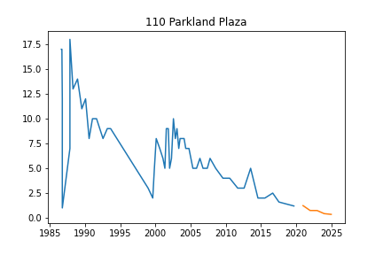
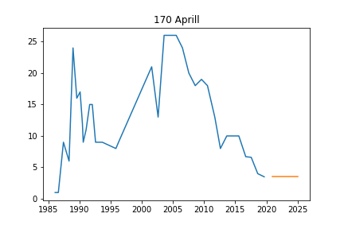

# Summary
## 110 Parkland Plaza
`
Initiated AutoTS object with best model: 
DatepartRegression
{
  "fillna": "mean",
  "transformations": {
    "0": "ClipOutliers",
    "1": "RollingMeanTransformer",
    "2": "DifferencedTransformer"
  },
  "transformation_params": {
    "0": {
      "method": "clip",
      "std_threshold": 3,
      "fillna": null
    },
    "1": {
      "fixed": true,
      "window": 10
    },
    "2": {}
  }
}
{
  "regression_model": {
    "model": "MLP",
    "model_params": {
      "hidden_layer_sizes": [
        72,
        36,
        72
      ],
      "max_iter": 500,
      "activation": "tanh",
      "solver": "lbfgs",
      "early_stopping": false,
      "learning_rate_init": 0.001
    }
  },
  "datepart_method": "expanded",
  "regression_type": null
}
`

## 170 Aprill
`
Initiated AutoTS object with best model: 
ZeroesNaive
{
  "fillna": "median",
  "transformations": {
    "0": "Discretize",
    "1": "DifferencedTransformer",
    "2": "ClipOutliers",
    "3": "ClipOutliers"
  },
  "transformation_params": {
    "0": {
      "discretization": "upper",
      "n_bins": 5
    },
    "1": {},
    "2": {
      "method": "clip",
      "std_threshold": 3,
      "fillna": null
    },
    "3": {
      "method": "clip",
      "std_threshold": 2,
      "fillna": null
    }
  }
}
{}
`

